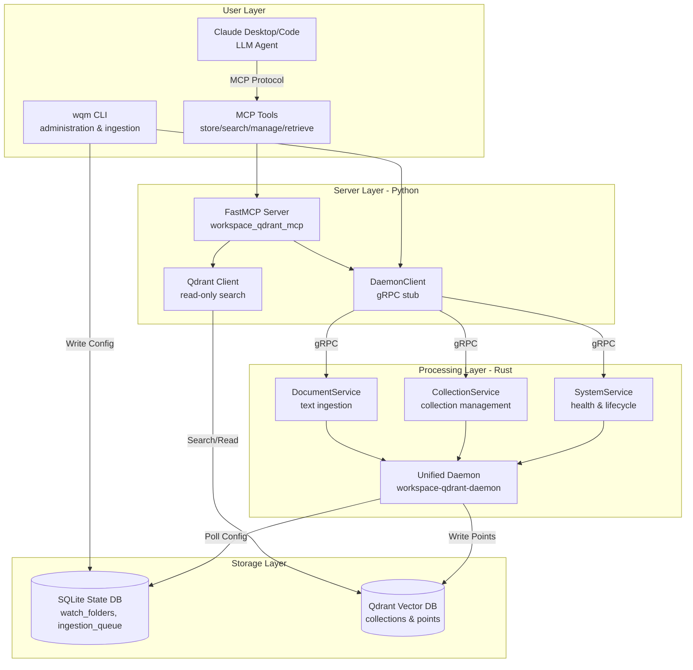
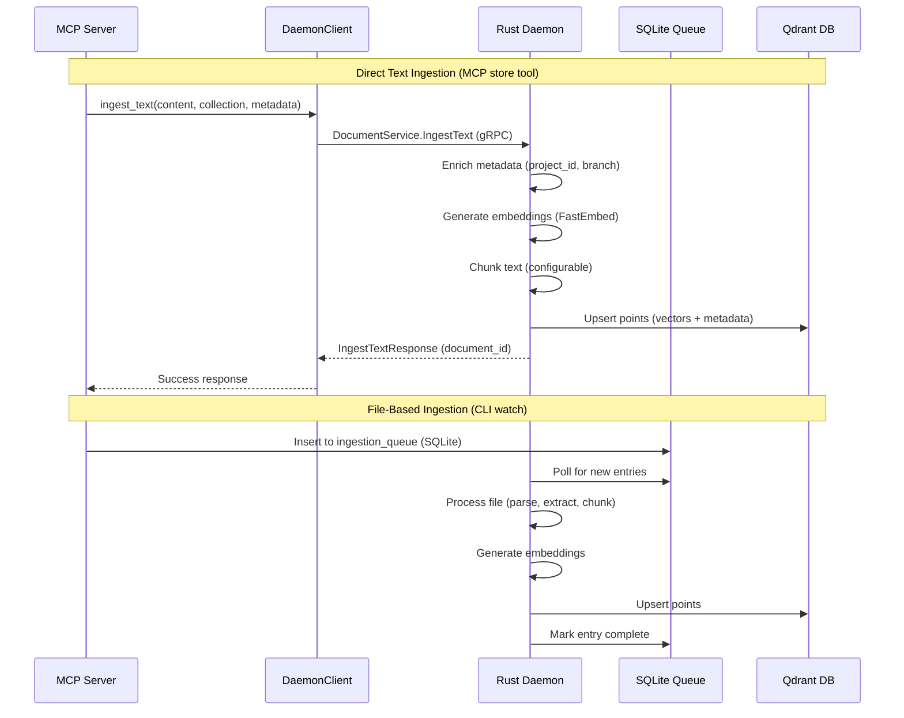
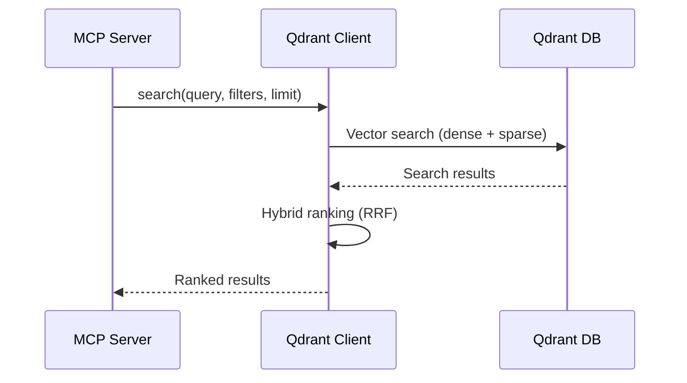
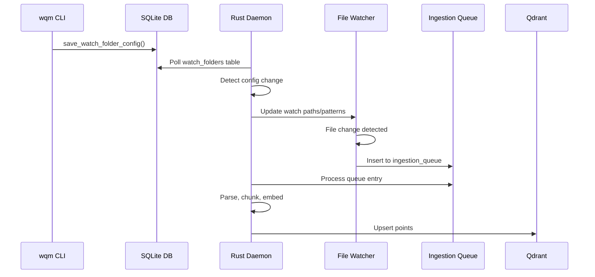

# Workspace Qdrant MCP - System Architecture

## Overview

workspace-qdrant-mcp is a semantic workspace platform that provides project-scoped vector database operations through a Model Context Protocol (MCP) server, backed by a high-performance Rust daemon for file watching, processing, and ingestion. The system enables LLM agents to naturally interact with project knowledge through conversational memory and hybrid semantic search.

**Current Status**: Phase 1 Foundation Complete (Unified Daemon Architecture)
- **Version**: 0.3.0
- **Protocol**: workspace_daemon.proto v1 (15 RPCs across 3 services)
- **Write Architecture**: Daemon-only writes validated (First Principle 10)
- **Implementation**: Unified Rust workspace at `src/rust/daemon`

## System Components

The architecture follows a four-component separation of concerns (First Principle 5):



### 1. MCP Server (Python)

**Location**: `src/python/workspace_qdrant_mcp/`

**Purpose**: Conversational interface for LLM agents via FastMCP protocol

**Key Features**:
- 4 comprehensive tools: `store`, `search`, `manage`, `retrieve`
- Hybrid semantic + keyword search
- Automatic project detection from current directory
- Stdio mode for Claude Desktop integration
- HTTP mode for testing and debugging

**Architecture Highlights**:
- **Read Path**: Direct Qdrant queries for search operations (performance)
- **Write Path**: Routes through DaemonClient gRPC to daemon (consistency)
- **Fallback Mode**: Direct Qdrant writes when daemon unavailable (documented exceptions)
- **Project Detection**: Git-aware workspace boundary detection

**Implementation Status**: ✅ Complete (Phase 1)
- Write path validated (Task 375.6)
- Collection naming enforced (non-empty basenames)
- gRPC integration aligned with daemon protocol

### 2. Rust Daemon (Unified Workspace)

**Location**: `src/rust/daemon/` (Cargo workspace)

**Members**:
- `core/` - Main daemon implementation, file watching, processing
- `grpc/` - gRPC services (SystemService, CollectionService, DocumentService)
- `python-bindings/` - PyO3 bindings for Python integration
- `shared-test-utils/` - Common test utilities across workspace

**Purpose**: High-performance background processing engine

**Key Features**:
- SQLite-driven file watching (crash-resistant, ACID guarantees)
- LSP integration for semantic code analysis
- Document parsing (code, markdown, PDF, EPUB, etc.)
- Embedding generation and chunking
- Exclusive Qdrant write access (single source of truth)

**Architecture Highlights**:
- **Single Writer Pattern**: Only daemon writes to Qdrant (First Principle 10)
- **Queue-Based Processing**: Async file operations via `ingestion_queue` table
- **Event-Driven Refresh**: Lightweight signals for state changes
- **Graceful Degradation**: Continues with reduced features on component failure

**Implementation Status**: ✅ Phase 1 Complete
- gRPC services implemented (workspace_daemon.proto)
- Collection naming validated (basename requirements enforced)
- Write path architecture validated

**Legacy Note**: The old `src/rust/daemon/core` implementation has been unified into this workspace. All components now use the single unified daemon.

### 3. CLI (wqm)

**Location**: `src/python/wqm_cli/`

**Purpose**: User control, configuration, and system administration

**Command Groups**:
- `service` - Daemon lifecycle (install/start/stop/status)
- `admin` - Collection management, system configuration
- `watch` - File watching configuration
- `ingest` - Manual document ingestion
- `lsp` - LSP server management
- `observability` - Metrics and monitoring

**Architecture Highlights**:
- Routes all writes through DaemonClient (consistency)
- Writes watch configuration directly to SQLite (no gRPC needed)
- MCP-aware logging (suppresses output in stdio mode)
- Service installation with binary validation

**Implementation Status**: ✅ Complete (Phase 1)
- SQLite state manager integration
- Daemon gRPC client integration
- Service management aligned with unified daemon

### 4. SQLite State Database

**Location**: User home directory (platform-specific)

**Purpose**: Crash-resistant configuration and queue management

**Key Tables**:
- `watch_folders` - File watcher configuration
- `ingestion_queue` - Pending file processing operations
- `projects` - Registered project metadata
- `collection_aliases` - Collection name mappings

**Architecture Highlights**:
- **WAL Mode**: Write-Ahead Logging for crash resistance
- **Poll-Based**: Daemon polls for configuration changes (no IPC needed)
- **ACID Guarantees**: Transactional safety for all state changes
- **Platform-Agnostic**: Cross-platform state persistence

## gRPC Protocol Architecture

### Protocol Definition

**File**: `src/rust/daemon/proto/workspace_daemon.proto`

**Design Principles**:
- Single writer pattern (daemon-only Qdrant writes)
- Queue-based async processing (file operations)
- Direct sync ingestion (text content via gRPC)
- Event-driven refresh (lightweight state change signals)

### Service Breakdown

#### 1. SystemService (7 RPCs)

**Purpose**: Health monitoring, status reporting, lifecycle management

**RPCs**:
1. `HealthCheck()` → `HealthCheckResponse`
   - Quick health check for monitoring/alerting
   - Returns per-component health status

2. `GetStatus()` → `SystemStatusResponse`
   - Comprehensive system state snapshot
   - Includes metrics, active projects, uptime

3. `GetMetrics()` → `MetricsResponse`
   - Current performance metrics
   - No historical data (use external monitoring for trends)

4. `SendRefreshSignal(RefreshSignalRequest)` → `Empty`
   - Signal database state changes for event-driven refresh
   - Queue types: INGEST_QUEUE, WATCHED_PROJECTS, WATCHED_FOLDERS, TOOLS_AVAILABLE

5. `NotifyServerStatus(ServerStatusNotification)` → `Empty`
   - MCP/CLI server lifecycle notifications
   - Daemon tracks active clients

6. `PauseAllWatchers()` → `Empty`
   - Master switch to pause all file watchers

7. `ResumeAllWatchers()` → `Empty`
   - Master switch to resume all file watchers

**Implementation Status**: ✅ Complete (grpc workspace)

#### 2. CollectionService (5 RPCs)

**Purpose**: Qdrant collection lifecycle and alias management

**RPCs**:
1. `CreateCollection(CreateCollectionRequest)` → `CreateCollectionResponse`
   - Create collection with proper vector configuration
   - Validates collection naming (non-empty basename required)

2. `DeleteCollection(DeleteCollectionRequest)` → `Empty`
   - Delete collection and all its data
   - Force flag for confirmation bypass

3. `CreateCollectionAlias(CreateAliasRequest)` → `Empty`
   - Create alias (for tenant_id changes, project migrations)

4. `DeleteCollectionAlias(DeleteAliasRequest)` → `Empty`
   - Delete collection alias

5. `RenameCollectionAlias(RenameAliasRequest)` → `Empty`
   - Atomically rename alias (safer than delete + create)

**Design Note**: `ListCollections` removed - MCP server queries Qdrant directly for read operations.

**Implementation Status**: ✅ Complete (grpc workspace)

#### 3. DocumentService (3 RPCs)

**Purpose**: Direct text ingestion (non-file content)

**Use Cases**:
- User input and manual notes
- Chat conversation snippets
- Scraped web content
- Cross-project scratchbook entries

**RPCs**:
1. `IngestText(IngestTextRequest)` → `IngestTextResponse`
   - Synchronous text ingestion
   - Automatic chunking, embedding, metadata enrichment
   - Returns document_id for future updates/deletes

2. `UpdateText(UpdateTextRequest)` → `UpdateTextResponse`
   - Update previously ingested text
   - Optional collection migration

3. `DeleteText(DeleteTextRequest)` → `Empty`
   - Delete ingested text document

**Implementation Status**: ✅ Complete (grpc workspace)
- Basename validation enforced (non-empty required)
- Metadata enrichment (project_id, branch, file_type)

## Data Flow Architecture

### Write Path (Daemon-Only Writes)

**First Principle 10**: Only the daemon writes to Qdrant. All components route writes through DaemonClient gRPC interface.



**Write Priority Hierarchy**:
1. **Primary**: Daemon via gRPC (DocumentService.IngestText)
2. **Fallback**: Direct Qdrant writes when daemon unavailable (logged with warnings)
3. **Exception**: MEMORY collections (`_memory`, `_agent_memory`) - direct writes allowed

**Validation Status** (Task 375.6):
- ✅ 18 comprehensive tests
- ✅ 47 write operations audited
- ✅ Zero undocumented violations
- ✅ All collection types validated (PROJECT, USER, LIBRARY, MEMORY)

### Read Path (Direct Qdrant Queries)

**Purpose**: Minimize latency for search operations



**Design Rationale**:
- Read operations don't require metadata enrichment
- Direct queries minimize hop latency
- Daemon focus on heavy processing (writes, embeddings, chunking)

### Watch System (SQLite-Driven)

**Flow**: `CLI → SQLiteStateManager → SQLite ← Rust Daemon → File Events → ingestion_queue`



**Key Features**:
- No gRPC needed for watch configuration (CLI writes directly to SQLite)
- Daemon polls SQLite for changes (crash-resistant)
- Debouncing and pattern matching in Rust
- Automatic queue-based processing

## Collection Management

### Collection Types

The system supports four collection types (documented in CLAUDE.md):

#### 1. PROJECT Collections

**Pattern**: `_{project_id}` (leading underscore, normalized project identifier)

**Purpose**: Project-specific code, documentation, and assets

**Metadata Enrichment**:
- `project_id` - Normalized git remote URL or project root path
- `project_root` - Absolute path on disk
- `branch` - Current git branch (optional)
- `file_type` - Language/format classification
- `symbols` - LSP-extracted symbols (functions, classes, etc.)

**Examples**:
- `_github_com_user_myproject` (git project)
- `_Users_chris_dev_localproject` (local project)

#### 2. USER Collections

**Pattern**: `{basename}-{type}` (non-empty basename required)

**Purpose**: User notes, scratchbooks, cross-project resources

**Metadata Enrichment**:
- `project_id` - Auto-enriched by daemon from project context (MCP only)
- `created_at` - Timestamp
- Custom metadata passed by user

**Examples**:
- `myapp-notes`
- `scratchbook-todos`
- `research-ideas`

**CLI vs MCP Behavior**:
- **MCP Server**: Daemon auto-enriches `project_id` from current directory
- **CLI**: User MUST specify `--project` explicitly (no automatic detection)

#### 3. LIBRARY Collections

**Pattern**: `_{library_name}` (leading underscore)

**Purpose**: Read-only shared knowledge bases (API docs, books, frameworks)

**Metadata Enrichment**:
- `library_name` - Library identifier
- `version` - Library version or book edition
- `url` - Documentation URL (optional)

**Examples**:
- `_fastapi`
- `_rust_std`
- `_designing_data_intensive_applications`

**Access Control**: Read-only via MCP interface (LLM agents cannot modify)

#### 4. MEMORY Collections

**Pattern**: `_memory`, `_agent_memory`

**Purpose**: LLM behavioral rules, preferences, agent definitions

**Metadata Enrichment**:
- `authority_level` - "absolute" or "default"
- `scope` - "global", "project", "session"
- `created_at` - Timestamp

**Exception**: Direct writes allowed (stores rules ABOUT the system, not project content)

### Collection Naming Validation

**Enforcement**: Daemon `DocumentService` rejects empty basenames (Task 385)

**Rules**:
- `collection_basename` cannot be empty string
- Leading underscore indicates system/library collection
- Project collections use normalized project identifiers
- User collections require meaningful basename

**Validation Points**:
- Daemon gRPC service validates on ingestion
- Python client validates before sending request
- Collection creation enforces naming rules

## Error Handling & Resilience

### Graceful Degradation (First Principle 9)

**Daemon Unavailable**:
- MCP server provides read-only access to existing data
- Writes fall back to direct Qdrant with warning logs
- Response includes `fallback_mode: "direct_qdrant_write"` flag

**LSP Server Failures**:
- Continue with text-only processing (no semantic symbols)
- Log degraded mode to user
- Retry LSP connection periodically

**Network Issues**:
- Local operations continue (SQLite state, config changes)
- Queue sync operations for when connectivity restored
- User notified of degraded functionality

**Resource Constraints**:
- Disable background indexing under memory pressure
- Prioritize user queries over background processing
- Clear communication about reduced feature set

### Transactional Safety (First Principle 7)

**Atomic Operations**:
- All SQLite writes use transactions (WAL mode)
- Qdrant upserts are atomic per point batch
- Rollback capability for failed operations

**State Persistence**:
- Ingestion queue tracks all work progress
- Unfinished work preserved across daemon restarts
- Checkpoint-based resumption for large batches

**Recovery**:
- Detect incomplete operations on daemon startup
- Offer automatic recovery or user confirmation
- No data loss from crashes or interruptions

## Security Architecture

### Write Access Control

**Daemon-Only Writes** (First Principle 10):
- Only daemon has Qdrant write credentials
- MCP server and CLI use read credentials + gRPC write path
- Prevents accidental direct writes from LLM agents

**LLM Access Control** (`common/core/llm_access_control.py`):
- Prevents MCP tools from mutating read-only collections
- Enforces collection type boundaries
- Validates project_id scope for multi-tenant isolation

### Binary Validation (Security Audit Remediation)

**Service Installation** (`common/security/binary_security.py`):
- SHA-256 checksum verification
- Ownership validation (detects world-writable binaries)
- Permission enforcement (0o700, owner-only execute)
- Tamper detection before execution

### Log Sanitization (Security Audit Remediation)

**Sensitive Data Protection** (`common/security/log_sanitizer.py`):
- Pattern-based detection (API keys, tokens, passwords)
- Field name-based redaction (case-insensitive)
- Configurable sanitization levels (MINIMAL, STANDARD, STRICT, PARANOID)
- Path masking (preserves filenames, redacts full paths)

### gRPC Security (Security Audit Remediation)

**TLS Configuration** (infrastructure ready, not yet deployed):
- Optional TLS with client certificate verification
- API key authentication via Bearer tokens
- Origin validation for CORS protection
- Security warnings logged on insecure startup

## Performance Characteristics

### Latency Targets

- **Search queries**: <100ms (project-scoped)
- **Health checks**: <10ms
- **Text ingestion**: <500ms (single document)
- **File processing**: Async (no user-facing latency)

### Scalability

- **Documents**: 100k+ across hundreds of collections
- **Concurrent watchers**: Dozens of projects simultaneously
- **Memory usage**: <500MB for large workspaces
- **Queue throughput**: 1000+ files/minute

### Optimization Points

**Embedding Cache**:
- Deduplicate embeddings for identical content
- Cache embeddings across chunking operations

**Batch Processing**:
- Group file operations into batches
- Minimize Qdrant network round-trips

**Incremental Updates**:
- LSP hook for real-time symbol extraction
- Only reprocess changed file sections (future enhancement)

## Development Workflow

### Building the System

```bash
# Python components
uv sync --dev                    # Install dependencies
uv run pytest                    # Run tests

# Rust daemon (unified workspace)
cd src/rust/daemon
cargo build --release            # Production build
cargo test                       # Run tests
cargo build --profile release-small  # Size-optimized build

# Install daemon service
uv run wqm service install --build
uv run wqm service start
```

### Running Tests

```bash
# Python unit tests
uv run pytest tests/unit -v

# Python integration tests (requires Qdrant)
uv run pytest tests/integration -v

# Rust tests (workspace-wide)
cd src/rust/daemon
cargo test

# Cross-platform tests
./cross_platform_test_runner.sh
```

### Protocol Changes

When modifying `workspace_daemon.proto`:

1. Update `.proto` file in `src/rust/daemon/proto/`
2. Rebuild Rust daemon: `cd src/rust/daemon && cargo build`
3. Regenerate Python stubs: `cd src/python/common && python -m grpc_tools.protoc ...`
4. Update tests to cover new RPCs
5. Update ARCHITECTURE.md (this file)

## Migration from Legacy Implementation

### Phase 1 Foundation (COMPLETE)

**Tasks 384-387** (October 2025):
- ✅ Enable grpc workspace in build configuration
- ✅ Fix collection naming (enforce non-empty basenames)
- ✅ Validate protocol alignment (MCP ↔ Daemon)
- ✅ Audit write path compliance (daemon-only writes)

**Key Changes**:
- Unified Rust workspace at `src/rust/daemon` (members: core, grpc, python-bindings, shared-test-utils)
- Legacy `src/rust/daemon/core` removed from build (archived for reference)
- Protocol mismatch resolved (Finding A1 from audit)
- Collection naming enforced (basenames validated)

### Phase 2 Enhancements (PLANNED)

**Pending Work**:
- Complete LSP integration for semantic symbol extraction
- Implement sparse vector support (BM25-style keyword matching)
- Add incremental update capability (LSP hooks)
- Performance benchmarking and optimization
- Cross-platform service installation (Windows support)

## Related Documentation

- **FIRST-PRINCIPLES.md** - Core architectural principles
- **CLAUDE.md** - Development guidelines and project context
- **PRDv3.txt** - Complete system specification
- **SECURITY_AUDIT.md** - Security findings and remediation
- **ARCHITECTURE_IMPLEMENTATION_AUDIT.md** - Phase 1 audit report
- **workspace_daemon.proto** - gRPC protocol specification

## Architecture Decision Records

### ADR-001: Daemon-Only Writes (First Principle 10)

**Decision**: All Qdrant write operations MUST route through the daemon.

**Rationale**:
- Single source of truth for metadata enrichment
- Prevents divergent enrichment logic across components
- Consistent behavior whether daemon is local or remote
- Clear architectural separation (daemon=write, others=read)

**Implementation**: Task 375.6 (October 2025)
- Write path validated across all collection types
- Fallback mode documented and logged
- 18 comprehensive tests, zero violations

**Exceptions**:
1. MEMORY collections (stores rules about system, not content)
2. Fallback mode when daemon unavailable (logged with warnings)
3. Test/diagnostic code (isolated from production)

### ADR-002: SQLite-Driven Watch Configuration

**Decision**: Watch folder configuration via SQLite, not gRPC.

**Rationale**:
- Crash-resistant (WAL mode, ACID guarantees)
- No IPC complexity (CLI writes directly)
- Daemon polls for changes (simpler than pub/sub)
- Platform-agnostic state persistence

**Implementation**: CLAUDE.md documentation
- `watch_folders` table schema defined
- Poll-based refresh in daemon
- Event-driven signals for immediate refresh

### ADR-003: Hybrid Read/Write Paths

**Decision**: Writes via daemon gRPC, reads via direct Qdrant queries.

**Rationale**:
- Writes need metadata enrichment (daemon responsibility)
- Reads prioritize latency (skip daemon hop)
- Daemon focused on heavy processing (embeddings, chunking)
- MCP server optimized for fast search responses

**Trade-offs**:
- Additional Qdrant connection from MCP server
- Daemon doesn't see read patterns (no read-based caching)
- Acceptable for current performance targets

## Success Metrics

This architecture succeeds when:

1. **LLM agents naturally discover project knowledge** without explicit collection management
2. **All writes route through daemon** with zero undocumented violations
3. **Search latency <100ms** for project-scoped queries
4. **System remains operational** when components fail (graceful degradation)
5. **Cross-platform consistency** on macOS, Linux, Windows

---

**Document Status**: Updated for Phase 1 Foundation (October 2025)
**Next Review**: After Phase 2 Enhancements completion
