# workspace-qdrant-mcp Architecture

> **Authoritative Specification**: For the complete system specification, see [WORKSPACE_QDRANT_MCP.md](../WORKSPACE_QDRANT_MCP.md). This document provides visual diagrams and component details.
>
> **Note**: This document describes the full system architecture including the Rust daemon and CLI which are under development. The MCP server (`workspace-qdrant-mcp`) is fully functional. Daemon and CLI features are planned for v0.4.0.

Visual architecture documentation for the workspace-qdrant-mcp system, showing component interactions, data flow, and system design.

## Table of Contents

- [System Overview](#system-overview)
- [Component Architecture](#component-architecture)
- [MCP Server Components](#mcp-server-components)
- [Rust Daemon Architecture](#rust-daemon-architecture)
- [Hybrid Search Flow](#hybrid-search-flow)
- [Collection Structure](#collection-structure)
- [SQLite State Management](#sqlite-state-management)
- [Write Path Architecture](#write-path-architecture)
- [Session Lifecycle Management](#session-lifecycle-management)
- [Data Flow Patterns](#data-flow-patterns)

## System Overview

workspace-qdrant-mcp implements a four-component architecture for high-performance semantic search and document management integrated with Claude Desktop and Claude Code.

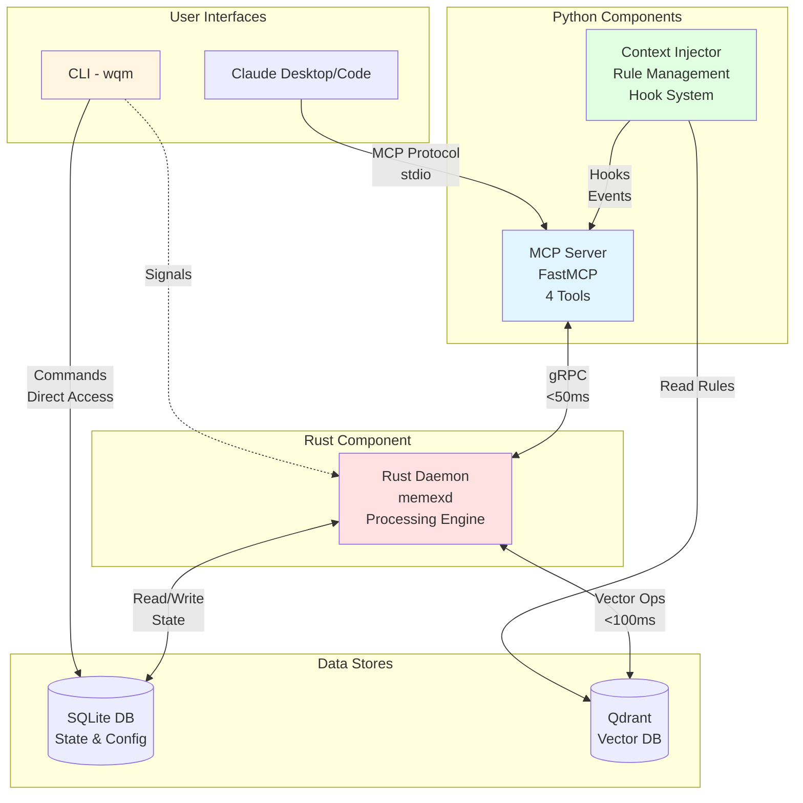

**Key Components:**
- **MCP Server**: Intelligent interface layer for Claude integration
- **Rust Daemon**: Heavy processing engine for document ingestion and search
- **CLI Utility**: Administrative control and system management
- **Context Injector**: LLM rule injection and behavioral context
- **SQLite**: Shared state and configuration database
- **Qdrant**: Vector database for semantic search

## Component Architecture

Detailed view of the four-component architecture showing responsibilities and communication patterns.

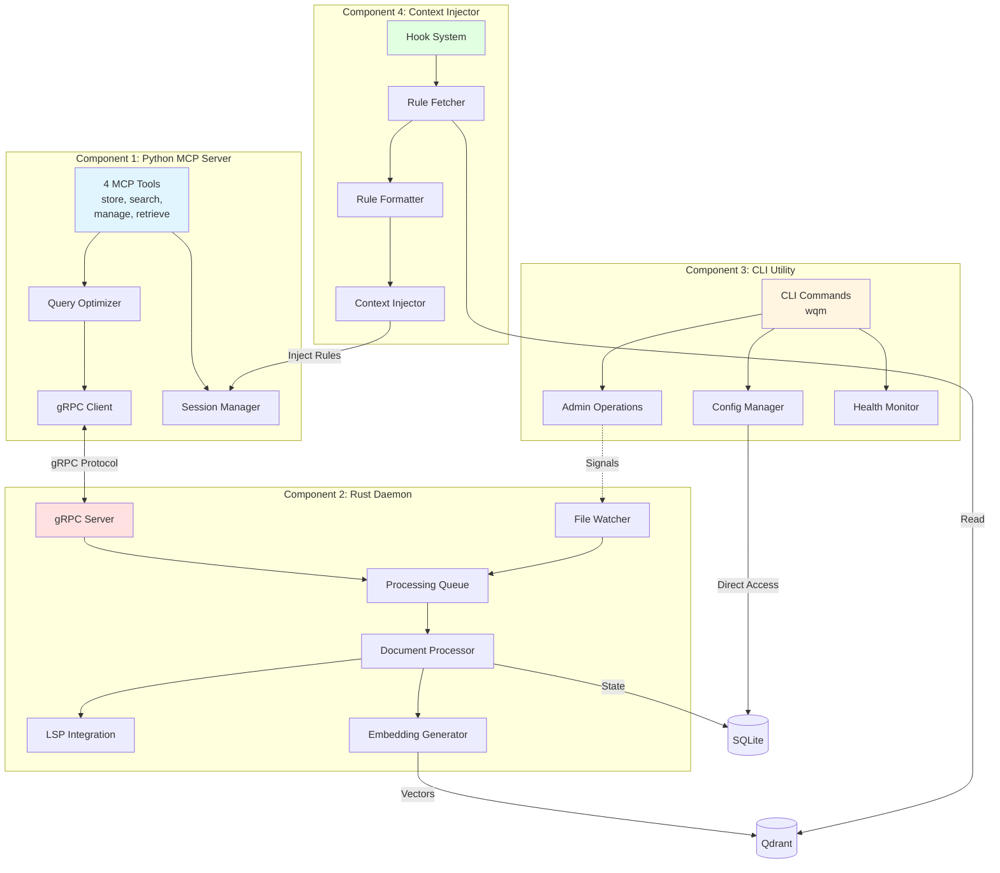

**Communication Patterns:**
- **gRPC**: MCP Server ↔ Rust Daemon (operational communication)
- **Signals**: CLI ↔ Daemon (lifecycle management)
- **SQLite**: Shared state with component-specific access
- **Hooks**: Event-driven Context Injector activation

## MCP Server Components

Detailed architecture of the FastMCP server implementation showing tool routing and processing.

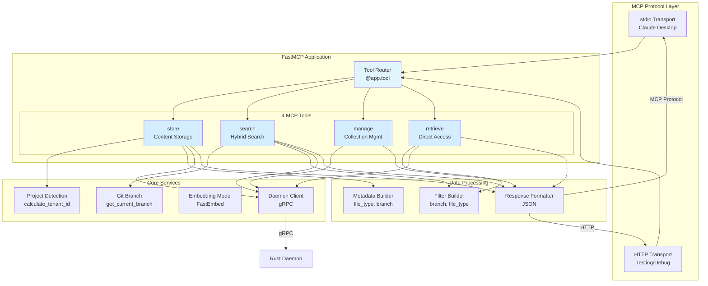

**Tool Capabilities:**
- **store**: Automatic collection routing, metadata enrichment, daemon-based writes
- **search**: Branch filtering, file type filtering, hybrid search modes
- **manage**: Collection lifecycle, health monitoring, system status
- **retrieve**: Direct ID lookup, metadata filtering, branch-aware queries

## Rust Daemon Architecture

High-performance document processing engine with concurrent operation handling.

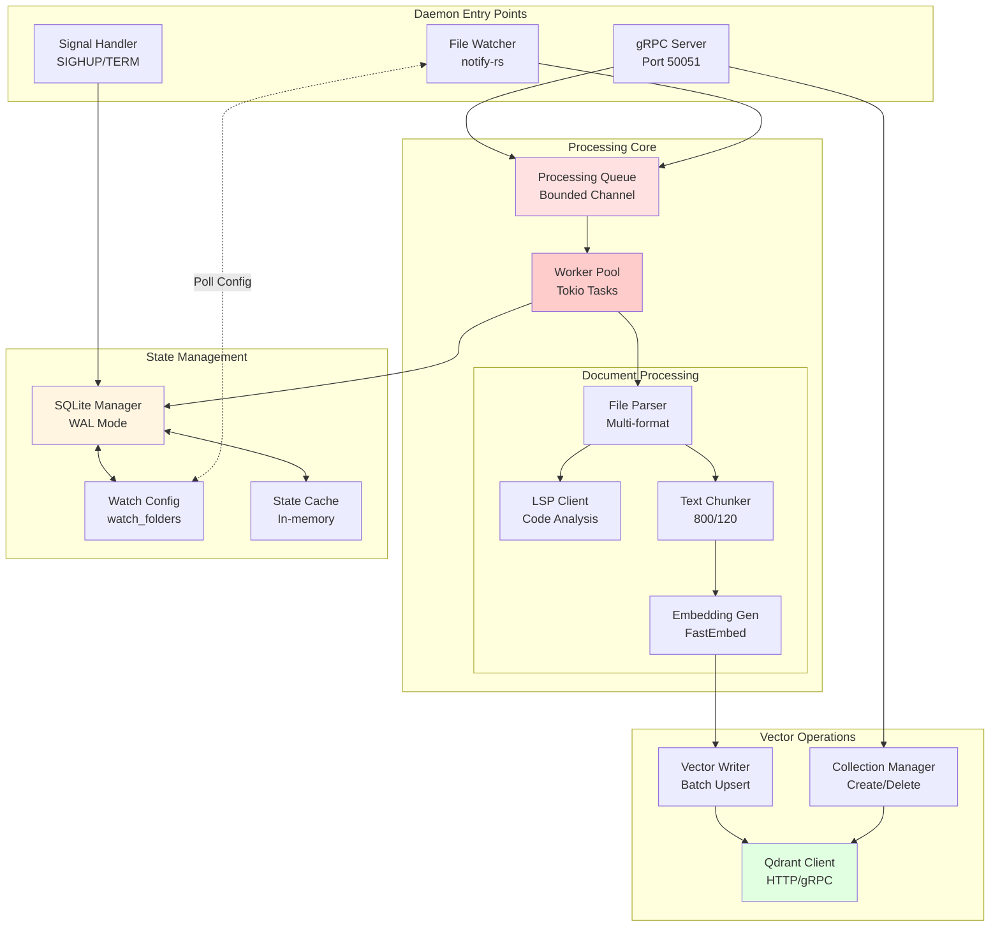

**Performance Characteristics:**
- **Throughput**: 1000+ documents/minute sustained
- **Memory**: <500MB sustained operation
- **Latency**: <50ms gRPC response time
- **Concurrency**: Multi-threaded worker pool with bounded queues

## Hybrid Search Flow

End-to-end search flow showing semantic and keyword search combination using RRF.

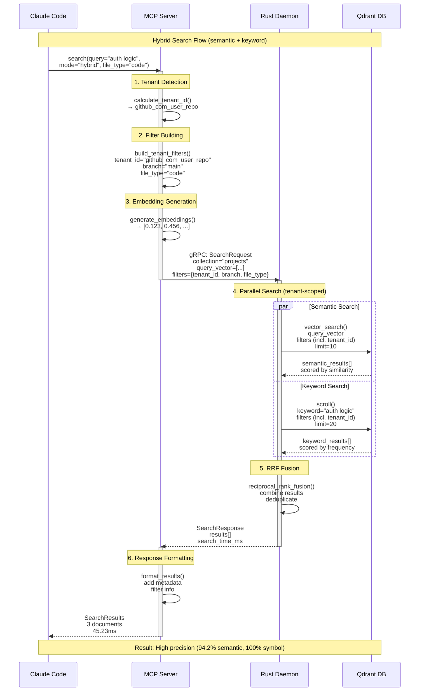

**Search Modes:**
- **hybrid**: Combines semantic and keyword with RRF (default)
- **semantic**: Pure vector similarity search
- **exact**: Keyword and symbol exact matching
- **keyword**: Simple keyword matching

**Performance Targets:**
- Total latency: <150ms end-to-end
- MCP processing: <50ms
- gRPC communication: <50ms
- Qdrant search: <50ms

## Collection Structure

Unified multi-tenant collection architecture with only 4 collections and tenant-based filtering.

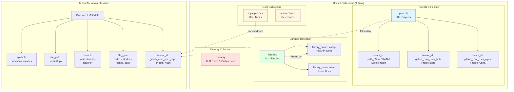

**Collection Architecture (per ADR-001):**
- **PROJECTS**: `projects` - Unified collection for ALL projects, filtered by `tenant_id`
- **LIBRARIES**: `libraries` - Unified collection for ALL libraries, filtered by `library_name`
- **MEMORY**: `memory` - LLM behavioral rules and preferences

**Multi-Tenant Isolation:**
- `tenant_id` derived from normalized git remote URL or path hash
- Payload indexing on `tenant_id` for O(1) filtering performance
- Cross-project search available with `scope="all"`
- Branch-scoped queries by default (configurable with `branch="*"`)

**Benefits:**
- Only 4 collections regardless of project count (scalable)
- Single HNSW index per collection type (efficient)
- Cross-project semantic search (powerful)
- Hard tenant filtering prevents data leakage (secure)

## SQLite State Management

**Reference:** [ADR-003](./adr/ADR-003-daemon-owns-sqlite.md)

**The Rust daemon (memexd) owns the SQLite database.** The daemon creates the database file (if absent), creates all tables, and handles schema migrations. MCP server and CLI may read/write to tables but must NOT create tables.

SQLite-based watch folder configuration with daemon polling for changes.

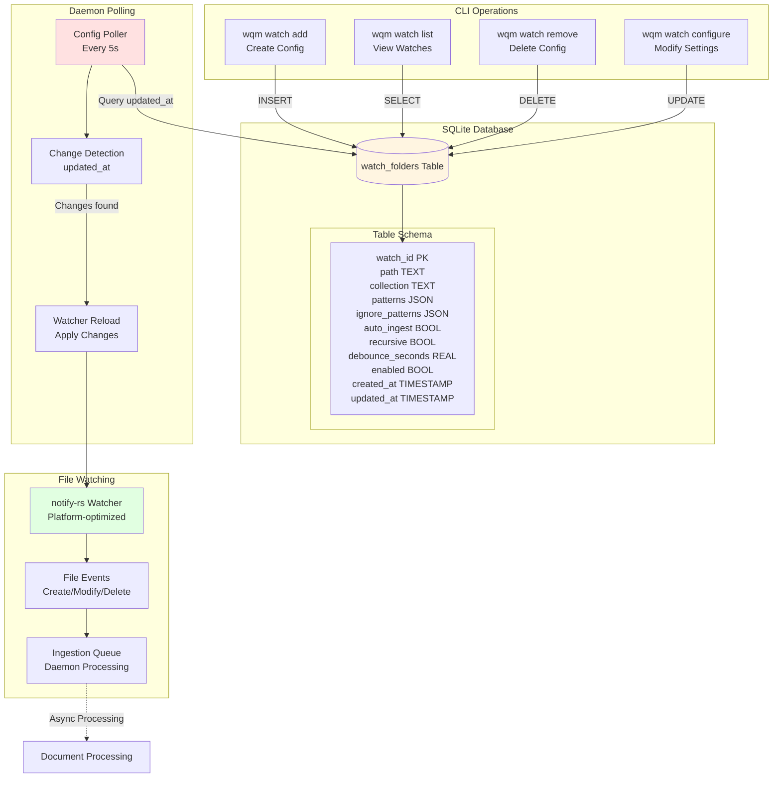

**Key Features:**
- **Daemon Owns Schema**: Daemon creates database and all tables (per ADR-003)
- **Crash-Resistant**: WAL mode with ACID guarantees
- **No gRPC Required**: CLI writes directly to SQLite (to tables created by daemon)
- **Daemon Autonomy**: Daemon polls independently
- **Configuration Flexibility**: Per-watch settings (patterns, debounce, recursion)

**Watch Configuration Fields:**
- `patterns`: File patterns to include (e.g., `["*.py", "*.md"]`)
- `ignore_patterns`: File patterns to exclude (e.g., `["*.pyc", "__pycache__/*"]`)
- `debounce_seconds`: Wait time before processing (prevents rapid re-processing)
- `recursive`: Watch subdirectories (configurable depth)
- `enabled`: Active/inactive toggle without deletion

## Write Path Architecture

Daemon-only write architecture ensuring all Qdrant writes flow through the high-performance Rust daemon.

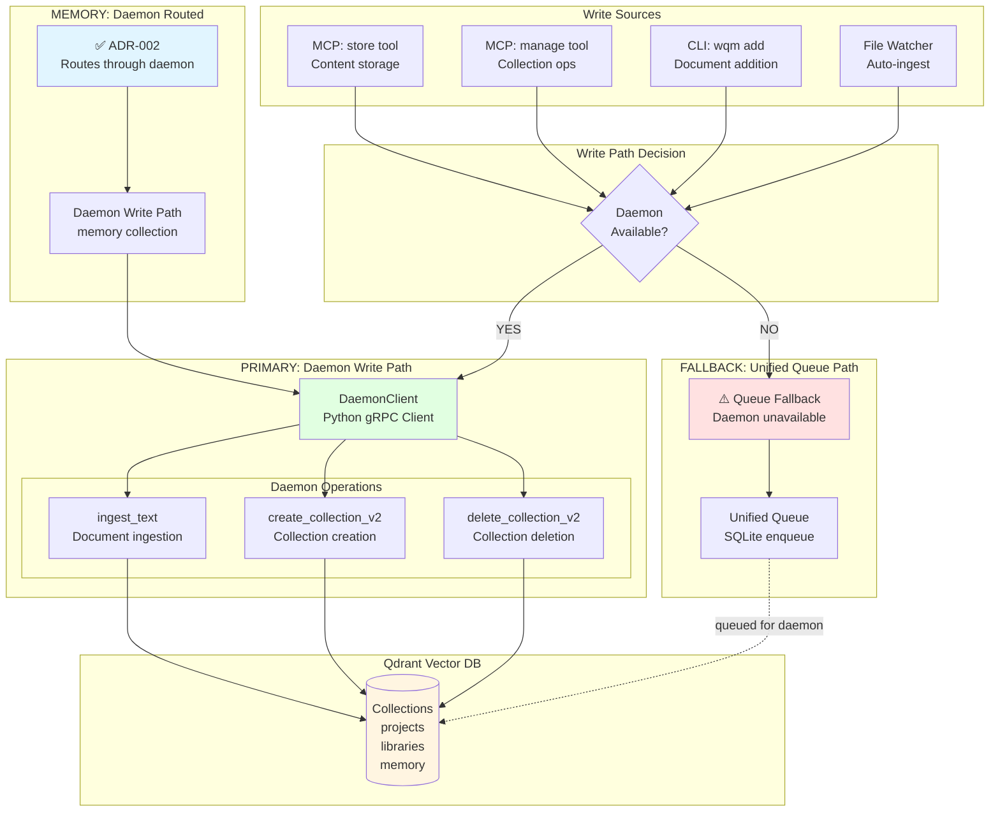

**Write Priority Levels:**
1. **PRIMARY**: `DaemonClient` → Daemon → Qdrant (all writes including memory)
2. **FALLBACK**: Unified Queue → SQLite → Daemon (when daemon unavailable, processed on restart)

**NO direct Qdrant writes** - ADR-002 prohibits any component other than daemon from writing to Qdrant.

**Collection Operations (Daemon Internal):**
- `create_collection_v2`, `delete_collection_v2` are daemon internal operations
- Daemon creates the 4 canonical collections (`projects`, `libraries`, `memory`, `scratchpad`) on startup
- MCP/CLI cannot create or delete collections (ADR-001: fixed 4-collection model)

**Validation (Task 375.6):**
- ✅ 18 comprehensive tests
- ✅ 47 write operations audited
- ✅ Zero violations found
- ✅ Complete compliance documentation

**Benefits:**
- **Consistent Metadata**: All writes enriched with project_id, branch, file_type
- **Performance**: Rust daemon handles heavy operations
- **Reliability**: Single code path reduces bugs
- **Monitoring**: Centralized write operations tracking

## Session Lifecycle Management

Session-based priority management ensures active projects get preferential processing in the ingestion queue.

### Session Lifecycle Flow

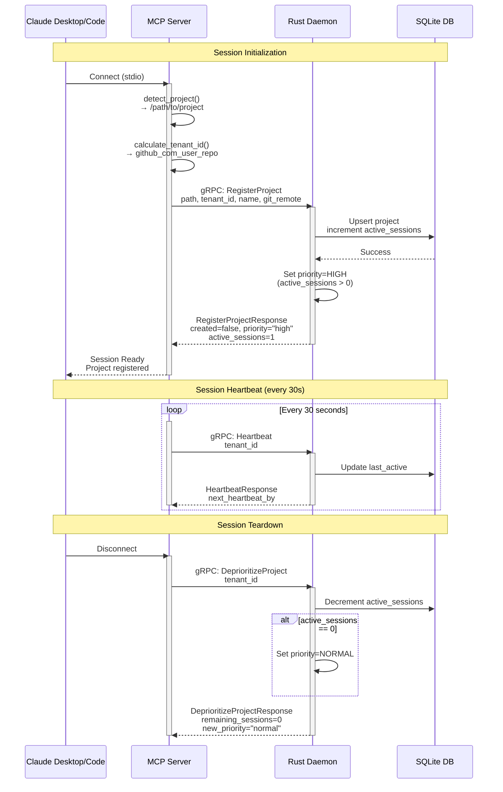

### Session States and Transitions

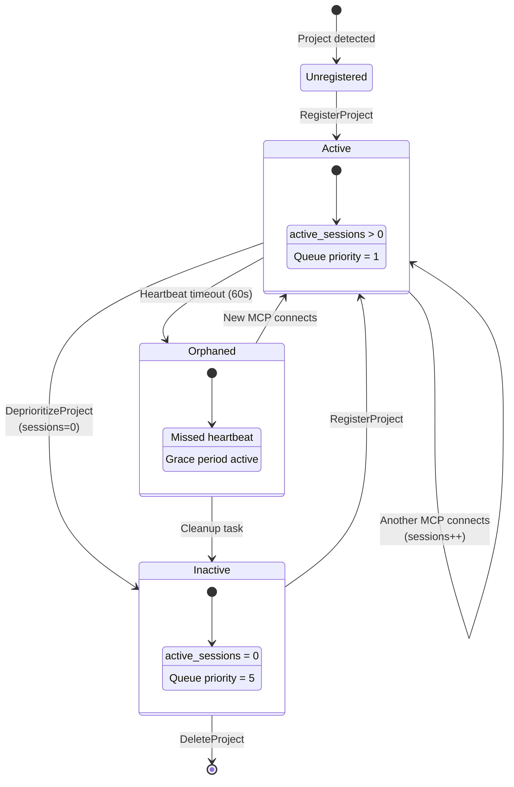

### Session Priority Impact

| Priority | active_sessions | Queue Position | Behavior |
|----------|-----------------|----------------|----------|
| **HIGH** | > 0 | First | File changes processed immediately |
| **NORMAL** | 0 | Standard | Processed in FIFO order |
| **LOW** | 0 (stale) | Last | Processed during idle time |

**Key Characteristics:**
- **60-second heartbeat timeout**: Sessions missed for 60s are considered orphaned
- **Multiple sessions supported**: Same project can have multiple MCP connections
- **Graceful degradation**: Orphaned sessions don't block processing
- **Session counting**: Priority based on aggregate session count
- **Automatic cleanup**: Orphaned sessions cleaned up periodically

## Data Flow Patterns

Common data flow patterns showing typical user operations.

### Document Ingestion Flow

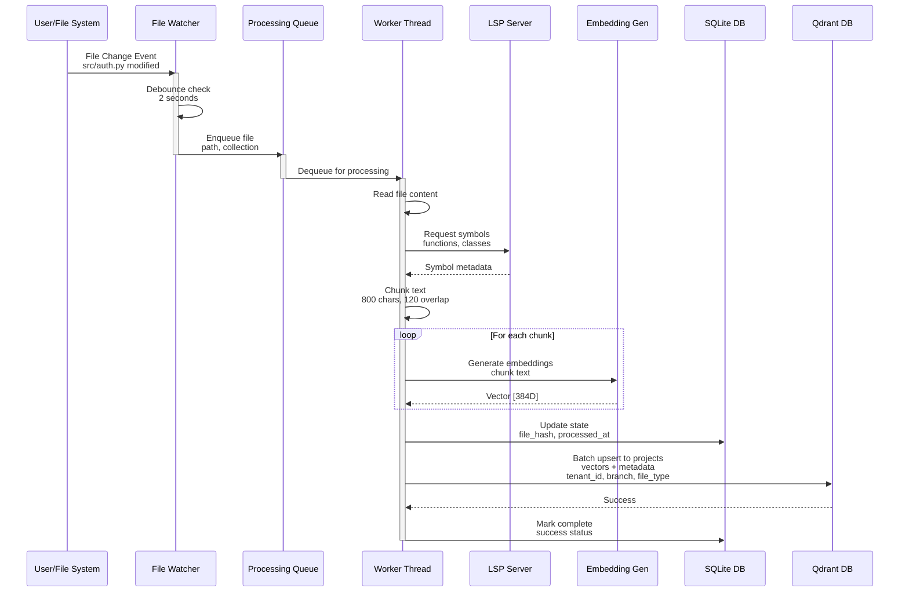

### Collection Management Flow

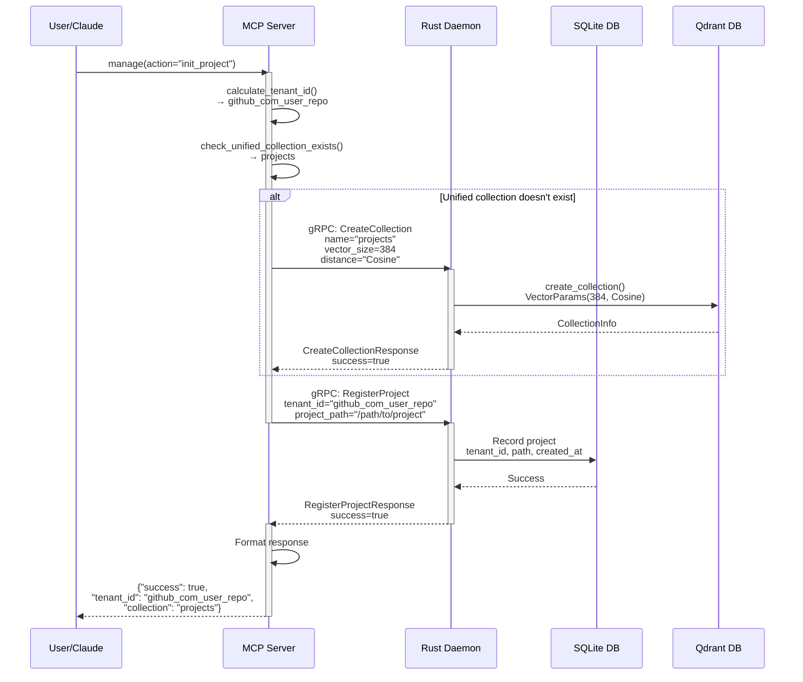

### Context Injection Flow

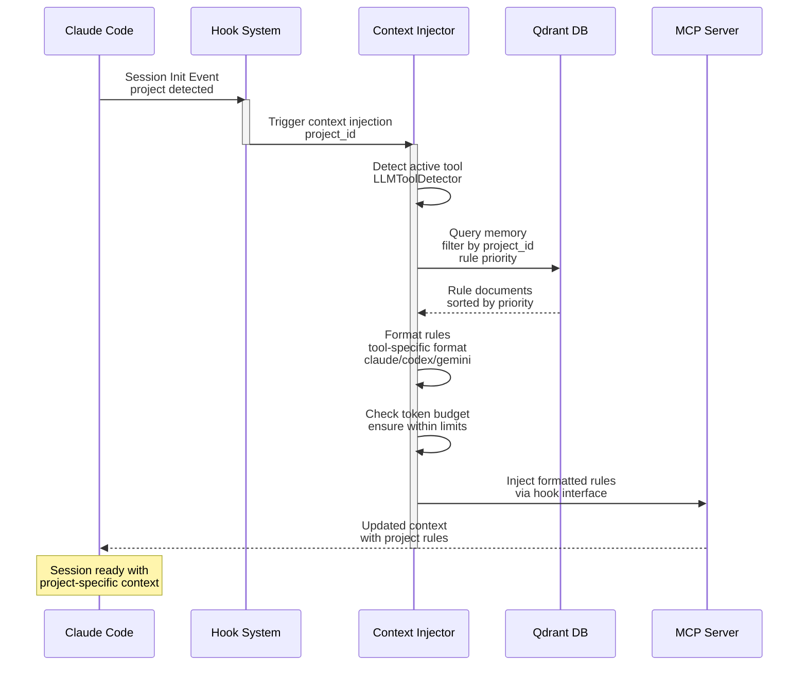

---

## Additional Resources

For detailed component specifications and implementation details:

- **[Component Boundaries](./architecture/component-boundaries.md)** - Formal component responsibilities
- **[Interface Specifications](./architecture/interface-specifications.md)** - API and interface details
- **[Data Flow and Isolation](./architecture/data-flow-and-isolation.md)** - System workflows
- **[Implementation Roadmap](./architecture/implementation-roadmap.md)** - Migration path
- **[Write Path Enforcement](./architecture/write-path-enforcement.md)** - Write path validation
- **[LLM Context Injection](./architecture/llm-context-injection.md)** - Context system details

**Reference Implementation:**
- **Server**: `src/python/workspace_qdrant_mcp/server.py` - MCP tools implementation
- **Daemon**: `src/rust/daemon/` - Unified Rust daemon (current), `src/rust/daemon/core/` (archived)
- **CLI**: `src/rust/cli/` - Rust CLI (wqm binary)
- **State**: `src/python/common/core/sqlite_state_manager.py` - SQLite management

**Version**: 1.4
**Last Updated**: 2026-01-30
**PRD Alignment**: WORKSPACE_QDRANT_MCP.md (Consolidated Specification)
**ADR Alignment**: ADR-001 (canonical collection names), ADR-002 (daemon-only writes), ADR-003 (daemon owns SQLite)
**Updates**: Added ADR-003 - daemon owns SQLite database and schema
