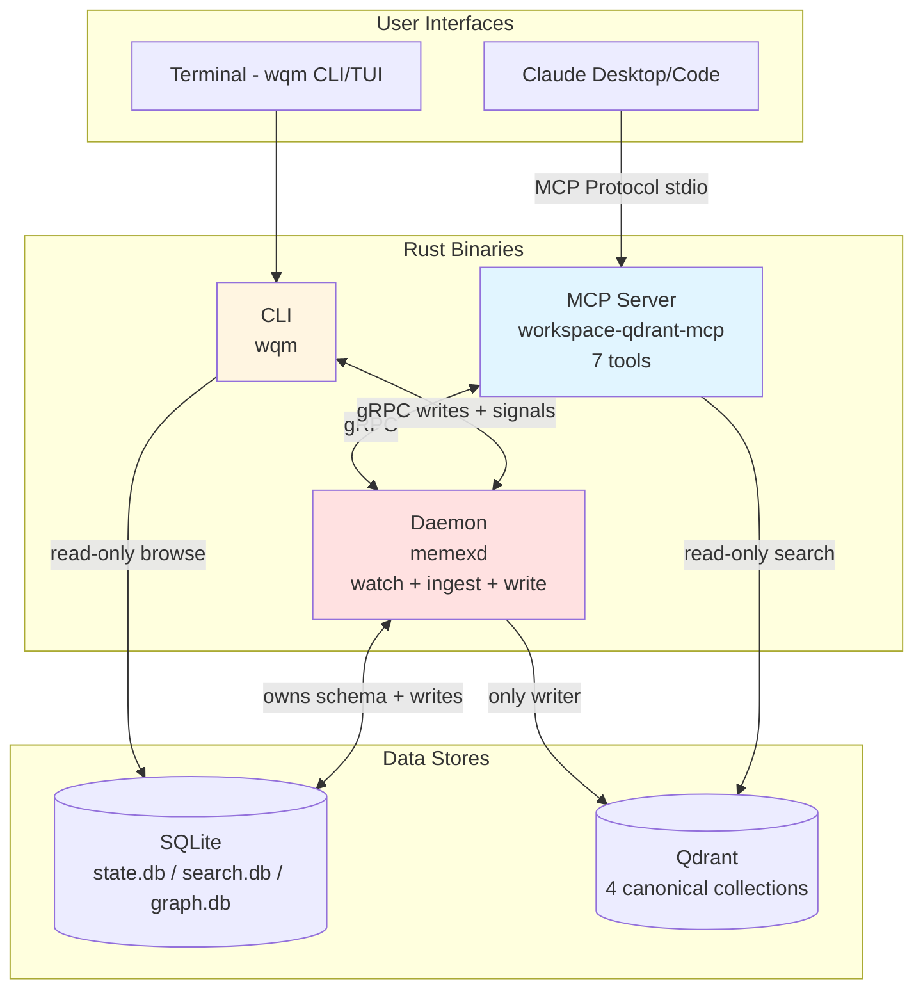
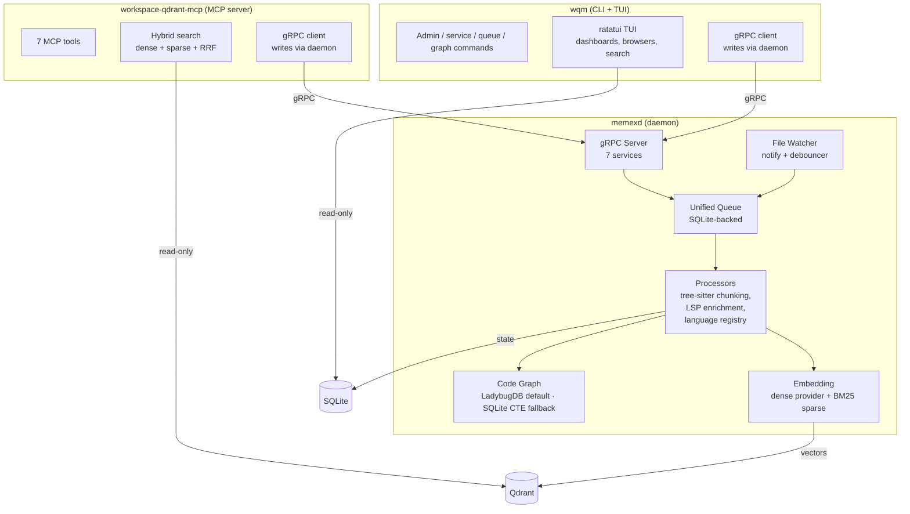
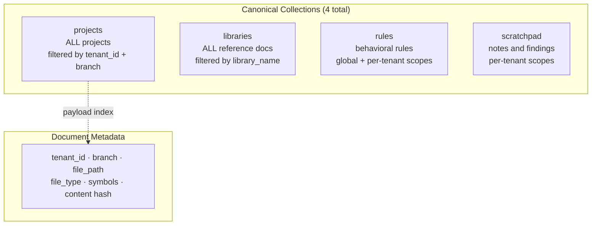
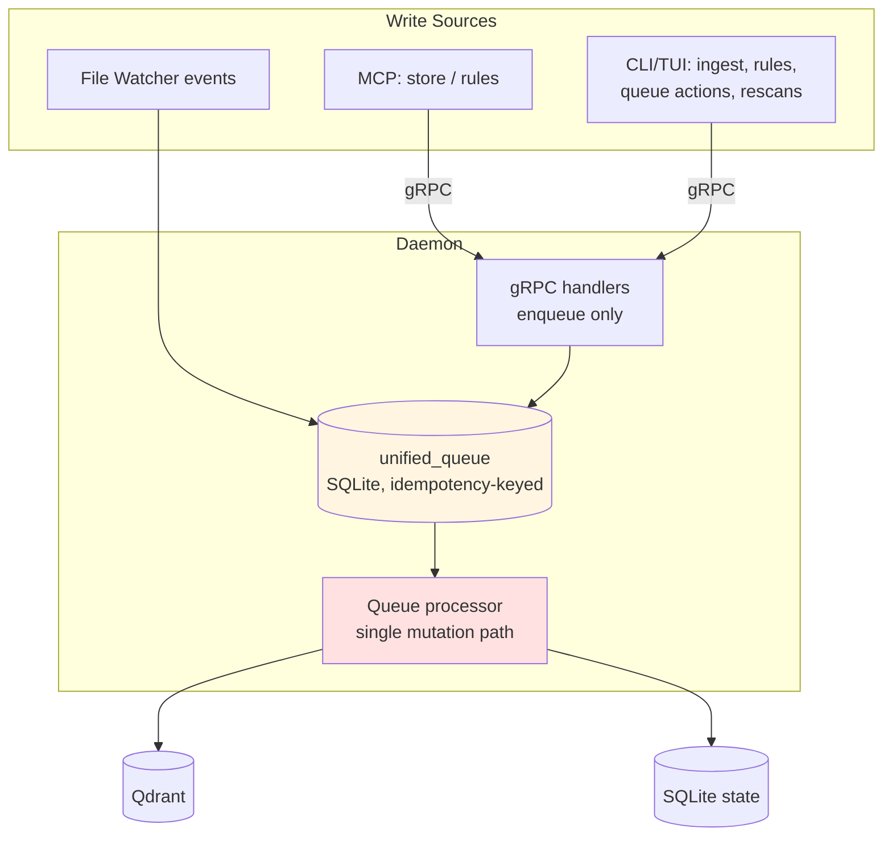
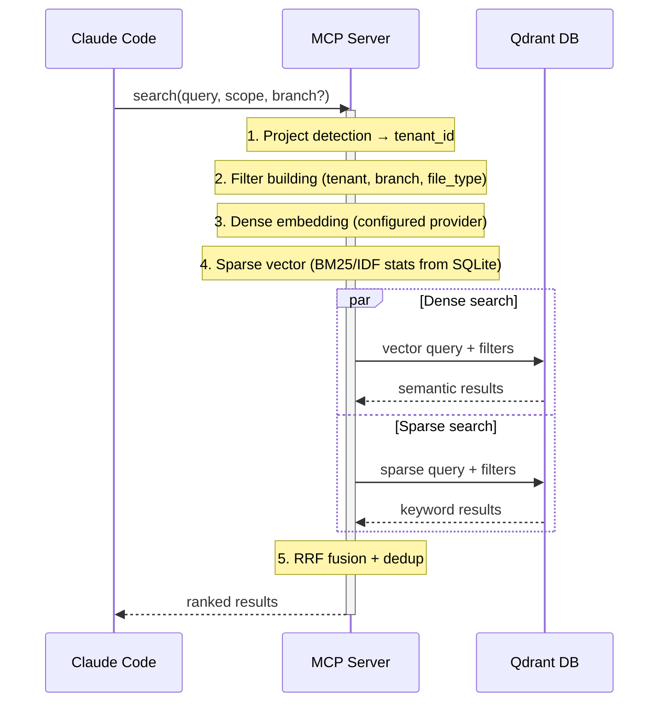

# workspace-qdrant-mcp Architecture

> **Authoritative Specification**: For the complete system specification, see the modular spec files in [docs/specs/](./specs/). This document provides the visual overview and component map.

workspace-qdrant-mcp is implemented entirely in Rust as a single Cargo workspace (`src/rust/`). Three shipped binaries cooperate around two data stores:

| Binary | Crate | Role |
|--------|-------|------|
| `memexd` | `daemon/memexd` (+ `daemon/core`, `daemon/grpc`) | Daemon: file watching, ingestion, embedding, all Qdrant/SQLite writes |
| `workspace-qdrant-mcp` | `daemon/mcp-server` | MCP server: Claude Desktop/Code integration (stdio), hybrid search pipeline |
| `wqm` | `cli` | CLI + TUI: administration, monitoring, queue/graph/search tooling |

Shared crates: `common` / `wqm-common` (types, project-id calculation, constants), `proto` (gRPC definitions), `client` (gRPC client used by CLI and MCP server), `common-node` (Node.js bridge), `daemon/shared-test-utils`, `tools/registry-updater` (language-registry maintenance).

Storage crates (branch-storage redesign, F1) — a hard read/write split: `storage` / `wqm-storage` holds every read path over the per-branch SQLite databases and Qdrant collections; `storage-write` / `wqm-storage-write` owns all mutation (SQLite DDL + migrations, Qdrant upserts/deletes/payload writes, the per-branch write-lock registry, and — in later features — git2). The dependency edge is one-directional (`wqm-storage-write` → `wqm-storage`, never the reverse). The read crate touches Qdrant only through `QdrantReadClient` (`wqm-storage::qdrant`), a newtype exposing the four read methods (`search_points`/`query`/`scroll`/`retrieve`) with a private inner client and no `Deref`; the five mutating methods live solely on `QdrantWriteClient` (`wqm-storage-write::qdrant`). Three CI guards enforce the boundary (`scripts/ci/storage-guards.sh`, plus a trybuild test): **Guard 1** keeps `wqm-storage-write` out of `mcp-server`'s feature closure (`cargo tree`); **Guard 2** makes a read-crate call to a `schema::*`/`migrations::*` function a compile error (trybuild); **Guard 3** scans the `mcp-server`/`wqm-cli` release binaries with `nm` to assert no Qdrant-mutating symbol is reachable there.

`wqm-common` is the canonical home of the content-addressing producers (`content_key` / `point_id`, in `hashing`) and, since the branch-storage redesign (F0), of four further shared nexuses relocated out of daemon-core so the read/write storage crates share one definition each (FP-2, no duplication): `StorageError` (`error`), `SearchResult` (`search::types`), `FileChange` / `FileChangeStatus` (`git::file_change`), and the pure Reciprocal-Rank-Fusion primitives `rrf_merge` / `rrf_score` (`search::rrf`). Daemon-core re-exports each from its former path, so existing call sites are unchanged. (`cross_collection_search` stays in daemon-core — it fans over a live Qdrant handle.)

## Table of Contents

- [System Overview](#system-overview)
- [Component Responsibilities](#component-responsibilities)
- [MCP Server](#mcp-server)
- [gRPC Services](#grpc-services)
- [Collection Structure](#collection-structure)
- [Write Path Architecture](#write-path-architecture)
- [Hybrid Search Flow](#hybrid-search-flow)
- [SQLite State Management](#sqlite-state-management)
- [Queue-Processor Health](#queue-processor-health)
- [Rule Injection](#rule-injection)

## System Overview

```mermaid
graph TB
    subgraph "User Interfaces"
        Claude[Claude Desktop/Code]
        Term[Terminal - wqm CLI/TUI]
    end

    subgraph "Rust Binaries"
        MCP[MCP Server<br/>workspace-qdrant-mcp<br/>7 tools]
        Daemon[Daemon<br/>memexd<br/>watch + ingest + write]
        CLI[CLI<br/>wqm]
    end

    subgraph "Data Stores"
        SQLite[(SQLite<br/>state.db / search.db / graph.db)]
        Qdrant[(Qdrant<br/>4 canonical collections)]
    end

    Claude -->|MCP Protocol stdio| MCP
    Term --> CLI

    MCP <-->|gRPC| Daemon
    CLI <-->|gRPC writes + signals| Daemon
    CLI -->|read-only browse| SQLite

    Daemon <-->|owns schema + writes| SQLite
    Daemon -->|only writer| Qdrant
    MCP -->|read-only search| Qdrant

    style MCP fill:#e1f5ff
    style Daemon fill:#ffe1e1
    style CLI fill:#fff5e1
```

**Key invariants** (see [docs/specs/](./specs/) and the ADRs):

- **Daemon owns all persistent state** (ADR-002, ADR-003): Qdrant writes and SQLite schema/mutations are daemon-only. MCP server and CLI route every mutation through daemon gRPC; their direct SQLite access is read-only.
- **Single-writer enforcement** (GP-9, F14): `memexd` is the sole writer to all per-project `store.db` files and the Qdrant `projects` collection. Enforcement has three layers:
  - **OS advisory lock**: on startup `memexd` acquires an exclusive `flock(2)` on `<data_dir>/daemon.lock` (`wqm-storage-write::single_writer::DaemonLock`). One lock per host/data-dir, not per-project. The OS releases it automatically on process exit or crash -- no manual stale detection needed for the crash case. A second process that finds the lock held is refused immediately with a clear error (fail-closed, no auto-reclaim). The daemon also writes a PID + timestamp heartbeat into the lock file; a staleness check is available as a diagnostic only (never force-reclaims). If a stale lock remains after a crash, the operator removes it manually.
  - **Structurally read-only connections**: every non-daemon SQLite connection (MCP server, CLI) is opened with `SQLITE_OPEN_READONLY` and `PRAGMA query_only = ON` (`wqm-storage::connection::open_store_readonly`). A write attempt on such a connection returns an error regardless of the schema. WAL readers proceed without blocking the daemon writer.
  - **No third write path**: any future write-capable operation (e.g. `wqm admin rebuild`) must acquire the same singleton advisory lock or run inside `memexd`. There is no third path.
- **Enqueue-only gRPC pattern**: write-path gRPC handlers enqueue to the unified queue; the queue processor performs the actual mutation (see `docs/specs/04-write-path.md`).
- **4 canonical collections** (ADR-001): `projects`, `libraries`, `rules`, `scratchpad` -- fixed regardless of project count.
- **Idempotency key**: `SHA256(item_type|op|tenant_id|collection|payload_json)[:32]`, computed identically in the daemon, MCP server, and CLI.

## Component Responsibilities

```mermaid
graph TB
    subgraph "memexd (daemon)"
        D_gRPC[gRPC Server<br/>7 services]
        D_Watch[File Watcher<br/>notify + debouncer]
        D_Queue[Unified Queue<br/>SQLite-backed]
        D_Proc[Processors<br/>tree-sitter chunking,<br/>LSP enrichment,<br/>language registry]
        D_Embed[Embedding<br/>dense provider + BM25 sparse]
        D_Graph[Code Graph<br/>LadybugDB default · SQLite CTE fallback]

        D_gRPC --> D_Queue
        D_Watch --> D_Queue
        D_Queue --> D_Proc
        D_Proc --> D_Embed
        D_Proc --> D_Graph
    end

    subgraph "workspace-qdrant-mcp (MCP server)"
        M_Tools[7 MCP tools]
        M_Search[Hybrid search<br/>dense + sparse + RRF]
        M_Client[gRPC client<br/>writes via daemon]
    end

    subgraph "wqm (CLI + TUI)"
        C_Admin[Admin / service / queue / graph commands]
        C_TUI[ratatui TUI<br/>dashboards, browsers, search]
        C_Client[gRPC client<br/>writes via daemon]
    end

    D_Embed -->|vectors| Qdrant[(Qdrant)]
    D_Proc -->|state| SQLite[(SQLite)]
    M_Search -->|read-only| Qdrant
    M_Client -->|gRPC| D_gRPC
    C_Client -->|gRPC| D_gRPC
    C_TUI -->|read-only| SQLite
```

- **Daemon (`memexd`)**: watches registered project/library folders, debounces events, enqueues work, chunks code semantically with tree-sitter (44 bundled languages, dynamic grammar download), enriches with LSP where available, generates dense + sparse embeddings, writes to Qdrant and SQLite, maintains the code-relationship graph, and runs maintenance sweeps (reconcile, orphan pruning, queue cleanup).
- **MCP server**: exposes the tool surface to Claude, performs project detection (git-aware `tenant_id`), executes the hybrid search pipeline against Qdrant (read-only), and routes all writes through daemon gRPC.
- **CLI (`wqm`)**: administration (service lifecycle, collections, rebuilds), monitoring (queue, status, perf, graph stats), and a full TUI. Reads SQLite read-only for browsing; every mutation goes through daemon gRPC.

## MCP Server

The MCP server (`daemon/mcp-server` crate, binary `workspace-qdrant-mcp`) speaks the MCP protocol over stdio and exposes **7 tools** (see `docs/specs/08-api-reference.md`):

| Tool | Purpose |
|------|---------|
| `store` | Save content (scratchpad/library/url), register projects for indexing |
| `search` | Hybrid semantic search with scope (`project`/`group`/`all`), branch filtering, optional graph context |
| `grep` | Fast literal/regex line search (FTS5-backed) |
| `retrieve` | Fetch a known document by ID or metadata |
| `list` | Browse project structure (summary or path drill-down) |
| `rules` | Manage behavioral rules (list/add/update/remove) |
| `embedding` | Embedding provider status and management |

## gRPC Services

13 services defined in `src/rust/daemon/proto/workspace_daemon.proto` — 8 read/operate services plus 5 write services (the write services implement the enqueue-only pattern):

- **SystemService** — health, status, metrics, refresh signals, watcher pause/resume, DLQ
- **CollectionService** — canonical collection lifecycle and aliases (daemon-internal)
- **DocumentService** — text ingestion, document update/delete
- **EmbeddingService** — dense embedding + sparse vector generation, provider status
- **ProjectService** — project registration, sessions/heartbeats, branch lifecycle
- **TextSearchService** — exact (FTS5 whole-phrase) and regex text search
- **GraphService** — code-graph queries (related nodes, impact, PageRank, communities, betweenness)
- **LanguageService** — language registry, LSP/grammar management
- **QueueWriteService / WatchWriteService / LibraryWriteService / TrackingWriteService / AdminWriteService** — mutation surface used by the CLI/TUI and MCP server (queue retry/cancel/remove, watch enable/disable, library ops, tracking, admin)

## Collection Structure

Unified multi-tenant model (ADR-001): exactly 4 collections, isolated by payload filters.

```mermaid
graph TB
    subgraph "Canonical Collections (4 total)"
        P[projects<br/>ALL projects<br/>filtered by tenant_id + branch]
        L[libraries<br/>ALL reference docs<br/>filtered by library_name]
        R[rules<br/>behavioral rules<br/>global + per-tenant scopes]
        S[scratchpad<br/>notes and findings<br/>per-tenant scopes]
    end

    subgraph "Document Metadata"
        Meta[tenant_id · branch · file_path<br/>file_type · symbols · content hash]
    end

    P -.->|payload index| Meta
```

- `tenant_id` derives from the normalized git remote URL (or a path hash for non-git folders); multi-clone repositories are disambiguated by project-ID calculation.
- Branch-scoped queries are the default; content-hash dedup shares identical chunks across branches.
- Hard tenant filtering prevents cross-project leakage; `scope="all"` opts into cross-project search.

## Write Path Architecture

All Qdrant writes flow through the daemon; gRPC write handlers only enqueue (see `docs/specs/04-write-path.md`).

```mermaid
graph TB
    subgraph "Write Sources"
        MCP_W[MCP: store / rules]
        CLI_W[CLI/TUI: ingest, rules,<br/>queue actions, rescans]
        Watch[File Watcher events]
    end

    subgraph "Daemon"
        Handlers[gRPC handlers<br/>enqueue only]
        UQ[(unified_queue<br/>SQLite, idempotency-keyed)]
        Proc[Queue processor<br/>single mutation path]
    end

    MCP_W -->|gRPC| Handlers
    CLI_W -->|gRPC| Handlers
    Watch --> UQ
    Handlers --> UQ
    UQ --> Proc
    Proc --> Qdrant[(Qdrant)]
    Proc --> SQLite[(SQLite state)]

    style UQ fill:#fff5e1
    style Proc fill:#ffe1e1
```

Properties:

- **Single mutation path**: one processor applies every write — consistent metadata enrichment, dedup, and GC.
- **Idempotency**: duplicate enqueues collapse on the idempotency key.
- **Fairness**: queue ordering blends priority (active sessions first), age promotion, and tenant line-jumping for interactive operations.
- **Crash safety**: the queue is SQLite-backed; work survives daemon restarts and is recovered at startup.

### Point identity (`content_key` / `point_id`)

Every Qdrant point ID is derived through one path-independent scheme, defined once in
`wqm-common::hashing` so the tagger, the re-key pass, and the v48 conversion all agree:

- **`lp(x) = u32_be(len) ‖ x`** — length-prefix framing. Prefixing each field with its
  byte length makes a multi-field concatenation injective, which a bare separator
  (`a|b`) cannot guarantee when the data may contain the separator.
- **`content_key = hex(SHA256(lp(tenant) ‖ lp(identity) ‖ lp(content_hash_hex)))`** —
  the full 32-byte digest (64 hex chars), birthday bound **~2⁶⁴**. The third field is
  the content hash rendered as a 64-char lowercase-hex ASCII string, never raw bytes,
  so the value converted during migration equals the freshly-computed one. For files
  the fields are `(tenant_id, file_identity_id, file_hash_hex)`.
- **`point_id = UUIDv5(POINT_NS, lp(content_key) ‖ lp(u32_be(chunk_index)))`** — a
  UUIDv5 (RFC 9562 §5.5), birthday bound **~2⁶¹** (6 bits fixed for version+variant).
  A `point_id` collision silently overwrites a chunk on upsert, so corpus-size
  guidance quotes ~2⁶¹ for `point_id` and ~2⁶⁴ for `content_key` — different bounds.

Files are **content-addressed** (a content change yields a new `point_id`; the old
point is tombstoned). Non-file content (rules, scratchpad, memory, URL, library) is
**identity-addressed** via `content_point_id(tenant, identity, chunk)` — the same
`content_key`/`point_id` flow with an empty content-hash slot, so re-ingesting changed
content keeps the ID stable and the update lands in place.

Byte-identical content under a distinct file-identity or collection is deduped by
**copying the vector**, never by sharing a point (the no-share invariant): a tenant-wide
`(tenant_id, file_hash)` probe (`tracked_files_schema::locate_byte_identical`) finds an
existing real point and `StorageClient::retrieve_point_with_vector` reads its vector to
copy. That read must return the **original, un-quantized** vector; this project sets no
quantization on any collection, so a point read returns the original (see the method
doc-comment in `storage/scroll.rs`).

### Blob dedup ladder + `ContentKeyLockManager` (branch-storage F6)

For the branch-storage per-project `store.db` model, chunk ingest runs the **two-case
dedup ladder** (`wqm-storage-write/src/blob/`), the chunk-grain greenfield replacement
of the retired 989-line `daemon/core/src/branch_index/tagger.rs` BranchTagger. The
ladder is split by responsibility (coding §X): `dedup.rs` (file-level `files`/`concrete`
upsert + chunk loop), `ladder.rs` (one chunk's write cycle), `embed.rs` (the lazy embed
seam), `lock.rs` (the lock manager). The authoritative flow is the arch §4.1 ingest
sequence diagram in `docs/architecture/branch-storage-model.md`.

- **content_key HIT** (blob row exists): add `blob_refs` + `fts_branch_membership`
  (ON CONFLICT IGNORE), recompute the full `branch_id[]` from SQLite truth via the
  single canonical producer `blob::membership::compute_membership` in
  `storage-write/src/blob/membership.rs` (`SELECT DISTINCT branch_id FROM blob_refs
  WHERE blob_id=?` appears exactly once in the write crate -- F7 / AC-F7.6 / FP-2),
  then enqueue an `overwrite_payload` (PUT) via `qdrant::membership` against the
  **stored** `blobs.point_id` (never recomputed, honoring a SEC-4 salted re-key).
  No re-embed. `set_payload` (POST) is never used for `branch_id[]` -- it has no
  append mode and would drop prior memberships.
- **content_key MISS** (new blob): embed once (dense + sparse), INSERT the blob (the
  FTS5 trigger fires), add the single referrer, and enqueue an upsert with
  `branch_id:[current_branch_id]`.
- **FP-1 ordering**: durable vectors persist in SQLite before any Qdrant op is enqueued;
  the batch flush fires outside the locks.

The **`ContentKeyLockManager`** is the §8 nexus that guarantees no blob or Qdrant blob
point is written outside a per-`content_key` lock. It holds one async lock per
`content_key` in a DashMap, eviction-bounded (cap 100,000 entries, idle-evict 300 s,
30 s cleanup, zero-waiter eviction only; a global fallback lock serializes over-cap
writes). A file's locks are always acquired **sorted by `content_key`** so two files
sharing chunks cannot deadlock by opposite traversal order.

**Daemon cutover is a follow-up**: the ladder + lock + facade method ship tested in
`wqm-storage-write`; wiring the daemon ingest path (`strategies/processing/file/ingest.rs`)
to the new write facade — and deleting `branch_index/tagger.rs` — requires the daemon to
construct the `WriteStoreFacade` impl with an injected embedder and store handle, tracked
as a separate task so the existing ingest path stays working end-to-end until then.

**F19 PUT throughput (AC-F19.1/F19.4)**: `overwrite_payload` (PUT) was benchmarked
against a paired upsert baseline on a 100k-point corpus (1536-dim dense + 16-entry
sparse, batch 1000, 10 measured iterations). Results on the reference loopback
environment (Intel i7-10700K, Qdrant 1.18.2): PUT p50 = 2686.92 ms per 1000-point
batch; UPSERT p50 = 463.97 ms; ratio = 5.791x (threshold N=3). F9 deletion Step-6
uses the **batched-outside-lock fallback** (AC-F19.3): membership RECOMPUTE stays
inside the per-content_key lock; the Qdrant PUT flushes outside via
`MembershipPutBatch` (`wqm-storage-write/src/qdrant/membership_batch.rs`).
Full benchmark report: `docs/benchmarks/F19-put-vs-upsert.md`.

### Branch delete + blob GC (branch-storage F9)

Whole-branch deletion and single-file deletion are implemented in `wqm-storage-write`
and follow the **FP-1 physical-delete ordering** (data products before truth rows,
truth rows committed before data products on ingest):

**Module layout** (three-file split for arch §9 line-budget compliance):
- `branch/probe.rs` — `DeleteAction`, `GitBranchProbe`, `delete_decision` (pure, no
  side effects), `probe_branch` (git2-backed). Split out so the truth-table decision
  function is unit-testable without a real git repository (AC-F9.1).
- `branch/steps.rs` — `BlobCandidate`, `step1_preselect` through `step8_delete_branch`.
  All SQL mutations for the 8-step sequence.
- `branch/delete.rs` — Thin orchestrator: `branch_delete` public async fn + test module.
- `blob/gc.rs` — `blob_refcount`, `delete_orphan_blob_row` (refcount-guarded GC helpers).
- `blob/file_delete.rs` — `delete_file_from_branch` (single-file delete, same 8-step
  FP-1 ordering scoped to one `file_id`).

**GP-4 truth table** (arch §4.3): deletion requires POSITIVE confirmation. A transient
`git2::ErrorCode::NotFound` (ambiguous: genuine absence vs. network error on a
remote-tracking ref) maps to **DEFER**, never Proceed.

| Git probe result | Action |
|---|---|
| `for-each-ref` empty + reflog delete event | Proceed |
| Branch present in topology | Keep |
| git2 error / I/O / Auth / NotFound-ambiguous | DEFER |
| Reflog unavailable / git dir unreachable | DEFER |

**8-step FP-1 sequence** (`branch_delete`, arch §4.3/§5.5):
1. Pre-select all `(blob_id, point_id, content_key)` for the branch (read-only, outside tx).
2. Identify orphan candidates via `GROUP BY blob_id HAVING SUM(other-branch refs) = 0` (batched ≤1000).
3. Enqueue `QdrantOp::Delete` for orphaned points — **data product before truth row** (FP-1 Step 3).
4. Chunked branch-wide DELETE of `fts_branch_membership` / `blob_refs` / `concrete` (subselect idiom; `DELETE ... LIMIT` is invalid without `SQLITE_ENABLE_UPDATE_DELETE_LIMIT`).
5. ABA-guarded re-verify under `BEGIN IMMEDIATE`: delete only still-unrefenced blobs rows.
6. Recompute membership for survivors (INSIDE `ContentKeyLock`); enqueue PUTs into `MembershipPutBatch`; flush OUTSIDE all locks (AC-F19.3).
7. DELETE orphaned `files` rows (no blob_refs from other branches).
8. DELETE `branches` row **LAST** — crash-recovery anchor (arch §4.3).

The `branch_cleanup/` module in `daemon/core` is **not retired** by this implementation:
the daemon cutover (wiring `memexd` to call `branch_delete` instead of `branch_cleanup/`)
is deferred to task #175. Until then `branch_cleanup/` continues serving the daemon.

### Qdrant recovery from durable SQLite vectors (branch-storage F11)

`rebuild_qdrant` is implemented in `wqm-storage-write/src/qdrant/recover.rs`. It
streams blobs from the SQLite `blobs JOIN blob_refs` table using keyset pagination
(`WHERE blob_id > ?`, page size clamped to [1000, 10000] per PERF-R5-N3) and upserts
them into Qdrant with the exact arch §5.3 collection spec (768-dim Cosine dense,
sparse dot-product under `sparse_vectors`, `branch_id`/`tenant_id` keyword payload
indexes). No embedding calls are made: `blobs.dense_vec` and `blobs.sparse_vec` are
decoded verbatim and `blobs.point_id` is used verbatim (DATA-05/SEC-4: salted re-keys
honored). Collection creation and payload-index creation live in
`wqm-storage-write/src/qdrant/collection.rs`.

**Daemon/CLI rewire deferred**: the `wqm admin rebuild` verb currently routes via the
daemon gRPC `RebuildIndexRequest` handler (`cli/src/commands/rebuild.rs`). Wiring
the daemon handler to call `rebuild_qdrant` from the write crate requires the daemon
cutover (#175, same milestone as the ingest and branch-delete cutover). Until #175
lands, `wqm admin rebuild` continues using the pre-existing daemon implementation and
`rebuild_qdrant` is available in the write crate ready to be wired in.

## Hybrid Search Flow

```mermaid
sequenceDiagram
    participant Claude as Claude Code
    participant MCP as MCP Server
    participant Qdrant as Qdrant DB

    Claude->>MCP: search(query, scope, branch?)

    activate MCP
    Note over MCP: 1. Project detection → tenant_id
    Note over MCP: 2. Filter building (tenant, branch, file_type)
    Note over MCP: 3. Dense embedding (configured provider)
    Note over MCP: 4. Sparse vector (BM25/IDF stats from SQLite)

    par Dense search
        MCP->>Qdrant: vector query + filters
        Qdrant-->>MCP: semantic results
    and Sparse search
        MCP->>Qdrant: sparse query + filters
        Qdrant-->>MCP: keyword results
    end

    Note over MCP: 5. RRF fusion + dedup
    MCP-->>Claude: ranked results
    deactivate MCP
```

- Dense embeddings come from the configured provider (FastEmbed by default; OpenAI et al. configurable). Sparse vectors use BM25 with corpus statistics persisted in SQLite.
- Literal/regex queries take the separate FTS5 path (`grep` tool, `TextSearchService`).

## Read Path (F10 -- ReadStoreFacade)

`wqm-storage` (the read crate) exposes a single read entrypoint `ReadStoreFacade`
(`src/rust/storage/src/facade/read/mod.rs`) that wires together:

- **`ProjectRegistry`** (`src/rust/storage/src/project/resolver.rs`) -- maps a caller's
  CWD to `(tenant_id, branch_id, db_path)` via `state.db.project_locations JOIN projects`.
  Most-specific-root-wins: a submodule at `/a/b` beats a container at `/a` when the CWD is
  inside `/a/b/`. Returns `None` when no registered root matches; callers MUST treat `None`
  as an error and never fall through to an all-tenant query (SEC-3, AC-F10.2). F16 will
  extend this same struct with the fuzzy handle->key resolver (FP-2, one nexus).

- **`branch_search`** (`src/rust/storage/src/facade/read/search.rs`) -- hybrid
  Qdrant dense + sparse search with `branch_id + tenant_id` pre-filter on every query
  (AC-F10.2 / SEC-3), RRF fusion (k=60), and SQLite enrichment via
  `idx_blob_refs_covering` JOIN to attach file paths and symbol metadata.

- **`fts_search`** (`src/rust/storage/src/fts/search.rs`) -- branch-scoped FTS5
  full-text search (arch §5.2, AC-F10.3). Uses a two-pass approach: pass 1 queries
  `fts_content MATCH ?` alone (FTS5 external-content restriction -- `snippet()` requires
  no JOINs at the driver level); pass 2 joins `fts_branch_membership` and `blob_refs` to
  enforce the branch filter. All user input phrase-wrapped via `sanitize_fts_query` before
  binding (arch §6.5 A5). This is the SOLE FTS5 module in the read crate (AC-F10.5);
  `facade/read/fts.rs` must not exist.

- **`list_branch`** (`src/rust/storage/src/facade/read/list.rs`) -- enumerates all
  files on a branch from `store.db`, with content hash and chunk count.

`wqm project branches` (AC-F10.8) is re-sourced from `state.db.project_locations JOIN
projects` -- one row per `(project, branch, checkout)` triple, carrying `sync_state` and
`location`. Supports `--json`, `--script`, `--no-headers` output flags.

## SQLite State Management

**Reference:** ADR-003 — **the daemon owns SQLite.** It creates the databases, owns the schema, and runs all migrations. Other components open read-only connections for browsing; every mutation goes through daemon gRPC.

Databases (under the platform data dir, e.g. `~/.local/share/workspace-qdrant/`):

| Database | Contents |
|----------|----------|
| `state.db` | Lean central registry (branch-storage F4). **Core tables:** `projects` (one row per registered project — `tenant_id` UNIQUE + stable, `db_path`, `content_key_version` DEFAULT 3), `project_locations` (one row per `(project, location, branch)` triple — `branch_id` UNIQUE, `sync_state` CHECK `pending/indexing/current/error`). **Existing tables unchanged:** `watch_folders`, `tracked_files`, `unified_queue`, `db_maintenance` (+`maintenance_meta`), `branch_lineage`, `control_baseline`, etc. Authoritative DDL: [`docs/architecture/branch-storage-model.md` §5.1](./architecture/branch-storage-model.md). `branch_id = SHA256(lp(tenant_id)||lp(location)||lp(branch_name))` — single producer `wqm_common::hashing::branch_id` (GP-5). `branch_name` validated via `daemon_core::branch_name_validation` (git2 ref-name rules, SEC-N04) before every INSERT into `project_locations`. |
| `search.db` | FTS5 indexes, file metadata (incl. `file_metadata.state`, search.db v8 — lets `grep` hide tombstoned files; branch-lineage P9), indexed-content cache |
| `graph.db` | code-relationship graph (nodes, edges, CTE queries) |
| `daemon_state.db` | daemon runtime bookkeeping |
| `projects/<tenant_id>/store.db` | Per-project branch-storage DB (branch-storage redesign, F3). 9 tables: `files`, `blob_refs`, `blobs`, `branches`, `concrete`, `xrefs`, `fts_content` (FTS5 external-content), `fts_branch_membership`, `store_meta`. Authoritative schema: [`docs/architecture/branch-storage-model.md` §5.2](./architecture/branch-storage-model.md). DDL implementation: `src/rust/storage-write/src/schema/`. Column name constants (read-only): `src/rust/storage/src/schema/columns.rs`. |

Conventions:

- WAL mode, `busy_timeout`, and transaction-wrapped operations everywhere — no bare queries outside a transaction.
- Schema migrations are versioned (`schema_version` module); table-rebuild migrations own their transaction and FK-guard.
- Watch-folder changes are made via gRPC (`EnableWatch`/`DisableWatch`, registration) and picked up by the daemon — the CLI never mutates `watch_folders` directly.

## Queue-Processor Health

The queue processor's health is determined by a functional verdict (#133) rather than simple counters. Four dual-EWMA control lanes — ms/KB processing cost, embedder-call latency, drain throughput, and DLQ delta-rate — are fed through the metrics switchboard (`switchboard/control_fanout.rs`, `ControlLane`) and shared with `EwmaState` (`queue_health/state.rs`) via `Arc<ControlLane>` clones. At each poll the verdict runs:

- **Trend probes (A-series):** dual-EWMA crossover on ms/KB cost, embedder latency, and DLQ delta-rate. Slow-lane baseline divergence from the fast lane signals degradation; a signed DLQ delta distinguishes draining (Green) from growing (Red).
- **Hard-state probes (B-series):** Qdrant reachability, disk headroom, processor-stall detection, and an all-items-failing predicate.
- **Drain-budget probe (F5):** pending-byte backlog vs. estimated drain rate.

Each probe verdict is debounced by a sliding window (plurality/severity tie-break). The overall health is the worst-of across all probes, surfaced via the `Health` gRPC RPC. Before any control lane is seeded (daemon cold-start) the verdict is `Unknown` ("learning baseline") rather than false Red.

Slow-lane baselines for the three persist-true metrics (`EmbedderLatency`, `QueueMsPerKb`, `QueueThroughput`) are flushed to `state.db::control_baseline` (schema v46) by `ControlBaselinePersistTask` during idle windows and restored on restart via `ControlLane::restore_baseline`, so cold-start learning converges faster after a normal shutdown.

Migration v47 rebuilds the `search_events` table to relax its `actor` CHECK constraint, adding `'benchmark'` to the accepted set (`'claude'`, `'user'`, `'daemon'`, `'benchmark'`). This allows the quality-eval harness (`wqm benchmark search-quality`, #135) to tag its own search traffic so organic-query mining can exclude it.

Migration v48 supports the branch-lineage indexing model (feature F2). It rebuilds `tracked_files` so every (branch, path) pair gets its own row, keyed on the new `tenant_id`, `branch`, `file_identity_id`, `content_key`, `is_virtual`, and `state` columns; the v40 `(watch_folder_id, relative_path, file_hash)` UNIQUE collides with this per-(branch, path) virtual model, so the table is dropped and recreated (D1 = Replace, pre-release convention — the indexing walk repopulates it). A partial unique index (`idx_tracked_files_live_view`) enforces one live row per `(tenant_id, content_key, branch)` while exempting `state = 'deleted'` tombstones, so logical deletes are recoverable. The migration also adds the `branch_lineage` table (per-tenant parent/child branch edges with an `origin` of `'event'`, `'inferred'`, or `'root'`) and a nullable JSON `db_maintenance.maintenance_meta` column — a general-purpose multi-use store (e.g. migration bookkeeping) added idempotently via a `pragma_table_info` probe. The migration is DDL-only: it does not touch Qdrant, transform rows, or mint `file_identity_id`.

**The current schema version is v49.** Migration v49 adds the `projects` and `project_locations` tables to state.db (branch-storage feature F4). `projects` carries a `content_key_version INTEGER NOT NULL DEFAULT 3` column introduced here by F4 (the sole DDL owner per AC-F4.5 / MF-R4-1; F13 only flips the value per-tenant at cutover, it does not add the column). `project_locations` enforces `branch_id UNIQUE` and a `sync_state CHECK ('pending','indexing','current','error')` constraint. Both tables use `CREATE TABLE IF NOT EXISTS` for idempotency. The migration runs inside a single `BEGIN IMMEDIATE` / `COMMIT` without a `ForeignKeysGuard` (no FK-referenced table is dropped). Existing state.db tables are untouched.

This replaces the earlier `error_count > 100` threshold check and the interim `is_running` / `> 60 s` stall heuristic. Full design: [`docs/architecture/queue-health.md`](./architecture/queue-health.md). Switchboard wiring: [`docs/architecture/metrics-switchboard.md`](./architecture/metrics-switchboard.md).

## Rule Injection

Behavioral rules live in the `rules` collection (with a SQLite mirror for fast listing) and reach Claude Code through installed hooks rather than a separate injector component:

- `wqm init hooks install` installs Claude Code hooks; at session start the hook fetches applicable rules (global + current project scope) and injects them into the session context.
- Rules are managed via the MCP `rules` tool, `wqm rules` commands, or the TUI rules browser.

---

## Additional Resources

- **[docs/specs/](./specs/)** — authoritative modular specification (16 files)
- **[Component Boundaries](./architecture/component-boundaries.md)** — formal component responsibilities
- **[Write Path Enforcement](./architecture/write-path-enforcement.md)** — write path validation
- **[Data Flow and Isolation](./architecture/data-flow-and-isolation.md)** — system workflows

**Reference Implementation:**

- **Daemon**: `src/rust/daemon/` (`core`, `grpc`, `memexd`)
- **MCP server**: `src/rust/daemon/mcp-server/`
- **CLI/TUI**: `src/rust/cli/` (`wqm` binary; TUI under `src/tui/`)
- **Shared**: `src/rust/common/`, `src/rust/proto/`, `src/rust/client/`

## Truth-Inclusive Full Backup / Restore (F20)

### Two recovery directions

In the blob+concrete model the SQLite stores are the TRUTH and Qdrant is the
rebuildable index. There are exactly two correct recovery directions:

1. **Index recovery** (`wqm admin rebuild`): store.db -> Qdrant. Used when Qdrant
   is lost or stale but the SQLite truth survives.
2. **Disaster recovery** (`wqm restore --full`): truth-inclusive bundle -> data
   directory. Used when the SQLite truth itself is lost.

Neither direction reconstructs truth from the rebuildable index. `recover_state`
(the old Qdrant->SQLite direction) is retired by F12.

### `wqm backup --full <destination>` (AC-F20.1)

Produces a single compressed archive bundling:

- Every SQLite truth store copied read-consistently via `VACUUM INTO` (no torn
  pages): `state.db`, `projects/<id>/store.db`, `global/store.db`,
  `libraries/store.db`.
- A Qdrant snapshot (reusing the existing snapshot helpers in
  `cli/src/commands/backup/create.rs` -- no second snapshot path, FP-2/DR GP-9).
- `manifest.json` inside the archive recording: `wqm_version`, `stores` list with
  `tenant_id` and `content_key_version` per store, `qdrant_snapshot_name`,
  `archive_timestamp`, `compressor`, `daemon_running`.

**Peak transient disk formula (AC-F20.1b):**
`sum(SQLite store sizes) + Qdrant snapshot size`

A pre-flight free-space check (using `statvfs`) runs BEFORE copying starts and
refuses with a clear required-vs-available message rather than failing partway.

**Daemon-running at backup time (DATA-N01):** `backup --full` may run with the
daemon live (it is read-only over the stores). When the daemon is running, the
SQLite stores and the Qdrant snapshot are captured at slightly different instants
(temporal skew). The manifest records `daemon_running: true` so a restore knows
the bundle may be mildly inconsistent. After restoring a daemon-running bundle,
run `wqm admin rebuild` to re-derive a consistent Qdrant index.

### `wqm restore --full <archive>` (AC-F20.2)

1. Calls `wqm_common::guard::assert_daemon_stopped` -- refuses if the daemon is
   live (AC-F20.4 / DR GP-4). The daemon must be stopped before restore.
2. Decompresses the archive by piping the file through the external compressor's
   `-d -c` mode into a streaming `tar::Archive` (PERF-NN-02). The full archive is
   never buffered in memory; peak memory is bounded by pipe buffers.
3. Extracts `stores/*` members to the data directory, reproducing the original
   layout (atomic write-then-rename per file).
4. Uploads the `qdrant/*` snapshot via the existing REST multipart upload path
   (reusing `cli/src/commands/restore/from_backup.rs` -- no second upload path).
   The Qdrant leg is skipped with a warning when Qdrant is unreachable; the
   SQLite truth is always the primary recovery target.

### Compressor detection and invocation (AC-F20.3)

Detection order: `zstd` -> `xz` -> `gzip` (first binary found on PATH wins).
Each binary is resolved to an absolute path via `which`. Invocation:

- Compress: `Command::new(<abs-path>).args(["-c", "-"])` (reads stdin, writes stdout)
- Decompress: `Command::new(<abs-path>).args(["-d", "-c", "-"])` (reads stdin, writes stdout)

Never `sh -c`; the binary path is the only resolved variable; argv is a fixed
constant array. Guard-4 / CWE-78 safe. Configurable explicit-format option is
deferred (PRD SS15).

### Daemon-running guard and the #175 transition path (AC-F20.4)

`wqm_common::guard::assert_daemon_stopped(data_dir)` is the single authoritative
daemon-running check in the workspace (FP-2 / DR GP-9). It probes
`<data_dir>/daemon.lock` with `flock(LOCK_EX|LOCK_NB)` -- the same lock that
`DaemonLock` (wqm-storage-write/src/single_writer.rs) holds while the daemon is
live.

**Effectiveness caveat (#175):** The guard becomes FULLY effective only once
`memexd` acquires `DaemonLock` at startup. This wiring rides the #175
daemon/write-crate cutover (the daemon does not yet depend on
`wqm-storage-write`). Until #175 lands, a running daemon will not hold
`daemon.lock`, so the guard will return `Ok(())` even when the daemon is live.
This is the correct posture for this branch: build the correct structure now;
daemon wiring rides #175.

`recover_state` (AC-F20.4 repoint): its local `is_daemon_running()` gRPC probe
was replaced with `assert_daemon_stopped` in the same change-set so exactly one
definition exists.

### F13 migration pre-step

`wqm backup --full <dest>` is the mandatory backup gate before running the F13
schema migration. Run it first; the migration guard checks for a recent full
backup before allowing the destructive re-key.

---

**Version**: 2.1
**Last Updated**: 2026-06-24
**Spec Alignment**: docs/specs/ (modular specification)
**ADR Alignment**: ADR-001 (canonical collections), ADR-002 (daemon-only writes), ADR-003 (daemon owns SQLite)
**Updates**: Rewritten for the all-Rust architecture (daemon + MCP server + CLI); removed obsolete Python/FastMCP component model. Added F20 full backup/restore section.
