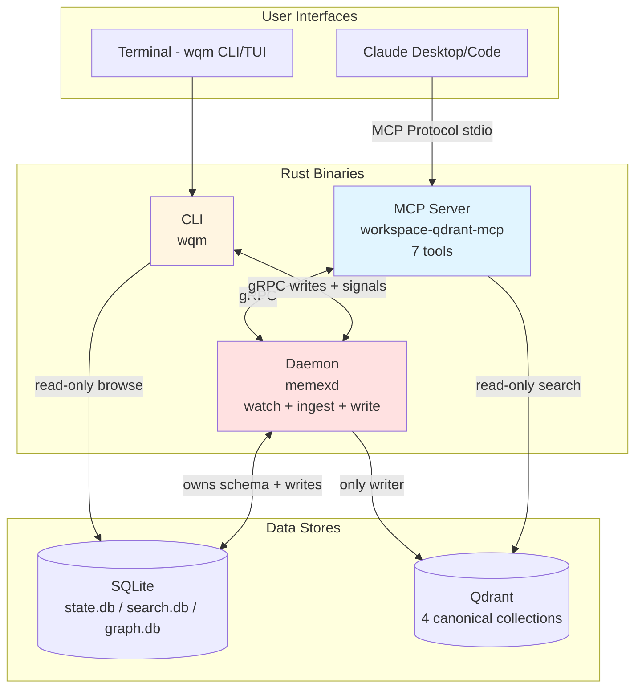
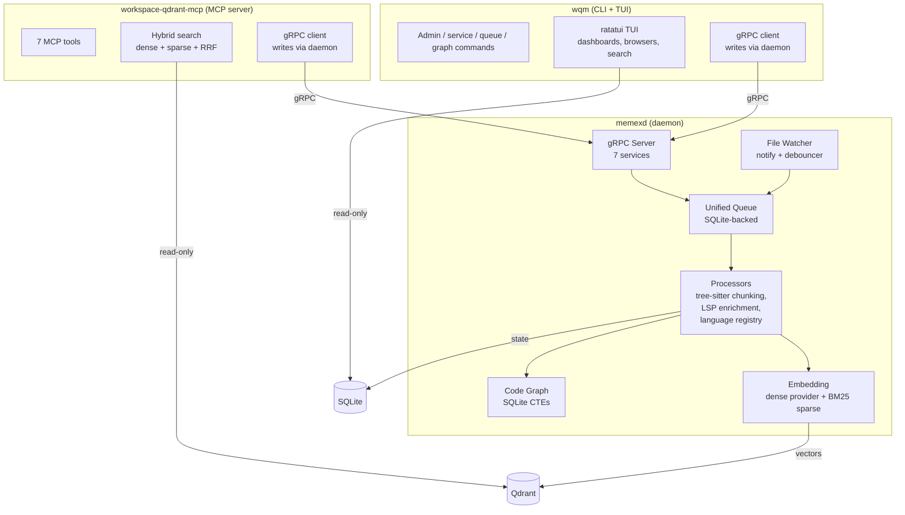
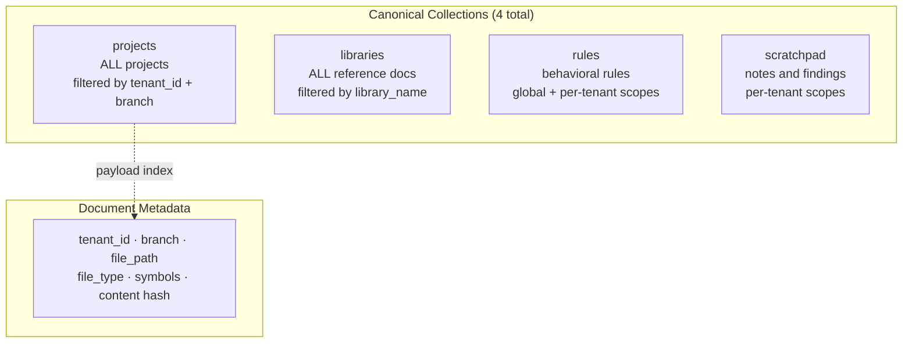
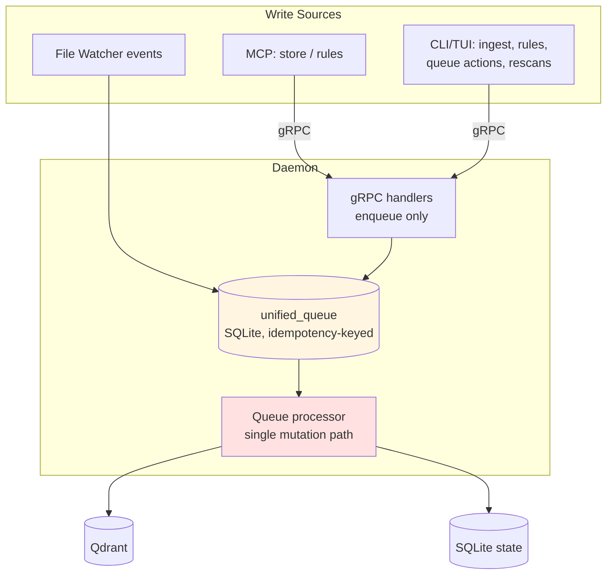
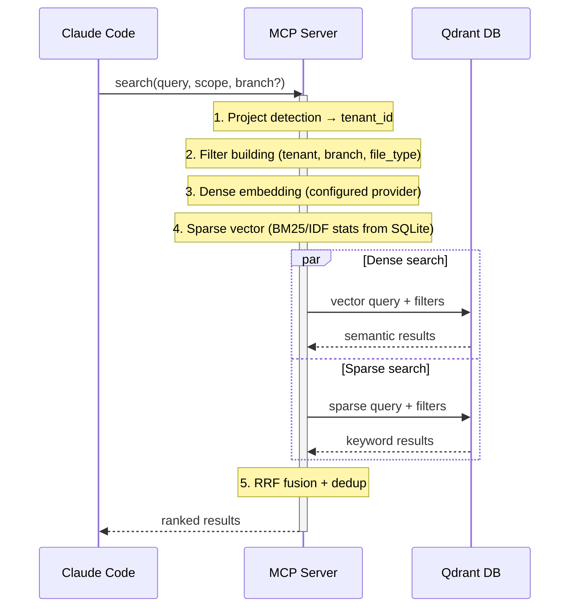

# workspace-qdrant-mcp Architecture

> **Authoritative Specification**: For the complete system specification, see the modular spec files in [docs/specs/](./specs/). This document provides the visual overview and component map.

workspace-qdrant-mcp is implemented entirely in Rust as a single Cargo workspace (`src/rust/`). Three shipped binaries cooperate around two data stores:

| Binary | Crate | Role |
|--------|-------|------|
| `memexd` | `daemon/memexd` (+ `daemon/core`, `daemon/grpc`) | Daemon: file watching, ingestion, embedding, all Qdrant/SQLite writes |
| `workspace-qdrant-mcp` | `daemon/mcp-server` | MCP server: Claude Desktop/Code integration (stdio), hybrid search pipeline |
| `wqm` | `cli` | CLI + TUI: administration, monitoring, queue/graph/search tooling |

Shared crates: `common` (types, project-id calculation, constants), `proto` (gRPC definitions), `client` (gRPC client used by CLI and MCP server), `common-node` (Node.js bridge), `daemon/shared-test-utils`, `tools/registry-updater` (language-registry maintenance).

## Table of Contents

- [System Overview](#system-overview)
- [Component Responsibilities](#component-responsibilities)
- [MCP Server](#mcp-server)
- [gRPC Services](#grpc-services)
- [Collection Structure](#collection-structure)
- [Write Path Architecture](#write-path-architecture)
- [Hybrid Search Flow](#hybrid-search-flow)
- [SQLite State Management](#sqlite-state-management)
- [Rule Injection](#rule-injection)

## System Overview

```mermaid
graph TB
    subgraph "User Interfaces"
        Claude[Claude Desktop/Code]
        Term[Terminal - wqm CLI/TUI]
    end

    subgraph "Rust Binaries"
        MCP[MCP Server<br/>workspace-qdrant-mcp<br/>7 tools]
        Daemon[Daemon<br/>memexd<br/>watch + ingest + write]
        CLI[CLI<br/>wqm]
    end

    subgraph "Data Stores"
        SQLite[(SQLite<br/>state.db / search.db / graph.db)]
        Qdrant[(Qdrant<br/>4 canonical collections)]
    end

    Claude -->|MCP Protocol stdio| MCP
    Term --> CLI

    MCP <-->|gRPC| Daemon
    CLI <-->|gRPC writes + signals| Daemon
    CLI -->|read-only browse| SQLite

    Daemon <-->|owns schema + writes| SQLite
    Daemon -->|only writer| Qdrant
    MCP -->|read-only search| Qdrant

    style MCP fill:#e1f5ff
    style Daemon fill:#ffe1e1
    style CLI fill:#fff5e1
```

**Key invariants** (see [docs/specs/](./specs/) and the ADRs):

- **Daemon owns all persistent state** (ADR-002, ADR-003): Qdrant writes and SQLite schema/mutations are daemon-only. MCP server and CLI route every mutation through daemon gRPC; their direct SQLite access is read-only.
- **Enqueue-only gRPC pattern**: write-path gRPC handlers enqueue to the unified queue; the queue processor performs the actual mutation (see `docs/specs/04-write-path.md`).
- **4 canonical collections** (ADR-001): `projects`, `libraries`, `rules`, `scratchpad` — fixed regardless of project count.
- **Idempotency key**: `SHA256(item_type|op|tenant_id|collection|payload_json)[:32]`, computed identically in the daemon, MCP server, and CLI.

## Component Responsibilities

```mermaid
graph TB
    subgraph "memexd (daemon)"
        D_gRPC[gRPC Server<br/>7 services]
        D_Watch[File Watcher<br/>notify + debouncer]
        D_Queue[Unified Queue<br/>SQLite-backed]
        D_Proc[Processors<br/>tree-sitter chunking,<br/>LSP enrichment,<br/>language registry]
        D_Embed[Embedding<br/>dense provider + BM25 sparse]
        D_Graph[Code Graph<br/>SQLite CTEs]

        D_gRPC --> D_Queue
        D_Watch --> D_Queue
        D_Queue --> D_Proc
        D_Proc --> D_Embed
        D_Proc --> D_Graph
    end

    subgraph "workspace-qdrant-mcp (MCP server)"
        M_Tools[7 MCP tools]
        M_Search[Hybrid search<br/>dense + sparse + RRF]
        M_Client[gRPC client<br/>writes via daemon]
    end

    subgraph "wqm (CLI + TUI)"
        C_Admin[Admin / service / queue / graph commands]
        C_TUI[ratatui TUI<br/>dashboards, browsers, search]
        C_Client[gRPC client<br/>writes via daemon]
    end

    D_Embed -->|vectors| Qdrant[(Qdrant)]
    D_Proc -->|state| SQLite[(SQLite)]
    M_Search -->|read-only| Qdrant
    M_Client -->|gRPC| D_gRPC
    C_Client -->|gRPC| D_gRPC
    C_TUI -->|read-only| SQLite
```

- **Daemon (`memexd`)**: watches registered project/library folders, debounces events, enqueues work, chunks code semantically with tree-sitter (44 bundled languages, dynamic grammar download), enriches with LSP where available, generates dense + sparse embeddings, writes to Qdrant and SQLite, maintains the code-relationship graph, and runs maintenance sweeps (reconcile, orphan pruning, queue cleanup).
- **MCP server**: exposes the tool surface to Claude, performs project detection (git-aware `tenant_id`), executes the hybrid search pipeline against Qdrant (read-only), and routes all writes through daemon gRPC.
- **CLI (`wqm`)**: administration (service lifecycle, collections, rebuilds), monitoring (queue, status, perf, graph stats), and a full TUI. Reads SQLite read-only for browsing; every mutation goes through daemon gRPC.

## MCP Server

The MCP server (`daemon/mcp-server` crate, binary `workspace-qdrant-mcp`) speaks the MCP protocol over stdio and exposes **7 tools** (see `docs/specs/08-api-reference.md`):

| Tool | Purpose |
|------|---------|
| `store` | Save content (scratchpad/library/url), register projects for indexing |
| `search` | Hybrid semantic search with scope (`project`/`group`/`all`), branch filtering, optional graph context |
| `grep` | Fast literal/regex line search (FTS5-backed) |
| `retrieve` | Fetch a known document by ID or metadata |
| `list` | Browse project structure (summary or path drill-down) |
| `rules` | Manage behavioral rules (list/add/update/remove) |
| `embedding` | Embedding provider status and management |

## gRPC Services

7 services defined in `src/rust/daemon/proto/workspace_daemon.proto`:

- **SystemService** — health, status, metrics, refresh signals, watcher pause/resume, DLQ
- **CollectionService** — canonical collection lifecycle and aliases (daemon-internal)
- **DocumentService** — text ingestion, document update/delete
- **EmbeddingService** — dense embedding + sparse vector generation, provider status
- **ProjectService** — project registration, sessions/heartbeats, branch lifecycle
- **TextSearchService** — exact (FTS5 whole-phrase) and regex text search
- **GraphService** — code-graph queries (related nodes, impact, PageRank, communities, betweenness)

## Collection Structure

Unified multi-tenant model (ADR-001): exactly 4 collections, isolated by payload filters.

```mermaid
graph TB
    subgraph "Canonical Collections (4 total)"
        P[projects<br/>ALL projects<br/>filtered by tenant_id + branch]
        L[libraries<br/>ALL reference docs<br/>filtered by library_name]
        R[rules<br/>behavioral rules<br/>global + per-tenant scopes]
        S[scratchpad<br/>notes and findings<br/>per-tenant scopes]
    end

    subgraph "Document Metadata"
        Meta[tenant_id · branch · file_path<br/>file_type · symbols · content hash]
    end

    P -.->|payload index| Meta
```

- `tenant_id` derives from the normalized git remote URL (or a path hash for non-git folders); multi-clone repositories are disambiguated by project-ID calculation.
- Branch-scoped queries are the default; content-hash dedup shares identical chunks across branches.
- Hard tenant filtering prevents cross-project leakage; `scope="all"` opts into cross-project search.

## Write Path Architecture

All Qdrant writes flow through the daemon; gRPC write handlers only enqueue (see `docs/specs/04-write-path.md`).

```mermaid
graph TB
    subgraph "Write Sources"
        MCP_W[MCP: store / rules]
        CLI_W[CLI/TUI: ingest, rules,<br/>queue actions, rescans]
        Watch[File Watcher events]
    end

    subgraph "Daemon"
        Handlers[gRPC handlers<br/>enqueue only]
        UQ[(unified_queue<br/>SQLite, idempotency-keyed)]
        Proc[Queue processor<br/>single mutation path]
    end

    MCP_W -->|gRPC| Handlers
    CLI_W -->|gRPC| Handlers
    Watch --> UQ
    Handlers --> UQ
    UQ --> Proc
    Proc --> Qdrant[(Qdrant)]
    Proc --> SQLite[(SQLite state)]

    style UQ fill:#fff5e1
    style Proc fill:#ffe1e1
```

Properties:

- **Single mutation path**: one processor applies every write — consistent metadata enrichment, dedup, and GC.
- **Idempotency**: duplicate enqueues collapse on the idempotency key.
- **Fairness**: queue ordering blends priority (active sessions first), age promotion, and tenant line-jumping for interactive operations.
- **Crash safety**: the queue is SQLite-backed; work survives daemon restarts and is recovered at startup.

## Hybrid Search Flow

```mermaid
sequenceDiagram
    participant Claude as Claude Code
    participant MCP as MCP Server
    participant Qdrant as Qdrant DB

    Claude->>MCP: search(query, scope, branch?)

    activate MCP
    Note over MCP: 1. Project detection → tenant_id
    Note over MCP: 2. Filter building (tenant, branch, file_type)
    Note over MCP: 3. Dense embedding (configured provider)
    Note over MCP: 4. Sparse vector (BM25/IDF stats from SQLite)

    par Dense search
        MCP->>Qdrant: vector query + filters
        Qdrant-->>MCP: semantic results
    and Sparse search
        MCP->>Qdrant: sparse query + filters
        Qdrant-->>MCP: keyword results
    end

    Note over MCP: 5. RRF fusion + dedup
    MCP-->>Claude: ranked results
    deactivate MCP
```

- Dense embeddings come from the configured provider (FastEmbed by default; OpenAI et al. configurable). Sparse vectors use BM25 with corpus statistics persisted in SQLite.
- Literal/regex queries take the separate FTS5 path (`grep` tool, `TextSearchService`).

## SQLite State Management

**Reference:** ADR-003 — **the daemon owns SQLite.** It creates the databases, owns the schema, and runs all migrations. Other components open read-only connections for browsing; every mutation goes through daemon gRPC.

Databases (under the platform data dir, e.g. `~/.local/share/workspace-qdrant/`):

| Database | Contents |
|----------|----------|
| `state.db` | watch folders, tracked files, unified queue, rules mirror, tenants |
| `search.db` | FTS5 indexes, file metadata, indexed-content cache |
| `graph.db` | code-relationship graph (nodes, edges, CTE queries) |
| `daemon_state.db` | daemon runtime bookkeeping |

Conventions:

- WAL mode, `busy_timeout`, and transaction-wrapped operations everywhere — no bare queries outside a transaction.
- Schema migrations are versioned (`schema_version` module); table-rebuild migrations own their transaction and FK-guard.
- Watch-folder changes are made via gRPC (`EnableWatch`/`DisableWatch`, registration) and picked up by the daemon — the CLI never mutates `watch_folders` directly.

## Rule Injection

Behavioral rules live in the `rules` collection (with a SQLite mirror for fast listing) and reach Claude Code through installed hooks rather than a separate injector component:

- `wqm init hooks install` installs Claude Code hooks; at session start the hook fetches applicable rules (global + current project scope) and injects them into the session context.
- Rules are managed via the MCP `rules` tool, `wqm rules` commands, or the TUI rules browser.

---

## Additional Resources

- **[docs/specs/](./specs/)** — authoritative modular specification (16 files)
- **[Component Boundaries](./architecture/component-boundaries.md)** — formal component responsibilities
- **[Write Path Enforcement](./architecture/write-path-enforcement.md)** — write path validation
- **[Data Flow and Isolation](./architecture/data-flow-and-isolation.md)** — system workflows

**Reference Implementation:**

- **Daemon**: `src/rust/daemon/` (`core`, `grpc`, `memexd`)
- **MCP server**: `src/rust/daemon/mcp-server/`
- **CLI/TUI**: `src/rust/cli/` (`wqm` binary; TUI under `src/tui/`)
- **Shared**: `src/rust/common/`, `src/rust/proto/`, `src/rust/client/`

**Version**: 2.0
**Last Updated**: 2026-06-10
**Spec Alignment**: docs/specs/ (modular specification)
**ADR Alignment**: ADR-001 (canonical collections), ADR-002 (daemon-only writes), ADR-003 (daemon owns SQLite)
**Updates**: Rewritten for the all-Rust architecture (daemon + MCP server + CLI); removed obsolete Python/FastMCP component model
