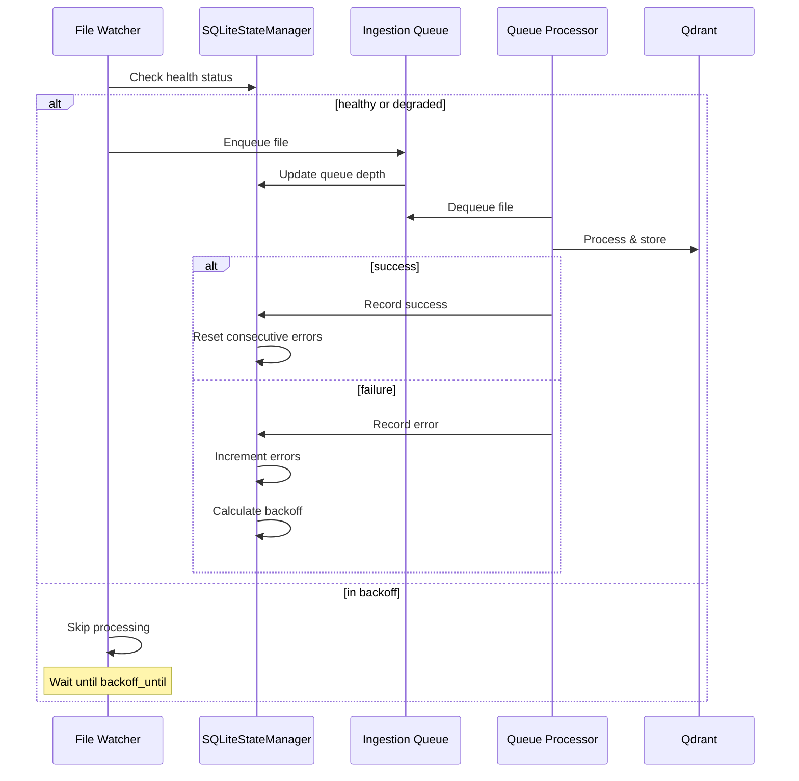
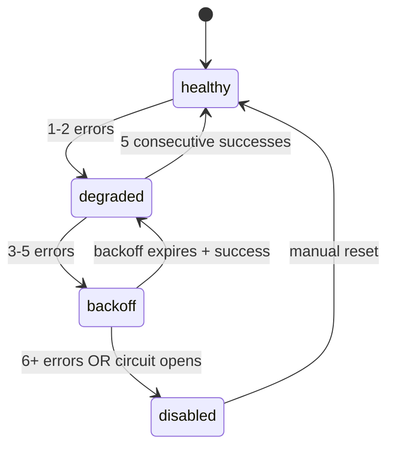
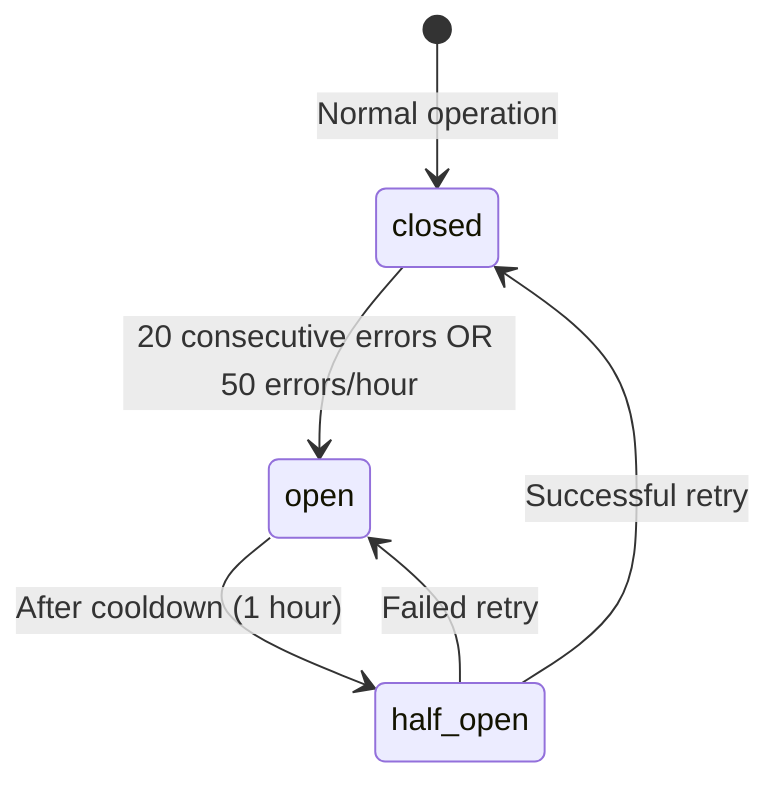
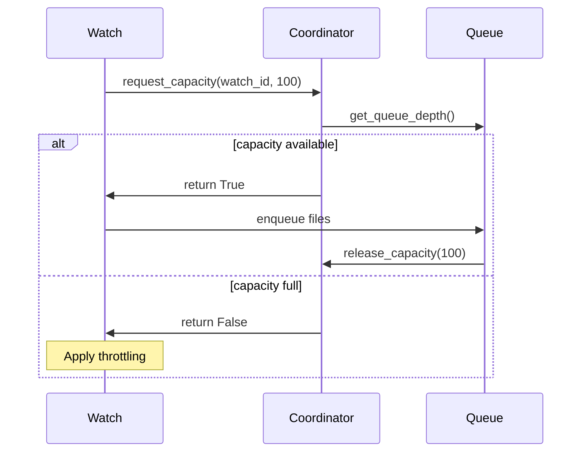
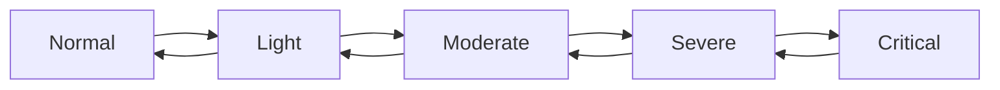
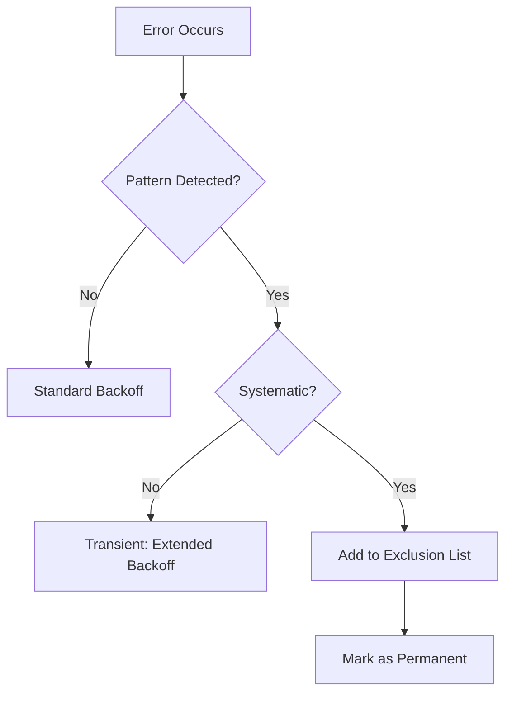

# Watch-Queue Handshake Architecture

This document describes the coordination mechanism between file watchers and the processing queue in workspace-qdrant-mcp. The handshake system ensures reliable file processing with error recovery, backoff strategies, and graceful degradation under load.

## Table of Contents

1. [Overview](#overview)
2. [Architecture](#architecture)
3. [Error Tracking and Backoff Strategy](#error-tracking-and-backoff-strategy)
4. [Health Status Transitions](#health-status-transitions)
5. [Circuit Breaker Pattern](#circuit-breaker-pattern)
6. [Coordination Protocol](#coordination-protocol)
7. [Graceful Degradation](#graceful-degradation)
8. [Error Pattern Detection](#error-pattern-detection)
9. [Priority Management](#priority-management)
10. [CLI Commands](#cli-commands)
11. [Configuration](#configuration)
12. [Troubleshooting](#troubleshooting)

## Overview

The watch-queue handshake system coordinates between:
- **File Watchers**: Monitor directories for changes and queue files for processing
- **Ingestion Queue**: SQLite-based queue storing files pending processing
- **Queue Processor**: Processes files from the queue and stores in Qdrant

Key features:
- Consecutive error tracking per watch folder
- Exponential backoff for repeated failures
- Health status monitoring (healthy/degraded/backoff/disabled)
- Circuit breaker pattern for persistent failures
- Graceful degradation under system load
- Error pattern detection for systematic failures
- Priority-based watch management

## Architecture

### Component Interaction



### Data Flow

```
┌─────────────────┐     ┌─────────────────┐     ┌─────────────────┐
│  File Watcher   │────▶│  SQLite Queue   │────▶│ Queue Processor │
│                 │     │                 │     │                 │
│ - Watch folders │     │ - ingestion_    │     │ - Process files │
│ - Debouncing    │     │   queue table   │     │ - Generate      │
│ - Pattern match │     │ - Priority      │     │   embeddings    │
│ - Error track   │     │   ordering      │     │ - Store vectors │
└─────────────────┘     └─────────────────┘     └─────────────────┘
        │                       │                       │
        ▼                       ▼                       ▼
┌─────────────────────────────────────────────────────────────────┐
│                     SQLiteStateManager                          │
│  - watch_folders table (config + error state)                   │
│  - watch_error_patterns table (pattern detection)               │
│  - watch_exclusions table (permanent exclusions)                │
│  - system_state table (degradation state)                       │
└─────────────────────────────────────────────────────────────────┘
```

## Error Tracking and Backoff Strategy

### Error Tracking Fields

Each watch folder tracks:

| Field | Description |
|-------|-------------|
| `consecutive_errors` | Number of errors since last success |
| `total_errors` | Cumulative error count |
| `last_error_at` | Timestamp of most recent error |
| `last_error_message` | Description of last error |
| `backoff_until` | When to resume processing |
| `last_success_at` | Timestamp of last successful processing |
| `health_status` | Current health state |

### Exponential Backoff

Backoff delay is calculated using exponential growth with jitter:

```python
base_delay_ms = 1000  # 1 second
max_delay_ms = 300000  # 5 minutes
backoff_multiplier = 2.0

delay = min(base_delay_ms * (multiplier ^ consecutive_errors), max_delay_ms)
delay_with_jitter = delay * (0.9 + random() * 0.2)  # ±10% jitter
```

### Backoff Sequence

| Consecutive Errors | Backoff Delay |
|-------------------|---------------|
| 1 | 2 seconds |
| 2 | 4 seconds |
| 3 | 8 seconds |
| 4 | 16 seconds |
| 5 | 32 seconds |
| 6+ | 64 seconds (capped) |

## Health Status Transitions

### State Machine



### Status Definitions

| Status | Description | Behavior |
|--------|-------------|----------|
| `healthy` | Operating normally | Full processing speed |
| `degraded` | Minor issues detected | Reduced priority (-1) |
| `backoff` | In backoff period | Processing paused until backoff_until |
| `disabled` | Circuit breaker open | Requires manual intervention |

### Transition Rules

```python
def transition_health_status(consecutive_errors: int, current_status: str) -> str:
    if consecutive_errors == 0:
        return "healthy"
    elif consecutive_errors <= 2:
        return "degraded"
    elif consecutive_errors <= 5:
        return "backoff"
    else:
        return "disabled"  # Circuit breaker opens
```

## Circuit Breaker Pattern

The circuit breaker prevents continuous retries for persistently failing watches.

### Circuit States



### Thresholds

| Condition | Threshold | Action |
|-----------|-----------|--------|
| Consecutive errors | 20 | Open circuit |
| Errors per hour | 50 | Open circuit |
| Cooldown period | 1 hour | Try half-open |
| Half-open successes | 3 | Close circuit |

### Implementation

When the circuit opens:
1. Watch is set to `enabled=false`
2. Health status becomes `disabled`
3. Warning is logged
4. Manual reset required via CLI

## Coordination Protocol

### Capacity Management

The `WatchQueueCoordinator` manages queue capacity:

```python
@dataclass
class CoordinatorConfig:
    total_capacity: int = 10000  # Maximum queue items
    high_watermark: float = 0.8  # 80% triggers throttling
    low_watermark: float = 0.5   # 50% resumes normal
```

### Flow Control



### Queue Depth Monitoring

| Queue Depth | Load Level | Action |
|-------------|------------|--------|
| 0-1000 | Normal | Full speed |
| 1000-3000 | Light | Minor throttling |
| 3000-5000 | Moderate | Reduce polling 2x |
| 5000-10000 | Severe | Reduce polling 4x |
| 10000+ | Critical | Emergency measures |

## Graceful Degradation

### Degradation Levels



### Level Definitions

| Level | Triggers | Actions |
|-------|----------|---------|
| Normal | Queue < 1000, throughput > 75% | Standard operation |
| Light | Queue > 1000 | 1.5x polling interval |
| Moderate | Queue > 3000 OR throughput < 75% | 2x polling, pause priority ≤ 3 |
| Severe | Queue > 5000 OR throughput < 50% | 4x polling, pause priority ≤ 5 |
| Critical | Queue > 10000 | 10x polling, pause priority ≤ 8 |

### Recovery Process

1. **Cooldown**: Wait 60 seconds before recovering
2. **Gradual**: Recover one level per check cycle
3. **Steps**: 3 successful checks to fully recover
4. **Resume**: Automatically resume paused watches

## Error Pattern Detection

### Pattern Types

| Type | Detection | Action |
|------|-----------|--------|
| `file_repeated` | Same file fails 5+ times | Exclude file permanently |
| `file_type` | Extension fails 10+ times | Log warning |
| `time_based` | Errors cluster by hour | Identify scheduling issues |
| `network` | Connection errors | Use longer backoff |
| `permission` | Access denied | Flag for investigation |

### Systematic vs Transient Failures



### Exclusion Management

Files can be excluded by:
- **File**: Exact path match
- **Pattern**: Glob pattern (e.g., `*.corrupted`)
- **Directory**: Entire directory tree

## Priority Management

### Watch Priority

Each watch has a priority (0-10, default 5):

```python
# Effective priority calculation
def calculate_effective_priority(watch: WatchFolderConfig) -> int:
    base = watch.watch_priority

    if watch.health_status == "degraded":
        base -= 1
    elif watch.health_status == "backoff":
        base -= 2
    elif watch.health_status == "disabled":
        return 0
    elif watch.health_status == "healthy" and recent_success:
        base += 1

    return max(0, min(10, base))
```

### Priority-Based Actions

| Priority | Moderate Load | Severe Load | Critical Load |
|----------|---------------|-------------|---------------|
| 0-3 | Paused | Paused | Paused |
| 4-5 | Active | Paused | Paused |
| 6-8 | Active | Active | Paused |
| 9-10 | Active | Active | Active |

## CLI Commands

### Watch Health Monitoring

```bash
# Show health status for all watches
wqm watch health

# Filter by status
wqm watch health --status degraded
wqm watch health --status backoff

# Filter by collection
wqm watch health --collection my-project

# JSON output
wqm watch health --format json
```

### Error Details

```bash
# Show detailed errors for a watch
wqm watch errors <watch_id>

# Shows:
# - Consecutive errors
# - Total errors
# - Last error timestamp
# - Last error message
# - Backoff status
# - Error patterns
```

### Reset Error State

```bash
# Clear error state (requires confirmation)
wqm watch reset-errors <watch_id>

# Force reset without confirmation
wqm watch reset-errors <watch_id> --force
```

### Watch Management

```bash
# List all watches with priority
wqm watch list --show-priority

# Update watch priority
wqm watch update <watch_id> --priority 8

# Disable a watch
wqm watch disable <watch_id>

# Enable a watch
wqm watch enable <watch_id>
```

## Configuration

### Watch Folder Configuration

```python
WatchFolderConfig(
    watch_id="my-project",
    path="/path/to/project",
    collection="my-project-code",
    patterns=["*.py", "*.js", "*.ts"],
    ignore_patterns=[".git/*", "node_modules/*", "__pycache__/*"],
    auto_ingest=True,
    recursive=True,
    recursive_depth=10,
    debounce_seconds=2.0,
    enabled=True,
    watch_type="project",
    watch_priority=5,  # 0-10
)
```

### Degradation Configuration

```python
DegradationConfig(
    # Queue depth thresholds
    queue_depth_light=1000,
    queue_depth_moderate=3000,
    queue_depth_severe=5000,
    queue_depth_critical=10000,

    # Throughput thresholds
    throughput_target=100.0,  # items/second
    throughput_warning=0.75,  # 75%
    throughput_critical=0.50,  # 50%

    # Memory thresholds
    memory_warning=0.70,  # 70%
    memory_critical=0.85,  # 85%

    # Polling adjustments
    polling_interval_light=1.5,
    polling_interval_moderate=2.0,
    polling_interval_severe=4.0,
    polling_interval_critical=10.0,

    # Recovery
    recovery_cooldown_seconds=60,
    recovery_steps=3,
)
```

### Backoff Configuration

```python
BackoffConfig(
    base_delay_ms=1000,      # 1 second
    max_delay_ms=300000,     # 5 minutes
    backoff_multiplier=2.0,
    jitter_factor=0.1,       # ±10%
)
```

## Troubleshooting

### Watch Not Processing Files

1. **Check health status**:
   ```bash
   wqm watch health
   ```

2. **Check if in backoff**:
   ```bash
   wqm watch errors <watch_id>
   ```

3. **Check if paused by degradation**:
   ```bash
   wqm watch list --show-degradation
   ```

4. **Reset if needed**:
   ```bash
   wqm watch reset-errors <watch_id> --force
   ```

### High Queue Depth

1. **Check degradation state**:
   ```bash
   wqm admin degradation-status
   ```

2. **Identify slow collections**:
   ```bash
   wqm admin queue-stats --by-collection
   ```

3. **Temporarily pause low-priority watches**:
   ```bash
   wqm watch disable <low-priority-watch>
   ```

### Persistent Failures

1. **Check error patterns**:
   ```bash
   wqm watch errors <watch_id> --show-patterns
   ```

2. **Review exclusions**:
   ```bash
   wqm watch exclusions <watch_id>
   ```

3. **Clear patterns and retry**:
   ```bash
   wqm watch reset-errors <watch_id> --clear-patterns
   ```

### Circuit Breaker Open

1. **Identify the cause**:
   ```bash
   wqm watch errors <watch_id>
   ```

2. **Fix the underlying issue** (permissions, network, etc.)

3. **Reset the circuit**:
   ```bash
   wqm watch reset-errors <watch_id> --force
   wqm watch enable <watch_id>
   ```

### Memory Issues

1. **Check memory usage**:
   ```bash
   wqm admin system-stats
   ```

2. **Reduce concurrent watches**:
   ```bash
   wqm watch list --by-priority
   # Disable lower priority watches
   ```

3. **Increase degradation sensitivity**:
   Adjust `memory_warning` threshold in configuration.

## Best Practices

1. **Set appropriate priorities**: Higher priority for critical projects
2. **Monitor health regularly**: Use `wqm watch health` in dashboards
3. **Configure patterns carefully**: Exclude binary files and generated code
4. **Review error patterns**: Identify systematic issues early
5. **Test recovery**: Verify manual reset procedures work
6. **Tune thresholds**: Adjust based on your hardware capacity

## Related Documentation

- [ARCHITECTURE.md](ARCHITECTURE.md) - Overall system architecture
- [API.md](API.md) - API reference
- [TESTING.md](TESTING.md) - Testing guide
- [TROUBLESHOOTING.md](TROUBLESHOOTING.md) - General troubleshooting
