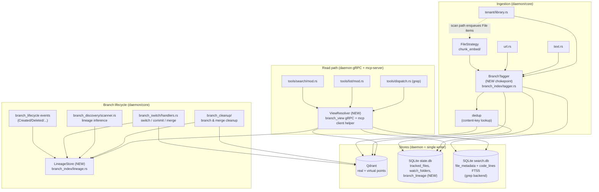
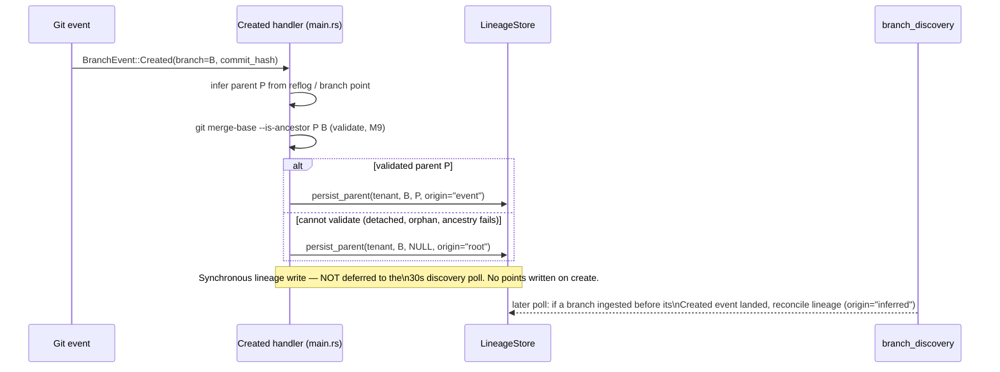
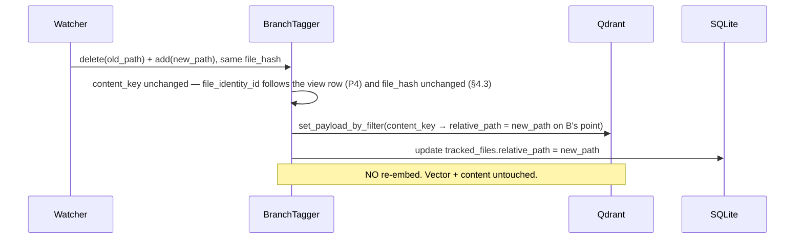
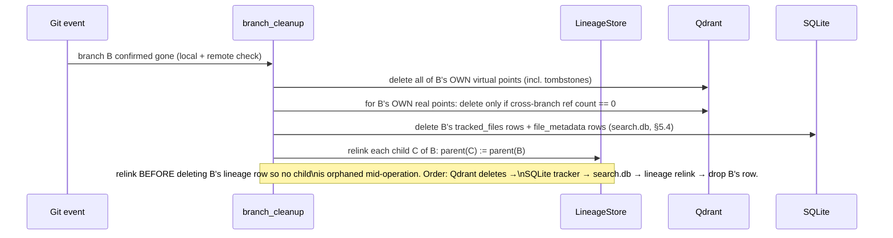

# Branch / Worktree-Aware Indexing — Subsystem Architecture

<!--
  File: docs/architecture/branch-lineage-indexing.md
  Location: docs/architecture/ (subsystem doc — not the root ARCHITECTURE.md)
  Context: memexd daemon + mcp-server (workspace-qdrant-mcp). Defines how indexed
  content (files, URLs, text/scratchpad, library docs) is scoped to git branches
  and worktrees so that branching never re-embeds shared content, per-branch
  metadata divergence is representable, and the read path returns the correct
  effective view for whatever branch/worktree is active.

  Companion documents:
    - docs/architecture/data-flow-and-isolation.md  (component isolation, store ownership)
    - ARCHITECTURE.md §Ingestion / §Search  (system-level picture)

  Grounding: every file:line below was re-verified on branch feat/branch-mgmt
  against the live tree (round-2 re-grounding, FP2). The current code uses a
  `branches:[]`-array-on-one-real-point model; this document designs the
  migration TO the LOCKED virtual-shadow-point + lineage-chain model (Chris's
  9-point principle, recorded in §1).

  Architecture round: 6 — DECISIONS-ENCODED pass + round-6 fixes applied
  (impl/data/security/readability audit). All four Chris/supervisor decision-gates
  are RESOLVED and encoded in this document (no longer open):
    - D1 = REPLACE (not Layer) — §9.1, §9.6. The Replace re-key pass also mints
      one `file_identity_id` per existing distinct file-lineage.
    - D2 = NO-SHARE, UNIVERSALLY — see §1.3 (full invariant), §4.3 (two-key split
      + three-case ladder), §5.1 (the COPY-VECTOR dedup chokepoint), §9.6 (D2).
    - Q3 / O3 = (b) local callers mutually trusted — the daemon checks only
      EXISTS-IN-REGISTERED-PROJECTS; session→tenant binding is done in the
      mcp-server, not in-band at the daemon (§5.6.1, §9.6).
  Tolerances (§9.6) are now CONFIGURABLE PARAMETERS (`[branch_lineage]` namespace)
  with Chris-ratified defaults — none hardcoded; retunable without a code change.
  Round 1–5 history: 15 round-1 MUST-FIX clusters + 14 round-2
  (N1–N14) + 10 round-3 (P1–P10) + the 5 mechanical round-4 residuals
  (Q1, Q2, Q4, Q6, Q7) + round-5 mechanical residuals; see
  tmp/arch-workspace/arch_response.md for the full trail. The MODEL (virtual
  shadow points + lineage chain) has stood unchallenged across all rounds and was
  NOT touched in round 6.

  Terminology (defined once here, used throughout):
    - REAL point   : a Qdrant point that carries the embedding vector + full
                     payload. The content lives here. Keyed by `content_key`.
    - VIRTUAL point: a Qdrant point with NO vector and NO `content` payload —
                     `virtual:true`, a `real_point_id` link, and its OWN
                     per-branch metadata (branch, path, presence). It is how a
                     branch says "I see this content, at this path" without
                     copying the vector.
    - TOMBSTONE    : a virtual point with `state:"deleted"`. It subtracts a path
                     from a branch's effective view (the branch deleted a file it
                     would otherwise have inherited).
    - content_key  : the path-independent, branch-independent content identity
                     `SHA256(tenant_id|file_identity_id|file_hash)` (§4.3). The
                     dedup key. The `file_identity_id` term partitions the
                     share-zone so identity is shared ONLY along a single
                     file-identity's lineage (axis A), never across distinct
                     files or collections (D2 = no-share).
    - file_identity_id : a content-INDEPENDENT random UUID minted at a path's
                     first parent-less ingest and INHERITED down lineage and
                     across renames (§4.4). It follows the VIEW ROW, not the
                     bytes. Inherited identical down a lineage chain, so same
                     file across branches keeps one content_key (axis A).
    - lineage chain: the ordered list `[B, parent(B), …, root]` of branches a
                     query branch B inherits from (§4.4, §5.2).
-->

## 1. Overview

### 1.1 The subsystem

Every indexed item in this system carries a git **branch** dimension. A file
that exists identically on `main` and on `feature/x` must be embedded **once**,
yet must be findable from a search scoped to either branch. A file that diverges
between branches — its content changed, its path changed, or it was deleted on
one branch only — must present a **different view per branch** without
re-embedding the bytes that did not change. A **worktree** is the same branch
checked out at a second drive path, so it adds concurrency and a second location
but no new semantics.

This subsystem owns that branch dimension across **all** ingestion surfaces:
file ingest (`FileStrategy`), URL fetch (`url.rs`), inline text / scratchpad
(`text.rs`), and library documents (`tenant/library.rs`). It also owns the
**read path** — resolving "what does branch B see?" for `search`, `list`, and
`grep` in the mcp-server. Note that `grep` reads a **separate** store
(`search.db` FTS5), not Qdrant, so the read path spans **three** stores; this is
a first-class concern (§4.2, §5.4), not an afterthought.

### 1.2 The locked model (Chris's 9-point principle — design target, not negotiable)

1. A derived branch shares its parent's records as **virtual points**: no
   payload, no vector, metadata `virtual:true` plus a link to the **real point**
   it shadows (same content hash). No re-embed.
2. A file **changed or added** on branch B → real ingestion scoped to B only;
   the shadow it would otherwise inherit is **superseded**.
3. A **delete on B** → the virtual record is deleted (B's view only); the parent
   real point is untouched.
4. A **move** (path changes, content hash unchanged) → keep the chunks, rewrite
   **only** the Qdrant metadata and our tracker. Never re-embed. **This also
   holds on `main`/active branch** — point identity is stable across a trivial
   path change.
5. **Recursion**: branching off a non-`main` branch uses the same model with the
   parent being *that* branch. Lineage is a **chain**, not a star around `main`.
6. A **worktree** is a branch active at a different drive path. Same principles;
   the only differences are concurrency and location.
7. **Local-only git must work** — no remote shared id required. A stable
   project + lineage id is derived locally; the remote case is the easy one.
8. **Lifecycle** covered end-to-end: create, merge-with-deletion,
   merge-without-deletion, branch deletion — the virtual tree is maintained so
   nothing re-embeds.
9. Applies to **all** indexing tools, not just file ingest.

Plus the read-path defect that triggered this work: `search`/`list`/`grep`
silently default the `branch` filter to the literally-checked-out branch
(`session.current_branch`), so in a non-`main` worktree every default query
returns **zero**. The corrected semantics are specified in §3.7 and §5.2.

### 1.3 Chosen model, in one screen

We adopt the locked **virtual-shadow-point + lineage-chain** model and **replace**
the current `branches:[]`-array model (migration analysis in §9.1 — decision
**D1 = Replace**, resolved). Concretely:

- **Content layer (real points).** A real Qdrant point holds the vector and the
  full payload. It is keyed by a **branch-agnostic, path-independent**
  identifier derived from `(tenant_id, file_identity_id, file_hash)` — the
  **content_key** (§4.3). Within ONE file-identity's lineage `file_identity_id`
  is inherited (identical down the chain), so identical bytes of the **same**
  file are embedded exactly once across branches, regardless of branch, path, or
  worktree. Two **distinct** files (or a project-copy vs a library-copy) with
  identical bytes get **different** content_keys → different real points; the
  compute is still deduped by **copying** the vector (§5.1), never by sharing the
  point.
- **View layer (virtual points).** A branch that inherits a parent's content
  carries a **virtual point**: `virtual:true`, no vector, no `content`, a
  `real_point_id` link, and **its own** per-branch metadata (`branch`,
  `relative_path`, `state`).
- **Lineage layer (the chain).** Each branch records its **parent branch** in a
  persisted lineage table (§4.4). A branch's effective view is *its own real and
  virtual points* **unioned with** the virtual points inherited along the chain
  to the root, with **tombstone subtraction** resolved nearest-branch-wins by a
  two-phase resolver (§5.2).

> **The no-share invariant (D2, the unifying principle).** Share point IDENTITY
> only along a single file-identity's lineage (**axis A** = the same file across
> branches = the locked virtual-point / lineage model). Across **distinct**
> file-identities or **distinct** collections, NEVER share identity — copy the
> vector to dedup the *compute* only. This is referenced from §4.3 (the
> `file_identity_id` key term), §5.1 (the three-case dedup ladder with a
> copy-vector path), and §9.6 (D2).
>
> **Axis legend (the one anchor for all later axis-A/B/C uses).**
> - **Axis A** — the *same* file-identity across branches → **share** the real
>   point (virtual point + lineage; no embed, no copy). §5.1 Case 1.
> - **Axis B** — *different* file-identities, same bytes, same project → **copy**
>   the vector into each identity's own real point (compute deduped, identity not
>   shared). §5.1 Case 2.
> - **Axis C** — the *same* document in a project AND a library under one tenant
>   (distinct collections) → **copy** the vector; each collection owns an
>   independent real point. §5.1 Case 2.

The content_key is the same dedup key whether the bytes arrive from a file, a
URL, inline text, or a library doc, so **one branch-tagging chokepoint** (§5.1)
serves every tool and satisfies P9.

### 1.4 Why this model and not the array

The existing `branches:[]` array on a single real point already delivers
"no re-embed for verbatim-shared content" (`branch_index/tagger.rs` Case 1 — `dedup.rs` RETIRED, see §8;
`scanner.rs` branch-add). It **cannot** represent **per-branch metadata
divergence**: one real point carries exactly one `relative_path`
(`tracked_files.relative_path` in the v40 DDL, `v40.rs:48`; payload
`relative_path`, `payload.rs:67-70`), so a file moved on B but not on `main` is
inexpressible without either duplicating the point (re-embed) or corrupting
`main`'s path. P4 (move-without-re-embed, holding on `main` too) and P1/P3
(per-branch presence/deletion) are exactly the cases the array cannot model. The
virtual point splits **content identity** (shared, in the real point) from
**branch view** (divergent, in the virtual point) — a copy-on-write /
structural-sharing scheme: shared structure until a branch writes, at which
point only that branch's view diverges. The array is a degenerate, view-less
special case of this model.

---

## 2. Component Map



| Component | Responsibility | Boundary / must NOT do | Anchor |
|---|---|---|---|
| **BranchTagger** (new) | The single chokepoint every ingestion surface routes through to (a) compute the content_key, (b) dedup against existing content, (c) write the real point once and/or the per-branch virtual point, (d) write the tracker row, (e) keep `search.db` `file_metadata` in step (§5.4). | Must NOT embed — it asks the embed stage only when content is genuinely new. Must NOT know tool specifics beyond the `IngestItem` contract (§5.1). | new `daemon/core/src/branch_index/tagger.rs`; replaces ad-hoc tagging at `payload.rs:65`, `url.rs:269`, `text.rs:226/339/420` |
| **Content dedup** | The dedup decision the tagger runs. **§5.1 is the single authoritative three-case description** — see it for the case-by-case ladder. | Must key on the content_key `(tenant_id, file_identity_id, file_hash)` (§4.3), NOT on path. The byte-locator is a **state.db probe on `(tenant_id, file_hash)`**, NOT a Qdrant scan. Must NEVER share identity across file-identities (D2). | lives entirely in `branch_index/tagger.rs`; `dedup.rs` RETIRED (deleted). Uses `locate_byte_identical` (operations.rs:680, F5, already implemented) + `retrieve_point_with_vector` (scroll.rs:440, F5, already implemented). |
| **LineageStore** (new) | Persist and read the parent-branch pointer per `(tenant, branch)`; expand a branch to its ordered lineage chain (depth-capped + cycle-guarded, §4.4/§5.2). | Must NOT infer lineage heuristically at read time — inference happens once at create/discovery, is **git-validated** (M9, §3.1), and persisted. | new `daemon/core/src/branch_index/lineage.rs` + `branch_lineage` table (§4.4) |
| **branch lifecycle wiring** | On `BranchEvent::Created`, synchronously write the lineage row (today `main.rs:528-533` is a `debug!` no-op). | Must NOT rely solely on the lazy 30s discovery poll for lineage; see the race fix (M6, §3.1). | `memexd/src/main.rs:528-533`, `branch_lifecycle/detector.rs:265` |
| **branch_switch handlers** | On switch/commit/merge: diff the tree, supersede shadows for changed/added paths (P2), enqueue genuinely-new content. | Must NOT treat merge as a plain commit (today it does — `handlers.rs:41`); merge must reconcile deleted paths (P8, §3.5). | `branch_switch/handlers.rs:30-134`; `apply_branch_add` at `branch_switch/handlers.rs:140` (NOT `db.rs:37`, which is the per-tenant lock acquisition in `batch_add_branch_to_unchanged_files`, `db.rs:26`) |
| **branch_cleanup** | On branch deletion: delete that branch's virtual points and any real points no other branch references; relink children's lineage to the deleted branch's parent. | Must NOT delete a real point while any branch (direct or virtual) still sees it — needs a **cross-branch** reference count (the existing guard is watch-folder-scoped, M7). | `branch_cleanup/mod.rs:210-386` (partition `:294-295`), `db::has_other_base_point_references:307` |
| **branch_discovery** | First-touch inference of a new branch's parent when no create event was observed (local-only, no remote). | Must persist the **git-validated** inferred parent via LineageStore; today `parent_branch` is computed (`scanner.rs:305`) and **dropped**. | `branch_discovery/scanner.rs:305-323`, `discovery_trigger.rs` |
| **ViewResolver** (new) | Turn the caller's requested/defaulted branch into the **lineage chain + tombstoned-path set** (two-phase, §5.2), build the Qdrant condition, and signal empty-vs-unknown. | Must NOT default to `session.current_branch` for the same-project case (the bug). Must keep tenant isolation unless `scope=all` (M10). | new daemon gRPC `branch_view` + mcp-server client helper (§5.2/M5); integrates `search/mod.rs:97-111`, `list/mod.rs:452-464`, `dispatch.rs:266-285`, extends `target_branch.rs` |
| **Filter builder** | Translate a lineage chain + tombstoned-path set into a Qdrant `Filter`. | Add a NEW `build_lineage_branch_condition(chain)` that matches `field::BRANCH` against an `IN`-set, beside the existing single-string `build_branch_condition` (`filters.rs:207-213`) — do **not** break its current callers; add an explicit tombstone `must_not` (§5.2, §8). | `client/src/qdrant/filters.rs:207-213` |

---

## 3. Data Flows

Each flow gives the happy path and the salient error path. "Real point" = vector
+ payload; "virtual point" = `virtual:true`, no vector, `real_point_id` link.

### 3.1 Branch create (P1, P5, P7) — with the no-op-consumer + poll-race fix (M6, M9)



**The round-1 gap (M6, validation §8).** Today `BranchEvent::Created` is handled
at `main.rs:528-533` by a `debug!` log only — "discovery on first file event."
Lineage is therefore established **lazily** by the 30s discovery poll. A branch
created and **ingested-to before the next poll** has no lineage row, so the
tagger would treat it as a root and stamp its first batch of points with no
inheritance — never retroactively fixed.

**The fix is two-pronged:**

1. **Synchronous lineage write on `Created`.** The `Created` arm becomes a real
   handler that infers the parent from the branch's reflog / creation commit and
   calls `LineageStore::persist_parent`. **This does NOT by itself eliminate the
   race (N13).** The handler is serial only *within the branch-event-consumer
   task*; the file-ingest pipeline is a **separate** task. Nothing orders "the
   `Created` lineage write completes" before "the first file event for B is
   processed" — a fast `git branch && <edit>` can interleave so the ingest task
   reaches the tagger before the event task has persisted the lineage row. The
   synchronous handler **shrinks** the window (most real workflows fire the event
   well ahead of the first edit) but is not a guarantee. **The reconciliation
   backstop (below) is the actual correctness guarantee**, not in-band ordering.
2. **Reconciliation backstop.** Because git events can still arrive late or be
   missed (daemon down at creation, `git branch` while the watcher is paused),
   the discovery poll (`branch_discovery/scanner.rs`) **reconciles**: when it
   finds points stamped on a branch that has no lineage row, it infers and
   persists the parent (`origin="inferred"`) and the read path treats a missing
   lineage row as a root in the interim (safe — the branch sees its own writes,
   never another branch's). An `origin="event"` write always wins over an
   `origin="inferred"` write (the lineage row's `origin` column orders this).

**Parent validation (M9, SEC-3).** `infer_parent_branch` (`scanner.rs:305-323`)
is a max-file-hash-overlap heuristic, never checked against git topology — a
submodule, an orphan branch, or a shared template can register a wrong parent and
leak another project's content through the chain. Both paths above validate the
candidate parent with `git merge-base --is-ancestor <parent_commit> <branch_commit>`
(git plumbing; documented exit-code contract: 0 = ancestor) before persisting.
On failure persist `parent = NULL` (root, conservative). **Error path:** if the
parent cannot be determined or validated (detached HEAD, brand-new orphan), the
branch is a root; it sees only its own future writes — correct, never silently
empty for content it actually adds.

**Git subprocess argument hardening (N10, CWE-78).** Branch names are
**untrusted input** (a local user can `git branch -- "--upload-pack=…"` or
`-x`), and the existing git invocations pass branch names as bare positionals
without an option terminator (`branch_cleanup/mod.rs:117,136,157,179`,
`reconcile.rs:376,655` all use `Command::new("git").args([…])` with `-C` but no
`--`). A name beginning with `-` would be parsed by git as a **flag**, not a ref —
e.g. a crafted name could coax `merge-base --is-ancestor` toward exit 0 (a false
ancestry "proof") or invoke an arbitrary `--upload-pack` helper
([CWE-78](https://cwe.mitre.org/data/definitions/78.html), OS command / argument
injection). The new validation path (and, by extension, the hardening pattern the
existing call sites should adopt) enforces:

1. **Validate branch names against git ref rules** before any subprocess use —
   reject a leading `-`, ASCII control characters, `..`, `~^:?*[`, trailing `/`
   or `.lock`, and the `\x1f` sentinel used by the lineage CTE (§5.2.1). This is
   the same `git check-ref-format`-equivalent rule set.
2. **Pass commit SHAs, not names, to `--is-ancestor`.** Resolve each branch to its
   commit object id first (`git rev-parse --verify -- <ref>^{commit}` — the `--`
   separator keeps a `-`-leading ref from being parsed as an option, SEC-R3-2),
   then call
   `git merge-base --is-ancestor <parent_sha> <branch_sha>` — a 40-hex SHA cannot
   be a flag, removing the injection surface from the ancestry check entirely.
3. **Separate positionals with `--`.** Every git invocation that takes a ref places
   a literal `--` before the ref argument so a residual `-`-leading value is forced
   to be interpreted as an operand, never an option.

This is documented alongside the M9 validation spec because the same code path
introduces `--is-ancestor`; the rule applies to all ref-bearing git calls.

> **O1 — RESOLVED = lazy (§9.6):** lazy vs eager virtual-point materialization.
> This design uses **lazy** (resolve inheritance at read time). The rejected
> alternative (materialize a virtual point per inherited chunk at create) is
> simpler to query but multiplies point count by branch count.

### 3.2 File changed or added on branch B (P2)

```mermaid
sequenceDiagram
  participant W as Watcher
  participant CK as BranchTagger
  participant DD as Content dedup
  participant EM as Embed stage
  participant QD as Qdrant
  W->>CK: IngestItem(content, path, branch=B, file_hash)
  CK->>CK: file_hash := SHA-256 of chunk bytes (re-derived, SEC-6)
  CK->>CK: file_identity_id := inherit from lineage parent, else MINT fresh UUID (§4.4)
  CK->>CK: content_key = SHA256(lp(tenant) ‖ lp(file_identity_id) ‖ lp(file_hash))  [§4.3]
  CK->>DD: case 1 — lookup real point by content_key
  alt Case 1 — content_key HIT (this file-identity already has these bytes)
    DD-->>CK: real_point_id
    CK->>QD: upsert virtual point (branch=B, path, state=present, real_point_id)
    Note over CK: supersede any inherited shadow for this path on B. No embed, no copy (axis A).
  else Case 2 — content_key MISS, but (tenant_id, file_hash) locator HIT (different file-identity / collection)
    DD-->>CK: oldest real_point_id (ORDER BY created_at ASC; follow real_point_id if virtual)
    CK->>QD: StorageClient::retrieve_point_with_vector(collection, real_point_id) → dense vector
    CK->>QD: upsert this file-identity's OWN REAL point (content_key) with the COPIED vector
    Note over CK: axes B/C — own point, copied compute, identity NEVER shared. No re-embed.
  else Case 3 — both MISS (genuinely new content)
    CK->>EM: embed
    EM-->>CK: vector
    CK->>QD: upsert REAL point (content_key, payload, virtual=false)
  end
```

"Added on B" and "changed on B" are the same flow: the new bytes either match
existing content (→ virtual point, no embed) or do not (→ real point, one
embed). Either way B's view at that path is now an **explicit** point, which
**supersedes** any inheritance B had for that path (P2 — at read time the nearer
branch's verdict wins, §5.2). **`file_hash` is re-derived from the chunk bytes
inside the tagger** (SEC-6), not trusted from the caller, so the content_key
cannot be spoofed by a wrong upstream hash. **Re-add of a previously-deleted path
(`git restore`):** if the path had a tombstone on B, this add is a **resurrection**
— it routes through `write_resurrection` (§7.2) so all three stores flip back to
`state='present'` symmetrically, not just the state.db row. **Error path:** embed
failure → DLQ as today; the tracker row is marked `needs_reconcile`
(`tracked_files.needs_reconcile`, `v40.rs` DDL) so reconcile retries without losing
the branch tag.

### 3.3 File move — path change, hash unchanged (P4, holds on `main` too)



Because the content_key excludes the path and `file_identity_id` follows the view
row across the move (not the bytes, §4.3/§4.4), a pure rename leaves both the
`file_identity_id` and the `file_hash` unchanged → the **same** content_key, so
the move collapses to a metadata rewrite. The mechanism is the
existing `set_payload_by_filter` at `storage/points/update.rs:113` (re-grounded —
round 1 cited `points/update.rs:113`, which is wrong). **Note:** that helper's
existing doc-comment describes a cascade-rename use that updates `tenant_id`; we
reuse the *mechanism* (filter → payload patch), not that specific call site, and
the design adds a branch-scoped path patch. The rewrite must target **B's view
point** specifically (its virtual point, or the real point if B owns it) so a
move on B does not rewrite another branch's path. This holds on `main`/the active
branch too — the active branch is just another branch whose view point gets its
`relative_path` rewritten. **Error path:** if the daemon sees the add before the
delete (rename observed as two events out of order), the content_key match still
fires on the add, so the worst case is a transient duplicate view resolved at the
next reconcile — never a re-embed.

> **O2 — RESOLVED = content-key reunion only (§9.6):** a rename that the watcher
> delivers as unrelated delete/add events relies on the content_key to reunite
> them; git-driven moves surface in `diff_tree` (`handlers.rs:92`) and are
> detected there via **git rename detection** (`git diff-tree -M`, default 50%
> similarity threshold; documented git plumbing). A *simultaneous content edit*
> (path AND bytes both change) is genuinely a delete+add — the content_key
> changes, so it re-embeds. That is correct. **No content-similarity rename
> detection for non-git moves is in scope** (the decided default).

### 3.4 Per-file delete on branch B (P3) — cross-branch reference guard (M7)

```mermaid
sequenceDiagram
  participant W as Watcher
  participant CK as BranchTagger
  participant QD as Qdrant
  W->>CK: delete(path) on branch B (e.g. git rm)
  alt B has its OWN view point at path (real or virtual)
    CK->>CK: cross-branch ref count for the real content (by content_key)
    alt other branches still reference the real point
      CK->>QD: delete only B's view point; KEEP the real point
    else B was the last referencer
      CK->>QD: delete B's view point AND the real point (vector)
    end
  else B only INHERITED the point from parent P
    CK->>QD: upsert TOMBSTONE virtual point (branch=B, path, state=deleted)
    Note over CK: parent P's real point untouched (P3).\nB's view now subtracts this path (§5.2).
  end
```

This is the case the current code gets **wrong**. Today `file/delete.rs` decides
deletion in `check_qdrant_deletion_needed` (`delete.rs:166`), which calls
`ctx.queue_manager.has_other_references(bp, watch_folder_id)` (`delete.rs:175`) —
a **cross-watch-folder** reference count keyed on `base_point`, scoped by
`watch_folder_id != …`, that **ignores branches**. (This is a *different* helper
from `branch_cleanup/db.rs::has_other_base_point_references:307`, which is also
watch-folder-scoped — both omit branches.) So a `git rm` on B deletes points even
when `branches=[main, B]` and `main` still references them, despite the file's
header claiming "reference-counted." Under the virtual model:

- A delete on a path B only **inherited** records a **tombstone** virtual point
  (`state=deleted`); the parent's real point is untouched (P3). B's effective
  view (§5.2) subtracts that path; every other branch is unaffected.
- A delete on a path B **owns** deletes B's view point and, only if a
  **cross-branch** reference count by `content_key` shows no other branch
  references the real content, deletes the real point. This cross-branch count is
  the new obligation (§4.4 stores enough to compute it; §5.5).

**Error path:** Qdrant delete failure leaves the tracker row marked
`needs_reconcile`; reconcile retries. A tombstone write is idempotent on
`(content_key, branch, path)`, so retry is safe.

### 3.5 Branch merge — with and without deletion (P8)

```mermaid
sequenceDiagram
  participant Git as Git merge event
  participant SW as branch_switch
  participant CK as BranchTagger
  participant CL as branch_cleanup
  Git->>SW: Merge(into=main, from=B, diff)
  loop each changed/added path in diff
    SW->>CK: re-ingest path on main (content-key dedup; usually a no-op upsert)
  end
  loop each DELETED path in diff (merge-with-deletion)
    SW->>CL: tombstone OR remove main's view point for that path
    Note over CL: deletions in the merge must propagate to the\ntarget's view, else merged-away files linger (today's gap)
  end
```

**Merge-without-deletion** is already close to correct: the merge diff's
changed/added paths re-ingest, and content-key dedup means shared bytes resolve
to existing real points (no re-embed). **Merge-with-deletion** is the gap today —
merge is handled as a generic commit at `handlers.rs:41` with no deletion
reconciliation. Paths deleted by the merge must update the **target** branch's
view (tombstone or point removal) so the merged-away file stops appearing.
**Error path:** partial merge processing marks affected tracker rows
`needs_reconcile`; reconcile completes the deletion propagation. (Merge commit
shapes — octopus, squash, fast-forward — all surface as `Merge`/`Commit`; §9.4
tracks verifying squash/FF deliver a usable deletion diff.)

### 3.6 Branch deletion (P8) — cross-store delete ordering + relink (M7, DATA-4)



The current `branch_cleanup` (validation: wired and correct for the **array**
model) already (a) partitions affected files into prune-vs-delete by remaining
references (`mod.rs:294-295`) and (b) guards real-point deletion with
`has_other_base_point_references` (`mod.rs:338` → `db.rs:307`). Under the virtual
model this does **not** generalize for free (round-1 "generalizes cleanly" claim
was false, M7): the existing guard is **watch-folder-scoped**, so two branches in
the *same* watch folder both referencing one real point will let a delete of one
branch drop the real point while the other branch's virtual point dangles. The
guard must become a **cross-branch** reference count by `content_key` (§5.5).

The **new obligations:**

- **Cross-branch reference count** before deleting any real point B owns.
- **`branch_lineage` relink** (P5): a child branch C whose parent was B is
  re-pointed to B's parent so C's chain survives B's removal. There is **no FK
  cascade** from `branch_lineage` to anything (DATA-4) — relink is an explicit
  `UPDATE` inside the same SQLite transaction that drops B's row, ordered so a
  crash leaves either the old chain or the relinked chain, never a dangling
  child pointing at a deleted parent (the read path's cycle/over-cap guard,
  §5.2, contains any transient inconsistency safely).
- **search.db cleanup** of B's `file_metadata` rows (§5.4), so grep stops
  returning B's deleted files.
- **Per-`content_key` lock acquisition while iterating the affected set (DS2).**
  Under the per-`content_key` default lock granularity (§7.1), `cleanup_deleted_branch`
  acquires a **per-`content_key`** lock for each affected content_key as it iterates
  — **replacing** (not supplementing) the existing per-tenant
  `branch_locks.get(tenant_id)` acquisitions at `branch_cleanup/mod.rs:76` and
  `:308`. Per-`content_key` locking on **BOTH** the tagger add (§7.1) **and** the
  cleanup delete is what closes the race where a concurrent add for content_key K
  inserts a new row **between** cleanup's affected-set fetch and its
  `has_other_base_point_references(K)` check (`mod.rs:338` → `db.rs:307`):
  serializing add and delete on the same K means the ref-count check and the
  consequent real-point delete are atomic w.r.t. that add.

**Error path:** if the remote existence check fails, defer cleanup (existing
behavior) — never delete on uncertainty.

### 3.7 Read path — effective-view resolution across lineage (the defect fix)

```mermaid
sequenceDiagram
  participant C as Caller (search/list/grep)
  participant VR as ViewResolver
  participant LIN as LineageStore (state.db)
  participant QD as Qdrant / search.db
  C->>VR: query (branch = explicit | default | "*", scope)
  alt branch == "*" AND scope == "all"
    VR-->>C: REJECT / require confirmation (M10 — full-corpus disclosure)
  else branch == "*"
    VR-->>C: drop branch condition; KEEP tenant condition (scope!=all)
  else branch resolved to B
    VR->>LIN: phase 1: lineage_chain(tenant, B) = [B, parent(B), ..., root]
    LIN-->>VR: ordered chain (depth-capped, cycle-guarded)
    VR->>LIN: phase 1b: SELECT tombstoned (branch,path) along chain
    LIN-->>VR: tombstone set, reduced nearest-branch-wins
    VR->>QD: phase 2: filter = must(branch IN chain) + must_not(tombstoned point ids)
    QD-->>VR: real points (own + inherited) with B's metadata view
    alt zero rows AND B known with non-empty chain
      VR-->>C: EmptyKnown (filtered, not "no data")
    else zero rows AND B unknown / chain empty
      VR-->>C: UnknownBranch (likely wrong default)
    end
  end
```

The **effective view of branch B** = the real points reachable through B's
lineage chain, **with the nearest branch's view winning** per path. The full
two-phase resolution, the worked example, and the cardinality/pagination
contract are in §5.2 (the heart of M1). The corrected default-branch and
wildcard semantics (M10) are in §5.3.

---

## 4. Data Model & Storage

### 4.1 Qdrant point schema

Two point classes share one collection (`projects` / `libraries`). All existing
payload fields (`payload.rs:55-97`) are retained on **real** points.

**Real point** (vector present):

| Field | Type | Meaning |
|---|---|---|
| `content_key` | string | Path-independent content identity `SHA256(tenant_id‖file_identity_id‖file_hash)` (§4.3); the dedup key. |
| `file_identity_id` | string (UUID) | Content-independent identity of the file-lineage this point belongs to (§4.4). Partitions the share-zone: identity is shared only along one file-identity's lineage (D2). |
| `point_id` | string (Qdrant UUID) | The 128-bit Qdrant id, derived `H(content_key|chunk_index)` (§4.3). |
| `virtual` | bool = `false` | Marks a real point. |
| `tenant_id`, `content`, `document_id`, `file_hash`, `document_type`, `language`, `file_extension`, `item_type`, `file_type`, library fields | as today | Unchanged from `payload.rs`. |
| `relative_path` | string | The path on the **owning** branch; per-branch divergence lives on virtual points. |
| `branch` | string | The branch that first embedded this content (provenance; the read filter matches over `branch` across both classes). |
| `chunk_index` | int | As today. |

**Virtual point** (no vector):

| Field | Type | Meaning |
|---|---|---|
| `virtual` | bool = `true` | Marks a shadow. |
| `real_point_id` | string | Link to the real point it shadows (same `content_key`). |
| `tenant_id` | string | Same tenant. |
| `branch` | string | The branch this view belongs to. |
| `relative_path` | string | **This branch's** path for the content (enables P4 divergence). |
| `state` | enum `present` \| `deleted` | `deleted` = tombstone (P3); subtracts the path from this branch's view. |
| `chunk_index` | int | Mirrors the real point's chunk for ordering. |
| `content_key` | string | Carried so the resolver can map a virtual point back to its real content without a second round-trip. |

A virtual point **never carries the `content` payload** (SEC-1, D2): the bytes
live only on the real point, and the resolver joins them back at output. A search
returns content via the **real** point; the matching virtual point supplies the
branch-correct `relative_path` and presence. The read filter (§5.2) selects by
`branch ∈ lineage chain` over **both** classes and applies tombstone subtraction.

> **Note (FP — leverage existing).** The locked field name in the principle is
> `virtual:true`; the existing `base_point` payload field (`payload.rs:66`) is
> the precursor of `content_key`. We rename rather than add a parallel concept
> (§9.1 migration).

### 4.2 Cross-store consistency model — THREE stores (M4)

This subsystem coordinates **three** stores, all written only by the daemon
(`data-flow-and-isolation.md`):

1. **Qdrant** — real + virtual points (the vector + view layer).
2. **SQLite `state.db`** — `tracked_files`, `watch_folders`, and the new
   `branch_lineage` (§4.4). Transactional.
3. **SQLite `search.db`** — `file_metadata` (`UNIQUE(file_id, branch)`,
   `code_lines_schema.rs:228`) + `code_lines` + FTS5, the **grep backend**
   (`grep_search/query.rs:15`). A separate database file with its **own** schema
   version (`SEARCH_SCHEMA_VERSION = 8` as of F3, `search_db/types.rs:7`; migration loop
   `search_db/mod.rs:203`; DDL constants in `code_lines_schema.rs`) — independent
   of state.db's v47/v48 counter (the project's search.db-separate-DB law). The
   new `file_metadata.state` column lands via a **search.db v8** step (§5.4), not
   state.db's v48.

The grep store was unaddressed in round 1 (M4): `grep_search/query.rs:22-23`
filters `AND branch = ?` — a **hard equality**, not a lineage `IN`, and with no
tombstone awareness. Tombstones and virtual points written to Qdrant are
invisible to grep, so grep would still show a deleted-branch file and miss an
inherited one. P9 ("applies to all indexing tools") is unmet until grep is
lineage- and tombstone-aware. The chosen approach (§5.4): the **BranchTagger
maintains `file_metadata` per branch view** (one row per `(file_id, branch)`,
matching its UNIQUE key), and the **grep read path routes through the same
ViewResolver**, expanding `branch = ?` to `branch IN (chain)` minus tombstoned
paths. Grep does not read Qdrant, so the resolver returns the chain + tombstone
set and grep applies it as a SQL `IN (…)` + `NOT IN (tombstoned paths)`.

**Write orderings — governing principle: *order by recoverability — update fast,
delete last*.** The state.db central index (`tracked_files` / `branch_lineage`) is
the single source of truth and crash-recovery anchor; the data products (Qdrant
points, `search.db` grep index, and any downstream knowledge graph) hang off it.
Every multi-store operation is sequenced so a crash at any point always leaves the
recovery anchor intact, by ordering steps from smallest blast radius / most
recoverable to largest / least recoverable. Concretely:

- **Additive writes (add/change):** central index **first** (SQLite tracker row),
  then the data products (Qdrant point, then `search.db` `file_metadata`), then
  enrich the index if needed. A crash leaves a tracker row flagged
  `needs_reconcile` pointing at content Qdrant/search.db may lack — reconcile
  re-drives it. The reverse order could orphan a vector with no tracker.
- **Logical tombstone (per-file/branch delete — `state='deleted'`, the row
  *survives* as the durable deleted-marker):** "update fast" — the central-index
  **state.db UPDATE is written first** (it is the reconcile anchor; §7.2), then the
  Qdrant tombstone, then the `search.db` mirror. A crash after the state.db UPDATE
  leaves the durable `state='deleted'` truth, and reconcile re-drives the lagging
  data products. Writing a data-product tombstone first would let a crash strand a
  tombstone the anchor (still `present`) silently undoes.
- **Physical GC (a real point's reference count reaches 0 — the row is *removed*):**
  "delete last" — delete the **data products first** (Qdrant point/vector, then
  `search.db`), each individually resumable while the central index still
  references it, then remove the central-index entry **last** (mirroring the
  existing cleanup ordering / #127 rationale, `branch_cleanup/mod.rs:323-339`): a
  crash mid-GC keeps the index so the next pass retries; the reverse risks an
  unrecoverable orphan.
- **Lineage edits** (`branch_lineage`): a single SQLite transaction, no Qdrant
  fan-out — `branch_lineage` is the **authority** for chain shape; Qdrant carries
  only per-point `branch`.

**state.db WAL is required for the concurrent lineage reader (N13).** The
`branch_view` resolver reads `branch_lineage` while the event/switch/cleanup tasks
write it. `state.db` must be opened in **WAL** journal mode (`PRAGMA
journal_mode=WAL`) so a reader gets a consistent snapshot without blocking the
writer and without `SQLITE_BUSY` on the read path; the daemon already opens its
SQLite stores WAL (the `SQLITE_BUSY_SNAPSHOT`-retry law). The single-authoritative
reader (§5.6, N3) means there is exactly one snapshot view per request — no
two-reader divergence to reconcile.

### 4.3 Point-ID derivation — reconciling the two schemes

Today two incompatible schemes coexist (validation §B):

- **Branch-agnostic** (`hashing.rs:173-193`): `compute_base_point(tenant,
  relative_path, file_hash)` then `compute_point_id(base_point, chunk)`. Used by
  `FileStrategy` (`chunk_embed`). **Includes the path** → defeats P4.
- **Branch-scoped** (`document_id.rs:40-50`): `generate_point_id(tenant, branch,
  path, chunk)`. Used by URL (`url.rs:123`), text, library. **Includes branch AND
  path** → re-embeds per branch and per move; defeats P1 and P4.

**Decision: one coherent scheme — the path-independent content_key.**

```
file_hash         = SHA-256( content bytes )            # 32 bytes, re-derived in-process at the post-parse seam (SEC-6)
file_identity_id  = inherit from lineage parent, else MINT a fresh random UUID  # content-INDEPENDENT (§4.4)
content_key       = hex( SHA-256( lp(tenant_id) ‖ lp(file_identity_id) ‖ lp(file_hash_hex) ) )   # FULL 32 bytes → 64 hex (DATA-2)
point_id          = UUIDv5( POINT_NS, lp(content_key) ‖ lp(u32_be(chunk_index)) )  # 128-bit Qdrant id (UNCHANGED derivation)
```

The `file_identity_id` term (D2 = no-share, §1.3 invariant) **partitions the
share-zone**. Because it is INHERITED identical down a single file-identity's
lineage (§4.4), the same file across branches still produces the **same**
content_key → same real point + virtual points (axis A, cross-branch reference
count by content_key §3.4/§4.4, and P4 rename-without-re-embed §3.3 all hold
verbatim). The term ONLY changes the outcome for two **different** files (or a
project-copy vs a library-copy) with identical bytes: they get **different**
content_keys → different real points, deduped by vector-copy not identity-share
(§5.1). `point_id` derivation over `content_key|chunk_index` is **unchanged**.

**Canonical concatenation encoding (N7).** Every multi-field hash/UUID input
above uses **length-prefixed** framing `lp(x) = u32_be(len_bytes(x)) ‖ x` — never
a bare `|`-separator. The existing `compute_base_point` uses
`format!("{}|{}|{}", …)` (`hashing.rs:175`), which is **prefix-ambiguous**: a
`tenant_id` or path containing `|` can collide with a different field split
(`"a|b" ‖ "c"` == `"a" ‖ "b|c"`). Length-prefixing removes that ambiguity. The
**same `lp` framing** is used identically by (a) the new `content_key`/`point_id`
functions in `hashing.rs`, (b) the Qdrant re-key pass (§9.1), and (c) the v48
data-conversion seeding (§4.5) — a single source-of-truth helper
`common/src/hashing.rs::lp(&[u8]) -> Vec<u8>` that all three import. `chunk_index`
is framed as its 4-byte big-endian form so the integer's textual width never
shifts the boundary.

**`POINT_NS` — the concrete UUIDv5 namespace (N7).** `point_id` is a
[RFC 9562](https://www.rfc-editor.org/rfc/rfc9562) **version-5** (SHA-1, name-based)
UUID under a fixed namespace constant, following the same **pattern** as the
existing `DOCUMENT_ID_NAMESPACE` (`document_id.rs:11`, a fixed namespace UUID fed
to `Uuid::new_v5`). The two differ only in construction form — `DOCUMENT_ID_NAMESPACE`
spells its bytes via `Uuid::from_bytes([…])`, `POINT_NS` via the equivalent
`Uuid::from_u128(…)` literal (both produce a constant 128-bit namespace; this is
the *pattern* mirrored, not the byte literal). `POINT_NS` is defined **once** as a literal constant so every
caller (tagger, re-key pass, conversion) derives the **same** id for the same
`(content_key, chunk_index)` — a divergent namespace would make the re-key create
duplicate points and defeat M3:

```rust
// common/src/hashing.rs — the ONE definition; do not redefine elsewhere.
// A randomly-generated, fixed v4 UUID used purely as the v5 namespace seed
// (RFC 9562 §5.5 — namespace need only be a stable, unique constant).
const POINT_NS: uuid::Uuid =
    uuid::Uuid::from_u128(0x6b1f9a2c_3d4e_4f60_8a71_5c2e9d0b7e34);
```

Rationale and properties:

- **Branch-agnostic** → identical bytes of the same file-identity embed once
  across all branches (P1); `file_identity_id` is inherited identical down the
  lineage, so a derived branch's content_key matches its parent's (axis A).
- **Path-independent** → a move keeps the same key (P4); the path lives only in
  payload / virtual points, rewritten by `set_payload_by_filter`.
  `file_identity_id` follows the **view row**, not the bytes, so it survives the
  move and P4 holds (§4.4).
- **File-identity-scoped (D2 = no-share)** → two **distinct** files with
  identical bytes get **distinct** content_keys, so identity is never shared
  across file-identities; the compute is still deduped by vector-copy (§5.1).
- **Tenant-scoped** → satisfies isolation; worktrees share `tenant_id`, so two
  worktrees of one project, working the same file-identity, **share** content
  (fixes P6 — §7.1).
- **Full-width hash (DATA-2 fix).** Round 1 truncated to 16 bytes
  (`hashing.rs` `hash[..16]`), giving a 128-bit space with a birthday collision
  at ~2³² chunks (~10⁻¹⁰), i.e. a *silent* point overwrite. The content_key now
  keeps the **full 32 bytes (64 hex)**, moving the birthday bound to ~2⁶⁴ — safe.
  The **point_id is a Qdrant UUID** (128-bit, its own id space), derived by
  UUIDv5 over `content_key|chunk_index`, so id space and key space are separate
  (READ-9/M8): collisions in the id space do not conflate content.

`generate_point_id` (branch-scoped) is **retired**; URL/text/library route
through the BranchTagger and the content_key instead (§5.1). `generate_document_id`
(the UUIDv5 logical document id, `document_id.rs:26`) is **unaffected**.

> **Hard-to-reverse (§9.3, D1):** changing the point-id formula re-keys every
> point. The re-key is a separate daemon-gated pass (§9.1, M3), not part of a
> SQLite migration. Afterward the formula is stable.

> **D2 (DECIDED = no-share, §9.6) — no cross-identity conflation.** Including
> `file_identity_id` in the key means two *different files with identical content*
> in the same tenant get **different** content_keys → **different** real points.
> Identity is shared ONLY along a single file-identity's lineage (axis A); it is
> NEVER shared across distinct files or distinct collections. The compute is
> still deduped: a cross-identity byte-identical hit **copies** the vector rather
> than re-embedding (§5.1 Case 2). This is both correct for dedup AND a
> **security/correctness property** (M8/SEC-1): because no real point is shared
> across file-identities, no branch can reach another file-identity's `content`
> through a shared point. The design additionally never stores `content` on a
> virtual point and joins content back only for the resolved view. The rejected
> alternative — a git **blob id** as the identity term — is wrong: a blob id is
> `SHA1("blob "+len+"\0"+content)`, a deterministic function of the bytes, so
> identical-content files would collide and defeat the partition; the term MUST
> be a content-independent random UUID (§4.4, §9.3).

### 4.4 Lineage persistence (the parent pointer)

`tracked_files` (v40 DDL, `v40.rs:28-56`) has `primary_branch`, a `branches` JSON
array, `base_point`, and `relative_path`, but **no parent/lineage column, no
`tenant_id` column, and no `content_key`/`state` column** (re-grounded, M2/M4).
`parent_branch` exists only as a transient field of `BranchDiscoveryResult`
(`scanner.rs`) and is **dropped** (validation §5). `watch_folders` carries
`tenant_id`, `is_worktree`, and `main_worktree_watch_id` (v31) but no lineage.

**Decision: a dedicated `branch_lineage` table** (new schema migration **v48** —
current max is v47, `schema_version/mod.rs:377`), not a column on `tracked_files`:

```sql
-- branch_lineage: the parent pointer per (tenant, branch). One row per branch.
-- A NULL parent_branch marks a lineage root (e.g. main, or an orphan branch).
CREATE TABLE branch_lineage (
    tenant_id      TEXT NOT NULL,
    branch         TEXT NOT NULL,
    parent_branch  TEXT,              -- NULL = root
    origin         TEXT NOT NULL CHECK (origin IN ('event','inferred','root')),
    created_at     TEXT NOT NULL,
    updated_at     TEXT NOT NULL,
    PRIMARY KEY (tenant_id, branch)
);
-- root_case index covers NULL parents (children_of uses IS NULL, DATA-6).
CREATE INDEX idx_branch_lineage_parent ON branch_lineage(tenant_id, parent_branch);
```

Why a table, not a column on `tracked_files`:

- Lineage is a property of **a branch**, not of each file row. On `tracked_files`
  it would duplicate the parent across every file and make relink (§3.6) an
  O(files) `UPDATE` instead of O(1).
- Lineage is keyed by `(tenant, branch)`, which crosses worktrees (they share
  `tenant_id`); a `watch_folder`-scoped column would fragment it per worktree —
  the exact P6 mistake.
- `origin` records provenance (`event` from git, `inferred` from
  `infer_parent_branch`, `root`) so an authoritative event can correct an earlier
  inference (§3.1).

**Single lineage authority (N6).** `branch_lineage` is the **sole** source of
parent/chain shape. `tracked_files` deliberately carries **no** `parent_branch`
column (§4.5) — a denormalized copy would diverge from `branch_lineage` after a
relink (§3.6) and any reader using it for lineage would compute a stale chain
(split-brain). No code path reads lineage from `tracked_files`. A consistency
test asserts the invariant: for every `(tenant_id, branch)` in `tracked_files`
there is a `branch_lineage` row, and chain reconstruction uses **only** the CTE
over `branch_lineage` (§5.2.1) — never a per-file column.

#### 4.4.1 `file_identity_id` — allocation rule (D2 = no-share, Q5 resolved)

`file_identity_id` is the content-independent term in the content_key (§4.3) that
partitions the share-zone per the no-share invariant (§1.3). It is a random
**UUID** stored on `tracked_files` (§4.5), indexed, participating in the
content_key and in lineage inheritance. **The allocation rule has no gap:**

- **MINT** a fresh UUID **only** at the first ingest of a path that has **no
  lineage parent** — a genuinely new file on this branch, or the first-ever ingest
  of this path. These are exactly the cases that have a real ingest event.
- **INHERIT** the parent's `file_identity_id` on **everything else**: lazy
  inheritance down lineage; materialization of a previously-lazy row (a tombstone
  INSERT or a content change at §4.5.1); and a rename/move. Inheritance follows
  the **view row**, not the bytes — so a move keeps the same `file_identity_id`
  and P4 still holds (§3.3).
- **No allocation gap (Q5 fully specified).** A lazy or inherited row **always**
  has a lineage parent to copy from — that is precisely what makes it lazy. Only
  parent-less first ingests mint, and those always carry a real ingest event from
  which to mint. There is no row that needs an identity yet has neither a parent
  to inherit from nor an ingest event to mint at.
- **Migration (§9.1 Replace re-key pass).** The Replace pass mints **one**
  `file_identity_id` per **distinct existing file-lineage** during the re-key, so
  every pre-existing point acquires a stable identity term consistent with the
  freshly-computed keys.

Why a **random** UUID and not a deterministic git blob id — the
rejected-alternative rationale — is argued once in §9.3 (a blob id is a function of
the bytes, so identical-content files would collide and defeat the partition).

**Cross-branch reference count (M7).** Deciding whether a real point is still
referenced needs a count of view points by `content_key` across branches. Two
options, decided here as a design detail (not Chris-gated): query Qdrant for
`count(points where content_key = K and not virtual=deleted)`, or maintain the
count in `tracked_files` by joining `(content_key, branch)` rows. Because the
daemon already does a tracker read on the delete path, we **count tracker rows by
`content_key`** (added as an indexed column in the v48 `tracked_files` rebuild,
§4.5) — no extra Qdrant round-trip, and it is transactional with the delete.

### 4.5 `tracked_files` v48 rebuild (the full DDL — M2)

The v40 `UNIQUE(watch_folder_id, relative_path, file_hash)` (`v40.rs:55`) permits
exactly one row per `(wf, path, hash)`. The virtual model needs **multiple branch
rows at possibly-differing paths for one content_key**, and the path-independent
dedup key needs `content_key`, `file_identity_id` (D2 = no-share), and tenant
scoping as columns. v40's UNIQUE therefore
**collides** with the model for the common shared-file case. v48 rebuilds the
table (the project's existing "drop-and-repopulate" migration convention applies,
`v40.rs` header: pre-release, no users to migrate):

```sql
-- v48: rebuild tracked_files for the virtual/lineage model.
-- Replaces the v40 UNIQUE(watch_folder_id, relative_path, file_hash).
CREATE TABLE tracked_files (
    file_id           INTEGER PRIMARY KEY AUTOINCREMENT,
    watch_folder_id   TEXT NOT NULL,
    tenant_id         TEXT NOT NULL,        -- NEW: dedup is (tenant_id, file_hash)
    branch            TEXT NOT NULL,        -- the branch this view row belongs to
    -- NO parent_branch column (N6): branch_lineage is the SOLE lineage authority.
    -- A denormalized hint here would go stale after a §3.6 relink (split-brain),
    -- and any code reading it for lineage would reconstruct a wrong chain.
    file_identity_id  TEXT NOT NULL,        -- NEW (D2 = no-share): content-independent
                                            -- random UUID; minted at parent-less first
                                            -- ingest, inherited everywhere else (§4.4.1).
                                            -- Participates in content_key + lineage inheritance.
    content_key       TEXT NOT NULL,        -- NEW: SHA256(tenant_id|file_identity_id|file_hash), full 64 hex
    is_virtual        INTEGER NOT NULL DEFAULT 0,  -- 1 = view-only (no vector)
    state             TEXT NOT NULL DEFAULT 'present'
                          CHECK (state IN ('present','deleted')),  -- NEW (DATA-7)
    file_type         TEXT,
    language          TEXT,
    file_mtime        TEXT NOT NULL,
    file_hash         TEXT NOT NULL,
    chunk_count       INTEGER DEFAULT 0,
    chunking_method   TEXT,
    lsp_status        TEXT DEFAULT 'none' CHECK (lsp_status IN ('none','done','failed','skipped')),
    treesitter_status TEXT DEFAULT 'none' CHECK (treesitter_status IN ('none','done','failed','skipped')),
    last_error        TEXT,
    needs_reconcile   INTEGER DEFAULT 0,
    reconcile_reason  TEXT,
    extension         TEXT,
    is_test           INTEGER DEFAULT 0,
    collection        TEXT NOT NULL DEFAULT 'projects',
    base_point        TEXT,                 -- retained transitional; == content_key post-migration
    relative_path     TEXT NOT NULL,        -- THIS branch's path
    incremental       INTEGER DEFAULT 0,
    component         TEXT,
    routing_reason    TEXT,
    created_at        TEXT NOT NULL,
    updated_at        TEXT NOT NULL,
    FOREIGN KEY (watch_folder_id) REFERENCES watch_folders(watch_id),
    -- One view row per (content, branch, path): supports per-branch path
    -- divergence (P4) and per-branch presence (P1/P3) for one content_key.
    UNIQUE (tenant_id, content_key, branch, relative_path)
);
CREATE INDEX idx_tracked_files_content_key   ON tracked_files(tenant_id, content_key);
CREATE INDEX idx_tracked_files_file_identity ON tracked_files(tenant_id, file_identity_id);
-- Case-2 cross-identity locator (§5.1): tenant-wide byte-identical lookup,
-- spanning projects+libraries, so a copy-vector hit is a state.db indexed probe.
CREATE INDEX idx_tracked_files_file_hash     ON tracked_files(tenant_id, file_hash);
CREATE INDEX idx_tracked_files_branch        ON tracked_files(tenant_id, branch);
CREATE INDEX idx_tracked_files_state       ON tracked_files(tenant_id, branch, state);
-- DS1: DB-level backstop for "at most one LIVE path per (content_key, branch)".
-- Partial unique index over non-deleted rows: the database REFUSES a second live
-- path for the same (content_key, branch), so the §5.1 add-probe is a fast-path
-- optimisation, not the sole correctness guard (see §4.5.1).
CREATE UNIQUE INDEX idx_tracked_files_live_view
    ON tracked_files(tenant_id, content_key, branch) WHERE state != 'deleted';
-- P10: covering index for the §5.2 nearest-wins window. PARTITION BY relative_path
-- ORDER BY (chain) depth scans+sorts the join output; leading (tenant_id,
-- relative_path) lets SQLite read partitions in path order and carries
-- (branch, state) so the reduce is covered without a table lookup.
CREATE INDEX idx_tracked_files_path_window ON tracked_files(tenant_id, relative_path, branch, state);
```

`tenant_id` is added directly (rather than always joining `watch_folders`)
because dedup, cross-branch ref-counting, and the resolver all key on it on hot
paths; the column is populated from the `watch_folders` join during the rebuild.

**Data conversion (D1 = REPLACE, decided §9.1: the table is drop-and-repopulate
by the initial walk).** Because Replace is chosen, the table is rebuilt fresh and
re-populated by the indexing walk rather than transformed row-by-row. The Replace
re-key pass (§9.1) **mints one `file_identity_id` per distinct existing
file-lineage** during the re-key so each rebuilt row carries a stable identity
term.

**What "one `file_identity_id` per distinct existing file-lineage" MEANS for v40
(DS3 — v40 has no lineage concept).** v40 stores no parent pointer and no
file-identity, so "file-lineage" must be defined from data v40 *does* carry. The
concrete **grouping key is the v40 `base_point`** (the path-inclusive content hash,
`hashing.rs::compute_base_point`): **one `file_identity_id` is minted per
`base_point` group**, and every old `branches[]` entry sharing that `base_point`
inherits it. Rows with **no `base_point`** (URL / text / scratchpad ingests, which
never compute one) **mint an independent identity each**.
- **Known pre-migration limitation (stated explicitly).** Because `base_point` is
  **path-inclusive**, a file that was **renamed on a branch BEFORE migration** has
  a **different `base_point` per path**, so the v48 rebuild would mint **two**
  `file_identity_id`s for what is semantically one history — the unification across
  the rename is lost for that pre-migration divergence. This is **acceptable**:
  pre-migration divergent history is rare (it requires a rename that happened under
  the old array model, before lineage existed), and the two identities still behave
  **correctly** post-migration — each is a valid, self-consistent file-identity with
  its own real/virtual points; they are simply not unified into one. Post-migration
  renames are handled correctly by the in-place rename path (§4.5.1, §3.3), which
  preserves `file_identity_id`. No fallback heuristic is introduced (content-based
  reunion across pre-migration renames is not grounded in v40 data and would risk
  wrongly merging genuinely-distinct same-bytes files — exactly what D2 forbids). For each rebuilt row the key is
`content_key = hex(SHA256(lp(tenant_id) ‖ lp(file_identity_id) ‖ lp(file_hash)))`
using the **same length-prefixed encoding** as §4.3 (so converted keys equal
freshly-computed ones — the re-key pass and the rebuild must agree, N7); the
`primary_branch` becomes a real row (`is_virtual=0`); every other entry in the old
`branches` array becomes a virtual row (`is_virtual=1, state='present'`,
`relative_path` copied — the array could only hold one shared path); and
`branch_lineage` is seeded per distinct branch with git-validated parents or root.
The SQLite rebuild does **not** touch Qdrant — the Qdrant re-key (which also mints
the per-lineage `file_identity_id`) is the separate pass in §9.1 (M3), explicitly
**not** inside `Migration::up(&SqlitePool)` (`migration.rs:17`).

#### 4.5.1 State-transition & rename SQL — never a second INSERT (N5)

The v48 `UNIQUE(tenant_id, content_key, branch, relative_path)` **does not include
`state`**. A present→deleted transition implemented as a second `INSERT` of the
same `(tenant_id, content_key, branch, relative_path)` therefore **collides** with
the UNIQUE constraint, and `INSERT OR REPLACE` would allocate a **new**
`file_id` AUTOINCREMENT (delete-then-insert semantics), breaking every
`file_metadata(file_id, branch)` join in search.db (§5.4). All view-row mutations
are therefore in-place `UPDATE`s, never re-inserts:

- **Present → deleted (tombstone an owned/inherited path).** When B already has a
  view row at `relative_path`, the tombstone is an in-place state flip:
  ```sql
  UPDATE tracked_files
     SET state = 'deleted', updated_at = ?now
   WHERE tenant_id = ?t AND content_key = ?k AND branch = ?b AND relative_path = ?p;
  ```
  When B only **inherited** the path (no B-owned row exists yet), the tombstone is
  a **single** `INSERT` of a fresh `(…, state='deleted')` row — the *first* row for
  that key tuple, so it does not collide. There is never a *second* insert for the
  same tuple; `file_id` is allocated once, at first insert, and is stable across
  every later state flip.
- **Rename on B (path change, hash unchanged — §3.3, P4).** The view row's path is
  rewritten **in place**, keyed *without* `relative_path` so the *old*-path row is
  the one updated:
  ```sql
  UPDATE tracked_files
     SET relative_path = ?new_path, updated_at = ?now
   WHERE tenant_id = ?t AND content_key = ?k AND branch = ?b
     AND relative_path = ?old_path;   -- exactly one row (per-branch view)
  ```
  This preserves `file_id` (the `file_metadata` join survives) and avoids the
  **phantom-row** hazard (N5): a watcher-delivered rename arrives as a non-atomic
  delete(old)+add(new); were the add a fresh `INSERT`, Phase-1 would briefly see
  **two** rows for one `(content_key, branch)` at two paths and surface both. The
  tagger instead detects the unchanged `content_key` on the add and routes it to
  the in-place path `UPDATE`.
- **Out-of-order rename: `add(new_path)` before `delete(old_path)` — the UNIQUE
  collision (P6).** When the watcher delivers the *add* first, the tagger sees
  `content_key` K on branch B already present (at `old_path`), and is about to
  write the new-path view. A naive `INSERT (tenant,K,B,new_path)` would create the
  second row, and the *subsequent* rename `UPDATE old_path → new_path` would then
  collide with `UNIQUE(tenant_id, content_key, branch, relative_path)` at **write
  time** — before reconcile's `updated_at` collapse could ever run. The rule that
  removes the collision: **the dedup lookup on the add first probes for a
  pre-existing `(tenant_id, content_key, branch, new_path)` row; if one exists the
  INSERT is SKIPPED (a no-op)** and the add is treated as already-satisfied. The
  later `delete(old_path)` event then cleans the stale old-path row (its own
  tombstone/UPDATE path), leaving exactly one row at `new_path`. No
  `INSERT OR REPLACE` is used anywhere on this path — it would churn the
  AUTOINCREMENT `file_id` and break the `file_metadata` join (N5). The ordering of
  the two events thus never produces two live rows: either the rename UPDATE moves
  the single row (delete-first), or the add no-ops against the row the rename will
  later reconcile (add-first).
- **Residual transient (both orders).** If the delete is *lost* (never delivered),
  the reconcile pass (§7.2) collapses any lingering duplicate by keeping the
  most-recent `updated_at` row per `(content_key, branch)` — never a re-embed,
  never a lingering second path.
- **`file_id` stability summary.** `file_id` is assigned exactly once per
  `(content_key, branch, relative_path)` lineage view and is never churned by a
  state flip or a rename. Only a genuinely new content view (a new `content_key`
  on a branch) allocates a new `file_id`.

**DB-level live-row backstop (DS1).** The "at most one **live** path per
`(content_key, branch)`" invariant is enforced **in the database** by the partial
unique index `idx_tracked_files_live_view ON (tenant_id, content_key, branch)
WHERE state != 'deleted'` (§4.5 DDL). Tombstoned (`state='deleted'`) rows are
excluded from the index, so a path can be tombstoned and a different live path can
exist for the same content_key+branch, but **two simultaneously-live paths are
rejected by the database**. This makes the application-level add-probe (the P6
out-of-order-rename `(tenant_id, content_key, branch, new_path)` pre-check above) a
**fast-path optimisation** — it avoids a doomed INSERT and the resulting error
round-trip — **not the sole correctness guard**. Even if the probe is skipped or
races, the index is the final word: a second live row cannot be committed.

---

## 5. Interfaces & Contracts

### 5.1 The single branch-tagging chokepoint (P9)

**Design invariant (P9):** Every path that writes a Qdrant point — file, URL, text, library — passes through `tag_and_store` before the point reaches Qdrant. No caller writes branch information directly into a payload field.

#### Input type — M14 corrected (supersedes original M14)

M14 originally stated "chunks are the established `ChunkRecord`." This was wrong. `ChunkRecord` (`chunk_embed/types.rs:7`) is a post-embedding metadata record: `point_id`, `chunk_index`, `content_hash`, optional `chunk_type`/`symbol_name`/`start_line`/`end_line`, but **no content bytes**. A tagger receiving only `ChunkRecord` cannot embed genuinely-new content for Case 3, and cannot drive the ladder without calling back into `embed_chunks` (`pub(super)` to `chunk_embed/`, inaccessible from `branch_index/`).

**M14 corrected:** The tagger's chunk input type is `TextChunk` (`crate::core_types::TextChunk`), the content-bearing pre-embed record strategies already produce before `embed_chunks`:
- `content: String` — raw extracted text (for Case-3 embedding)
- `chunk_index: usize` — position (for `point_id` derivation)
- `metadata: HashMap<String, String>` — optional `"chunk_type"`/`"symbol_name"`/`"start_line"`/`"end_line"`, populated **only** for semantic (tree-sitter) chunks (`chunking.rs:163-230`). For paragraph/character chunks these keys are absent; the tagger writes the corresponding `qdrant_chunks` columns as `NULL` (nullable per `schema.rs:64-68`).

`TextChunk` is exported crate-wide at `lib.rs:129` — no visibility change needed.

**EmbeddingGenerator (not EmbedFn) — retained from M14:** the tagger calls `ctx.embedding_generator.generate_embeddings_batch(&chunk_texts, "default")` directly; it does NOT call `embed_chunks`.

#### `IngestItem<'a>` struct

```rust
/// Input to tag_and_store. Constructed at the post-parse seam inside
/// run_ingest_pipeline (after parse_document L224).
pub(crate) struct IngestItem<'a> {
    pub watch_folder_id: &'a str,
    pub tenant_id: &'a str,            // TEXT in state.db (NOT i64)
    pub branch: &'a str,
    pub collection: &'a str,
    pub relative_path: &'a str,        // required by the §5.2 view layer
    /// Absolute on-disk path (mirrors finish_pipeline's existing abs_file_path
    /// param). Bound into search.db file_metadata.file_path, which holds an
    /// ABSOLUTE path (not relative — N5).
    pub abs_file_path: &'a str,
    pub file_identity_id: uuid::Uuid,  // minted/inherited via allocate_file_identity
    /// Whole-file SHA-256 hex from parse_document (parse.rs:88).
    /// Re-derived IN-PROCESS at the post-parse seam — never the queue payload.
    /// Used as BOTH (a) content_key third ingredient and (b) Case-2 locator input.
    pub file_hash: &'a str,
    pub chunks: &'a [crate::core_types::TextChunk],  // content-bearing; NOT ChunkRecord
    pub file_mtime: &'a str,
    pub file_type: Option<&'a str>,
    pub language: Option<&'a str>,
    pub is_test: bool,
    pub extension: Option<&'a str>,
    pub component: Option<&'a str>,
    pub base_point: Option<&'a str>,
    pub extra_payload: std::collections::HashMap<String, serde_json::Value>,
}
```

#### SEC-6: content_key keyed on `file_hash` — in-process re-derivation at the post-parse seam

content_key is keyed on `file_hash` — the whole-file SHA-256 returned by `parse_document` (ingest.rs:224) as a fresh local. SEC-6 holds because `file_hash` is derived in-process from disk bytes, not from queue-supplied `UnifiedQueueItem.file_hash`. By the time `tag_and_store` runs, `file_hash` is a caller-scope local from `parse_document`.

```
file_hash    = SHA-256( content bytes )               # re-derived by parse_document (SEC-6)
content_key  = content_key(tenant_id, file_identity_id, file_hash)
             = hex( SHA-256( lp(tenant_id) ‖ lp(file_identity_id) ‖ lp(file_hash_hex) ) )
point_id     = UUIDv5( POINT_NS, lp(content_key_bytes) ‖ lp(u32_be(chunk_index)) )   # unchanged
```

This is the identical call the F16 re-key pass makes (`hashing.rs:46` "ONLY producer" guarantee; `t_f1_encoding_agreement` enforces it). No `chunk_content_digest`, no `lp`-concat of chunk bytes, no `hex::encode`. `IngestItem.file_hash` serves as both the content_key third ingredient AND the Case-2 `locate_byte_identical` input — both take the in-process value.

#### Seam location — post-parse, pre-embed

`tag_and_store` is called inside `run_ingest_pipeline`, **after `parse_document` (L224)**, replacing `run_middle_phases` (L236) and `upsert_and_mark_done` (L255) for the embed + write path:

1. `parse_document` (L224) → `(document_content, file_document_id, file_hash, base_point)`; `document_content.chunks` is `&[TextChunk]`.
2. `allocate_file_identity(&ctx.pool, item.tenant_id, detected_branch, relative_path)` → `file_identity_id` (`identity.rs:67`).
3. Construct `IngestItem`.
4. `let (outcome, file_id, points) = branch_index::tag_and_store(ctx, &item).await?`
5. Thread returned `file_id` + `Vec<DocumentPoint>` through concept/narrative/component phases (formerly in `run_middle_phases`).
6. `finish_pipeline(ctx, item, pool, file_id, …)` continues with FTS5/graph/dependency phases.

**Parse-cost tradeoff (accepted):** Cases 1/2 pay parse cost (~5–20 ms) before short-circuiting; they still skip embed (~100–500 ms). Goal: no-re-embed, not no-re-parse.

**dedup.rs retirement:** `dedup.rs` and `try_dedup` (`:30`) are **deleted**; the `ingest.rs:92` early-exit gate is removed.

#### `insert_tracked_file_v48` — new v48-compatible insert

The existing `insert_tracked_file` (`operations.rs:261`) targets v40 (`primary_branch`, `branches` JSON array — removed in v48 `v48.rs:52-87`); it fails at runtime against v48. New function:

```rust
/// Insert a v48 tracked_files row, returning file_id (AUTOINCREMENT PK).
/// created_at/updated_at generated internally via wqm_common::timestamps::now_utc().
pub async fn insert_tracked_file_v48(
    pool: &SqlitePool,
    watch_folder_id: &str, tenant_id: &str, branch: &str,
    file_identity_id: &str, content_key: &str,
    is_virtual: bool, state: &str,
    file_type: Option<&str>, language: Option<&str>,
    file_mtime: &str, file_hash: &str,
    chunk_count: i32, chunking_method: Option<&str>,
    lsp_status: ProcessingStatus, treesitter_status: ProcessingStatus,
    collection: &str, extension: Option<&str>, is_test: bool,
    base_point: Option<&str>, component: Option<&str>, relative_path: &str,
    needs_reconcile: bool, reconcile_reason: Option<&str>,
) -> Result<i64, sqlx::Error>
```

`lsp_status`/`treesitter_status` default `ProcessingStatus::None` for virtual/initial rows. `chunk_count = item.chunks.len() as i32`. `created_at`/`updated_at` via `wqm_common::timestamps::now_utc()` (idiom at `operations.rs:280`). New deliverable in §8.

#### Write-field vs filter-field reconciliation

The tagger writes `branch: item.branch` — Qdrant payload key `"branch"` (singular scalar) — on real and virtual points, per §4.1 (L621/L629). No `branches` array. `build_lineage_branch_condition` (§8) must match `field::BRANCH` (= `"branch"`), NOT `field::BRANCHES` (legacy v40 array). `constants.rs:112-115` comments are inverted vs intent (§7.6 L2112: `branch` is the NEW scalar post-Replace) and are corrected as part of the §8 payload-index deliverable.

#### Three-case dedup ladder

Pre-computation at entry:
```rust
// content_key from in-process file_hash (SEC-6). Conforms to hashing.rs:48 "ONLY
// producer" contract; matches F16 re-key pass exactly.
let content_key = wqm_common::hashing::content_key(
    item.tenant_id, &item.file_identity_id.to_string(), item.file_hash,
);
```

**Case 1 — content_key HIT (virtual write, axis A):**

A HIT means this same file-identity already has these bytes. v48 operation = INSERT a virtual row, NOT mutate a `branches` array (none in v48).

*Idempotency guard:* before inserting, check whether a live row already exists for the exact `(tenant_id, content_key, branch, relative_path)` tuple (same branch re-ingesting unchanged content — restart, `git restore`, watcher re-deliver). If so, no-op refresh, not a new INSERT (which would collide with `UNIQUE(tenant_id, content_key, branch, relative_path)` and `idx_tracked_files_live_view`).

1. Query `tracked_files WHERE tenant_id=? AND content_key=? AND state='present'`. If HIT:
2. **Same-branch idempotency check:** Query `WHERE tenant_id=? AND content_key=? AND branch=? AND relative_path=? AND state='present'`. If a row exists: `UPDATE updated_at=now_utc()`, return `(SharedExisting, that.file_id)`. No Qdrant/search.db writes (already correct).
3. Else (DIFFERENT branch): `insert_tracked_file_v48` with `is_virtual=true, state='present', needs_reconcile=false, reconcile_reason=None`, same `content_key`/`file_identity_id` as hit, → `virtual_file_id`.
4. For each chunk `i`, virtual Qdrant point: `point_id = real_point_id_for(&content_key, i)`, payload `virtual:true`, `real_point_id`, `branch:item.branch` (singular), `relative_path`, `state:"present"`, `chunk_index`, `tenant_id`, `content_key`, `file_identity_id`, **no vector**; `insert_points_batch`.
5. search.db `file_metadata` via `UPSERT_FILE_METADATA_V8_SQL` (§8 BN2): `(virtual_file_id, tenant_id, branch, abs_file_path, base_point, relative_path, file_hash, 'present')`.
6. Return `(SharedExisting, virtual_file_id)`.

*A same-branch HIT on a DIFFERENT relative_path is a MOVE, not an idempotent re-ingest — route it to `write_move_metadata` (tombstone old path first, §3.3), never a Case-1 virtual INSERT (which would collide with the live-view index). The idempotency guard's same-path probe already distinguishes these (a same-branch, same-content_key hit on a different relative_path falls through the same-path check, so the tagger routes it to the move path rather than a Case-1 INSERT).*

**Case 2 — content_key MISS + file_hash locator HIT (copy-vector, axes B/C):**

1. content_key not in tracked_files.
2. `locate_byte_identical(&ctx.pool, item.tenant_id, item.file_hash)` (`operations.rs:680`). If `Some(hit)`:
3. **DS4 — no follow-link:** `real_point_id_for(hit.content_key, i)` is correct for virtual+real rows (virtual shares the real point's content_key; pure fn, `operations.rs:705-713`).
4. **Ordering (state.db first, §4.2):**
   - a. `insert_tracked_file_v48(is_virtual=false, needs_reconcile=true, reconcile_reason=Some("additive_crash"))` → file_id
   - b. each `i`: `retrieve_point_with_vector(&hit.collection, &real_point_id_for(&hit.content_key, i))` → vec
   - c. qdrant_chunks tuples `(real_point_id_for(&content_key, i), i, compute_content_hash(&chunk.content), chunk_type?, symbol_name?, start_line?, end_line?)`
   - d. `insert_qdrant_chunks(&ctx.pool, file_id, &tuples)` (`operations.rs:372`)
   - e. DocumentPoints: `id=real_point_id_for(&content_key,i)`, `dense_vector=fetched`, payload `branch:item.branch`(singular), `virtual:false`, content_key, file_identity_id, tenant_id, relative_path
   - f. **component injection inside the tagger:** `component::inject_component(ctx, &ctx.pool, item.watch_folder_id, base_path, item.relative_path, &mut points)` — mutates `&mut points` (component tags) BEFORE the upsert so they reach Qdrant (NF1; symmetric to tier-2 in Case 3). `inject_component` needs `(ctx, pool, watch_folder_id, base_path, relative_path, &mut points)`; it must be reachable from `branch_index/` (§8 BN3).
   - g. `insert_points_batch(&item.collection, points, None)`
   - h. search.db `UPSERT_FILE_METADATA_V8_SQL`: `(file_id, tenant_id, branch, abs_file_path, base_point, relative_path, file_hash, 'present')`
   - i. `UPDATE tracked_files SET needs_reconcile=0, reconcile_reason=NULL WHERE file_id=?`
5. Return `(CopiedVector, file_id)`.

D2: new content_key (this file's file_hash), new point_id, independent real point.

**Case 3 — both MISS (embed + upsert):**

1. content_key not in tracked_files; file_hash not located.
2. **Ordering (state.db first, §4.2):**
   - a. `insert_tracked_file_v48(is_virtual=false, needs_reconcile=true, reconcile_reason=Some("additive_crash"))` → file_id
   - b. acquire `ctx.embedding_semaphore`
   - c. `chunk_texts = item.chunks.iter().map(|c| c.content.clone()).collect()`
   - d. `ctx.embedding_generator.generate_embeddings_batch(&chunk_texts, "default")` → `Vec<EmbeddingResult>` (pattern at `chunk_embed/mod.rs:126`)
   - e. each `(chunk, embed_result)` at `i`: point_id, `dense_vector=embed_result.dense.vector.clone()`, `sparse_vector=sparse_embedding_to_map(&embed_result.sparse)`, payload `branch:item.branch`(**singular** — NOT branches[]), `virtual:false`, content_key, file_identity_id, tenant_id, relative_path, chunk fields from `chunk.metadata` (nullable), + `item.extra_payload`; `DocumentPoint{id, dense_vector, sparse_vector, payload}`
   - f. **tier-2 tagging inside the tagger:** `run_tier2_tagging(ctx, &mut points, timings)` — the existing free async fn (`ingest.rs:502`; made `pub(crate)`/relocated per §8 BN3) MUTATES `points` BEFORE `insert_points_batch` so the taxonomy labels land in Qdrant without a second upsert. (NOT `ctx.tier2_tagger.run(...)` — no such method exists.)
   - g. **component injection inside the tagger:** `component::inject_component(ctx, &ctx.pool, item.watch_folder_id, base_path, item.relative_path, &mut points)` — mutates `&mut points` (component tags) BEFORE the upsert so they reach Qdrant (NF1; symmetric to tier-2). Must be reachable from `branch_index/` (§8 BN3).
   - h. qdrant_chunks tuples (as Case 2c)
   - i. `insert_qdrant_chunks(&ctx.pool, file_id, &tuples)`
   - j. `insert_points_batch(&item.collection, points, None)`
   - k. search.db `UPSERT_FILE_METADATA_V8_SQL` (P9/M4): `(file_id, tenant_id, branch, abs_file_path, base_point, relative_path, file_hash, 'present')`
   - l. `UPDATE tracked_files SET needs_reconcile=0, reconcile_reason=NULL WHERE file_id=?`
3. Return `(EmbeddedNew, file_id)`.

**Case-3 embed-orchestration duplication (accepted drift debt):** Case 3 replicates `embed_chunks`'s semaphore+batch+sparse assembly (it is `pub(super)`). Accepted cost of Option B; any change to `embed_chunks` orchestration must mirror to the tagger. File a GH issue at impl time for a future shared `pub(crate)` helper.

#### Helper split
- `write_virtual(ctx, item, &content_key) -> Result<(TagOutcome, i64, Vec<DocumentPoint>), TaggerError>` — Case 1
- `write_real_copy(ctx, item, &hit, &content_key) -> …` — Case 2
- `write_real_embed(ctx, item, &content_key) -> …` — Case 3

#### TagOutcome
```rust
pub(crate) enum TagOutcome {
    SharedExisting,    // Case 1: virtual row + virtual point
    CopiedVector,      // Case 2: own real point, vector copied
    EmbeddedNew,       // Case 3: embedded + upserted
    Tombstoned,        // delete
    MovedMetadataOnly, // move, no re-embed
}
```

#### tag_and_store entry point
```rust
pub(crate) async fn tag_and_store(
    ctx: &ProcessingContext,   // ctx.pool at context.rs:124; no separate pool param
    item: &IngestItem<'_>,
) -> Result<(TagOutcome, i64, Vec<crate::storage::DocumentPoint>), TaggerError>
// i64 = file_id (for finish_pipeline FTS5); Vec<DocumentPoint> = tier-2-tagged points
// threaded through concept/narrative phases
```

---

**Timing-oracle constraint (S1, CWE-208 — LOAD-BEARING assumption).** Case-2 copy
(~µs: an indexed state.db probe + a by-id vector copy) vs Case-3 embed (~100s ms)
is an **observable timing discrepancy**: a caller able to time ingests could use it
as a **cross-tenant hash-EXISTENCE oracle** (does byte-identical content already
exist somewhere under this tenant?). This is acceptable **ONLY** under the
single-user, mutually-trusted-local-process model (Q3 = (b), §5.6.1/§9.6 O3). That
assumption is **LOAD-BEARING**: any future multi-user / multi-tenant extension MUST
add a **constant-time or jitter/batched dedup path** so the embed-vs-copy timing no
longer leaks existence. This is a **monitored design constraint**, not an
unexamined gap (also recorded §9.5).

**Cross-collection durability — the WHY for axis C.** Because each holder owns an
**independent** real point (vector copied, identity never shared across
collections), every collection is durably **self-sufficient**. If a project is
deleted, or a project file is deleted, or an incremental-variant library's source
document is long gone, the project's real point dies but the library's independent
real point **survives** — there is no shared real point that can be orphaned. This
eliminates the project-first / inc-library "permanent loss" hazard **by
construction**: no promotion or re-homing scheme is needed. The invariant that
guarantees it is **copy-or-embed at ingest, NEVER reference-across-identity**
(§9.5 clause).

**Copy-vector retention contract (S3, CWE-212 — stated contract for the PRD /
operator).** Because every holder owns an independent real point, deleting a
project (or a project file, or an incremental-source document) does **NOT** remove
a copy-vector point held by a **library** under the same tenant — the library's
point persists until the **library itself is purged**. This is **intended**
(cross-collection durability, the very property above), but it carries a
user-expectation / privacy implication: **complete content removal requires purging
the associated libraries too.** Deleting the originating project alone does not
erase byte-identical content that was copy-deduped into a library. Operators and
the PRD must state this explicitly so "delete the project" is not mistaken for
"erase the content everywhere."

### 5.2 The read-path view resolution — TWO-PHASE, nearest-wins (M1, the big one)

Nearest-branch-wins tombstone subtraction is **not** expressible as a uniform
Qdrant server-side filter: Qdrant's `must_not` is a per-field/per-point exclusion
with no "nearest chain position wins per `relative_path`" primitive. Resolution
is therefore **two phases**:

**Phase 1 — SQLite resolution (state.db).** Expand the chain and reduce
tombstones, nearest-first:

```rust
// daemon: branch_view gRPC service (see M5/§5.6 for placement)

pub struct ViewResolution {
    /// [B, parent(B), ..., root], nearest-first. Depth-capped, cycle-guarded.
    pub chain: Vec<String>,
    /// The (real) point_ids to EXCLUDE: paths a nearer branch tombstoned.
    pub excluded_point_ids: Vec<String>,
    /// Discriminates empty-vs-unknown for the caller (§5.3).
    pub status: ViewStatus,
}

/// How the resolver classified the request — lets the caller distinguish a
/// deliberately-filtered-empty view from a wrong-branch guess (§5.3), and
/// from a wildcard read, without conflating any with an error (§7.3).
pub enum ViewStatus {
    /// Branch known, chain non-empty: a normal resolved view.
    Resolved,
    /// Branch known with a non-empty chain, but zero rows match: filtered
    /// empty, NOT "no data" — the caller reports it as such.
    EmptyKnown,
    /// Branch unknown / chain empty: likely a wrong default; the caller hints
    /// at re-running with the resolved primary_branch (never recommends "*").
    UnknownBranch,
    /// branch == "*" path: branch condition dropped, tenant condition kept
    /// unless scope == all (§5.3).
    Wildcard,
}
```

Algorithm (Phase 1):

1. `chain = lineage_chain(tenant, B)` via the recursive CTE (§5.2.1), nearest-first.
   The CTE returns each branch's **`depth`** (0 = nearest = B). **`depth` is the
   single canonical position name** used identically in §5.2, §5.2.1, and the
   §5.4 grep reduce — there is no separate `chain_position` alias (P2).
2. **SQL-side nearest-wins reduce (N8a).** Rather than fetch every cross-branch
   row into the daemon and reduce in application code (an unbounded hot-path
   scan), the winning row per path is selected **inside SQLite** with a window
   function, joined to the chain's per-branch `depth`. The chain CTE is wrapped as
   `chain(branch, depth)` — a **2-name alias over the 2-column projection** the
   §5.2.1 CTE actually emits (`SELECT branch, depth`), so `depth` binds to the
   real recursion depth, **never** to `parent_branch` (the P2 mis-binding the
   round-3 4-column-over-2-name alias caused, which sorted branches
   lexicographically and picked the wrong nearest-wins winner):

   In the SQL below, `chain(branch, depth)` is the §5.2.1 RECURSIVE-CTE definition
   (its `WITH RECURSIVE chain(branch, parent_branch, depth, visited) AS (seed UNION
   ALL recursive)` walk), **projected to its `(branch, depth)` output** — i.e.
   §5.2.1's recursive body, NOT its full standalone statement. §5.2.1's trailing
   `SELECT branch, depth FROM chain ORDER BY depth` is dropped on substitution here:
   this outer query supplies its own ordering via `ROW_NUMBER`'s `ORDER BY c.depth`.
   Only the `(branch, depth)` columns are what bind.

   ```sql
   WITH RECURSIVE chain(branch, depth) AS ( /* §5.2.1 recursive walk, projected to (branch, depth) */ ),
        ranked AS (
          SELECT tf.content_key, tf.relative_path, tf.branch, tf.state,
                 tf.chunk_count,                                   -- N1: needed to re-derive point_ids
                 ROW_NUMBER() OVER (PARTITION BY tf.relative_path
                                    ORDER BY c.depth) AS rn        -- nearest-wins by lineage depth (P2)
            FROM tracked_files tf
            JOIN chain c ON c.branch = tf.branch
           WHERE tf.tenant_id = ?1
        )
   SELECT content_key, relative_path, state, chunk_count
     FROM ranked WHERE rn = 1 AND state = 'deleted';   -- only the tombstoned winners
   ```

   `ROW_NUMBER() … ORDER BY depth` makes the **nearest** branch's row
   win per `relative_path`; filtering `rn = 1 AND state = 'deleted'` returns
   **only** paths whose nearest verdict is a tombstone — the exact set to exclude.
   Present-winning paths need no Phase-2 work (they match the `branch IN chain`
   `must`). The query is bounded by distinct paths along the chain, not by
   collection size. The covering index `idx_tracked_files_path_window (tenant_id,
   relative_path, branch, state)` (§4.5, P10) serves the **`PARTITION BY
   relative_path` scan** — SQLite reads partitions in path order without a table
   lookup; the `JOIN chain c ON c.branch = tf.branch` is served by
   `idx_tracked_files_branch`. The index does **not** make the per-partition
   `ORDER BY c.depth` sort free: each partition is still sorted on `depth`, but
   over at most the chain length (≤64 CTE rows per path), so that sort is trivially
   bounded and not a hot-path concern. (For very wide repos where the join output
   is large, the partitioning/grouping cost is bounded by this covering index
   rather than an unindexed `O(rows·log rows)` external sort over the whole join
   output — P10.)
3. **Re-derive the excluded `point_id`s (N1, the 4-auditor gap).** `tracked_files`
   stores **no `point_id`** — it must be reconstructed. For each tombstoned-winner
   row, the real point's chunk ids are
   `point_id_i = UUIDv5(POINT_NS, lp(content_key) ‖ lp(u32_be(i)))` for
   `i in 0..chunk_count` (§4.3 encoding). All `chunk_count` ids go into
   `excluded_point_ids`. **A single-chunk assumption here silently leaks every
   chunk past the first of a multi-chunk tombstoned file** (P3 breaks for any file
   >1 chunk) — hence `chunk_count` is selected in step 2 and the derivation loops
   over all chunks.
   - **Stale-`chunk_count` reconcile risk (N1).** `chunk_count` is written to the
     tracker row in the same transaction as the Qdrant upsert ordering of §4.2; a
     crash **between** the Qdrant upsert and the tracker update can leave
     `chunk_count` stale (too low → a leaked tail chunk; too high → a harmless
     `has_id` of a non-existent id, which Qdrant ignores). The `needs_reconcile`
     flag (§7.2) drives a re-derivation pass that recounts chunks from Qdrant
     (`count(points where content_key=K and not virtual)`) and rewrites
     `chunk_count`; until reconcile runs, the read path is **fail-safe-low** only
     for the rare too-low case, which the reconcile pass closes. This residual is
     documented, not silent.
4. **Zero-tombstone fast path:** if step 2 returns no rows, `excluded_point_ids`
   is empty and Phase 2 is a plain `must(branch IN chain)` with no `must_not` —
   the common case pays nothing for tombstone handling.

**Phase 2 — Qdrant filter.** Build:

```
// N14: ONE must list — both conditions in a single key so neither is shadowed.
Filter {
  must: [
    build_lineage_branch_condition(chain),       // matches field::BRANCH IN (chain)
    tenant_condition,                            // M10 — present unless scope==all
  ],
  must_not: [ Condition::has_id(excluded_point_ids) ],  // explicit, bounded set
}
```

The two filters live in a **single `must` list** (N14): a struct literal with two
`must:` keys is invalid and an implementer transcribing it could silently drop the
branch condition or the M10 tenant condition. `tenant_condition` is the literal
absence-of-condition only when `scope == all` (M10, §5.3); otherwise it is always
present.

**The lineage-filter interface (I4 — concrete signature).** The existing
`build_branch_condition` (`client/src/qdrant/filters.rs:207-213`) reads
`params.branch: Option<String>` and matches the legacy array field `field::BRANCHES`
against a **single** branch string (v40 back-compat). The lineage read must match the SCALAR field `field::BRANCH` (= `"branch"`, written by the tagger per §4.1)
matched against a **CHAIN** (an `IN`-set of branches), so this design adds a NEW
sibling function rather than mutating the existing one:

```rust
// client/src/qdrant/filters.rs — NEW, beside build_branch_condition (NOT a rewrite of it).
/// Match field::BRANCH (= "branch", singular scalar written by the tagger per §4.1) against ANY branch in the resolved lineage chain.
/// Returns None when the chain is empty (caller then falls back to the
/// single-branch build_branch_condition, preserving existing behavior).
fn build_lineage_branch_condition(chain: &[String]) -> Option<Condition>;
```

- **How the chain reaches it.** `FilterParams` gains an **optional
  resolved-lineage-chain field** (e.g. `lineage_chain: Option<Vec<String>>`) that
  the **ViewResolver** (§5.2/§5.6) populates from the Phase-1 chain. The builder
  uses `build_lineage_branch_condition(chain)` when that field is present and
  **falls back to the single-string `build_branch_condition`** when it is absent —
  so every existing caller that sets only `FilterParams { branch: Option<String> }`
  keeps working unchanged.
- **Caller-migration path.** The search and list call sites that today construct
  `FilterParams { branch: Option<String>, … }` (the `search/`, `list/`, and
  `dispatch` paths, §8 `mcp-server/src/tools/{search,list,dispatch}.rs`) are
  migrated to set the new `lineage_chain` field from the `branch_view`
  `ViewResolution.chain` instead of (or in addition to) the bare `branch`; until a
  call site is migrated it transparently keeps the single-branch behavior. The
  existing `build_branch_condition` callers are **never** broken.

**Cardinality, the security invariant, and pagination (M1, N8b, N8c, PERF).**

- **The full tombstone set is ALWAYS loaded from SQLite (N8b — security).** Phase 1
  loads **every** tombstoned-winner path along the chain, with no cap. That set is
  bounded by the number of deleted files along the lineage, never by collection
  size, so loading it in full is cheap and correct. `MAX_EXCLUDED` (tolerance,
  §9.6) governs **only the exclusion mechanism** — whether those known-excluded
  ids are sent to Qdrant as a `must_not(has_id …)` clause, or applied as a
  daemon-side post-filter. It must **never** cap the tombstone set itself: capping
  the set would let deleted content reappear above the cap (a confidentiality
  regression). The mechanism switch is a performance choice; the set is a
  correctness invariant.
- **Below `MAX_EXCLUDED`:** send `must_not(has_id excluded_point_ids)` — one
  server-side filter, exact.
- **Above `MAX_EXCLUDED` — post-filter (N8c, Q2).** **Where this loop runs:** it
  runs in the **mcp-server search path — the `client` crate that holds the
  `QdrantReadClient`** (`client/src/search/flow.rs`), **NOT** in the daemon
  `branch_view` handler. The `branch_view` handler only returns the
  `ViewResolution` (chain + `excluded_point_ids` + status); it never touches
  Qdrant. The mcp-server, having received that resolution, fetches by
  `must(branch IN chain)` through its `QdrantReadClient` and drops excluded ids in
  application code. This needs **paginated scrolling** so the working set per
  request stays bounded. `QdrantReadClient::scroll` **already** accepts
  `offset: Option<PointId>` and returns the `next_page_offset` cursor as the
  second tuple element (`client/src/qdrant/client.rs:196-232`) — the cursor
  infrastructure exists; no `scroll_paged` deliverable is needed (the round-3 "no
  cursor" claim was a false existing-state assertion, P3/FP2). The single concrete
  gap is the **call site**: `client/src/search/flow.rs:157` calls
  `scroll(&collection, filter, limit, None)` and binds the returned cursor to `_`,
  **discarding** it. The post-filter path threads it instead:
  - **Per-page filter against the FULL excluded set.** Each page filters its
    points against the **entire** (uncapped) `excluded_point_ids` set loaded in
    Phase 1 (the security invariant above) — *not* a per-page subset — so a
    tombstoned id is dropped regardless of which page it lands on.
  - **Loop:** start with `offset = None`; for each page, call
    `scroll(collection, must(branch IN chain), PAGE = scroll batch (100), offset)`,
    drop any returned point whose id is in `excluded_point_ids`, append survivors
    to the result; set `offset = next_page_offset`.
  - **Termination:** stop when `next_page_offset` is `None` (scroll exhausted) or
    the caller's requested result count is reached.
  - **Per-page bound:** at most `PAGE` (100) points decoded per round-trip.
  - **Memory bound:** the working set per request is `PAGE` points + the
    `excluded_point_ids` set (bounded by deleted files along the chain, §N8b) +
    the accumulated survivors up to the caller's `limit` — never the whole
    collection.
  - **Worst-case cost (Q2):** when survivors are sparse — a large
    `must(branch IN chain)` matching set that is mostly tombstoned (high tombstone
    volume relative to the caller's `limit`) — the loop pages until it has
    collected `limit` survivors or exhausts the cursor, an
    **O(matching-segment / PAGE) gRPC round-trips** worst case. A
    **per-query page-budget / timeout** caps this (Chris tolerance, §9.6); on
    hitting it the path returns the survivors gathered so far plus an explicit
    "result truncated by budget" signal (never a silently empty or
    silently-complete result, §7.3). A repeatedly-budget-hitting query is the
    signal to **raise `MAX_EXCLUDED`** (so the exact `must_not(has_id …)` path is
    used instead) or to run **periodic tombstone cleanup** that prunes the dead
    points the post-filter is paging past.

  No new client method is required; the existing `scroll` is threaded with its
  already-returned cursor. The "just paginate with offset/limit" hand-wave of
  round 2 is replaced by this concrete loop contract.

**Worked 3-row example.** Tenant `t1`. Lineage `feat → dev → main`
(`feat`.parent=`dev`, `dev`.parent=`main`). File `a.rs` (content_key `K_a`):

| branch | relative_path | state | row meaning |
|---|---|---|---|
| `main` | `a.rs` | present | real point `P_a` (vector here) |
| `dev`  | `a.rs` | present | virtual point → `P_a` |
| `feat` | `a.rs` | deleted | tombstone (feat `git rm`'d a.rs) |

Query from `feat`: `chain = [feat, dev, main]`. Phase-1 reduce for `a.rs`,
nearest-first → first verdict is `feat`=deleted → hide `a.rs`; `excluded_point_ids
= [P_a]`. Phase-2 filter: `must(branch IN [feat,dev,main])` + `must_not(id P_a)`.
Result: `feat` does **not** see `a.rs`, while a query from `dev` (chain
`[dev,main]`, no tombstone) **does** see it via `dev`'s virtual point → `P_a`.
Exactly nearest-wins.

#### 5.2.1 The lineage CTE — depth cap + cycle guard (M11)

The round-2 draft used `AND bl.branch NOT IN (SELECT branch FROM chain)` as a
cycle guard. **That is invalid SQLite (N2):** a recursive CTE may reference the
recursive table **at most once** in its recursive term; the sub-`SELECT … FROM
chain` is a *second* reference, so SQLite rejects the statement at prepare time
with `multiple references to recursive table: chain`. It would break **all** view
resolution. Two valid options; this design takes the **visited-string** form
because it terminates a cycle *immediately* (the depth-cap-only form still walks a
cycle up to 64 wasted iterations):

The delimiter framing the `visited` accumulator is `\x1f` (ASCII Unit Separator,
`char(31)` / `x'1f'`), **not** `/` — git ref names *can* contain `/` (`feat/x`),
so a `/`-delimited guard would treat `feat` as a substring of `feat/x` and
mis-fire `instr`, silently truncating a chain through a hierarchically-named
branch (the exact leak N2 closed). `\x1f` is forbidden inside a git ref name, so
it is a collision-free sentinel. The SQL below uses the real sentinel verbatim in
the seed, the accumulator, **and** the `instr` guard:

```sql
WITH RECURSIVE chain(branch, parent_branch, depth, visited) AS (
    SELECT branch, parent_branch, 0, char(31) || branch || char(31)
      FROM branch_lineage WHERE tenant_id = ?1 AND branch = ?2
  UNION ALL
    SELECT bl.branch, bl.parent_branch, c.depth + 1,
           c.visited || bl.branch || char(31)
      FROM branch_lineage bl
      JOIN chain c
        ON bl.tenant_id = ?1
       AND bl.branch    = c.parent_branch
     WHERE c.depth < 64                                          -- depth cap (M11)
       AND instr(c.visited, char(31) || bl.branch || char(31)) = 0 -- cycle guard, single ref (N2); \x1f sentinel (P1)
)
SELECT branch, depth FROM chain ORDER BY depth;                  -- nearest-first; depth is THE position name (P2)
```

`visited` is an accumulator column carried **forward** through the recursion (a
single `chain` reference, legal), framed with the `\x1f` sentinel so a branch name
is never a substring of another (`instr` boundary match holds even for `feat/x`).
A repeated branch makes `instr(…) > 0`, so the recursive term yields no new row
and the walk ends — a cycle **terminates at the offending edge**, not at the cap.

**(Branch-name caveat — N10 link.)** The `\x1f` sentinel is guaranteed safe by
git ref rules (control characters are forbidden in ref names), and branch-name
validation (§3.1, N10) additionally rejects control characters — including `\x1f`
— before any name reaches this query, so a crafted name cannot inject a false
`instr` boundary.

**Over-cap policy:** if the walk still reaches `branch_lineage.lineage_depth_cap`
(default `64`, configurable — §9.6) — a legitimately very deep chain, not a cycle — the resolver
logs a warning, treats the deepest reached branch as the effective root, and
emits a telemetry counter so a pathological chain is visible (PERF-7). The CTE is
also where M7's relink correctness is contained at read time: a transiently
dangling child resolves to a shorter chain, never a crash. The round-2 "can no
longer livelock" wording is corrected — the **valid** guard above is what
prevents the livelock; the invalid anti-join never compiled.

### 5.3 Default-branch + wildcard semantics (M10, the isolation fix)

The bug (validation §A): for the **same-project** case the default falls straight
to `session.current_branch` (`search/mod.rs` default, `dispatch.rs:284`), i.e.
the literally-checked-out branch, whose content lives under a *different* branch's
lineage. The cross-project case already resolves correctly via
`target_branch::resolve_cross_project_branch` (`search/mod.rs:107`,
`list/mod.rs:456`, `dispatch.rs:277`). The fix routes the **same-project** default
through the same resolution: detect the branch from the active checkout, then —
if it has no lineage row — fall back to the tenant's most common `primary_branch`
among tracked rows, then to lineage resolution. A default that resolves to a
branch with an empty chain returns **`UnknownBranch`** (the caller hints "did you
mean a different branch?") rather than silently zero.

**Wildcard guard (M10/SEC-2).** `branch="*"` clears the *branch* condition;
`scope="all"` clears the *tenant* condition. Together they disclose the full
cross-project corpus through documented params. The resolver:

- `branch="*"` with `scope != all` → drop the branch condition but **keep the
  tenant condition** (project isolation preserved).
- `branch="*"` **and** `scope="all"` → the both-broad combination is
  **confirmation-gated** (`branch_lineage.wildcard_all_policy` default `confirm`, configurable — §9.6): it
  requires an explicit confirmation / audit-logged opt-in flag rather than being
  hard-rejected, so power users can opt in. It is **never** the silent result of
  defaulting.
- The `UnknownBranch` hint must **not** recommend `"*"` as the recovery (SEC-5);
  it points at re-running with the resolved `primary_branch` or naming the branch.

### 5.4 Grep / search.db lineage + tombstone awareness (M4)

Grep reads `search.db` `file_metadata` (`grep_search/query.rs:15`), not Qdrant,
and today filters `AND branch = ?` (`query.rs:22-23`). `search.db` is a **separate
database with its own migration version path** — `SEARCH_SCHEMA_VERSION` (today
`= 7`, `search_db/types.rs:7`), applied by the loop
`for version in (current+1)..=SEARCH_SCHEMA_VERSION` in `search_db/mod.rs:203`,
with the table DDL held as Rust **string constants** in `code_lines_schema.rs`
(the `UNIQUE(file_id, branch)` constraint is `code_lines_schema.rs:228`; the
`search_db/migrations.rs:121` reference in the round-2 draft was a **doc comment**,
not the DDL home — corrected, N4). The `state` column is therefore added by a
**search.db v8** migration step, **not** by state.db's v48 (the two version
counters are independent — the `search.db`-separate-DB law).

**search.db v8 migration (concrete, N4):**

```rust
// code_lines_schema.rs — new constant, applied by the v8 arm of search_db/mod.rs.
// Name is prefixed SEARCH_DB_ to avoid colliding with state.db's existing
// MIGRATE_V8_ADD_COLUMNS_SQL (DATA-R3-4): an unprefixed MIGRATE_V8_… risks being
// wired to the wrong DB's v8 arm → a silent "no such table" on the wrong store.
pub const SEARCH_DB_MIGRATE_V8_FILE_METADATA_STATE: &str = "\
    ALTER TABLE file_metadata \
      ADD COLUMN state TEXT NOT NULL DEFAULT 'present' \
      CHECK (state IN ('present','deleted'));";
// bump: SEARCH_SCHEMA_VERSION = 8  (search_db/types.rs)
```

Two coordinated changes resolve the round-2 write-side/read-side mismatch (N4) —
the design uses the **state column on both sides**, not `file_path NOT IN
(tombstoned)`:

- **Write side (state mirror) — for BOTH content writes AND view-only
  tombstones (P5).** The BranchTagger writes one `file_metadata` row per
  `(file_id, branch)` view (the table's `UNIQUE(file_id, branch)`,
  `code_lines_schema.rs:228`) and **mirrors the tracker's `state`** into the new
  `file_metadata.state` column, so a tombstoned path is durably representable in
  search.db itself. The tagger's `file_metadata` write fires on **content ingest**,
  but a tombstone on an **inherited** path (§4.5.1 fresh-INSERT case) is a
  *view-only* delete with no content write — so without an explicit paired write
  search.db would have **no** `(file_id, branch, state='deleted')` row for that
  branch. Grep's nearest-wins would then mis-resolve: with no `deleted` row on the
  nearer branch `feat`, a present `file_metadata` row on a farther chain branch
  (`dev`/`main`) wins and grep wrongly surfaces the file `feat` deleted. Therefore
  **`write_tombstone` (§8) touches BOTH stores** — it writes the Qdrant tombstone
  *and* INSERTs a `(file_id, branch, state='deleted', relative_path)` row into
  search.db `file_metadata` — for **both** owned and inherited-path tombstones.
  (The `file_id` for an inherited-path tombstone is the one allocated by the same
  §4.5.1 fresh-INSERT into `tracked_files`, so the two stores agree on identity.)
  Branch delete (§3.6) removes B's `file_metadata` rows.
- **Read side (state-aware, consistent with the write side).** Grep's
  default-branch resolution routes through the **same** `branch_view` resolver.
  `query.rs` builds `AND branch IN (chain) AND state = 'present'` — the tombstone
  is read **from the mirrored column**, the same authority the write side sets, so
  there is no second "tombstoned-path list" representation to keep in sync. (The
  resolver's `excluded_point_ids` set is a Qdrant-only artifact; grep does not use
  it — grep's exclusion is the nearest-wins `state` verdict below.) Because grep is
  pure SQL it applies the chain + state predicate directly, no Qdrant `has_id`
  exclusion needed. P9 now holds for grep.

**Nearest-wins for grep — chain positions inside search.db (P4).** `branch_lineage`
lives in **state.db** and `file_metadata` in **search.db**: there is no cross-DB
join, so the chain's per-branch `depth` (the §5.2 nearest-wins ordering key) is not
directly available to a `search.db` query. The resolver therefore returns the
**ordered chain** in `BranchViewResponse` (the `repeated string chain` field is
already ordered nearest-first, §5.6.1), and grep materializes the positions in the
`search.db` query itself by binding the chain as a `VALUES` CTE with the array
index as the position:

The `VALUES` rows are built **dynamically** — one row per chain entry — never as
the fixed `(?1,0),(?2,1),(?3,2)` 3-element literal a draft showed (that silently
truncates any chain longer than 3 to a depth-3 window, dropping the rest of the
lineage). A chain has at most **64 entries** (the §5.2.1 depth cap), so the
construction binds at most 64 placeholders — far under SQLite's 999 bound-variable
limit. **The branch names are BOUND parameters, never string-interpolated**: a
valid git branch name like `it's` (an apostrophe is legal in a ref) would inject
SQL if concatenated into the statement text. Only the integer **position** column
is an inline literal (`0, 1, 2, …` — the list index, not attacker-controlled). The
construction follows the existing dynamic-SQL pattern in the same file — the
`format!` + `next_param` counter in `grep_search/query.rs:15-39` (init
`let mut next_param = 1;` at `:16`, e.g. `format!(" AND branch = ?{}", next_param)`
at `:23`, incrementing `next_param` per bound value):

```sql
-- grep_search/query.rs — chain bound as (branch, depth) VALUES, built dynamically.
-- Pseudocode for the build (mirrors the query.rs format!/next_param pattern):
--   let mut rows = Vec::new();
--   for (depth, _branch) in chain.iter().enumerate() {
--       rows.push(format!("(?{}, {})", next_param, depth)); // branch BOUND; depth = inline int literal
--       next_param += 1;                                    // bind branch name as a parameter
--   }
--   let values = rows.join(", ");   // e.g. "(?1, 0), (?2, 1), … (?N, N-1)" for an N-entry chain
-- Resulting statement (?N positional placeholders, branch names bound, never interpolated):
WITH chain(branch, depth) AS (
    VALUES {values}    -- one (?N, depth) row per chain entry, in nearest-first order
),
ranked AS (
    SELECT fm.file_id, fm.relative_path, fm.branch, fm.state,
           ROW_NUMBER() OVER (PARTITION BY fm.relative_path
                              ORDER BY c.depth) AS rn      -- nearest-wins, same shape as §5.2 (P2)
      FROM file_metadata fm
      JOIN chain c ON c.branch = fm.branch
     WHERE fm.tenant_id = ?N                              -- next positional placeholder after the chain binds
)
SELECT file_id, relative_path FROM ranked WHERE rn = 1 AND state = 'present';
```

The `?N` for `tenant_id` is the next positional placeholder after the chain's
bound branch names (`next_param` continues from where the `VALUES` build left
off) — the round-4 draft's `?t` was not a valid positional parameter (SQLite uses
`?`, `?NNN`, `:name`, `@name`, `$name`; `?t` is none of these) and is corrected.

A path present on a near branch but tombstoned on a far one (or vice-versa) is
resolved exactly as Qdrant's Phase 1: grep applies the same
`ROW_NUMBER() OVER (PARTITION BY relative_path ORDER BY depth)` reduce
(§5.2 step 2) over `file_metadata` joined to the chain, keeping the nearest row's
`state` and emitting only `state='present'` winners. The window query is the
single shared reduction shape across both stores; the `VALUES`-CTE binding is how
the state.db-resident chain positions reach the search.db query without a cross-DB
join. (`code_lines` text matching joins `file_id IN (…)` against this winning set.)

### 5.5 Internal contracts between subsystems

- **Watcher/discovery → LineageStore:** discovery must call `persist_parent`
  whenever it infers a parent (today it drops it). Inference is git-validated
  (§3.1). The tagger trusts that lineage exists; if missing, it treats the branch
  as a root (safe).
- **branch_switch → tagger:** on switch/commit/merge, switch enqueues
  changed/added paths which flow through the tagger; switch itself never writes
  points directly (it does today via `apply_branch_add`,
  `branch_switch/handlers.rs:140` — that path folds into the tagger's
  virtual-point write).
- **branch_cleanup → LineageStore + tagger:** cleanup relinks children
  (`children_of(tenant, branch)` using `parent_branch IS NULL` for the root case,
  DATA-6; `relink(tenant, child, new_parent)`), and uses the tagger's
  **cross-branch reference count by `content_key`** (count of `tracked_files`
  rows with the same `content_key` on other branches) before deleting a real
  point (M7).
- **ViewResolver → LineageStore:** read-only `resolve_view(tenant, branch, scope)`
  returning the §5.2 `ViewResolution`; a short synchronous SQLite read, reached
  **only** through the daemon `branch_view` gRPC service (single authoritative
  path, N3 — no rusqlite side-door).

### 5.6 ViewResolver placement (M5)

mcp-server depends only on `wqm-common` / `wqm-client` / `wqm-proto` and uses
**rusqlite**; `LineageStore` is **sqlx** in `daemon/core`. A
`resolve_view(conn: &rusqlite::Connection, …)` in mcp-server therefore cannot call
the sqlx store, and `schema_version/mod.rs` forbids non-daemon DDL.

**Decision: ONE authoritative path — the daemon `branch_view` gRPC service. No
rusqlite read helper (N3).** The round-2 draft offered the gRPC service *and* an
optional rusqlite "fast path" read helper. That dual path is removed: two readers
of `branch_lineage` under `state.db`'s WAL can observe **different snapshots**
mid-relink (§3.6), so the same query could resolve to different chains depending
on which path ran — a non-deterministic result the auditors flagged. A single
authoritative reader makes the resolved view deterministic per WAL snapshot.

- **Resolution authority is the daemon `branch_view` gRPC service** (the daemon
  already owns `branch_lineage` and is the single writer). The mcp-server calls it
  via `wqm-client`/`wqm-proto`, receiving the `ViewResolution` (chain + excluded
  ids + status). Lineage logic lives in exactly one crate; there is no second
  sqlx/rusqlite access pattern to keep consistent.

**The `Arc<Mutex<DaemonClient>>` boundary (N3 — deadlock/`.await` hazard).** The
mcp-server holds its gRPC client as `Arc<Mutex<DaemonClient>>` (a **tokio**
`Mutex`, declared at `tools/mod.rs:100` and handed out by `ToolContext::daemon()`
at `tools/mod.rs:157`; the actual `.lock().await` lock sites are `tools/mod.rs:341` and
`transport/http.rs:218`). `transport/http.rs:135` is the **struct-field
declaration** (the `daemon: Arc<Mutex<DaemonClient>>` field) and
`transport/http.rs:250` is the **construction site** (`Arc::new(Mutex::new(daemon))`)
— neither is a lock site; the lock-holding pattern is at the two `.lock().await`
call sites above. Tools mutably
lock the client per call. Two concrete hazards and their resolution:

1. **Re-entrant lock / deadlock.** If a tool already holds the `daemon` mutex
   guard and then issues the `branch_view` call **through that same guard**, the
   resolution must complete *before* the outer RPC that needs the guard — but a
   nested acquire of the same tokio `Mutex` deadlocks. Resolution: the
   ViewResolver helper acquires the daemon lock, issues `branch_view`, and
   **drops the guard** before the tool proceeds to its main RPC — i.e.
   `branch_view` is resolved as a **distinct, fully-completed lock scope** at the
   top of the tool, never nested inside the guard held for the search/list/grep
   RPC. The resolved `ViewResolution` (a plain owned struct) is then passed by
   value into the main call with no lock held.
2. **Guard across `.await`.** The owned `ViewResolution` crosses the later
   `.await` freely (it holds no connection); the **`MutexGuard` does not** — it is
   dropped at the end of the `branch_view` scope, well before any subsequent
   `.await`. (A `tokio::sync::MutexGuard` is `Send` and *may* be held across an
   await, but doing so would re-serialize all tool calls — §7.1's anti-pattern —
   so the design forbids it on the read path.)

The exact instance is the single shared `daemon: Arc<Mutex<DaemonClient>>` on the
tool context (`ToolContext::daemon()`, `tools/mod.rs:157`); the resolver helper
takes a clone of that `Arc`, locks it for the `branch_view` call only, and returns
the owned resolution.

The mcp-server's `search/mod.rs`, `list/mod.rs`, and `dispatch.rs` call the gRPC
`branch_view` where they today compute `default_branch`, in the dedicated
lock scope described above.

**Per-query latency budget + `ViewResolution` cache (PERF-R3-4).** Every read now
pays one extra gRPC round-trip (`branch_view`) before its main search/list/grep
RPC — a **two-hop** path that also doubles the contention on the shared
`Arc<Mutex<DaemonClient>>` (two lock acquisitions per query instead of one). To
keep this off the hot path, the mcp-server **caches the `ViewResolution` per
`(tenant_id, branch, scope)` key** in a small in-process map (an `Arc<RwLock<…>>`
keyed on the request triple). A cached entry serves the resolution with **zero**
gRPC hops and zero `daemon`-mutex acquisition for the resolution step, so the
common repeated-query case pays the two-hop cost only on a cache miss.

- **Invalidation is TTL-primary, generation-counter-verified-on-refresh (Q1).**
  The generation counter is **pull-based** — the mcp-server only learns of a
  lineage change by making a `branch_view` RPC and reading the
  `lineage_generation` field (field 4) in the `BranchViewResponse`; the daemon
  has no push channel to invalidate a remote cache entry. Therefore the **TTL is
  the actual max-staleness bound**: a cached entry is served for at most its TTL,
  after which the next use forces a `branch_view` refresh. On that refresh the
  returned `lineage_generation` is compared against the cached entry's generation;
  if it advanced (the `Created`/relink/cleanup paths of §3.1/§3.6 bump a per-tenant
  **monotonic generation counter** each time they write `branch_lineage`), the
  stale entry is discarded and replaced. The counter cannot shorten staleness
  below the TTL — it only *verifies* freshness when a refresh happens anyway, and
  catches the case where the lineage changed but the chain/excluded set did not
  visibly differ. This is sound because `branch_lineage` is the single authority
  (N6) and only the daemon writes it, so the counter it returns is the truth.
  Consequently the **cache TTL is a Chris tolerance (§9.6)** — it is the
  worst-case staleness window a stale-but-live cached view can persist.
- **Latency budget.** The resolution step (cache hit *or* one `branch_view` hop)
  carries an explicit per-query budget (a Chris tolerance, §9.6); the §7.5 read-path
  telemetry tags resolution latency and cache hit/miss so a regression or a
  thrashing cache is visible rather than silent. The cache also removes the
  two-hop client-mutex contention concern: the second lock acquisition disappears
  on a hit.

#### 5.6.1 `branch_view` gRPC contract + trust boundary (N9, SEC-R2-1)

The new service is the only cross-process surface that exposes lineage and
tombstone data, so its trust boundary is **fail-closed and tenant-scoped**:

```proto
// proto/workspace_daemon.proto — new service (brings the count 12 → 13, §8/NIT)
message BranchViewRequest {
  string tenant_id = 1;   // REQUIRED — the project/tenant whose lineage is read
  string branch    = 2;   // requested branch, "*", or "" (default-resolve)
  string scope     = 3;   // "project" | "group" | "all"
}
message BranchViewResponse {
  // ORDERED nearest-first [B, parent(B), …, root]. The order IS the data: grep
  // consumes the array index as the nearest-wins position (depth) via a VALUES
  // CTE (§5.4, P4), so no separate position map is needed on the wire.
  repeated string chain               = 1;
  repeated string excluded_point_ids  = 2;  // §5.2 Phase-1 result (Qdrant-only)
  ViewStatus      status              = 3;  // Resolved|EmptyKnown|UnknownBranch|Wildcard
  uint64          lineage_generation  = 4;  // per-tenant monotonic counter for cache verify (Q1, §5.6)
}
service BranchViewService { rpc Resolve(BranchViewRequest) returns (BranchViewResponse); }
```

- **`tenant_id` is a required field.** An absent/empty `tenant_id` is **rejected**
  (`InvalidArgument`), never defaulted — a missing tenant must not widen the read.
- **"Valid" = EXISTS-IN-REGISTERED-PROJECTS at the daemon; session→tenant binding
  is done in the mcp-server (Q3 = (b), decided).** Under the mutually-trusted
  local model (§5.6.1 gate, §9.6 O3), the **daemon** validates only that the
  requested `tenant_id` is a **registered project** (and is non-empty). The
  **session→tenant binding** — ensuring a caller reads its own session's project
  — is the **mcp-server's** responsibility: it establishes the session's project
  context and issues `branch_view` for that tenant. The daemon does not re-derive
  session context in-band (there is no in-band binding under (b)).
  **Cross-project resolution is not done by passing a foreign `tenant_id` here**;
  it requires `scope=group` and goes through the existing
  `resolve_cross_project_branch` rules (§5.3), which apply the group-membership /
  majority-vote policy. (Option (a)'s in-band binding for true cross-tenant
  isolation was the rejected alternative; see the resolved gate below.)
- **`scope == all` does not relax tenant validation here** — the wildcard/corpus
  disclosure guard stays in the ViewResolver (§5.3, M10); `branch_view` always
  resolves *a* tenant's lineage and never returns another tenant's chain.

> **Q3 / O3 — RESOLVED = (b) local callers mutually trusted.** The daemon gRPC is
> **local and unauthenticated**, so the handler cannot, on its own, know the
> caller's session context. The decided enforcement model is **(b)**. Stated
> precisely (S2):
> - **The daemon enforces NAMESPACE CONTAINMENT only.** Any registered project's
>   lineage metadata is **readable by any local process** that asks for that
>   `tenant_id`; an **unregistered `tenant_id` is rejected**. That is the whole of
>   the daemon-side property.
> - **PER-SESSION isolation** — ensuring a caller reads only *its own session's*
>   project — is enforced **EXCLUSIVELY in the mcp-server** (it establishes the
>   session's project context and issues `branch_view` for that tenant). It is
>   **NOT** a daemon-side property and the daemon does not re-derive it in-band.
> - **The fail-closed floor** (accurately): the daemon **requires** a `tenant_id`
>   (absent/empty → `InvalidArgument`), checks **registered-existence** (unknown
>   tenant → rejected), and applies the **wildcard double-gate** (`scope==all` does
>   not relax tenant validation; the corpus-disclosure guard stays in the
>   ViewResolver, §5.3/M10).
>
> This accepts that any local process talking directly to the daemon can read a
> registered project's lineage metadata; that is acceptable under the
> mutually-trusted local model.
>
> The rejected alternative (a) — an **in-band session→tenant binding** threaded
> through the request for true cross-tenant isolation between local projects — was
> not chosen; it adds wiring that the local trust model does not require.
> Recorded as resolved in §9.6 (O3).

---

## 6. Technology Decisions

| Decision | Chosen | Alternatives | Evidence / public basis | Reversal cost |
|---|---|---|---|---|
| **View model** | Virtual shadow points + lineage chain | (a) keep `branches:[]` array; (b) one real point per branch (full copy) | **Git's own object model** is the direct precedent: a commit shares unchanged blob/tree objects with its parent and stores only the delta — the real point ≈ a content-addressed blob, the virtual point ≈ a branch's tree entry pointing at it. (General structural-sharing background: Okasaki, *Purely Functional Data Structures*, Cambridge University Press, 1999, Ch. 2 "Persistence" — persistent structures share unchanged sub-structure across versions.) Array cannot model per-branch path divergence (P4) — one `relative_path` per point (`v40.rs:48`). | High — re-keys points (separate pass §9.1). After, stable. |
| **Point-id / content_key** | `content_key = SHA256(tenant\|file_identity_id\|file_hash)` full 32B; `point_id = UUIDv5(content_key\|chunk)` | keep dual schemes; keep path in key; 16-byte truncation; omit `file_identity_id` (share across distinct files — rejected, D2 = no-share) | SHA-256 content addressing (RFC 6234). `file_identity_id` (content-independent random UUID, §4.4) partitions the share-zone per the no-share invariant; inherited down lineage so axis A holds. Full-width avoids the 2³² birthday hazard (DATA-2). | High at switchover (re-key), then nil. |
| **Tombstone resolution** | Two-phase: SQLite nearest-wins reduce → Qdrant `must(branch IN chain)` + `must_not(ids)` | single Qdrant filter (impossible); eager materialization | Qdrant `must_not` has no per-path nearest-wins primitive (M1). Two-phase is the standard view-resolution pattern. | Low — read-path only. |
| **Lineage storage** | New `branch_lineage` table (v48), keyed `(tenant, branch)` | column on `tracked_files`; column on `watch_folders` | Normalization: lineage is per-branch; per-`watch_folder` refragments across worktrees (P6). Matches additive-migration convention (v21/v31/v47). | Low — drop table + revert reads; no point re-key. |
| **Lineage chain walk** | Recursive CTE, depth cap 64 + anti-join cycle guard | unbounded CTE | Standard SQLite recursive-CTE termination guards (M11). | Low. |
| **Move detection** | content_key equality + git rename info (`git diff-tree -M`) | content-similarity heuristics; all renames = delete+add | `git diff-tree -M` rename detection is documented git plumbing (default 50% similarity); content_key equality is exact. | Low — additive; absence re-embeds (status quo). |
| **Materialization** | Lazy (resolve at read) | eager virtual points at create | Avoids point-count × branch-count blow-up (§9.2); read cost is one chain filter. | Low — switch to eager later without re-key. |
| **ViewResolver placement** | daemon `branch_view` gRPC — **single authoritative path, no rusqlite side-door** (N3) | rusqlite helper in mcp-server; dual gRPC+helper | mcp-server cannot import daemon/core (sqlx vs rusqlite, no dep, M5); a second reader diverges under WAL mid-relink (N3). | Medium — proto + service. |
| **Default-branch read** | Resolve through target-branch + lineage; signal empty-vs-unknown; tenant-preserving wildcard | keep `current_branch` default (bug); always `"*"` | The bug is demonstrated (validation §A); unguarded `"*"`+`all` discloses corpus (M10). | Low — read-path only. |

---

## 7. Cross-Cutting Concerns

### 7.1 Concurrency — two worktrees of one project ingesting simultaneously (P6, M13)

Worktrees share `tenant_id` but get **distinct** `watch_id`s linked by
`main_worktree_watch_id`. Today dedup keys on `watch_folder_id`, so two worktrees
re-embed identical content independently (validation §6). The content_key (§4.3)
is **tenant-scoped**, so both worktrees now resolve to the **same** real point.

Concurrent writes to the same content_key are serialized by the existing
**per-tenant lock** (`ctx.branch_locks.get(&item.tenant_id)`, an
`Arc<TenantBranchLocks>`; used at `branch_index/tagger.rs` (per-content_key lock, §7.1), `branch_cleanup/mod.rs:76,308`,
and `branch_switch/db.rs:37` — the lock-acquisition line of
`batch_add_branch_to_unchanged_files` (`db.rs:26`), distinct from `apply_branch_add`
at `branch_switch/handlers.rs:140`). **PERF-4 / M13:** this lock currently spans a SQLite
read + write **and** the Qdrant `set_payload`/upsert across awaits; the new model
adds a virtual-point upsert in the same critical section, so holding the coarse
per-tenant lock across all Qdrant RPCs would serialize *all* ingest for a tenant
(P6 throughput). Because a Qdrant upsert on a fixed `point_id` is **idempotent**,
the design **narrows the lock** to the dedup decision only:

- Hold the lock for the **content_key dedup read + the tracker-row write** (the
  part that must be atomic to avoid a lost-update / double-embed). The lock
  granularity is **per-`content_key`** (`branch_lineage.add_lock_granularity`
  default `content_key`, configurable — §9.6) — finer than per-tenant, so it serializes only the racers
  for one content_key and gives strict single-embed even under the race, while
  leaving unrelated content_keys un-contended.
- Release before the **idempotent** Qdrant real/virtual upsert. Two racing
  worktrees that both decide "new" for the same content_key will both upsert the
  same `point_id` — the second is a redundant idempotent write, never a duplicate
  point.

**The DELETE path is the exception — it holds the lock across the whole decision
(PERF-R2-4).** The narrowed-lock argument relies on *write* idempotency, which
does **not** hold for a delete: the cross-branch reference count
read (§3.4/§5.5) and the consequent real-point delete must be **atomic** w.r.t. a
concurrent add for the same `content_key`. A narrowed lock would admit a TOCTOU
race — branch B reads "ref count == 1, I am the last", branch C concurrently adds
a reference, then B deletes the real point that C now needs (a lost-reference
deletion). Therefore on the delete path the lock (per-`content_key`, the decided
default — §7.1 above, §9.6) is **held across the ref-count read AND the Qdrant
point delete** as a single critical section, so no add for that `content_key` can
interleave between the count and the delete. The delete path forgoes the add
path's release-before-upsert narrowing for correctness; deletes are far rarer than
adds, so the wider hold is acceptable.

**`cleanup_deleted_branch` lock granularity (DS2).** Concretely, the branch-cleanup
path acquires **per-`content_key`** locks while iterating its affected set,
**replacing** — not supplementing — the existing per-tenant acquisitions at
`branch_cleanup/mod.rs:76` and `:308` (`branch_locks.get(tenant_id)`). With
per-`content_key` locking applied on **both** the tagger add (above) and the
cleanup delete, the race where a concurrent add for content_key K inserts a row
between cleanup's affected-set fetch and its `has_other_base_point_references(K)`
check is closed: the add cannot interleave because it contends on the same K lock
the cleanup holds across its read-and-delete. (Cross-referenced from §3.6 and
listed as a concrete `branch_cleanup` edit in §8.)

### 7.2 Crash / restart consistency

The `needs_reconcile` flag (`tracked_files`) plus the reconcile pass is the
recovery backbone. The §4.2 orderings ensure a crash leaves either (a) a tracker
row flagged for reconcile pointing at maybe-missing content (additive), or (b)
still-present local rows whose Qdrant delete will be retried (deletes) — never an
orphaned vector with no repair path (#127). Tombstone state is **durable** in
SQLite (the new `tracked_files.state` column, DATA-7), so a crash between the
Qdrant tombstone write and the tracker update is recoverable: reconcile re-drives
the tombstone from the persisted `state='deleted'` row.

**`write_tombstone` 3-store crash-recovery contract (Q4).** A tombstone is a
three-store write (§5.4): (1) the **state.db** `tracked_files` row UPDATE to
`state='deleted'`, (2) the **Qdrant** tombstone, and (3) the **search.db**
`file_metadata` `(file_id, branch, state='deleted', relative_path)` row that keeps
grep's nearest-wins correct (§5.4 write side, P5). These are not one transaction
(three separate stores), so a crash can leave the search.db row missing after
state.db and Qdrant succeed — and grep would silently re-surface the deleted file.
The **state.db `tracked_files` row is the durable truth**: the reconcile pass is
anchored there. The §7.2 reconcile must therefore **re-drive the search.db
`file_metadata` tombstone INSERT whenever a `tracked_files` row has
`state='deleted'` and the paired `file_metadata` row for that `(file_id, branch)`
is absent — or present but not `state='deleted'`**. This holds for **both** owned
tombstones (the path was ingested on this branch) **and inherited-path tombstones**
(the §4.5.1 fresh-INSERT view-only delete, whose `file_id` is the one that
fresh-INSERT allocated, so reconcile addresses the same identity in both stores).
Write ordering is fixed so reconcile is always anchored at the durable truth:
state.db `tracked_files` `state='deleted'` is written first (it is the source of
record), then Qdrant, then the search.db mirror; reconcile reads `tracked_files`
and repairs any store that lags it. The symmetric lag (search.db row present but
`tracked_files` not `deleted`) cannot occur under this ordering because the
search.db mirror is written last.

**`write_resurrection` — the symmetric present-direction reconcile (DS5).** The
`write_tombstone` contract above only repairs the **deleted** direction. The
inverse is a real correctness gap: a `git restore` on a branch (a normal workflow)
re-ingests a previously-deleted path, and the three stores must be driven back to
**present** symmetrically. The reconcile pass therefore also enforces the
**present** direction: **for any `tracked_files` row with `state='present'`, if the
paired `search.db file_metadata(file_id, branch)` row is absent OR has
`state='deleted'`, re-INSERT/UPDATE it to `state='present'`.** Define
`write_resurrection` as the exact inverse of `write_tombstone`, mirrored across all
three stores:
1. **state.db** — `UPDATE tracked_files SET state='present'` for the `(content_key,
   branch, relative_path)` view row (the durable source of record);
2. **Qdrant** — remove the tombstone (clear the `state:"deleted"` virtual point /
   restore the present view point);
3. **search.db** — flip the `file_metadata(file_id, branch)` `state` back to
   `present` (re-INSERT if the row is absent).

`write_resurrection` is invoked on **re-ingest of a previously-deleted path**. It
is cross-referenced from §3.2 (file added/changed — the re-add of a tombstoned
path routes through it) and from §3.5/§3.6 (merge / branch-deletion relink, where a
path that was tombstoned on one branch can come back live via another). State.db
`tracked_files` remains the anchor: reconcile reads it and repairs whichever store
lags — tombstone-direction via `write_tombstone`, present-direction via
`write_resurrection`.

**Additive-crash anchor.** Cases 2/3 write the tracked_files row with `needs_reconcile=1` FIRST (state.db-first, FP order-by-recoverability), cleared LAST after Qdrant + search.db succeed. A startup additive-crash reconciler that re-drives rows left at `state='present' AND needs_reconcile=1` is a NAMED deliverable (§8), designed in its own task: it completes Case-1/Case-2 rows from state.db alone (point_id is derivable from content_key; vectors are re-copyable via `locate_byte_identical` + `retrieve_point_with_vector`; no chunk content needed), and RE-ENQUEUES Case-3 rows for normal ingestion (the existing pipeline re-parses → re-runs the tagger, idempotent via the Case-1 same-branch guard for unchanged files; a since-changed or deleted file flows through the normal change/delete path, which supersedes the stale row). NOTE (security): completing from the stored `file_hash` trusts state.db rather than re-deriving from disk — acceptable under Q3=(b) (anything that can write state.db can already forge Qdrant directly); this shifts residual trust from the queue to state.db and does not reopen SEC-6.

Lineage edits are single
SQLite transactions, atomic across a crash; the relink-before-drop ordering
(§3.6) plus the read-path cycle guard (§5.2.1) contain any transient dangling
child.

### 7.3 Error handling

Per FP and §X: no silent fallback. Embed failure → DLQ. Dedup lookup failure →
surfaced as a `QueueOperation` error (as today; from `branch_index/tagger.rs` — `dedup.rs` RETIRED). Read-path
resolution failure (SQLite/gRPC error) → the tool returns an explicit error,
**never** a silently empty result — distinct from the deliberate `EmptyKnown` /
`UnknownBranch` signals (§5.2/§5.3).

### 7.4 Local-vs-remote project id (already implemented — P7)

`ProjectIdCalculator::calculate` (`project_id/calculator.rs:41-66`) derives a
stable id with **no remote** (`local_{hash(syntactic-canonical-path)}`),
deterministic across restarts; `detect_git_remote` returns `None` cleanly. This
subsystem **inherits** that id as `tenant_id`; branch lineage is keyed on
`(tenant_id, branch)`, both locally derivable. No remote shared id is required.

### 7.5 Observability

`TagOutcome` (§5.1) feeds telemetry: count `EmbeddedNew` vs `SharedExisting` vs
`CopiedVector` vs `MovedMetadataOnly` vs `Tombstoned` to prove "no re-embed" holds
(same discipline as `metrics-switchboard.md`); `CopiedVector` specifically proves
the cross-identity / cross-collection compute-dedup (D2 axes B/C, §5.1) fires
instead of a redundant embed. The read path emits the resolved chain length, the
`excluded_point_ids` count, the over-cap counter (§5.2.1), and the
empty-vs-unknown signal so the silent-empty regression and pathological chains are
detectable (PERF-7). It also emits the **`branch_view` resolution latency** and
the **`ViewResolution` cache hit/miss** (§5.6, PERF-R3-4) against the per-query
resolution budget (§9.6), so a two-hop regression or a thrashing cache is visible.
Point-count per tenant (real vs virtual) is exported to watch §9.2 (multiplication
under many branches).

**Grep latency-regression bound (PERF-R2-5).** Grep moves from a single
`branch = ?` equality to `branch IN (chain) AND state='present'` plus the
nearest-wins window reduce (§5.4). That is a measurable regression for the
**zero-divergence common case** (a chain of length 1 with no tombstones should be
near-equivalent to today's single equality). The grep read path therefore emits a
latency histogram tagged by chain length and tombstone presence, and a regression
**budget**: the length-1, zero-tombstone case must stay within a small multiple of
today's single-equality latency (the exact multiplier is a Chris tolerance, §9.6).
The `idx_tracked_files_branch` / `file_metadata` branch index keeps the `IN`
bounded to chain length; the window reduce runs only when the chain has >1 branch.
The telemetry makes any regression beyond the budget visible rather than silent.

### 7.6 Qdrant payload indexes (M12)

The new filter fields are unindexed today; an unindexed `must`/`must_not` is an
O(collection_size) payload scan on the hot read path. Existing indexes on
`COLLECTION_PROJECTS` are `project_id`, `branches`, `tenant_id`, `file_path`
(`multi_tenant.rs:233-261`). v48 + collection init add `create_payload_index`
(`multi_tenant.rs:160`) for:

- `branch` (scalar keyword — the new read filter; the existing `branches` array
  index does **not** cover the scalar `branch` field),
- `virtual` (bool keyword — separate real vs virtual scans),
- `state` (keyword — tombstone scans),
- `content_key` (keyword — dedup + cross-branch ref-count lookups),
- `file_identity_id` (keyword — partitions the share-zone; carried on points so a
  cross-identity copy-vs-share decision is verifiable, D2 / §5.1).

The redundant `branches` **array** index is retired once the array model is gone
(D1 = Replace).

---

## 8. Module / Codesize Plan

Rust limits (coding.md §VIII): **500 lines/file, 80 lines/function**, 10%
tolerance. Each new file carries the §X header context block.

**New modules** (`daemon/core/src/branch_index/`):

| File | Responsibility | Est. lines |
|---|---|---|
| `branch_index/mod.rs` | Module facade. `IngestItem<'a>`: watch_folder_id, tenant_id: &str (NOT i64), branch, collection, relative_path (required by §5.2), abs_file_path (absolute on-disk path → search.db file_metadata.file_path), file_identity_id: Uuid, file_hash (in-process; content_key ingredient AND Case-2 locator), chunks: &[TextChunk], file_mtime, file_type, language, is_test, extension, component, base_point, extra_payload. `TagOutcome`. `tag_and_store` re-export. | ~150 |
| `branch_index/tagger.rs` | `tag_and_store(ctx, item) -> (TagOutcome, file_id, Vec<DocumentPoint>)`: content_key from in-process file_hash (SEC-6/M1); three-case ladder with same-branch idempotency guard. Helpers: `write_virtual` (Case 1 — same-branch probe, then insert_tracked_file_v48 is_virtual=true + virtual Qdrant point + UPSERT_FILE_METADATA_V8_SQL), `write_real_copy` (Case 2 — insert_tracked_file_v48 needs_reconcile=1 + insert_qdrant_chunks + retrieve_point_with_vector + inject_component + insert_points_batch + UPSERT_FILE_METADATA_V8_SQL + clear needs_reconcile), `write_real_embed` (Case 3 — insert_tracked_file_v48 needs_reconcile=1 + generate_embeddings_batch + run_tier2_tagging in-tagger + inject_component in-tagger + insert_qdrant_chunks + insert_points_batch + UPSERT_FILE_METADATA_V8_SQL + clear needs_reconcile). Returned Vec<DocumentPoint> is tier-2-tagged; caller threads it to concept/narrative phases. Retained: `write_tombstone`, `write_resurrection` (DS5), `move_metadata`. reconcile_reason='additive_crash' at insert for Cases 2/3; cleared on success. wqm_common::timestamps::now_utc() for created_at/updated_at. All fns < 80. The tagger deliberately orchestrates tier-2 + component injection via the shared `ProcessingContext` (cohesion accepted; no build cycle — NF3). | ~470 |
| `branch_index/lineage.rs` | `LineageStore`: persist/read parent, `lineage_chain` (CTE), `children_of`, `relink`, cross-branch ref count. | ~300 |
| `branch_index/virtual_point.rs` | Virtual/tombstone payload builders + the `state` enum. | ~180 |
| `branch_index/resolve.rs` | Two-phase `resolve_view` (Phase-1 reduce + Phase-2 filter build, §5.2). | ~260 |

**New daemon gRPC — the FULL wiring (`branch_view` service, M5/N9/N12).** A new
gRPC service is not just a handler; every touch-point below is a concrete
deliverable with a module home and a realistic size:

| Site | Change | Est. lines |
|---|---|---|
| `daemon/proto/workspace_daemon.proto` | Add `BranchViewService` + `BranchViewRequest`/`BranchViewResponse`/`ViewStatus` messages (§5.6.1). | ~40 |
| `daemon/grpc/build.rs` | No code change (the existing `tonic_build::configure().compile_protos(...)` regenerates from the proto); **update the "12 services" comment** at `build.rs:5` → 13 (NIT). | comment |
| `daemon/grpc/src/services/branch_view.rs` (NEW) | `BranchViewServiceImpl`: tenant validation (N9 fail-closed) + delegate to `branch_index::resolve` (the NEW resolve module above). | ~140 |
| `daemon/grpc/src/services/mod.rs` | Re-export `BranchViewServiceImpl`. | ~2 |
| `daemon/grpc/src/factory.rs` | Instantiate `BranchViewServiceImpl` in `start()` (`factory.rs:44`) and `.add_service(...)` it to the tonic `Server` alongside the existing 12 (the `add_service` calls run from `factory.rs:280` onward). | ~10 |
| `daemon/grpc/src/builder.rs` | Thread any dependency (state.db pool handle) the service needs into the builder. | ~12 |
| `memexd/src/grpc_setup.rs` | Register/wire the service at daemon start. | ~8 |
| `daemon/grpc/src/lib.rs:41` + `proto/workspace_daemon.proto:12` | Update the **"12 services"** comments → 13. **Live count verified = 12 today** (`lib.rs:41` lists Core 3 + Write 5 + Supporting 4 = 12); +`branch_view` = **13** (NIT, N3). | comment |
| `client/src/grpc/branch_view_methods.rs` (NEW) | gRPC stub: `impl DaemonClient { pub async fn branch_view_resolve(&mut self, req) -> Result<BranchViewResponse> }` — matches the established `*_methods.rs` pattern (`document_methods.rs:34`, `search_methods.rs`, …, all `impl DaemonClient`). Lives in the **`wqm-client`** crate, so it is shared by **both** wqm-cli and mcp-server (single transport, no duplication, P7). | ~120 |
| mcp-server `…/tools/branch_view.rs` (NEW) | Thin **lock-scope caller wrapper**: clones `ToolContext::daemon()` (`tools/mod.rs:157`), locks it for the `branch_view_resolve` call only, drops the guard, returns the owned `ViewResolution` (§5.6 N3). mcp-server-side glue only — the transport lives in the client stub above. | ~60 |

The proto regeneration is automatic via `tonic_build`; the manual work is the
service impl + the four registration edits + the client helper.

**New schema steps (two independent version paths):**

- **state.db v48** — `daemon/core/src/schema_version/v48.rs`: `branch_lineage`
  table, `tracked_files` rebuild (§4.5), payload-index registration hooks. If the
  body nears the file limit, split the data-conversion routine into
  `v48/migrate_branches.rs` (responsibility split, not a line cut — §X). The
  Qdrant re-key is **not** here (§9.1, M3).
- **search.db v8** — new DDL constant `SEARCH_DB_MIGRATE_V8_FILE_METADATA_STATE`
  in `code_lines_schema.rs` (SEARCH_DB_-prefixed to avoid colliding with state.db's
  `MIGRATE_V8_ADD_COLUMNS_SQL`, DATA-R3-4), applied by a `8 =>` arm in
  `search_db/mod.rs` (the
  `(current+1)..=SEARCH_SCHEMA_VERSION` loop, `:203`); bump `SEARCH_SCHEMA_VERSION`
  to 8 in `search_db/types.rs:7` (§5.4, N4). Independent of v48. **Impl note (N2):
  verify the `SEARCH_SCHEMA_VERSION` location (`search_db/types.rs`) at build time**
  before editing — confirm the constant still lives there and its current literal,
  since a const move would silently bump the wrong file.

**Epoch re-key pass (NAMED module + trigger — N12).** The Qdrant re-key (§9.1, M3)
is **not** a migration; it is a daemon-gated batch pass with its own home:

| Site | Change | Est. lines |
|---|---|---|
| `daemon/core/src/branch_index/rekey.rs` (NEW) | `rekey_collection`: scroll-in-batches (=100), **mint one `file_identity_id` per distinct existing file-lineage** (D2 = no-share, §4.4.1), recompute `content_key`/`point_id` (§4.3 `lp` encoding) using that identity, upsert-new-then-delete-old, `schema_epoch` cursor flag, idempotent + crash-resumable. Split helpers keep fns < 80. | ~320 |
| **Trigger** — `memexd/src/main.rs` startup gate | On boot, if the collection's `schema_epoch` payload flag < target, run `rekey_collection` before serving (or expose it as an admin command); queries during the window are served through the **epoch-aware filter** below. | ~30 |

**The SECOND `filters.rs` edit — epoch-aware filter (N12, distinct from the
lineage-set edit).** `client/src/qdrant/filters.rs` needs **two** separate edits,
and shipping only the first re-opens the SEC-4 mid-window hazard:

1. The **lineage-set** edit (`filters.rs:207-213`) — replace single-branch match
   with `must(branch IN chain)` + `must_not(excluded ids)` (§5.2). *(already
   listed in the modified-modules table.)*
2. The **epoch-aware** edit — during the re-key window, every read filter also
   pins `must(schema_epoch == target)` so old (path-keyed) and new (content-keyed)
   points never both match one query (SEC-4). This is a **distinct** clause added
   to the same builder; it is removed (or made a no-op) once the re-key completes
   and all points carry the target epoch.

**Modified existing modules:**

| File | Change |
|---|---|
| `common/src/hashing.rs` | ALREADY IMPLEMENTED: `lp()` :29, `content_key()` :48. No edit. Tagger calls `content_key(tenant_id, file_identity_id, file_hash)` (file_hash = parse_document in-process value) — conforming to the F1 "ONLY producer" contract (:43-47) + `t_f1_encoding_agreement` (:570-582). No `chunk_content_digest`. §4.3 formula unchanged. |
| `common/src/document_id.rs` | Retire `generate_point_id` (branch-scoped); keep `generate_document_id`. |
| `…/file/chunk_embed/payload.rs` | Drop inline `branches:[branch]` (`:65`); emit `virtual:false` + `content_key` + `file_identity_id`. Under Option B the tagger owns payload assembly and upsert for the file surface; the `:65` `branches` write is deleted as part of tagger integration. Non-file callers (url.rs, text.rs) unaffected until F7+. |
| `daemon/core/src/storage/points/scroll.rs:440` | ALREADY IMPLEMENTED (F5, commit df3caee09). `retrieve_point_with_vector` exists. No edit needed. |
| `…/tracked_files_schema/operations.rs` | ALREADY IMPLEMENTED (F5, commit df3caee09): `ByteIdenticalHit` (:650), `locate_byte_identical` (:680), `real_point_id_for` (:714). DS4 is_virtual follow-link NOT required: `real_point_id_for(hit.content_key, i)` is correct for virtual+real rows (virtual shares the real point's content_key, :705-713). NEW DELIVERABLE: `insert_tracked_file_v48` — existing `insert_tracked_file` (:261) targets v40 (primary_branch, branches absent in v48) and fails at runtime against v48; spec in §5.1. Mark `insert_tracked_file` (:261) `#[deprecated]`; audit callers; delete once migrated. |
| `daemon/core/src/code_lines_schema.rs` | NEW CONSTANT `UPSERT_FILE_METADATA_V8_SQL`: the existing `UPSERT_FILE_METADATA_SQL` (:206) targets the pre-v8 schema — binds `(file_id, tenant_id, branch, file_path, base_point, relative_path, file_hash)` with `ON CONFLICT(file_id, branch)` and has NO `state` column. After the search.db v8 ALTER (`migrations.rs:166`: ADD COLUMN state TEXT NOT NULL DEFAULT 'present' CHECK(state IN ('present','deleted'))), tagger writes must include `state`. Spec: `INSERT INTO file_metadata (file_id, tenant_id, branch, file_path, base_point, relative_path, file_hash, state) VALUES (?1..?8) ON CONFLICT(file_id, branch) DO UPDATE SET tenant_id=excluded.tenant_id, file_path=excluded.file_path, base_point=excluded.base_point, relative_path=excluded.relative_path, file_hash=excluded.file_hash, state=excluded.state`. Bind: ?1=file_id, ?2=tenant_id, ?3=branch, ?4=item.abs_file_path (the `file_path` column holds an ABSOLUTE path — all existing writers store absolute, `fts5_index` reads it from disk, search readers do `LIKE '/abs/%'`; N5), ?5=item.base_point, ?6=item.relative_path, ?7=item.file_hash, ?8='present'. Conflict target `(file_id, branch)` matches the v7 DDL UNIQUE(file_id, branch). NOTE: the earlier "spec-16 reclassification" conflated `file_metadata.file_path` (search.db, ABSOLUTE) with the Qdrant payload `FilePayload.file_path` (RelativePath) — they are different columns; `file_metadata.file_path` is absolute. |
| `…/file/ingest.rs` | RESTRUCTURE `run_ingest_pipeline`: remove `run_middle_phases` + `upsert_and_mark_done` calls; insert `allocate_file_identity` + `IngestItem` construction + `tag_and_store` at the post-parse seam. Thread returned `file_id` + `Vec<DocumentPoint>` through concept/narrative/component phases (formerly in run_middle_phases). `finish_pipeline` call unchanged (receives file_id, base_point, file_hash, payload, file_path, abs_file_path, detected_language, timings, detected_branch — all in-scope locals). `run_middle_phases` deleted (embed+upsert → tagger; phase calls → restructured pipeline). `upsert_and_mark_done` deleted (tagger owns). Concept/narrative phases adapted to accept `&[TextChunk]`. Make `run_tier2_tagging` (`:502`) `pub(crate)` / relocate so `branch_index/tagger.rs` can call it. `component::inject_component` (`:484`, `pub(super)`) must likewise be reachable from `branch_index/` — it mutates `&mut points`; today it runs AFTER `run_middle_phases` returns but BEFORE the upsert, so no gap exists. Option B moving the upsert INTO the tagger NEWLY strands it (component tags would never reach Qdrant). It is NOT a pre-existing gap: it is newly stranded by the seam move and is now owned by the tagger (run inside the real-point cases right after tier-2, before insert_points_batch — symmetric to tier-2, NF1). NF3: the tagger deliberately orchestrates tier-2 + component via the shared `ProcessingContext` (cohesion accepted; no build cycle). |
| `branch_index/tagger.rs` + `memexd/src/main.rs` (startup reconcile sweep) | ADDITIVE-CRASH RECONCILER (startup sweep, own task — NAMED deliverable, designed in its own task): re-drive `state='present' AND needs_reconcile=1` rows — Case-1/2 completed from state.db, Case-3 re-enqueued for normal ingestion; stale (changed/deleted file) rows superseded by the normal path. Lives in `memexd/src/main.rs` startup, gated before serving (no concurrent tagger writes race the sweep). reconcile_reason='additive_crash' set at insert (diagnostic). See the §7.2 addendum for the full mechanism. |
| `client/src/qdrant/filters.rs` (NEW fn + struct field) | Add `build_lineage_branch_condition(chain: &[String]) -> Option<Condition>` matching `field::BRANCH` (= `"branch"`, the SINGULAR scalar written by the tagger per §4.1) — NOT `field::BRANCHES` (legacy array). Matching the wrong field makes newly-indexed points invisible to lineage queries. Retained: `build_branch_condition` (:207-213, matches `field::BRANCHES`) for v40 back-compat during D1=Replace; retired once all old points re-keyed. Add `FilterParams.lineage_chain: Option<Vec<String>>`. Also correct `constants.rs:112-115` comments: `BRANCH="branch"` is the NEW post-Replace scalar; `BRANCHES="branches"` is the LEGACY array — current comments inverted. |
| `…/file/dedup.rs` | RETIRE — DELETE. Three-case ladder moves entirely to `branch_index/tagger.rs`. `try_dedup` (`:30`) deleted. `ingest.rs:92` early-exit gate removed; pipeline always proceeds to `parse_document` before the tagger decides. |
| `daemon/core ProcessingContext` (NEW field) | Add the **per-`content_key` lock map** (§7.1) — e.g. a **bounded** `DashMap<content_key, Arc<Mutex<()>>>` on `ProcessingContext`. It is a NEW data structure; it **must be size-bounded / evicted** (LRU or capacity cap) so the map cannot grow unbounded with the number of distinct content_keys seen. Both the tagger add and `cleanup_deleted_branch` (DS2) acquire from it. |
| `branch_index/tagger.rs` (NEW fn) | Add `write_resurrection` (DS5) — the inverse of `write_tombstone`: drive state.db / Qdrant / search.db back to `state='present'` on re-ingest of a previously-deleted path (§7.2, §3.2). |
| `…/tenant/library.rs`, `…/url.rs`, `…/text.rs` | Route through `tag_and_store`; remove direct branch/point-id writes. |
| `…/file/delete.rs` (`check_qdrant_deletion_needed:166`, `has_other_references:175`) | Per-file delete becomes tombstone-or-delete with a **cross-branch** reference guard (§3.4). |
| `…/file/chunk_embed/mod.rs:13` | ALREADY DONE (commit f964b018a, green). N11 applied: `pub(crate) use types::ChunkRecord;`. Under Option B the tagger imports `TextChunk`, NOT `ChunkRecord`; N11 not required for the tagger. The `pub(crate)` promotion is harmless and crate-internal; reverting is net churn for a visibility-only change with no maintenance contract. Keep. |
| `branch_switch/handlers.rs:41`, `branch_switch/handlers.rs:140`, `branch_switch/db.rs:37` | The `Commit \| Merge \| Pull \| Rebase` arm (`handlers.rs:41` — all four GitEventTypes share it) reconciles deletions for **every** merge-shaped event, not just `Merge` (§3.5, NIT); `apply_branch_add` (`handlers.rs:140`, NOT `db.rs:37` — the latter is the per-tenant lock acquisition in `batch_add_branch_to_unchanged_files`) folds into the tagger. |
| `branch_cleanup/mod.rs` (`:294-295`,`:338`), `branch_cleanup/db.rs:307` | Cross-branch real-point guard + child lineage relink + search.db cleanup (§3.6). **DS2 lock-granularity edit:** `cleanup_deleted_branch` acquires **per-`content_key`** locks while iterating the affected set, **replacing** the per-tenant `branch_locks.get(tenant_id)` acquisitions at `mod.rs:76` and `:308`; held across the ref-count read AND the delete so a concurrent add for K cannot interleave (§7.1). |
| `branch_discovery/scanner.rs:305`, `discovery_trigger.rs` | Git-validate + persist inferred parent (stop dropping it). |
| `memexd/src/main.rs:528-533` | `Created` arm becomes a real synchronous lineage-write handler (M6). |
| `client/src/qdrant/filters.rs:207-213` | **Edit 1** — replace `build_branch_condition` with the lineage-set `must` + tombstone `must_not` (§5.2). **Edit 2 (distinct, N12)** — add the epoch-aware `must(schema_epoch==target)` clause for the re-key window (§8 epoch pass). |
| `client/src/search/flow.rs:157` | **Thread the existing cursor** — `scroll` already returns `next_page_offset` (`client/src/qdrant/client.rs:196-232`); the call site currently discards it (`let (points, _) = …, None`). Loop the cursor for the over-`MAX_EXCLUDED` post-filter path (N8c, §5.2). **No new `scroll_paged` method** (P3 — the "no cursor" claim was false). |
| `grep_search/query.rs:15-39` | `branch IN (chain)` + tombstone `NOT IN` via the resolver (§5.4). |
| `storage/collections/multi_tenant.rs:233-261` | Register the new payload indexes (§7.6). |
| `mcp-server/src/tools/{search,list,dispatch}.rs` | Default branch via the `branch_view` gRPC/helper; emit empty-vs-unknown. |

---

## 9. Risks & Open Questions

### 9.1 Array-model → virtual-point migration (analysis + recommendation) — D1

**What exists.** A single **real** point accumulates branch names in a
`branches:[]` payload array (`payload.rs:65`) and a mirror JSON array in
`tracked_files.branches` (`v40.rs` DDL). Dedup appended a branch on a content match
(`dedup.rs:94-135` — **retired**, replaced by `branch_index/tagger.rs` Case 1 virtual-row INSERT); branch-switch adds branches; cleanup prunes the array or
deletes the point with a watch-folder-scoped guard (`branch_cleanup/mod.rs:294-339`,
`db.rs:307`). This delivers "no re-embed for verbatim-shared content" but carries
**one** `relative_path` per point — it cannot represent per-branch path
divergence (P4) or per-branch presence/deletion (P1/P3).

**Two parts to the migration, kept separate (M3):**

- The **SQLite v48 rebuild** of `tracked_files` + `branch_lineage` lives in
  `Migration::up(&SqlitePool)` (`migration.rs:17`) — transactional,
  snapshot-restorable (the v40 FK-guard precedent).
- The **Qdrant re-key** (every `point_id` changes because the key drops the path
  and widens to 32B) **cannot** live in `Migration::up` (it takes only a
  `SqlitePool`, M3) and Qdrant is non-transactional with no "restore from
  snapshot." It is a **separate daemon-gated, resumable pass**: a startup gate /
  admin command that (1) sets a `schema_epoch`/`migrated` payload flag as a
  resumption cursor, (2) scrolls in batches (existing scroll batch = 100),
  **upsert-new-then-delete-old** per batch so there is never an empty-results
  window, (3) is idempotent and crash-resumable from the cursor, (4) pauses
  *queries against the affected collection* or serves them through an
  epoch-aware filter during the window so old (path-keyed) and new
  (content-keyed) points never both match a query (SEC-4 mid-window hazard).
  Whether ingest pauses during the pass is a tolerance for Chris (§9.6).

**Option A — Replace (CHOSEN).** Convert the array to virtual/lineage in
v48; run the re-key pass — which **also mints one `file_identity_id` per distinct
existing file-lineage** (§4.4.1, D2 = no-share) — then delete the array fields
after. **Grouping key for "distinct existing file-lineage" (DS3):** since v40 has
no lineage concept, the group is the v40 **`base_point`** (path-inclusive content
hash) — one identity per `base_point` group; `base_point`-less rows (URL / text /
scratchpad) mint one identity each. A file renamed on a branch **before** migration
has a different `base_point` per path and so mints two identities for one semantic
history — a stated, acceptable limitation (the identities still behave correctly,
just un-unified). Full rationale and the no-fallback decision are in §4.5
("What 'one `file_identity_id` per distinct existing file-lineage' MEANS").
- *Pro:* one coherent model; P4/P1/P3 expressible; URL/text/library unify on the
  chokepoint; the array's special cases (one shared path; watch-folder-scoped
  reference deletion) become first-class.
- *Con:* the one-time Qdrant re-key pass.
- *Reversal cost:* high during switchover (re-key), then nil; forward-only in
  practice (rollback = pre-migration snapshot for SQLite; the re-key pass is
  re-runnable but not auto-reverted).

**Option B — Layer.** Keep the array for shared-verbatim content; add virtual
points only when a branch diverges.
- *Pro:* no re-key for the common case; smaller migration.
- *Con:* **two** view models coexist permanently — the read path must union
  "branch ∈ array" with "virtual points along lineage," and lineage must be
  derivable though the array has no parent pointer. This is the dual-model
  incoherence that produced today's file-vs-URL split. It also leaves the path
  baked into the array's point id, so a move on a still-shared file **still
  re-embeds** (P4 unmet for the shared case).

**Decision: Option A (Replace) — DECIDED.** The locked principle *is* the virtual
model; layering preserves a second model whose only advantage (no re-key) is a
one-time cost, while its disadvantage (permanent dual-model read path + P4 unmet
for shared files) is structural and recurring. The existing reference-counting
logic and per-tenant lock transfer to the real-point lifecycle, so Replace reuses
more than it discards. The Replace re-key pass additionally mints one
`file_identity_id` per distinct existing file-lineage (§4.4.1).

> **DECISION-GATE D1 — RESOLVED = Replace (chosen).** Replace was approved over
> Layer (Chris + supervisor). This sets the Qdrant re-key scope and is the one
> hard-to-reverse choice. Reversal cost: Replace = high at switchover then nil.
> Rationale stands as above. The re-key pass mints the per-lineage
> `file_identity_id` (D2 = no-share).

### 9.2 Scaling — point-count multiplication under many branches

Lazy materialization (§3.1) means a branch with no divergence adds **zero** points
— only a lineage row. Points are created only where a branch genuinely diverges.
Worst case (every branch edits every file) degenerates to one point per (content,
branch), unavoidable because the content genuinely differs. The §7.5 metric
watches the real:virtual ratio so a pathological pattern is visible early. The
`excluded_point_ids` cap + post-filter fallback (§5.2) bounds the read-path cost
of many tombstones.

### 9.3 Hard-to-reverse decisions

- The **point-id formula** (§4.3) — re-keys all points; settled by D1 = Replace.
- **The `file_identity_id` term in the dedup key (D2 = no-share, DECIDED; Q5
  resolved).** Identity is shared **only** along a single file-identity's lineage
  (axis A); two same-content **different** files get **distinct** content_keys, so
  no real point is shared across file-identities. This is correct for dedup AND a
  security property (M8/SEC-1), additionally defended by never storing `content`
  on virtual points (§4.1). The identity term **must be content-independent**: a
  git blob id is **wrong** — it is a deterministic function of the content bytes
  (`SHA1("blob "+len+"\0"+content)`), so two identical-content files produce the
  *same* blob id and the key would still conflate them — zero isolation,
  defeating no-share. The term is therefore a **content-independent random UUID**,
  `file_identity_id`, **a committed column in the v48 DDL** (§4.5), minted at
  parent-less first ingest and **inherited** everywhere else (§4.4.1), stable
  across rename and state transitions (it follows the view row, not the bytes).
  The key is `SHA256(lp(tenant_id) ‖ lp(file_identity_id) ‖ lp(file_hash))`, so
  identical bytes in two *different* files get distinct keys while a move (same
  row, same `file_identity_id`, unchanged bytes) keeps its key — P4 still holds.
  **Q5 — RESOLVED.** The allocation rule has **no gap** (§4.4.1): a lazy or
  inherited row always has a lineage parent to copy from (that is what makes it
  lazy), and only parent-less first ingests mint, which always carry a real
  ingest event. The compute for a cross-identity / cross-collection byte-identical
  file is still deduped — by **vector-copy**, not identity-share (§5.1 Case 2).

### 9.4 Known unknowns

- Watcher rename fidelity for **non-git** moves: relies on content-key reunion
  (§3.3, O2). Git moves reliable via `git diff-tree -M`.
- Merge commit shapes (octopus, squash, fast-forward) all surface as
  `Merge`/`Commit`; §3.5 assumes the diff enumerates deletions — verify squash/FF
  deliver a usable diff before relying on merge-with-deletion propagation.

### 9.5 Out of scope (noted, not designed here)

- Cross-**tenant** content sharing (forks of *different* projects with identical
  files) — intentionally not deduped; tenant is the isolation boundary.
- Within-tenant **cross-collection** identical content (a project doc ↔ a library
  doc under the **same** tenant) is **COMPUTE-deduped via vector-copy but NOT
  identity-shared** (§5.1 Case 2 / axis C, the no-share invariant §1.3). Each
  collection owns an independent real point, so a deletion in one never orphans
  the other (cross-collection durability, §5.1). This is **designed here**; it is
  listed for contrast with the cross-tenant out-of-scope item above.
- **Query-time answer-dedup — DEFERRED (open item for the feature PRD).** Storage
  stays "dumb": a document that genuinely lives in two locations (a project AND a
  library) yields **two independent durable hits**. Collapsing duplicate
  **answers** at query time (e.g. by `content_hash` during ranking) is **not a
  storage concern** and is **deferred to the planned UNIVERSAL response/delivery
  component** (origin: the knowledge-graph federated staging-cache /
  retriever-not-generator design), to be generalized across all searches. It is
  explicitly out of scope for this subsystem.
- Re-embedding policy changes (model upgrades) — orthogonal; existing `reembed`
  admin path.
- **Dedup timing oracle (S1, CWE-208) — MONITORED CONSTRAINT, not a gap.** Case-2
  copy (~µs) vs Case-3 embed (~100s ms) is an observable timing difference usable
  as a cross-tenant hash-existence oracle. Acceptable **only** under Q3=(b) (single
  user, mutually-trusted local processes); that assumption is **load-bearing**. Any
  future multi-user/multi-tenant extension MUST add a constant-time or
  jitter/batched dedup path. Full statement in §5.1.
- **Copy-vector retention contract (S3, CWE-212) — STATED CONTRACT for the PRD /
  operator.** Deleting a project (or project file, or inc-source) does NOT remove
  copy-vector points held by a library under the same tenant; complete content
  removal requires purging the associated libraries too. Intended (cross-collection
  durability) but a user-expectation/privacy implication. Full statement in §5.1.

### 9.6 Decisions — RESOLVED this round (gates) + RECOMMENDED tolerance defaults

**Decision-gates — all RESOLVED.**

- **D1 — Migration strategy: RESOLVED = Replace** (not Layer; §9.1). Sets the
  Qdrant re-key scope; the re-key pass also mints one `file_identity_id` per
  distinct existing file-lineage. Hard to reverse; rationale in §9.1.
- **D2 — Dedup granularity: RESOLVED = no-share, universally** (§1.3 invariant,
  §4.3, §5.1). Share identity ONLY along a single file-identity's lineage (axis
  A); across distinct file-identities or collections, never share — copy the
  vector to dedup the compute (§5.1 Case 2). The key carries a content-independent
  `file_identity_id` term (§4.4.1), a committed v48 column (§4.5). Q5 (its
  allocation rule) is fully specified, not gated.
- **O1 — Virtual-point materialization: RESOLVED = lazy** (resolve at read,
  §3.1).
- **O2 — Non-git move detection: RESOLVED = content-key reunion only** (no
  content-similarity rename detection in scope, §3.3).
- **O3 / Q3 — `branch_view` trust-boundary enforcement: RESOLVED = (b) local
  callers mutually trusted** — daemon enforces NAMESPACE CONTAINMENT only;
  per-session isolation is the mcp-server's job. Full statement and trust boundary
  in §5.6.1.

**Tunables — CONFIGURABLE PARAMETERS, not compile-time constants (Chris-ratified
defaults).** Every tolerance below is exposed as a runtime configuration parameter
under a `[branch_lineage]` config namespace (the exact config surface — daemon
config file / struct, env override precedence — is a PRD wiring detail; the
architecture's contract is only that NONE of these is hardcoded). The defaults are
ratified; an operator can retune any of them without a code change or
re-architecting. The semantics column is load-bearing — read it before changing a
value.

| Config key | Default | Type | Governs | Semantics (do not violate when retuning) |
| ---------- | ------- | ---- | ------- | ----------------------------------------- |
| `branch_lineage.lineage_depth_cap` | `64` | u32 | §5.2.1 | Bounds the resolver recursive CTE depth. Deep enough for any realistic branch ancestry; exceeding it is treated as a (logged) degenerate chain, never a cycle. |
| `branch_lineage.max_excluded` | `1024` | u32 | §5.2, N8b | The exclusion-**mechanism** switch threshold ONLY — above it, the read path switches to the post-filter scroll strategy. It is **never** a cap on the tombstone set itself; tombstones are always fully honored. |
| `branch_lineage.over_max_excluded_strategy` | `"scroll"` | enum {`scroll`,`reject`} | §5.2, N8c | `scroll` threads the existing cursor (`flow.rs:157`) and degrades gracefully; `reject` fails the query. Default `scroll` — never fail a legitimate query. |
| `branch_lineage.wildcard_all_policy` | `"confirm"` | enum {`confirm`,`reject`} | §5.3 | Governs `branch="*"` + `scope="all"`. `confirm` lets power users opt into the corpus-wide disclosure explicitly; `reject` hard-blocks it. |
| `branch_lineage.rekey_pause_ingest` | `true` | bool | §9.1 | Whether the one-time Qdrant re-key pass pauses ingest for the affected tenant during switchover. `true` = correctness over availability for the migration. |
| `branch_lineage.add_lock_granularity` | `"content_key"` | enum {`content_key`,`tenant`} | §7.1 | Lock strictness for the add + cleanup-delete paths. `content_key` serializes only true racers (finer, less contention); `tenant` is the coarse fallback. Per-`content_key` is what closes the cleanup-vs-add ref-count race (DS2). |
| `branch_lineage.latency_regression_alert_ratio` | `1.5` | f32 | §7.5, PERF-7 | Read-path alert fires when p95 latency exceeds this multiple of the pre-change baseline, sustained over the alert window. |
| `branch_lineage.grep_len1_latency_multiplier` | `2.0` | f32 | §7.5, PERF-R2-5 | Latency-budget multiplier for the length-1 zero-tombstone grep path vs today's single-equality budget. |
| `branch_lineage.branch_view_resolution_budget_ms` | `50` | u32 | §5.6, Q1/PERF-R3-4 | `branch_view` per-query resolution latency budget (p95). |
| `branch_lineage.view_resolution_cache_ttl_s` | `5` | u32 | §5.6, Q1/PERF-R3-4 | `ViewResolution` cache TTL. NOTE: because the lineage-generation counter is pull-based, this TTL **is** the worst-case staleness bound on a cached view, not a mere backstop — lowering it tightens freshness at cache-hit cost. |
| `branch_lineage.post_filter_page_budget` | `8` | u32 | §5.2, Q2 | Max pages the over-`max_excluded` post-filter scroll loop walks before yielding. |
| `branch_lineage.post_filter_timeout_ms` | `250` | u32 | §5.2, Q2 | Wall-clock cap on the same loop (whichever of page-budget / timeout trips first). Hitting it argues to raise `max_excluded` or run tombstone cleanup. |

These are PRD inputs: the PRD specifies the config struct, defaults table, and override precedence; the implementation reads each value from config (no magic numbers in code).
