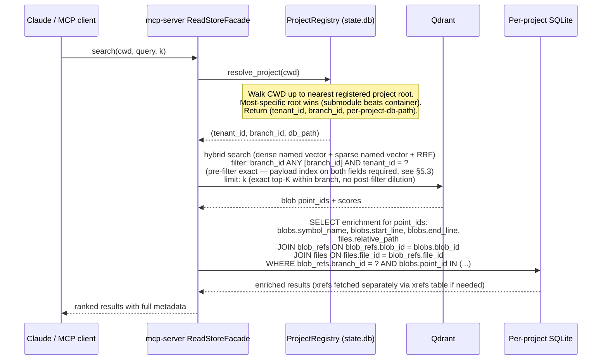
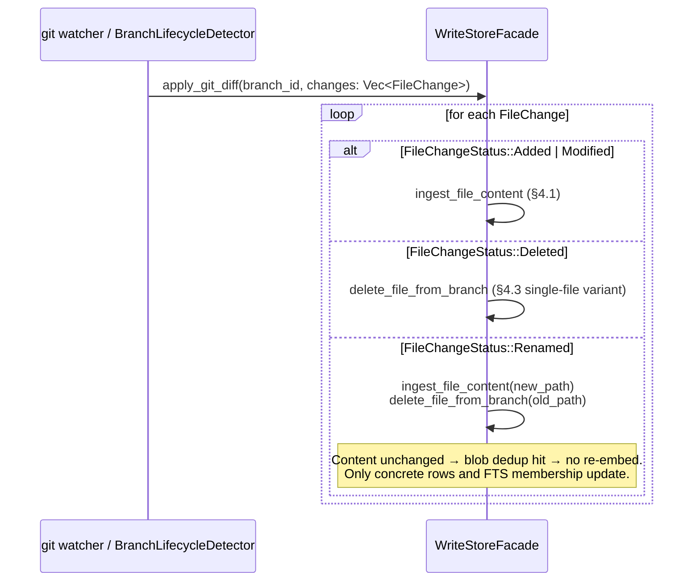

<!--
  File: docs/architecture/branch-storage-model.md
  Location: docs/architecture/ (subsystem architecture document)
  Context: workspace-qdrant-mcp (memexd daemon + mcp-server + wqm CLI). Defines
  the "blob + concrete, branch as flat barrier" branch-storage model — the
  replacement for the virtual-shadow-point + lineage-chain model specified in
  branch-lineage-indexing.md (that file will be removed at convergence of this
  agentic-arch loop; do not edit it).

  Companion documents (planned — will exist at convergence):
    - docs/ARCHITECTURE.md                     — system-level picture; will gain a
                                                 pointer here at convergence
    - docs/architecture/data-flow-and-isolation.md — component isolation, store ownership
    - docs/architecture/write-path-enforcement.md  — write-path gRPC invariants
    - FIRST-PRINCIPLES.md                      — FP-1 (order-by-recoverability),
                                                 FP-2 (unify to prevent drift)

  Replaces: docs/architecture/branch-lineage-indexing.md (locked round-6
  virtual-shadow + lineage-chain + tombstone model). Everything from that doc
  that this one does not address is explicitly superseded and no longer applies.

  Architecture round: 7 (R6 MUST-FIX revision; M4 — unified compute_membership producer + NITs addressed — convergence candidate)
  Seed inputs: .wqmtmp/branch-mgmt-redesign-brief.md §10b (authoritative),
               tmp/arch-workspace/SEED-prior-hazards.md (hazard catalog).
  Decisions encoded here are LOCKED for the purposes of the convergence loop;
  any open item is explicitly flagged in §10.
-->

# Branch-Storage Model — Subsystem Architecture

## 1. Overview and Terminology

Every indexed item in workspace-qdrant-mcp has a git-branch dimension: the same
file's content may be identical across branches (embed once, search from any
branch) or may differ per branch (different content, same path). The previous
"virtual-shadow + lineage-chain" model solved this with virtual Qdrant points,
a persisted lineage table, and tombstones. It was structurally sound but
invented git-style mechanics that git already provides for free, at the cost of
significant complexity — chain CTEs (Common Table Expressions), nearest-branch-wins
resolution, virtual points with no vector, tombstone lifecycle.

**The blob + concrete model takes a different route.** Git is content-addressed
and materializes a complete tree at every commit. We do the same: deduplicate at
the content level (blob), maintain a complete per-branch materialized view in
SQLite (junction rows), and use a flat `branch_id` membership set on each blob
for Qdrant pre-filtering. No lineage. No tombstones. No virtual points.

The model is **git-faithful**: what git can represent, we can represent; what git
resolves by commit parentage, we leave to git and consume only the resulting
diff. Delete on a branch removes `branch_id` membership from the blob and drops
the junction rows; when the SQLite referrer count reaches zero, the blob is
garbage-collected — the same cycle git uses for unreachable objects.

### Key terms (one definition each, used consistently throughout)

- **blob** — one deduped CHUNK of content: a single `blobs` table row that owns
  one `content_key`, one dense vector, one sparse vector, and one `raw_text`
  slice. A file with N chunks produces N blob rows (one per chunk).
  A blob is SHARED across all `(branch_id, file_id)` pairs that contain
  identical chunk content.
- **Qdrant point** — a single entry in the Qdrant HNSW index. One blob ↔ one
  Qdrant point; identified by the blob's `point_id` (UUIDv5). "Point" in this
  document always refers to a Qdrant entry. The SQLite per-chunk junction is always
  called a "junction row" (in the `blob_refs` table) — there is no SQLite table
  named `points`.
- **concrete** — the `concrete` SQLite table: one row per `(branch_id, file_id)`
  pair. Carries the per-branch enrichment metadata (ingest status, component,
  call-site references). Has no blob_id itself; it is the per-branch file anchor.
- **branch_id** — a hash key `SHA256(lp(tenant_id)||lp(location)||lp(branch_name))`,
  NOT the git branch name string. Two checkouts of the same branch at different
  paths yield different `branch_id` values.
- **chunk_content_hash** — `hex(SHA256(raw_chunk_text))`. The CHUNK-grain content
  digest; the primary dedup input. Path-independent: identical chunk content in
  different files or branches yields the same hash.
- **content_key** — `hex(SHA256(lp(tenant_id)||lp("code")||lp(chunk_content_hash)||lp("")))`,
  computed by the single canonical producer `wqm_common::hashing::content_key(
  tenant_id, "code", chunk_content_hash, "")` (`common/src/hashing.rs:48`). Path-independent
  dedup key at chunk grain. Two identical chunks anywhere in the same tenant → same
  `content_key` → same blob row. See §5.4 for the full formula and rationale.
- **point_id** — `UUIDv5(POINT_NS, lp(content_key)||lp(u32_be(0)))`, produced by
  `wqm_common::hashing::point_id(content_key, 0)`. One blob ↔ one Qdrant point.
  The chunk_index argument is always 0 for blob points because the blob IS the dedup
  unit (one blob = one point). See §5.4.
- **file_hash** — `hex(SHA256(whole_file_bytes))`. FILE-grain change-detection
  digest, stored in `concrete.file_hash`. Distinct from `chunk_content_hash` (chunk
  grain). Used only for change detection ("has this file changed since last ingest?"),
  NOT as a component of `content_key` or `point_id`.
- **junction row** — a row in `blob_refs(branch_id, file_id, chunk_index, blob_id)`
  that links a specific chunk (by position) of a file on a specific branch to a blob.
  `chunk_index` is positional membership metadata: it lives here, NOT in the blob
  dedup key. Two identical chunks at different ordinals → same `blob_id`, different
  `blob_refs` rows with different `chunk_index` values.
- **FTS5** — SQLite Full-Text Search version 5, the full-text index embedded in
  the per-project DB. All FTS operations are pure SQLite; Qdrant is not involved.
- **RRF** — Reciprocal Rank Fusion, the merge algorithm for hybrid dense+sparse
  search results.
- **HNSW** — Hierarchical Navigable Small World, the approximate nearest-neighbor
  graph Qdrant uses for vector search (~log N hops per query, scales with point
  count N).
- **WAL** — SQLite Write-Ahead Logging mode: writers and readers operate on separate
  WAL pages so readers get a consistent snapshot without blocking writers.
- **CTE** — Common Table Expression: a named subquery (SQL `WITH` clause) used in
  recursive and multi-step queries.

Architectural payoffs over the prior model:

| Concern | Prior (lineage+tombstone) | This model |
|---------|--------------------------|------------|
| Qdrant HNSW point count | O(branches × unique chunks), virtual points included | O(unique chunk contents) — minimum possible |
| Pre-filter | Chain CTE + nearest-wins → approximate | `branch_id ANY [B]` → exact, no post-filter dilution |
| Delete lifecycle | Tombstone state machine | Remove membership + GC when SQLite count = 0 |
| FTS5 store | Separate search.db | Folded into per-project DB (same binary) |
| Recovery | Re-embed on Qdrant loss | Vectors durable in SQLite → Qdrant is rebuildable |
| Concurrency | Single state.db writer | Per-project DB cuts lock contention |

---

## 2. Guiding Principles (Arch GP)

These principles resolve questions this document does not spell out literally.
Each refines the upstream chain (global FPs → coding-domain FPs → project FPs)
without contradicting it. Where a future implementation question is not
explicitly answered here, the implementor traces upward through this chain.

**GP-1 — Git-faithful materialization.** We index the materialized result of
what git has computed, not how git computed it. Branch topology, merge ancestry,
rebase re-writes — these are git's business. Our business is: "given the current
file content on branch B at location L, ensure the blob is indexed and the
concrete rows for (B, L, file) are current." We never replicate git's internal
mechanics; we consume its output.

**GP-2 — Blob = content identity, concrete = branch identity.** A blob record is
owned by its content (content-addressed). A concrete row is owned by a
`(branch_id, file_id)` pair. These two ownership domains must never be confused:
writing a concrete row must not mutate a blob; GC-ing a blob must not leave
dangling concrete rows. The facade enforces this split.

**GP-3 — Qdrant is an index, SQLite is the truth.** Qdrant carries pre-filter
metadata and vectors for approximate NN search. SQLite carries the authoritative
view of what each branch contains and the durable dense + sparse vectors. If
Qdrant is lost or corrupted it is rebuilt from SQLite without re-embedding. No
decision that makes Qdrant irreplaceable is acceptable.

**GP-4 — Transient failure means keep, not delete.** Any error in the delete or
GC path — network blip, timeout, git-read error — defers the operation; it never
triggers partial deletion. A still-referenced blob must never be GC'd. Data loss
from overly aggressive deletion is worse than temporary storage growth.
(Refines FP-1 "order by recoverability / delete last".)

**GP-5 — Single canonical producer for every derived value.** `content_key`,
`point_id`, `chunk_content_hash`, `branch_id` are computed by one function each,
used everywhere. No parallel formulas. (Refines FP-2 "unify to prevent drift",
building on the existing `wqm_common::hashing::{content_key, point_id}` established
in F1. `file_identity_id` is retired in this model — see §5.4 and §9.)

**GP-6 — Batch at ≥1000 points for all Qdrant bulk ops.** Performance evidence
(SEED-prior-hazards §B): 100-point batches yield ~16s for 50k-file×8-chunk
corpus on remote Qdrant, failing a 30s acceptance ceiling; 1000-point batches
yield ~1.6s. All upsert, membership-update, and delete paths batch at ≥1000
points unless the total count is smaller.

**GP-7 — Least-privilege by process boundary, structurally enforced.** The MCP
server process may read and search; it may not write to the store. Write logic
lives in a SEPARATE crate `wqm-storage-write` that `mcp-server` and `wqm-cli`
never name in their dependency trees. `memexd` depends on both `wqm-storage`
(read + search) and `wqm-storage-write` (write). Because `mcp-server` and
`wqm-cli` have no path to `wqm-storage-write` in their dependency graphs, there
is no write code in those binaries — this is a STRUCTURAL guarantee (absence of
code), not a disabled feature.

**Why a crate split and not a cargo feature:** under `resolver = "2"` (verified:
`src/rust/Cargo.toml:9`), features are still unified across normal workspace
members that share the same dependency. If a single crate `wqm-storage` exposed
a `write` cargo feature and `memexd` enabled it, any workspace `cargo build` would
compile `wqm-storage` with `write` enabled for all dependents — including
`mcp-server` — because they share the same crate instance. The write code would be
present in the read-only binary regardless of the flag on the dependent. A separate
crate that `mcp-server` and `wqm-cli` never depend on cannot be unified away; the
guarantee becomes structurally unconditional. The `write` cargo feature approach is
explicitly retired as the primary boundary.

As defense-in-depth, a CI `cargo tree -e features -p mcp-server` assertion verifies
that `wqm-storage-write` does not appear in the `mcp-server` dependency closure.
This catches any future dependency edge that would restore the path. A `trybuild`
compile-fail test asserting that a write call fails to compile from the read-only
crate is a non-negotiable PRD deliverable alongside R8's `InMemoryStoreFacade`.
Aligns with the existing `wqm-client::write_service_guard` pattern.

**GP-8 — Named logical operations, no arbitrary SQL.** The storage facade grows
by adding named operations (`ingest_blob`, `branch_onboard`, `branch_delete`,
`search`, `fts_search`, `rebuild_qdrant`). Consumers never receive a raw
connection or execute ad-hoc SQL. This is the hard line between the application
and the storage engine.

**GP-9 — Single-writer daemon invariant (named).** `memexd` is the SOLE writer
to all per-project store.db files and to the Qdrant `projects` collection. MCP
server and wqm-cli are read-only by process boundary (GP-7) AND by design.
This invariant structurally excludes cross-process Qdrant write races — no
external process holds a Qdrant write client. Within `memexd`, concurrent blob
writes to the same blob are serialized by `ContentKeyLockManager` (one async
`Mutex<()>` per `content_key` in a bounded `DashMap`); `branch_id[]` membership
mutations are also serialized per `point_id` through the same lock. The DashMap
is eviction-bounded (see §6.3) to prevent monotonic daemon heap growth.

**GP-9 enforcement mechanism (B1 — single-writer is load-bearing for F04 race
freedom AND cross-tenant isolation):**

(a) **Daemon singleton advisory lock.** On startup, `memexd` acquires an OS-level
    advisory file lock on `<data_dir>/daemon.lock` — one lock per HOST/data-dir,
    not per-project. A per-project lock would not exclude two daemon processes from
    racing on Qdrant's shared collection during operations like `rebuild_qdrant` or
    payload-index creation that are collection-global, not project-local. If the
    lock is held, startup refuses with a clear error — one writer per store,
    enforced at the process boundary. Stale-lock handling (daemon crashed without
    releasing) is a PRD detail (timeout + reclaim).

(b) **Non-daemon connections are structurally read-only.** Every non-daemon SQLite
    connection (MCP server, CLI) is opened with `SQLITE_OPEN_READONLY` flag AND
    `PRAGMA query_only = ON` set immediately after open. This is a connection
    property, not a convention — a write attempt on such a connection returns an
    error regardless of the schema. WAL readers can proceed without blocking the
    daemon writer.

(c) **Any future write-capable path acquires the same singleton lock.** Any future
    operation that must write (e.g. `wqm rebuild`, `wqm migrate`) MUST either run
    inside the daemon process OR acquire the same singleton advisory lock before
    touching any per-project DB or Qdrant collection. There is no third path.

The `wal_autocheckpoint` PRAGMA is set only on the daemon write connection;
it is meaningless (and silently ignored) on read-only connections.

---

## 3. Component Map

```mermaid
graph TB
    subgraph "Consumer processes"
        MCP["MCP server<br/>workspace-qdrant-mcp<br/>(read + search only)"]
        CLI["wqm CLI/TUI<br/>(read + search)"]
        Daemon["memexd daemon<br/>(write + read + search)"]
    end

    subgraph "Read crate — wqm-storage (MCP+CLI+daemon)"
        RFacade["ReadStoreFacade trait<br/>search, fts_search, list_branch,<br/>get_file, resolve_project"]
        ProjectReg["ProjectRegistry<br/>(reads state.db only)"]
    end

    subgraph "Write crate — wqm-storage-write (daemon ONLY)"
        WFacade["WriteStoreFacade trait<br/>ingest, branch_onboard,<br/>branch_delete, rebuild_qdrant"]
        LockMgr["ContentKeyLockManager<br/>per-content_key async Mutex"]
    end

    subgraph "Per-project SQLite DB  (projects/&lt;tenant_id&gt;/store.db) — 9 tables"
        Files["files table<br/>file-level metadata, 1 row/(branch_id,path)"]
        BlobRefs["blob_refs junction table<br/>(branch_id, file_id, chunk_index, blob_id)<br/>GC referrer count = COUNT(*) WHERE blob_id=?"]
        Blobs["blobs table<br/>1 row per unique CHUNK:<br/>content_key UNIQUE,<br/>dense_vec + sparse_vec + raw_text"]
        Branches["branches table<br/>branch_id=SHA256(tenant+location+branch),<br/>active flag, sync_state"]
        Concrete["concrete table<br/>(branch_id, file_id) per-branch enrichment:<br/>ingest status, component, routing"]
        XRefs["xrefs table<br/>per-branch call-site/import refs:<br/>(concrete_id, blob_id, symbol_name,<br/>target_branch_id, target_concrete_id)"]
        FTS5["fts_content FTS5 table<br/>external-content on blobs;<br/>synced via after-insert/delete triggers"]
        FTSMembership["fts_branch_membership table<br/>(blob_id, branch_id) junction<br/>indexed scalar branch filter"]
    end

    subgraph "Central state.db"
        Projects["projects table<br/>name, tenant_id, DB path,<br/>location list (active+sync),<br/>branch_id=SHA256(tenant+location+branch)"]
    end

    subgraph "Qdrant — projects collection (per-tenant namespace)"
        QBlob["blob points (1 per unique chunk)<br/>payload: tenant_id (keyword, indexed),<br/>branch_id[] (keyword array, indexed),<br/>collection_id<br/>vectors: named dense (Cosine, 768-dim),<br/>named sparse (dot-product)"]
    end

    subgraph "Git object reader"
        GitReader["git module<br/>git2 (tree_ops.rs)<br/>reflog reader (reflog.rs)<br/>diff_tree (diff_tree.rs)"]
    end

    Daemon -->|WriteStoreFacade| WFacade
    Daemon -->|ReadStoreFacade| RFacade
    MCP    -->|ReadStoreFacade| RFacade
    CLI    -->|ReadStoreFacade| RFacade
    WFacade -->|composes| RFacade

    WFacade --> LockMgr
    WFacade --> Files
    WFacade --> BlobRefs
    WFacade --> Blobs
    WFacade --> Branches
    WFacade --> Concrete
    WFacade --> XRefs
    WFacade --> FTS5
    WFacade --> FTSMembership
    WFacade --> QBlob
    WFacade --> Projects
    RFacade --> Files
    RFacade --> Blobs
    RFacade --> FTS5
    RFacade --> FTSMembership
    RFacade --> QBlob

    Daemon -->|git topology| GitReader

    style WFacade fill:#ffe1e1
    style RFacade fill:#e1f5ff
    style QBlob fill:#e8f5e9
    style Projects fill:#fff9e1
```



### Component responsibilities and hard boundaries

**WriteStoreFacade** — The full storage interface, available to `memexd` only. Owns
all mutation: blob dedup ladder, branch lifecycle (onboard/delete/GC), Qdrant
membership updates, concrete row management, FTS5 inserts. Must NOT expose raw
connections or raw SQL. Must NOT be linked into the MCP server binary.

**ReadStoreFacade** — The subset of `WriteStoreFacade` that performs no writes:
`search`, `fts_search`, `get_file`, `list_branch`, `resolve_project`. Linked into
`mcp-server` and `wqm-cli`. Must NOT accept any write method. Locking: uses
SQLite WAL — readers get a consistent snapshot without blocking the daemon writer.

**ContentKeyLockManager** — Holds one async `Mutex<()>` per active `content_key`
in a `DashMap`. Serializes concurrent daemon writes targeting the same blob.
The lock covers the SQLite blob write cycle and the Qdrant-op enqueue: acquire →
SQLite INSERT (`blobs`, `blob_refs`, `fts_branch_membership`) → recompute
`branch_id[]` from SQLite → enqueue Qdrant `overwrite_payload` (PUT) for this
content_key → release. The batched Qdrant FLUSH (≥1000 ops, GP-6) executes OUTSIDE
any single lock; this is safe because the SQLite-derived membership set is the same
on any retry — the enqueued PUT is idempotent (B1).

**Ingest path vs delete path (same producer, different sequencing):** both paths use
`compute_membership(blob_id)` → `overwrite_payload` (PUT), but differ in WHEN the
mutation fires and how the PUT is dispatched. The ingest path enqueues the PUT and
releases the lock BEFORE the batch flush. The delete path runs `compute_membership`
AFTER the blob_refs DELETE (Step 4) so the SELECT excludes the departed branch, then
executes `overwrite_payload` (PUT) SYNCHRONOUSLY inside the lock (Step 6, §4.3) and
releases. NOT enqueued. Batching the delete-path PUT would allow a concurrent ingest
ADD to race the membership-read between enqueue and flush, reintroducing the F04 race.

**ProjectRegistry** — Reads the central `state.db` `projects` table to map
`(CWD → registered project root → tenant_id → per-project DB path → branch_id)`.
Implements the query root resolution rule (§4, data flow "Search"). Must NOT write
to `state.db` from the MCP or CLI; writes route through daemon gRPC.
This type is MINTED net-new by F10 (the `resolve_project` CWD→tenant resolution) and
EXTENDED by F16 with the FP-3 fuzzy handle→key resolver (address-by-name on inputs,
identify-by-key internally — projects AND scratchpad/rules handles AND future handles;
see §8). One nexus, two phases (FP-2): F10 mints, F16 extends. The resolver's
human-facing input path is fuzzy (Jaro-Winkler ≥ 0.92, exact-match-wins short-circuit,
action-tiered strictness); the resolved exact key — never the typed string — feeds the
`tenant_id = ?` filter (§6.5 binding, extended to cover `state.db` queries).

**Per-project SQLite DB** — One `.db` file per project at
`projects/<tenant_id>/store.db` (relative to the wqm data directory). Contains
nine tables: `files`, `blob_refs`, `blobs`, `branches`, `concrete`, `xrefs`,
`fts_content`, `fts_branch_membership`, `store_meta`. Opened in WAL mode. The single writer is
`memexd` (GP-9); `mcp-server` and `wqm-cli` open it read-only via WAL snapshots.
`busy_timeout` and `wal_autocheckpoint` are set at connection open time for
multi-reader + single-writer stability.

**Store-bucket folder layout (canonical, citable rule).** Per-tenant `store.db` files
live under three sibling top-level buckets in the wqm data directory, keyed by tenant
class: `projects/<tenant_id>/store.db` (a registered project), `libraries/<tenant_id>/store.db`
(a reference library), and `global/<tenant_id>/store.db` (the `global` bucket — the
orphan re-home target of AC-F16.5 and the home of globally-scoped scratchpad/rules after
the F16 data refactor). All three are structurally identical store.db files; the bucket
prefix alone records tenant class. This layout is the citable target for AC-F16.3.

**Central state.db** — The lean registry. Contains the `projects` table (project
name, `tenant_id`, per-project DB path, location list with `(location, branch_name,
active, sync_state)`, the canonical `branch_id`). Also contains `watch_folders`,
`db_maintenance`, `unified_queue`, and all other daemon-bookkeeping tables that
exist today (they are not changed by this architecture). State.db is the
crash-recovery anchor: if a per-project DB is lost, state.db records what existed
and the recovery path can rebuild it.

**Qdrant blob store** — One Qdrant collection (`projects`) retaining the existing
per-tenant namespace. Each Qdrant point represents one blob (one unique chunk).
Payload fields are pre-filter metadata ONLY: `tenant_id`, `branch_id[]` (keyword
array, payload index required — see §5.3 collection spec), `collection_id`. NO
`referrer_list`, NO raw text, NO paths, NO enrichment data. GC refcount is always
computed from `SELECT COUNT(*) FROM blob_refs WHERE blob_id = ?` in SQLite (GP-3
— SQLite is the truth for GC decisions). Qdrant is rebuildable from SQLite and
is never the sole copy of any data. Collection creation must specify: named dense
vector (`"dense"`, Cosine distance, 768-dim), named sparse vector (`"sparse"`,
dot-product), and payload indexes on `tenant_id` and `branch_id` before first
upsert (see §5.3).

**FTS5 (`fts_content`)** — An FTS5 virtual table inside the per-project DB using
`content="blobs"` external-content mode. Rows keyed by `blob_id` (`content_rowid`).
Synced with the `blobs` table via `AFTER INSERT` and `AFTER DELETE` triggers on
`blobs` — NOT auto-synced; without these triggers a GC'd blob leaves a ghost FTS
rowid and a new blob is invisible to FTS. The `fts_branch_membership` junction
table provides an indexed `(branch_id, blob_id)` scalar filter so FTS5 MATCH results
can be branch-scoped without json_each (avoids the 8–35x slowdown from SEED F01).
Full-text search never touches Qdrant; it is a pure SQLite query with the pattern:
`fts_content MATCH ? JOIN fts_branch_membership USING (blob_id) WHERE branch_id = ?`.

**Git object reader** (`src/rust/daemon/core/src/git/`) — The existing module
(`tree_ops.rs:get_blob_hash`, `reflog.rs`, `diff_tree.rs`, `worktree.rs`) already
wraps `git2` for blob hash lookup, reflog reading, diff tree parsing, and worktree
detection. The new model promotes this from a supporting role to the **branch
topology source of truth**: diff apply for macro git ops, reflog scanning for
missed-event recovery. Must NOT be called from `mcp-server` or `wqm-cli`; it
runs inside `memexd` only.

---

## 4. Data Flows

### 4.1 Ingest — file → blob dedup → concrete rows → Qdrant index

Per-chunk lock granularity: a file with N chunks acquires N `content_key` locks in
sequence. Each lock covers one chunk's full write cycle (SQLite + Qdrant for that
chunk) before the next chunk is processed.

Per `(branch_id, path)` file: UPSERT one `files` row; UPSERT one `concrete` row.
Then, for EACH chunk:

```mermaid
sequenceDiagram
    participant FS as FS watcher / git event
    participant Ingest as ingest_file_content<br/>(strategies/processing/file/ingest.rs)
    participant LockMgr as ContentKeyLockManager
    participant SQLite as Per-project SQLite
    participant Qdrant as Qdrant

    FS->>Ingest: file event (path, branch_id, watch_folder_id)
    Ingest->>Ingest: parse + chunk (tree-sitter); compute file_hash
    Note over Ingest: Per §5.4: mint file_id per (branch_id, path).<br/>NO lineage walk (identity.rs retired — branch_lineage dropped §5.6).
    Ingest->>SQLite: UPSERT files row (branch_id, file_id, path, language...)
    Ingest->>SQLite: UPSERT concrete row (branch_id, file_id, status...)

    loop for each chunk [chunk_index=0..N-1]
        Ingest->>Ingest: compute chunk_content_hash = hex(SHA256(raw_chunk_text))<br/>compute content_key = content_key(tenant_id, "code", chunk_content_hash, "")<br/>compute point_id = point_id(content_key, 0)<br/>— canonical producers, §5.4 (path-independent, chunk_index NOT in content_key)
        Ingest->>LockMgr: acquire lock(content_key)
        LockMgr-->>Ingest: lock held

        alt blob already exists (content_key UNIQUE hit in blobs)
            Ingest->>SQLite: INSERT blob_refs(branch_id, file_id, chunk_index, blob_id) ON CONFLICT IGNORE
            Ingest->>SQLite: INSERT fts_branch_membership(blob_id, branch_id) ON CONFLICT IGNORE
            Note over Ingest,LockMgr: Recompute full branch_id[] membership from SQLite inside the lock:<br/>SELECT DISTINCT branch_id FROM blob_refs WHERE blob_id = ? (blob_id known from content_key hit).<br/>Enqueue Qdrant overwrite_payload (PUT — full payload replacement) for this content_key with<br/>the reconstructed full payload {tenant_id, branch_id: full_set[], collection_id}.<br/>Lock is released BEFORE the batch flush — the PUT is enqueued, not executed live.<br/>Idempotent: re-running with the same SQLite state produces the same payload (B1).<br/>NOTE: Qdrant set_payload (POST) has no array-append mode — it replaces the field value<br/>with the supplied array, silently dropping all prior branch memberships. NEVER use<br/>set_payload for the branch_id[] field. ALWAYS recompute from SQLite and PUT.
        else genuinely new blob (content_key miss)
            Ingest->>Ingest: embed chunk (dense + sparse vectors)
            Ingest->>SQLite: INSERT blobs(content_key, chunk_content_hash,<br/>raw_text, dense_vec, sparse_vec, symbol_name,<br/>start_line, end_line) — trigger fires fts_content insert
            Ingest->>SQLite: INSERT blob_refs(branch_id, file_id, chunk_index, blob_id)
            Ingest->>SQLite: INSERT fts_branch_membership(blob_id, branch_id)
            Note over Ingest,LockMgr: Enqueue Qdrant upsert (point_id, dense_vec, sparse_vec,<br/>payload={tenant_id, branch_id:[current_branch_id], collection_id}) for batch flush.<br/>The blob_refs INSERT above (single referrer, lock held) guarantees current_branch_id<br/>is the correct initial membership — no SQLite recompute query needed at this site<br/>(the in-process branch_id IS the full membership set at point-of-enqueue).<br/>After any crash, §4.7 reconcile corrects drift by recomputing from SQLite.
        end

        Ingest->>LockMgr: release lock(content_key)
    end
    Note over Ingest,Qdrant: Qdrant batch flush fires OUTSIDE per-content_key locks<br/>when ≥1000 ops accumulated (GP-6). SQLite writes complete BEFORE any flush.
    Note over SQLite,Qdrant: Write order (FP-1): SQLite first → Qdrant second.<br/>Crash after SQLite = Qdrant missing entry → §4.7 reconcile adds it.<br/>Crash after Qdrant flush = idempotent retry (same blob_id, same point_id).<br/>WARNING: every overwrite_payload (PUT) MUST supply ALL payload fields<br/>(tenant_id, branch_id: full_set[], collection_id) — see §6.3 for the full<br/>warning; omitting any field silently deletes it, breaking future searches.
```

### 4.2 Branch onboard

When a previously unknown branch is first seen (new branch created, worktree
added, git checkout detected):

**Membership write path — ONE path only:** `branch_id[]` membership for a blob is
ALWAYS the full set derived from SQLite (`SELECT DISTINCT branch_id FROM blob_refs
WHERE blob_id = ?`), written via `overwrite_payload` (PUT — full payload replacement)
under the per-content_key ContentKeyLock. This single pattern applies to BOTH the
ADD path (existing blob gains a new branch) and the REMOVE path (branch delete). There
is NO separate post-loop membership batch and NO `set_payload` array-append. Both
the new-blob path (upsert with `branch_id:[current_branch]` initial membership computed
from SQLite) and the existing-blob path (recompute from SQLite + PUT) are handled in
§4.1 inside the per-chunk lock. Qdrant `set_payload` (POST) replaces the named field
with the supplied value — it has no append mode — and MUST NOT be used for `branch_id[]`.

```mermaid
sequenceDiagram
    participant Git as git event / BranchLifecycleDetector
    participant Facade as WriteStoreFacade
    participant SQLite as Per-project SQLite
    participant Qdrant as Qdrant

    Git->>Facade: branch_onboard(branch_id, location)
    Facade->>SQLite: INSERT branches(branch_id, location, active=true, sync_state=pending)
    Note over Facade: sync_state=indexing emitted to telemetry so callers<br/>know search results may be incomplete until indexing completes.
    Facade->>Git: git diff HEAD..branch_id (diff_tree.rs) — git rev-parse/<br/>git-object reads cached per location (prior hazard B ~150s)
    loop for each changed file (bounded concurrency: ≤N_CPU tasks)
        Facade->>Facade: ingest_file_content (§4.1 flow)<br/>— membership written INSIDE §4.1 per-chunk loop
    end
    Note over Facade,SQLite: Unchanged files reuse existing blobs (content_key hit).<br/>BOTH paths in §4.1 (new-blob AND existing-blob) write blob_refs AND<br/>fts_branch_membership rows. For each reused blob the existing-blob branch of §4.1<br/>recomputes the full branch_id[] from SQLite and writes it via overwrite_payload (PUT).
    Facade->>SQLite: UPDATE branches SET sync_state=current
    Note over Qdrant: branch_id[] membership complete for all chunks (each chunk's PUT is additive per FP-1).<br/>Crash before sync_state=current → §4.7 reconcile re-runs missing chunks.<br/>SLA: Qdrant pre-filter correct when sync_state=current; FTS5 available immediately.
```

**Partial-recall window:** between `sync_state=pending` and `sync_state=current`,
Qdrant search returns incomplete results (blobs not yet appended with this `branch_id`
are missed). FTS5 is correct as soon as the per-file ingest completes. The facade
MUST expose `sync_state` to callers via `list_branch` / status ops so mid-onboard
partial recall is not silent.

**Retry and crash-resume:** if the daemon crashes mid-onboard, on restart it reads
`sync_state=pending` branches and re-drives §4.1 for all their files. `blob_refs
ON CONFLICT IGNORE` and FTS `AFTER INSERT` trigger are idempotent. The Qdrant
`overwrite_payload` (PUT) recompute-from-SQLite pattern is also idempotent: re-running
with the same SQLite state produces the same full `branch_id[]` set and the same PUT.

### 4.3 Branch delete + blob GC

**Deletion truth table (GP-4):** authorization to delete is driven by a POSITIVE
absence signal, not the absence of a positive presence signal.

| Git query result | Action |
|---|---|
| Branch HEAD positively confirmed deleted (`git for-each-ref` returns nothing; reflog shows a delete event) | Proceed with delete |
| Branch present in topology | Keep — do NOT delete |
| Read error (`git2` returns Auth, I/O, NotFound-ambiguous, locked-repo) | DEFER — do NOT proceed |
| Reflog unavailable / git dir unreachable | DEFER — do NOT proceed |

A transient `git2::Error::NotFound` (which can arise from a network error on a
remote-tracking ref, not only genuine absence) MUST map to DEFER, not delete.
Only a confirmed delete event (positively recorded in reflog or for-each-ref)
authorizes proceeding.

```mermaid
sequenceDiagram
    participant Git as git event (branch deleted)
    participant Facade as WriteStoreFacade
    participant SQLite as Per-project SQLite
    participant Qdrant as Qdrant

    Git->>Facade: branch_delete(branch_id)

    Note over Facade: GP-4 — Deletion truth table check (above).<br/>Any ambiguity or error → DEFER, do NOT proceed.

    Note over Facade: FP-1 physical-delete ordering (data products first, truth last):<br/>Step 1: pre-select all blob candidates for this branch (read-only; outside transaction).<br/>Step 2: compute orphan candidates (batched GROUP BY; outside transaction).<br/>Step 3: delete orphaned Qdrant points (data product).<br/>Step 4: DELETE blob_refs + fts_branch_membership + concrete for this branch (truth rows).<br/>Step 5: re-verify orphan set AFTER blob_refs deletion; delete confirmed orphaned blobs (truth rows).<br/>Step 6: for each still-referenced blob from Step 1, recompute branch_id[] from SQLite (now<br/>         excludes deleted branch) → overwrite_payload (PUT) under ContentKeyLock (data product).<br/>Step 7: delete orphaned files for this branch (truth rows).<br/>Step 8: delete branches row (crash-recovery anchor, last).<br/>NOTE: membership PUT (Step 6) fires AFTER blob_refs DELETE (Step 4) so the SQLite recompute<br/>correctly excludes the deleted branch. Orphaned blobs get a Qdrant point DELETE instead of a PUT.

    Facade->>SQLite: SELECT DISTINCT blob_id, point_id FROM blob_refs WHERE branch_id=?
    Note over Facade: Step 1: hold all (blob_id, point_id) candidates in memory (pre-select<br/>before any delete; read-only, no lock held). Partition into orphan candidates (Step 2)<br/>and still-referenced blobs (Step 6 membership update).

    Note over Facade: Step 2: pre-select orphan candidates in batched GROUP BY queries<br/>(≤1000 blob_ids per call — SQLite SQLITE_MAX_VARIABLE_NUMBER limit).<br/>Query: SELECT blob_id FROM blob_refs WHERE blob_id IN (candidate_window)<br/>  GROUP BY blob_id<br/>  HAVING SUM(CASE WHEN branch_id != :deleted_branch_id THEN 1 ELSE 0 END) = 0<br/>Result: blob_ids whose ONLY referrer is the deleted branch = orphan candidates.<br/>NOTE: the WHERE predicate must NOT exclude the deleted-branch rows before the<br/>HAVING test — doing so makes the GROUP BY produce zero rows for true orphans,<br/>so HAVING can never match. Keep all rows; test other-branch membership in HAVING.
    Facade->>SQLite: batched GROUP BY orphan scan (≤1000 candidates per call)

    loop orphaned blob_ids (batched ≥1000)
        Facade->>Qdrant: delete point (batched ≥1000) — Step 3
    end

    Note over Facade: CANONICAL CHUNKED-DELETE IDIOM (steps 4 and 5):<br/>  DELETE ... LIMIT is INVALID in the bundled SQLite (libsqlite3-sys 0.30.1 does<br/>  not enable SQLITE_ENABLE_UPDATE_DELETE_LIMIT). Every bounded bulk delete MUST<br/>  use the subselect pattern:<br/>    DELETE FROM &lt;t&gt; WHERE rowid IN<br/>      (SELECT rowid FROM &lt;t&gt; WHERE &lt;pred&gt; LIMIT N)<br/>  looped until 0 rows affected, committing (releasing the RESERVED lock) per<br/>  batch. This is the ONE valid idiom — used for ALL delete steps. No other form.

    Note over Facade: Steps 4a–4c: chunked deletes, committing per batch to allow ingest to interleave.<br/>Each iteration runs the subselect idiom (WHERE branch_id=? LIMIT 10000) per table<br/>until 0 rows affected. Intra-chunk ordering within step 4 is FK-safe in either<br/>direction; all three tables are cleaned before the step 5 loop begins.

    loop step 4 — chunked deletes until 0 rows (≤10,000 rows per batch)
        Facade->>SQLite: BEGIN IMMEDIATE
        Facade->>SQLite: DELETE FROM fts_branch_membership WHERE rowid IN<br/>  (SELECT rowid FROM fts_branch_membership WHERE branch_id=? LIMIT 10000) — Step 4a
        Facade->>SQLite: DELETE FROM blob_refs WHERE rowid IN<br/>  (SELECT rowid FROM blob_refs WHERE branch_id=? LIMIT 10000) — Step 4b
        Facade->>SQLite: DELETE FROM concrete WHERE rowid IN<br/>  (SELECT rowid FROM concrete WHERE branch_id=? LIMIT 10000) — Step 4c
        Facade->>SQLite: COMMIT — releases RESERVED lock; ingest may interleave
    end

    Note over Facade: Step 5: re-verify orphan set NOW (after all blob_refs for this branch deleted).<br/>BEGIN IMMEDIATE is required: re-verify SELECT and blobs DELETE must be atomic —<br/>no new blob_refs can be inserted between them (ABA guard).<br/>Both the re-verify window and the blobs DELETE are chunked (≤1000 per batch)<br/>to avoid unbounded IN-lists (SQLITE_MAX_VARIABLE_NUMBER limit) and write-stall.

    loop step 5 — per batch of ≤1000 orphan candidates
        Facade->>SQLite: BEGIN IMMEDIATE
        Facade->>SQLite: SELECT blob_id FROM blob_refs<br/>WHERE blob_id IN (candidate_window_1000)<br/>GROUP BY blob_id HAVING COUNT(*) > 0 — still-referenced (ABA survivors)
        Note over Facade: confirmed_orphan_batch = candidate_window MINUS still-referenced.<br/>DELETE confirmed orphans from blobs (FTS5 blobs_ad trigger fires automatically).
        Facade->>SQLite: DELETE FROM blobs WHERE rowid IN<br/>  (SELECT rowid FROM blobs WHERE blob_id IN (confirmed_orphan_batch)) — Step 5<br/>  (subselect idiom; ≤1000 blob_ids per batch; FTS5 trigger fires per row)
        Facade->>SQLite: COMMIT — releases RESERVED lock between orphan batches
    end

    Note over Facade: Step 6: for each still-referenced blob (from Step 1 set MINUS confirmed orphans),<br/>recompute branch_id[] via compute_membership(blob_id) =<br/>  SELECT DISTINCT branch_id FROM blob_refs WHERE blob_id = ?<br/>Now that Step 4 has deleted all blob_refs for deleted_branch_id, this query returns<br/>the correct membership set (deleted branch excluded automatically by absence of rows).<br/>Write via overwrite_payload (PUT, {tenant_id, branch_id: recomputed_set[], collection_id})<br/>SYNCHRONOUSLY under per-content_key ContentKeyLockManager lock (F04 race prevention).<br/>Orphaned blobs (confirmed orphan set from Step 5) already had their Qdrant points<br/>deleted in Step 3 — do NOT PUT an empty membership; the point no longer exists.

    loop step 6 — still-referenced blobs (batched ≥1000)
        Note over Facade,Qdrant: acquire ContentKeyLock → compute_membership(blob_id) →<br/>overwrite_payload (PUT) → release. Synchronous, not enqueued.
        Facade->>Qdrant: overwrite_payload (PUT) {tenant_id, branch_id: recomputed_set[], collection_id}<br/>(Step 6 — membership data product, after blob_refs truth delete)
    end

    Facade->>SQLite: BEGIN IMMEDIATE
    Facade->>SQLite: DELETE FROM files<br/>WHERE branch_id = deleted_branch_id<br/>AND NOT EXISTS (<br/>  SELECT 1 FROM blob_refs WHERE blob_refs.file_id = files.file_id<br/>    AND blob_refs.branch_id != deleted_branch_id<br/>) — Step 7 (bounded: scoped to one branch's files; FK-safe after step 4)
    Facade->>SQLite: COMMIT

    Facade->>SQLite: DELETE branches WHERE branch_id=?
    Note over Facade: branches row deleted LAST — crash recovery reads sync_state<br/>to resume. FTS5 trigger fires on blobs DELETE (Step 5), keeping FTS in sync.
```

**Crash safety:** a crash after Step 3 (orphan Qdrant points deleted) but before
Step 4 (blob_refs deleted) means SQLite still references the branch rows; §4.7
reconcile re-adds any Qdrant membership for still-referenced blobs (Step 6 cannot
have run yet, since Step 4 has not yet executed — additive recovery, GP-3). A
crash after Step 4 (blob_refs deleted) but before Step 6
(membership PUT) leaves Qdrant membership stale with the deleted branch still
present; §4.7 reconcile detects the SQLite/Qdrant mismatch and removes it. A crash
after Step 3 (orphan Qdrant points deleted) but before Step 5 (blobs rows deleted)
leaves orphan `blobs` rows; §4.7 prunes them on next run. At no point is an
unreferenced blob GC'd while the SQLite truth still references it.

**Single-file delete variant (`delete_file_from_branch(branch_id, file_id)`):**
The macro git-diff path (§4.6) and a single-file removal both need to retract ONE
file from ONE branch without tearing down the whole branch. This is the
branch-delete ordering above, scoped to a single `(branch_id, file_id)` instead of
all of `branch_id`, and following the same FP-1 physical-delete order (data
products first, truth rows last):

1. Pre-select the file's `(blob_id, point_id)` set: `SELECT DISTINCT bf.blob_id,
   b.point_id FROM blob_refs bf JOIN blobs b ON b.blob_id = bf.blob_id WHERE
   bf.branch_id = ? AND bf.file_id = ?` (read-only, outside the transaction).
2. `BEGIN IMMEDIATE`; delete this file's junction + membership + concrete rows on
   this branch: `DELETE FROM blob_refs WHERE branch_id=? AND file_id=?`,
   `DELETE FROM concrete WHERE branch_id=? AND file_id=?`, and the matching
   `fts_branch_membership` rows for any blob that lost its last membership on this
   branch; `COMMIT`.
3. For each `blob_id` from step 1, re-test referrer count
   (`SELECT COUNT(*) FROM blob_refs WHERE blob_id=?`): count 0 → orphan (delete its
   Qdrant point, then delete the `blobs` row under `BEGIN IMMEDIATE` with the ABA
   re-verify); count > 0 → still referenced → recompute `branch_id[]` from SQLite
   and `overwrite_payload` (PUT) under the ContentKeyLock (`compute_membership`, the
   one producer).
4. Delete the `files` row for this `(branch_id, file_id)` LAST, only if no
   `blob_refs` for it remain on this branch (crash-recovery anchor removed last).

A rename (§4.6) is `ingest_file_content(new_path)` FIRST, then
`delete_file_from_branch(old_path)` — ingest-before-delete so a blob shared between
the old and new path never transiently drops to refcount 0 and gets GC'd between
the two steps (AC-F8.6).

### 4.4 Search — root resolution → pre-filter → SQLite enrich



### 4.5 Recovery — rebuild Qdrant from SQLite

This path fires when Qdrant is empty or when the operator runs `wqm rebuild`.
It never re-embeds because the dense + sparse vectors are durable in the `blobs`
table.

```mermaid
sequenceDiagram
    participant Op as operator / daemon startup
    participant Facade as WriteStoreFacade
    participant SQLite as Per-project SQLite
    participant Qdrant as Qdrant

    Op->>Facade: rebuild_qdrant(tenant_id)
    Note over Facade: Collection creation (idempotent): create_collection if not exists;<br/>create_payload_index(branch_id, keyword);<br/>create_payload_index(tenant_id, keyword).<br/>Named vectors: dense (Cosine, 768-dim) + sparse (dot-product).
    Facade->>SQLite: streaming cursor (keyset pagination, batch size ≥1000):<br/>SELECT b.blob_id, b.point_id, b.dense_vec, b.sparse_vec,<br/>json_group_array(DISTINCT br.branch_id) AS branch_ids<br/>FROM blobs b JOIN blob_refs br ON br.blob_id = b.blob_id<br/>WHERE b.tenant_id = ? AND b.blob_id > ? -- keyset cursor (avoids O(N²) OFFSET scan)<br/>GROUP BY b.blob_id ORDER BY b.blob_id LIMIT 1000
    loop batches of ≥1000 (streaming, not all-at-once)
        Facade->>Qdrant: upsert blob points (vectors + payload={tenant_id, branch_id[], collection_id})
    end
    Note over Qdrant: Payload indexes re-created (Qdrant does not persist index defs<br/>across collection recreation). Recovery SLA = I/O bound, not model bound.
```

**Memory bound:** results are fetched in paginated batches (cursor by `blob_id`),
not in a single `SELECT *` query. A single-query load of a 400k-blob project
would spike the daemon heap by ~1.9 GB (400k x 3KB vectors + metadata).

**Recovery directions (`recover_state` retired).** In the blob+concrete model the
SQLite stores are the TRUTH and Qdrant is the rebuildable index, so the legacy
`recover_state` command — which reconstructed `state.db` FROM Qdrant (the OLD inverted
direction) — is retired (F12). There are exactly two correct recovery directions:
(1) **index recovery** = `wqm rebuild` / `rebuild_qdrant` (store.db → Qdrant, this §4.5
path), used when Qdrant is lost or stale but the SQLite truth survives; and
(2) **disaster recovery** = `wqm restore --full` (F20), used when the SQLite truth
itself is lost — it restores the full truth-inclusive backup bundle, after which index
recovery (1) can re-derive Qdrant if needed. Neither direction ever reconstructs truth
from the rebuildable index.

### 4.6 Macro git op diff apply (merge, rebase, checkout)

We do not model HOW git performed the operation. We consume the delta:



### 4.7 Reconcile pass (periodic background)

The reconcile pass runs periodically (cadence must beat `gc.reflogExpire` — default
90 days for reachable refs, 30 days for unreachable) and on daemon startup. It
corrects state drift from crashes or missed events.

**Five cases reconcile handles:**

1. **Missing Qdrant membership (SQLite says branch B owns blob X; Qdrant's `branch_id[]`
   lacks B):** crash after §4.1 SQLite write, before Qdrant flush. Fix: recompute the
   full `branch_id[]` from SQLite (`SELECT DISTINCT branch_id FROM blob_refs WHERE
   blob_id = ?`) and write via `overwrite_payload` (PUT) under ContentKeyLock —
   the same `compute_membership` → PUT producer used in §4.1 (existing-blob path) and
   §4.3 Step 6 (REMOVE still-referenced path).
2. **Stale Qdrant point (Qdrant has point X; SQLite `blob_refs` shows zero referrers):**
   crash after §4.3 Step 3 (Qdrant delete failed) but the blob row survived. Fix:
   delete orphan Qdrant point (verify `blob_refs COUNT = 0` inside a transaction
   before deleting, to guard against ABA). Similarly prune orphan `blobs` rows where
   `blob_refs COUNT = 0`. Conversely, if an ABA-survivor concurrent ingest hits the
   same orphan-candidate blob between the orphan scan (Step 2) and the point-delete
   (Step 5), the blob may be left with a valid SQLite referrer but a missing Qdrant
   point; reconcile detects this as a SQLite-referenced blob whose `point_id` is
   absent from Qdrant and heals it by re-upserting from the durable `blobs` vectors
   (the same `overwrite_payload` PUT path as case 1, no re-embedding required).
3. **Missed branch topology event** (branch deleted while daemon was down): read
   `git for-each-ref` + reflog to find branches whose heads are no longer present,
   then run §4.3 delete for each confirmed-deleted branch.
4. **FTS branch membership drift** (`blob_refs` has a `(blob_id, branch_id)` row
   but `fts_branch_membership` lacks the corresponding row): crash after `blob_refs`
   write but before `fts_branch_membership` write in §4.1. Fix: for every
   `(blob_id, branch_id)` in `blob_refs`, INSERT into `fts_branch_membership ON
   CONFLICT IGNORE`. Cheap incremental scan — can be scoped to rows newer than
   the last successful reconcile timestamp.
5. **Cross-DB tenant-mismatch** (a Qdrant point whose payload `tenant_id` disagrees
   with its owning SQLite store's `store_meta.tenant_id`): crash mid-re-tenant — the
   scratchpad/rules data refactor (F16, AC-F16.2) or the orphan re-home (AC-F16.5)
   moves a row between two store.db files (copy-then-delete: write destination row →
   Qdrant payload PUT → delete source row LAST) and updates the Qdrant payload
   `tenant_id` non-transactionally across the two backends. A crash leaves a point whose
   payload `tenant_id` no longer matches an owning store. **Heal with disambiguation**
   (the transient window after the PUT but before the source-row delete has BOTH stores
   holding a `blob_refs` row for the point, so "the store that holds the row" is
   ambiguous):
   - **If exactly one of the candidate stores has `store_meta.tenant_id` EQUAL to the
     current Qdrant payload `tenant_id`** → that store is authoritative; case 5 is a
     **NO-OP** (the payload already names the intended owner; the migration's remaining
     step — the source-row delete — will resolve the duplicate). This is the transient
     copy-then-delete window: do NOT re-PUT the payload back to the source tenant, which
     would revert the migration and oscillate.
   - **If NO candidate store matches the payload** (a genuine stale-payload mismatch:
     the move's Qdrant PUT never landed, or landed wrong) → re-derive the authoritative
     owning tenant from the store that holds the `blob_refs`/concrete row and
     `overwrite_payload` the point's `tenant_id` to match (additive-first, no re-embed).
   This case MUST be evaluated before case 2: without it, case 2 sees a point whose
   `tenant_id` finds zero referrers in the store it points at and culls it as a
   zero-referrer orphan = **silent data loss**.
   **Detection bound (not an every-pass full scan):** cases 1/2/4 are watermark-scoped;
   case 5 is likewise bounded — its candidate set is sourced from the **migration journal**
   (tenant-move operations in flight or completed since the last reconcile), NOT an
   O(N_points) full-collection scan on every pass. Reconcile evaluates case 5 only when
   the journal shows a tenant-move touched points since the last successful pass.
   Owned by F15 (AC-F15.6).

The reconcile pass is additive-first (adds missing memberships and FTS rows before
pruning stale ones), honoring FP-1's bias toward false-positives over false-negatives
in search results.

---

## 5. Data Model and Storage

### 5.1 Central state.db — projects table

`state.db` is the crash-recovery anchor (FP-1). The `projects` table is its
primary new content in this model (existing tables — `watch_folders`,
`unified_queue`, `db_maintenance`, etc. — are unchanged).

```sql
-- Central registry of known projects
CREATE TABLE projects (
    project_id    INTEGER PRIMARY KEY AUTOINCREMENT,
    name          TEXT NOT NULL,
    tenant_id     TEXT NOT NULL UNIQUE,  -- UUID, stable across renames
    db_path       TEXT NOT NULL,          -- path to per-project store.db
    content_key_version INTEGER NOT NULL DEFAULT 3,  -- per-tenant content_key producer-version
                                          -- gate (3 = legacy three-slot, 4 = four-slot). Created
                                          -- by F4 in Phase 1; flipped per-tenant by F13 at cutover.
    created_at    TEXT NOT NULL,
    updated_at    TEXT NOT NULL
);

-- One row per (project, location, branch) pair.
-- A location is a checkout root path; a branch is the git ref name.
-- Two clones on the same branch = two rows with distinct location values.
-- branch_id is the canonical pre-computed key = SHA256(tenant_id|location|branch_name).
CREATE TABLE project_locations (
    location_id   INTEGER PRIMARY KEY AUTOINCREMENT,
    project_id    INTEGER NOT NULL REFERENCES projects(project_id),
    location      TEXT NOT NULL,          -- absolute root path
    branch_name   TEXT NOT NULL,          -- git ref name ("main", "feat/x", ...)
    branch_id     TEXT NOT NULL UNIQUE,   -- canonical search key
    active        INTEGER NOT NULL DEFAULT 1,  -- 1 = currently checked out
    sync_state    TEXT NOT NULL DEFAULT 'pending'
                      CHECK (sync_state IN ('pending','indexing','current','error')),
    last_synced   TEXT,
    created_at    TEXT NOT NULL,
    updated_at    TEXT NOT NULL
);
CREATE INDEX idx_project_locations_tenant
    ON project_locations(project_id, active);
CREATE INDEX idx_project_locations_branch_id
    ON project_locations(branch_id);
```

`branch_id = SHA256(lp(tenant_id) || lp(location) || lp(branch_name))` — computed
by a single canonical function in `wqm_common::hashing` (GP-5). Two clones of
`main` at different paths produce different `branch_id` values even when content
is identical; identical content → same blobs (shared via dedup), different
`branch_id` membership entries.

### 5.2 Per-project SQLite DB — store.db schema

**Authoritative table count: 9 tables** (`files`, `blob_refs`, `blobs`,
`branches`, `concrete`, `xrefs`, `fts_content`, `fts_branch_membership`,
`store_meta`).

**Blob grain:** one `blobs` row = one deduped CHUNK of content. A file with N
chunks produces N blob rows. The dedup unit is a chunk's raw text content, not a
whole file. Each blob row owns one `content_key` (UNIQUE), one dense vector, one
sparse vector, and one `raw_text`.

**GC referrer count:** `SELECT COUNT(*) FROM blob_refs WHERE blob_id = ?`.
The `blob_refs` junction table is the sole referrer ledger; no Qdrant payload
field (such as `referrer_list`) is used for GC decisions.

```sql
-- One row per (branch_id, path) pair: a file as seen on a specific branch.
-- The new model mints file_id per (branch_id, relative_path); there is NO
-- stable-across-branches file_identity_id (the branch_lineage-coupled
-- identity.rs allocator is retired). A within-branch rename is
-- delete(old_path) + insert(new_path); content dedup makes it cheap.
CREATE TABLE files (
    file_id          INTEGER PRIMARY KEY AUTOINCREMENT,
    branch_id        TEXT NOT NULL REFERENCES branches(branch_id) ON DELETE CASCADE,
    relative_path    TEXT NOT NULL,   -- project-relative, normalized (forward slashes)
    file_type        TEXT,
    language         TEXT,
    extension        TEXT,
    is_test          INTEGER NOT NULL DEFAULT 0,
    collection       TEXT NOT NULL DEFAULT 'projects',
    created_at       TEXT NOT NULL,
    updated_at       TEXT NOT NULL,
    UNIQUE (branch_id, relative_path)
);
CREATE INDEX idx_files_branch ON files(branch_id);
CREATE INDEX idx_files_path   ON files(branch_id, relative_path);

-- Branch registry: mirrors state.db project_locations for local queries.
-- State.db is authoritative (FP-1); this table is a per-project cache.
CREATE TABLE branches (
    branch_id     TEXT PRIMARY KEY,  -- SHA256(lp(tenant)||lp(location)||lp(branch_name))
    branch_name   TEXT NOT NULL,
    location      TEXT NOT NULL,     -- absolute checkout root path
    active        INTEGER NOT NULL DEFAULT 1,
    sync_state    TEXT NOT NULL DEFAULT 'pending'
                      CHECK (sync_state IN ('pending','indexing','current','error')),
    sync_metadata TEXT,              -- JSON crash-resume cursor:
                                     -- {"last_processed_chunk_index": N, "total_chunks": M}
                                     -- Written on each batch flush; read on daemon restart
                                     -- to resume from the last committed batch offset.
    created_at    TEXT NOT NULL,
    updated_at    TEXT NOT NULL
);

-- Content-addressed blob record: ONE ROW PER UNIQUE CHUNK.
-- A file with N chunks → N blob rows (one per chunk, deduped by chunk content).
-- Identical chunk content across files or branches → ONE blob row shared by all.
-- Vectors stored here so Qdrant is rebuildable without re-embedding (GP-3).
-- Dedup key: content_key (UNIQUE) — see §5.4 for the exact formula.
-- GC: a blob is orphaned when blob_refs has no rows for this blob_id.
--
-- chunk_index is NOT stored here — it is POSITIONAL membership metadata belonging
-- to blob_refs (where this chunk sits in a particular file on a particular branch).
-- Two identical chunks at different positions in different files share ONE blob row.
--
-- FP-2 (GP-5): content_key and point_id are computed by the single canonical
-- producers in wqm_common::hashing::{content_key, point_id}. See §5.4.
CREATE TABLE blobs (
    blob_id              INTEGER PRIMARY KEY AUTOINCREMENT,
    content_key          TEXT NOT NULL UNIQUE, -- chunk-grain dedup key: content_key(tenant_id, "code", chunk_content_hash, "")
    chunk_content_hash   TEXT NOT NULL,         -- hex(SHA256(raw_text)) — the dedup input (path-independent)
    point_id             TEXT NOT NULL UNIQUE,  -- UUIDv5: point_id(content_key, 0); one blob = one point
    tenant_id            TEXT NOT NULL,         -- = owning tenant of this store.db (single-tenant
                                               --   invariant); duplicated per-row so the recovery
                                               --   cursor (§4.5) can filter without a join.
    raw_text             TEXT NOT NULL,         -- chunk content for FTS5 + retrieval
    dense_vec            BLOB NOT NULL,         -- f32[] little-endian, length=768
    sparse_vec           BLOB NOT NULL,         -- (u32 index, f32 value)[] pairs, serialized
    chunk_type           TEXT,                  -- 'code'|'comment'|'doc'|'text'
    symbol_name          TEXT,                  -- canonical symbol definition if applicable
    start_line           INTEGER,
    end_line             INTEGER,
    created_at           TEXT NOT NULL
);
-- Note: UNIQUE constraint on content_key already creates an implicit B-tree index;
-- idx_blobs_content_key would be redundant. Only explicit supplementary indexes below.
CREATE INDEX idx_blobs_chunk_content_hash ON blobs(chunk_content_hash);
CREATE INDEX idx_blobs_point_id           ON blobs(point_id);
CREATE INDEX idx_blobs_tenant             ON blobs(tenant_id);

-- Junction table: maps (branch, file, chunk_index) → blob.
-- This is the referrer ledger: GC count = COUNT(*) WHERE blob_id = ?
-- One row per (branch_id, file_id, chunk_index) — i.e. per chunk per branch view.
-- Multiple branches sharing the same blob produce MULTIPLE blob_refs rows
-- pointing at the SAME blob_id; that is the dedup model.
CREATE TABLE blob_refs (
    ref_id       INTEGER PRIMARY KEY AUTOINCREMENT,
    branch_id    TEXT NOT NULL REFERENCES branches(branch_id) ON DELETE CASCADE,
    file_id      INTEGER NOT NULL REFERENCES files(file_id) ON DELETE CASCADE,
    chunk_index  INTEGER NOT NULL,  -- 0-based ordinal within the file (not a linked list)
    blob_id      INTEGER NOT NULL REFERENCES blobs(blob_id) ON DELETE RESTRICT,
    UNIQUE (branch_id, file_id, chunk_index)
);
-- idx_blob_refs_blob is intentionally ABSENT: idx_blob_refs_covering (blob_id,
-- branch_id, file_id) is a superset that covers all queries needing blob_id alone
-- (SQLite uses the covering index prefix). A separate single-column idx_blob_refs_blob
-- would be fully redundant and add a fourth index maintenance cost per INSERT/DELETE
-- on the highest-write-rate table (+33% WAL amplification at 400k rows).
CREATE INDEX idx_blob_refs_branch ON blob_refs(branch_id);
CREATE INDEX idx_blob_refs_file   ON blob_refs(file_id);
-- Covering index for the search-enrichment JOIN (§4.4) and the GC GROUP BY scan:
-- blob_refs.blob_id IN (...) AND branch_id = ? → yields file_id without heap fetch.
-- This index also covers single-column blob_id lookups (prefix of the key).
CREATE INDEX idx_blob_refs_covering ON blob_refs(blob_id, branch_id, file_id);

-- Per-branch (branch_id, file_id) enrichment: ingest status, component routing.
-- Symbol DEFINITIONS live in blobs.symbol_name (shared by content).
-- Call-site RESOLUTION (which concrete target) lives in xrefs (per-branch).
CREATE TABLE concrete (
    concrete_id       INTEGER PRIMARY KEY AUTOINCREMENT,
    branch_id         TEXT NOT NULL REFERENCES branches(branch_id) ON DELETE CASCADE,
    file_id           INTEGER NOT NULL REFERENCES files(file_id) ON DELETE CASCADE,
    file_mtime        TEXT NOT NULL,
    file_hash         TEXT NOT NULL,   -- snapshot at time of ingest (whole-file SHA256)
    lsp_status        TEXT NOT NULL DEFAULT 'none'
                          CHECK (lsp_status IN ('none','done','failed','skipped')),
    treesitter_status TEXT NOT NULL DEFAULT 'none'
                          CHECK (treesitter_status IN ('none','done','failed','skipped')),
    component         TEXT,
    routing_reason    TEXT,
    last_error        TEXT,
    needs_reconcile   INTEGER NOT NULL DEFAULT 0,
    created_at        TEXT NOT NULL,
    updated_at        TEXT NOT NULL,
    UNIQUE (branch_id, file_id)
);
CREATE INDEX idx_concrete_branch     ON concrete(branch_id);
CREATE INDEX idx_concrete_file       ON concrete(file_id);
CREATE INDEX idx_concrete_reconcile  ON concrete(branch_id, needs_reconcile)
    WHERE needs_reconcile = 1;

-- Per-branch cross-reference rows.
-- Symbol definitions dedup at blob level; call-site RESOLUTION is per-branch
-- because "which bar() does this call resolve to" differs per branch.
-- target_concrete_id: the resolved target concrete row ON THIS BRANCH.
-- target is stored as (branch_id, symbol) → resolved at query time if NULL;
-- a pre-resolved target_concrete_id is stored when LSP analysis is complete.
-- NO target_blob_id: a blob is branch-blind; pointing xref targets at blobs
-- would make call-graph resolution cross the branch barrier (A3).
CREATE TABLE xrefs (
    xref_id            INTEGER PRIMARY KEY AUTOINCREMENT,
    concrete_id        INTEGER NOT NULL REFERENCES concrete(concrete_id) ON DELETE CASCADE,
    blob_id            INTEGER NOT NULL REFERENCES blobs(blob_id) ON DELETE CASCADE,
    symbol_name        TEXT NOT NULL,
    xref_type          TEXT NOT NULL,   -- 'call'|'import'|'inheritance'|'field'
    target_symbol      TEXT,            -- unresolved: the symbol name to resolve
    target_branch_id   TEXT REFERENCES branches(branch_id),  -- always same as concrete.branch_id
    target_concrete_id INTEGER REFERENCES concrete(concrete_id) ON DELETE SET NULL,
    created_at         TEXT NOT NULL
);
CREATE INDEX idx_xrefs_concrete ON xrefs(concrete_id);
CREATE INDEX idx_xrefs_symbol   ON xrefs(symbol_name, xref_type);
CREATE INDEX idx_xrefs_target   ON xrefs(target_branch_id, target_symbol);

-- FTS5 external-content table over blobs.raw_text.
-- content="blobs" means SQLite reads raw_text from blobs at query time.
-- content_rowid="blob_id" maps the FTS rowid to blobs.blob_id — so FTS rowid
-- IS the blob_id, enabling the JOIN below without a separate blob_id column.
-- Sync contract: AFTER INSERT and AFTER DELETE triggers on blobs keep fts_content
-- in sync. Without triggers, GC'd blobs leave ghost FTS rowids (silent errors).
-- Query pattern:
--   SELECT b.raw_text, fbm.branch_id
--   FROM fts_content fc
--   JOIN fts_branch_membership fbm ON fbm.blob_id = fc.rowid
--   WHERE fc.raw_text MATCH ?        -- bound parameter, sanitized (§6.5)
--     AND fbm.branch_id = ?          -- bound parameter
-- Parameters MUST be bound (no string interpolation); FTS5 MATCH strings
-- are sanitized/escaped before binding (§6.5).
CREATE VIRTUAL TABLE fts_content USING fts5 (
    raw_text,
    content="blobs",
    content_rowid="blob_id"   -- rowid = blobs.blob_id; no redundant blob_id column needed
);

-- Triggers to keep fts_content in sync with blobs (external-content requirement).
-- CRITICAL: the INSERT trigger MUST supply (rowid, raw_text) — the rowid is the
-- blob_id that fts_branch_membership joins on. A missing rowid → NULL join key →
-- zero FTS results for ALL queries.
CREATE TRIGGER blobs_ai AFTER INSERT ON blobs BEGIN
    INSERT INTO fts_content(rowid, raw_text) VALUES (new.blob_id, new.raw_text);
END;
CREATE TRIGGER blobs_ad AFTER DELETE ON blobs BEGIN
    INSERT INTO fts_content(fts_content, rowid, raw_text) VALUES ('delete', old.blob_id, old.raw_text);
END;

-- Junction for branch-scoped FTS5 queries (indexed scalar, not JSON).
CREATE TABLE fts_branch_membership (
    blob_id    INTEGER NOT NULL REFERENCES blobs(blob_id) ON DELETE CASCADE,
    branch_id  TEXT NOT NULL REFERENCES branches(branch_id) ON DELETE CASCADE,
    PRIMARY KEY (blob_id, branch_id)
);
CREATE INDEX idx_fts_branch ON fts_branch_membership(branch_id, blob_id);

-- Single-row table binding this store.db file to its owning tenant. The
-- AC-F3.4 blobs BEFORE-INSERT trigger reads store_meta.tenant_id to stamp
-- blobs.tenant_id, enforcing cross-tenant isolation (no blob may be written
-- under a tenant other than this store's owner). Populated once at store
-- creation (F13/registration); never updated.
CREATE TABLE store_meta (
    tenant_id  TEXT NOT NULL
);
```

**Connection-open protocol (mandatory for every connection to store.db):**

```sql
-- These two PRAGMAs MUST be the first statements on every new connection,
-- both daemon write connections and read-only connections.
PRAGMA foreign_keys = ON;  -- SQLite default is OFF; RESTRICT/CASCADE guards are
                            -- silently inactive without this. Must be set per-connection
                            -- (not persisted across closes).
PRAGMA journal_mode = WAL; -- already set at DB creation; idempotent to re-assert.
```

Daemon write connections additionally set:
```sql
PRAGMA wal_autocheckpoint = 1000; -- keep WAL from growing unbounded (write conn only;
                                   -- meaningless on read-only connections).
PRAGMA busy_timeout = 5000;       -- 5s retry window for WAL lock contention.
```

Read-only connections (MCP server, CLI) open with `SQLITE_OPEN_READONLY` flag and
`PRAGMA query_only = ON` (see GP-9 enforcement §2). They do NOT set `wal_autocheckpoint`.

### 5.3 Qdrant collection spec and blob point payload

**Collection creation (idempotent, run before first upsert and after rebuild):**

```json
POST /collections/projects
{
  "vectors": {
    "dense": { "size": 768, "distance": "Cosine" }
  },
  "sparse_vectors": {
    "sparse": {}
  },
  "hnsw_config": { "m": 16, "ef_construct": 100 }
}
```

`m=16` and `ef_construct=100` are Qdrant's defaults, adequate for 768-dim Cosine
embeddings at typical corpus sizes. Tuning guidance: raise `m` (e.g. to 32) for
higher recall at ~2x graph memory cost; `ef_construct` affects only build quality,
not search latency. The primary search-time recall/latency lever is Qdrant's
`hnsw_ef` (search-time parameter, default 128 in Qdrant), set per-query or via
the collection `optimizer_config`. These values are deferred to PRD performance tuning.

Note: sparse vectors go under the top-level `"sparse_vectors"` key with
`SparseVectorParams` (`{}` — no `distance` field; sparse similarity is implicit dot-product).
They must NOT be placed inside the `"vectors"` map (which expects `VectorParams` with a
required `distance` field — an invalid shape for sparse vectors).

```json
PUT /collections/projects/index
  field: "branch_id",    schema: { "type": "keyword" }    // payload index (MANDATORY)
  field: "tenant_id",    schema: { "type": "keyword" }    // payload index (MANDATORY)
  field: "collection_id", schema: { "type": "keyword" }   // optional, for future collection filter
```

Both payload indexes MUST exist before any search with a branch/tenant filter.
Without them, Qdrant performs a full payload scan (O(N) post-filter disguised as
a pre-filter), negating the "exact top-K, no post-filter dilution" headline.
`rebuild_qdrant` (§4.5) recreates these indexes after collection creation.

**Blob point payload (pre-filter metadata ONLY):**

```json
{
  "tenant_id":     "uuid-string",
  "collection_id": "projects",
  "branch_id":     ["hash1", "hash2"]
}
```

`branch_id[]` is a keyword array indexed in Qdrant (`MatchAny` condition:
`branch_id ANY [target_branch_id]`). It is maintained by the daemon (GP-9,
single-writer invariant) — no external process writes to it. ADD and REMOVE use
ONE unified producer: `compute_membership(blob_id) = SELECT DISTINCT branch_id
FROM blob_refs WHERE blob_id = ?` → `overwrite_payload` (PUT — full payload
replacement) under the per-`content_key` ContentKeyLockManager lock, re-supplying
ALL payload fields (`tenant_id`, `branch_id: full_set[]`, `collection_id`). The
producer differs only in WHEN it runs relative to the blob_refs mutation:
- **ADD (new-blob):** blob_refs INSERT fires first; the in-process `branch_id`
  value IS the initial full membership (single referrer, lock held), so the upsert
  payload carries `branch_id:[current_branch_id]` directly. The PUT is enqueued
  for batch flush and executed outside the lock.
- **ADD (existing-blob):** blob_refs INSERT fires first; `compute_membership` runs
  inside the lock; the PUT is enqueued for batch flush and executed outside the lock.
- **REMOVE:** blob_refs DELETE (Step 4) fires first; THEN `compute_membership` runs
  inside the per-content_key lock for each still-referenced blob (deleted branch is
  now absent from blob_refs, so the query naturally excludes it); the PUT executes
  SYNCHRONOUSLY inside the lock (Step 6, §4.3, §6.3). Orphaned blobs (no remaining
  referrers after Step 4) get a Qdrant point DELETE instead of a PUT — there is no
  empty-array PUT.
No Qdrant `get_points` call is used at any site; Qdrant is never a source of
membership truth. `set_payload` (POST) is NEVER used for `branch_id[]`: it replaces
the field value with the supplied array (not an append), silently dropping all prior
memberships on every call.

**NO `referrer_list` in the payload.** GC refcount is computed from
`SELECT COUNT(*) FROM blob_refs WHERE blob_id = ?` in SQLite (GP-3 — SQLite is
truth). Storing a mutable referrer array in Qdrant would create a dual source of
truth that can diverge after any crash between the SQLite delete and the Qdrant
`set_payload`, and would create unbounded payload growth on hot blobs (a file
present in 50 branches → 50-entry array).

**Pre-filter recall note:** `branch_id ANY [B]` is exact above a minimum matching-set
size (Qdrant HNSW pre-filter graph resolves at ~O(log N)). At extreme low
selectivity (very few matching points), Qdrant may fall back to brute-force exact
search — this is the correct behavior and still yields exact top-K results;
latency increases proportionally.

### 5.4 Dedup scope and content-key formula

Content dedup is bounded **within a single per-project DB** by construction
(each project's blobs are in its own DB). Cross-project dedup is intentionally
absent: a library reference in project A and the same library's standalone bucket
are separate tenants — they may share bytes but never share a point identity,
preserving deletion isolation.

**Blob grain is CHUNK, not file.** The dedup unit is one chunk's raw text content.
A file with N chunks produces N blobs with N content_keys. This is the only grain
consistent with the schema (one blob row → one Qdrant point → one dense+sparse
vector pair).

**FP-2 / GP-5 — canonical producer, one formula everywhere (B2):**

The canonical `wqm_common::hashing::content_key(tenant_id, collection, identity, content_hash_hex)`
producer (`src/rust/common/src/hashing.rs:48`, generalized to four slots by F5) takes four
string slots (`tenant`, `collection`, `identity`, `content_hash`). For chunk-grain blob
dedup, the call is:

```
content_key(tenant_id, "code", chunk_content_hash, "")
```

That is: `collection` slot = `"code"`, `identity` slot = `chunk_content_hash`,
`content_hash_hex` slot = `""` (empty). This collapses to:

```
content_key = hex(SHA256(lp(tenant_id) || lp("code") || lp(chunk_content_hash) || lp("")))
```

**Why path-independent:** `file_path_hash` and `chunk_index` are NOT arguments.
Including the file path in the key would make identical chunk content in file A
and file B produce different `content_key` values — defeating cross-file dedup,
which is the entire point (see §1 "blob SHARED across (branch_id, file_id) pairs
with identical chunk content"). This is a GENERALIZATION of the existing producer
(same function, compatible calling convention — existing non-file callers use the
`identity` slot for a document identity and the `content_hash_hex` slot for the
content hash; chunk callers put the chunk hash in the `identity` slot). It is NOT
a fork.

**`chunk_index` belongs in `blob_refs`, not in the dedup key.** Two identical
chunks at different ordinals in different files → SAME `content_key` → SAME blob
row → SAME Qdrant point. Their positional distinction is recorded in `blob_refs`
via the `chunk_index` column. This is the only arrangement consistent with the
"one blob ↔ one Qdrant point" invariant stated in §1.

**`point_id` derivation:**

```
chunk_content_hash = hex(SHA256(raw_chunk_text))         -- path-independent digest
content_key        = content_key(tenant_id, "code",
                                 chunk_content_hash, "")  -- per §5.4 formula above
point_id           = point_id(content_key, 0)            -- UUIDv5(POINT_NS,
                                                         --   lp(content_key)||lp(u32_be(0)))
```

The chunk_index argument to `point_id` is always `0` for blob points because one blob
= one Qdrant point. Using 0 is not an approximation — it is the correct call because
the dedup key itself (`content_key`) already encodes the content uniquely within the
tenant; varying the chunk_index in `point_id` would mint multiple Qdrant points for
the same blob, contradicting the invariant.

Both producers are in `wqm_common::hashing::{content_key, point_id}`
(`src/rust/common/src/hashing.rs:48/66`). The PRD must wire all ingest paths through
these exact calls. The `hashing.rs` file itself is unchanged; only the call-site
arguments are defined here.

**File-level change detection (separate concept, not part of the dedup key):**
`concrete.file_hash = hex(SHA256(whole_file_bytes))` is used to detect whether a
file has changed since the last ingest. It is stored on the `concrete` row (file
grain, per-branch). It plays no role in `content_key` or `point_id` computation.
Confusing `file_hash` (change-detection, file grain) with `chunk_content_hash`
(dedup key input, chunk grain) is the class of bug this formula closes.

**Security property (SEC-4):** SHA-256 collision-resistance is the load-bearing
property for `content_key` (birthday bound ~2^64, well beyond any indexed corpus).
A `point_id` collision silently overwrites the Qdrant blob on upsert — this is
noted in `hashing.rs:66` (~2^61 effective space for UUIDv5). The cross-tenant
isolation property of `content_key` (tenant_id is the first field) means two
tenants with identical chunk content produce different `content_key` values → the
Qdrant `point_id` space is partitioned by tenant (closing the cross-tenant
collision path of SEC-4).

Residual guard: on upsert, if two distinct `content_key` values produce the same
`point_id` (a UUIDv5/SHA-1 collision in the `point_id` space, birthday bound ~2^61),
a blind upsert would silently overwrite the Qdrant blob for the first content_key.
The guard: on upsert, verify that the stored `blobs.point_id` for the computed
`content_key` matches the expected derivation. If a collision is detected
(two distinct content_keys mapping to the same point_id), RE-KEY by minting a new
`point_id` with a random nonce appended to the hash input; store the resulting salted
`point_id` in `blobs.point_id` so rebuild reads it directly without recomputing.
Since `rebuild_qdrant` (§4.5) reads `blobs.point_id` verbatim, the salted value is
durable without needing a separate salt column. Log an alert. GC uses
`COUNT(*) FROM blob_refs WHERE blob_id = ?` with a verify-before-delete check
inside a transaction so a refcount error never GCs a still-referenced blob.

**Cross-tenant isolation:** `tenant_id` is the first field in the `content_key`
hash, so identical chunk content in two different projects produces different
`content_key` values. Dedup cannot cross the tenant boundary even if an
implementation bug were to route the wrong per-project DB path — the key space
is partitioned by tenant at hash level.

### 5.5 Consistency model

The two-store contract (SQLite truth + Qdrant index) uses a strict ordering
derived from FP-1: data products (Qdrant points, FTS5 indexes) are written AFTER
their SQLite truth rows, and deleted BEFORE their SQLite truth rows.

**Additive (ingest new blob):**

Per §4.1, `concrete` and `files` are upserted ONCE at file level (before the chunk
loop), not inside the per-chunk lock. The per-chunk lock covers only the blob and
its membership records:

1. (File level, before chunk loop) SQLite: UPSERT `files` row; UPSERT `concrete` row.
2. Acquire `ContentKeyLock(content_key)` for this chunk.
3. SQLite: INSERT `blobs` row (FTS5 trigger fires automatically); INSERT `blob_refs`
   row; INSERT `fts_branch_membership` row. These three chunk-level rows are written
   in one transaction (`files` and `concrete` were committed earlier at file level,
   per step 1 — two separate transactions total per file, not one).
4. Enqueue Qdrant upsert for this content_key; release ContentKeyLock. The Qdrant
   batch flush executes outside the lock when ≥1000 ops are accumulated (GP-6).
5. (After batch flush) Qdrant: upsert blob point (batched ≥1000).

A crash after step 3 leaves SQLite consistent and Qdrant missing the point.
§4.7 reconcile re-adds it. A crash after step 5 is a completed write (the in-process
lock is released; the Qdrant point is durable).

**Branch membership update (existing blobs gain new branch_id — additive):**

Per §4.1 existing-blob branch — done inside the per-chunk lock, not as a
separate post-loop batch:

1. SQLite: INSERT `blob_refs(branch_id, file_id, chunk_index, blob_id) ON CONFLICT IGNORE`;
   INSERT `fts_branch_membership(blob_id, branch_id) ON CONFLICT IGNORE`.
2. Recompute full `branch_id[]` from SQLite: `SELECT DISTINCT branch_id FROM blob_refs
   WHERE blob_id = ?`. Enqueue Qdrant `overwrite_payload` (PUT — full payload replacement)
   with `{tenant_id, branch_id: full_set[], collection_id}` for this content_key; release
   ContentKeyLock. Batch flush executes outside the lock when ≥1000 ops accumulated (GP-6).
   NOTE: Qdrant `set_payload` (POST) is NOT used — it replaces the field value with the
   supplied array, silently dropping all prior branch memberships.

A crash after step 1 leaves the branch visible in SQLite but invisible to Qdrant
pre-filter. §4.7 reconcile re-adds missing memberships using the same recompute-and-PUT.

**Physical delete (branch deleted, blob becomes unreferenced):**
Per FP-1 "delete data products first, truth rows last" with membership update
sequenced AFTER the blob_refs mutation so SQLite truth is correct at recompute time:

1. Pre-select: `SELECT DISTINCT blob_id, point_id FROM blob_refs WHERE branch_id=?`
   — hold all candidate (blob_id, point_id) pairs in memory before any delete.
2. Pre-select orphan candidates: blobs whose ONLY referrer is the deleted branch
   (batched GROUP BY, ≤1000 per query, executed OUTSIDE the transaction).
   Correct query shape: `GROUP BY blob_id HAVING SUM(CASE WHEN branch_id !=
   :deleted THEN 1 ELSE 0 END) = 0` — all rows are kept so the HAVING clause
   can count other-branch references. A `WHERE branch_id != :deleted` predicate
   before the GROUP BY eliminates the rows that define an orphan and must NOT be used.
3. Qdrant: DELETE orphaned blob points (data product before truth row).
4. SQLite: DELETE `fts_branch_membership`, `blob_refs`, `concrete` rows for the
   deleted branch using the canonical chunked-delete idiom (see §4.3): subselect
   `WHERE rowid IN (SELECT rowid FROM <t> WHERE branch_id=? LIMIT 10000)` looped
   until 0 rows, committing per batch (releases RESERVED lock so ingest can interleave).
5. SQLite: Re-verify orphan set in batches of ≤1000 candidates inside individual
   `BEGIN IMMEDIATE ... COMMIT` cycles (ABA guard — see §4.3): per batch, select
   still-referenced blob_ids from the candidate window, then DELETE confirmed-orphan
   `blobs` rows using the subselect idiom. Chunked to avoid both the
   `SQLITE_MAX_VARIABLE_NUMBER` limit and unbounded write-stall (same rationale as
   step 4). FTS5 `blobs_ad` trigger fires automatically per deleted blob.
6. Qdrant: for each still-referenced blob (Step 1 set MINUS confirmed orphans),
   recompute `branch_id[]` via `compute_membership(blob_id) = SELECT DISTINCT branch_id
   FROM blob_refs WHERE blob_id = ?` (now excludes deleted branch — blob_refs rows
   deleted in Step 4) → `overwrite_payload` (PUT — full payload replacement,
   `{tenant_id, branch_id: recomputed_set[], collection_id}`) SYNCHRONOUSLY under
   per-content_key ContentKeyLock. NOT enqueued (F04 race prevention — see §6.3).
   ALL three payload fields (`tenant_id`, `branch_id: full_set[]`, `collection_id`)
   MUST be supplied on every PUT — omitting any field silently drops it (see §6.3).
   Orphaned blobs already had their points deleted in Step 3; do NOT PUT empty arrays.
7. SQLite: DELETE `files` rows WHERE `branch_id = deleted` AND no blob_refs from other
   branches reference them (NOT EXISTS subquery, scoped to deleted branch).
8. SQLite: DELETE `branches` row (crash-resume anchor, deleted last).

A crash after step 3 (orphan Qdrant points deleted) but before step 4 (SQLite
blob_refs deleted) leaves the SQLite truth intact → §4.7 reconcile re-adds Qdrant
membership (additive recovery, GP-3). A crash after step 3 (orphan Qdrant points deleted) but
before step 5 (blobs rows deleted) leaves orphan `blobs` rows with no referrers →
§4.7 prunes them. A crash mid-chunk (step 4) leaves partially-deleted blob_refs; the
next daemon run re-runs branch_delete from `sync_state` and the chunked DELETE is
idempotent (`WHERE branch_id = ?` returns only remaining rows). At no point is a
SQLite-truth-referenced blob GC'd.

### 5.6 Migration approach

This is a D1-scale reset: the `branch_lineage` table (v48 migration) and the
virtual/tombstone semantics in `tracked_files` are replaced wholesale. The
migration introduces a new per-project store.db schema and must run across all
registered projects (xN per-project DBs). It also requires a Qdrant collection
re-key because the dedup unit changes (whole-file → chunk-grain blobs).

**SQLite table rebuild pattern (authoritative):** SQLite does not support
`ALTER TABLE ... DROP COLUMN` in versions before 3.35 or `ALTER TABLE ... DROP
CONSTRAINT` in any version. Schema changes that remove columns or constraints
MUST use the CREATE+INSERT SELECT+DROP+RENAME pattern established in migrations
v35/v37/v40:

```sql
PRAGMA foreign_keys = OFF;   -- disable FK enforcement during rebuild
BEGIN IMMEDIATE;
CREATE TABLE tracked_files_new ( ... new schema ... );
INSERT INTO tracked_files_new SELECT ... FROM tracked_files;
DROP TABLE tracked_files;
ALTER TABLE tracked_files_new RENAME TO tracked_files;
COMMIT;
PRAGMA foreign_keys = ON;
```

The FK-off window is a data-integrity risk; it must be as narrow as possible
(one transaction, confirmed commit before re-enabling).

**Migration steps:**

1. **Stop daemon** (`memexd`).
2. **Backup state.db and all per-project DBs** to a timestamped archive path.
   `db_maintenance.maintenance_meta` records the archive location AND a
   per-project migration state flag: `{"migration_epoch": 49, "project_state":
   {"<tenant_id>": "pending"|"complete"|"error"}}`. This flag enables resumption
   after a partial migration (daemon killed mid-run).
3. **State.db schema** (v49 migration):
   - DROP `branch_lineage` table.
   - Rebuild `tracked_files` → retired (absorbed into per-project `files` +
     `concrete` tables); any surviving tracked_files data migrated or discarded.
   - Add `project_locations` table to state.db (already in §5.1 DDL).
4. **Per-project store.db creation** (xN, serial by default; parallel allowed with
   a per-project file lock): create new `store.db` with the 8-table schema from
   §5.2 using plain `CREATE TABLE` statements — this is a FRESH FILE, not a
   rebuild of an existing table via the CREATE+INSERT+DROP+RENAME pattern (that
   pattern applies only to in-place schema changes on `state.db` tables like
   `tracked_files`). Each project's migration state is updated in
   `db_maintenance.maintenance_meta` on completion.
5. **Re-ingest all projects** (full re-index): daemon re-scans all registered
   locations. Because durable vectors are not available on the old schema, this
   initial migration re-embeds. After migration, re-embed is never required for
   Qdrant recovery.
6. **Restart daemon** and run §4.7 reconcile pass; verify zero discrepancies.

Detailed runbook (backup path naming, rollback procedure, daemon-safe partial
re-index) belongs in the PRD. This section establishes the approach and the
schema-rebuild pattern.

---

## 6. Interfaces and Contracts

### 6.1 WriteStoreFacade trait

Available only inside `memexd`. Trait DEFINED in `wqm-storage-write` (daemon only);
`wqm-storage` defines ONLY `ReadStoreFacade`. `mcp-server` and `wqm-cli` depend on
`wqm-storage` only — they have no dependency edge to `wqm-storage-write` and therefore
cannot link or name the write trait (GP-7, §9). This is a structural guarantee: the
write trait definition is absent from every binary that must not write.

```rust
/// Full write+read+search interface available to the daemon.
/// All methods are async; errors are StorageError.
/// No method accepts a raw SQL string or a database connection.
/// `#[async_trait]` is required: async fn in traits produces opaque `impl Future`
/// which is not object-safe; the macro erases it so `Arc<dyn WriteStoreFacade>`
/// compiles (see §6.4 for the Arc<dyn ...> usage pattern).
#[async_trait::async_trait]
pub trait WriteStoreFacade: ReadStoreFacade {
    /// Ingest one file chunk batch for a given (branch_id, file).
    /// Implements the blob dedup ladder (§4.1) — two cases:
    ///   content_key hit → add membership only (blob exists; no re-embed needed)
    ///   content_key miss → embed, store blob, add membership
    /// ("byte-identical" content always produces the same chunk_content_hash and
    /// therefore the same content_key — it is a content_key HIT, not a third case.)
    async fn ingest_file(
        &self,
        tenant_id: &str,
        branch_id: &str,
        file: &IngestFileRequest,
    ) -> Result<IngestOutcome, StorageError>;

    /// Onboard a previously unknown branch: register it and ingest
    /// the files that differ from the prior state (§4.2).
    async fn branch_onboard(
        &self,
        tenant_id: &str,
        branch_id: &BranchId,
        diff: &[FileChange],
    ) -> Result<BranchOnboardStats, StorageError>;

    /// Delete a branch: remove membership, drop concrete rows, GC orphaned blobs.
    /// Deferred on any transient error (GP-4). Returns the number of GC'd blobs.
    async fn branch_delete(
        &self,
        tenant_id: &str,
        branch_id: &str,
    ) -> Result<BranchDeleteStats, StorageError>;

    /// Rebuild the Qdrant index for a tenant from SQLite durable vectors.
    /// No embedding API calls. Used for recovery and operator-driven rebuild.
    async fn rebuild_qdrant(
        &self,
        tenant_id: &str,
    ) -> Result<RebuildStats, StorageError>;

    /// Register a new project location with the central registry.
    async fn register_project(
        &self,
        name: &str,
        location: &str,
        branch_name: &str,
    ) -> Result<ProjectRegistration, StorageError>;

    /// Apply a git diff to a branch (macro git op: merge/rebase/checkout result).
    async fn apply_git_diff(
        &self,
        tenant_id: &str,
        branch_id: &str,
        changes: &[FileChange],
    ) -> Result<DiffApplyStats, StorageError>;
}
```

### 6.2 ReadStoreFacade trait

Implemented by the same struct as `WriteStoreFacade`; exposed as a trait object
to `mcp-server` and `wqm-cli`, which depend on the `wqm-storage` read crate and
have no dependency edge to `wqm-storage-write`. There is no "read-only build" of a
single crate — the boundary is a crate edge, not a feature flag (GP-7, §2).

```rust
/// Read-only interface available to the MCP server and CLI.
/// A future result-manager (triage) consumes this same trait.
/// `#[async_trait]` required for object-safety (used as Arc<dyn ReadStoreFacade>).
#[async_trait::async_trait]
pub trait ReadStoreFacade: Send + Sync {
    /// Hybrid search (dense + sparse + RRF) scoped to one branch.
    /// Pre-filters on branch_id[] membership in Qdrant; enriches from SQLite.
    async fn search(
        &self,
        tenant_id: &str,
        branch_id: &str,
        query: &SearchQuery,
        k: usize,
    ) -> Result<Vec<SearchResult>, StorageError>;

    /// Full-text (FTS5) search scoped to one branch.
    /// Pure SQLite query — does not touch Qdrant.
    async fn fts_search(
        &self,
        tenant_id: &str,
        branch_id: &str,
        query: &str,
        k: usize,
    ) -> Result<Vec<FtsResult>, StorageError>;

    /// List all files known to a branch.
    async fn list_branch(
        &self,
        tenant_id: &str,
        branch_id: &str,
    ) -> Result<Vec<FileEntry>, StorageError>;

    /// Retrieve a specific file entry by path.
    async fn get_file(
        &self,
        tenant_id: &str,
        branch_id: &str,
        relative_path: &str,
    ) -> Result<Option<FileEntry>, StorageError>;

    /// Resolve the caller's CWD to (tenant_id, branch_id, db_path).
    /// Walks up the directory tree to the nearest registered project root.
    /// Most-specific root wins (submodule beats container).
    async fn resolve_project(
        &self,
        cwd: &Path,
    ) -> Result<Option<ProjectBinding>, StorageError>;
}
```

### 6.3 Cross-process locking protocol

**Single-writer daemon invariant (GP-9):** `memexd` is the SOLE writer to all
per-project store.db files and to the Qdrant `projects` collection. This is a
hard architectural invariant, not a convention. The enforcement mechanism is
defined in §2 GP-9 (B1). Summary of three-layer enforcement:

1. `mcp-server` and `wqm-cli` depend on `wqm-storage` (read + search) but NOT on
   `wqm-storage-write`. The write crate is absent from their dependency graph (GP-7,
   §2). This is a structural guarantee — write code does not exist in those binaries.
2. Per-project store.db is opened with `SQLITE_OPEN_READONLY` + `PRAGMA query_only=ON`
   by all non-daemon connections — a write attempt returns an error, not a race.
3. `memexd` acquires a singleton advisory lock on `<data_dir>/daemon.lock` at startup
   (one lock per HOST/data-dir, not per-project — see GP-9(a)); a second daemon instance
   is refused. Any future write-capable path (rebuild CLI, migrate) must acquire the
   same lock.

**ContentKeyLockManager** — an in-process async `Mutex<()>` per `content_key`
stored in a `DashMap`. Serializes concurrent daemon writes targeting the same blob.
The lock covers the SQLite blob write cycle: acquire → SQLite INSERT (`blobs`,
`blob_refs`, `fts_branch_membership`) → recompute `branch_id[]` from SQLite →
enqueue Qdrant `overwrite_payload` (PUT) for this content_key → release. The Qdrant
batch FLUSH occurs OUTSIDE any single content_key lock: the system accumulates
enqueued ops across ~1000 content_keys and flushes them in one batched call (GP-6).
This is safe because the SQLite-derived membership set is idempotent (B1) — any retry
with the same SQLite state produces the same PUT payload — and `point_id` is
content-addressed; a concurrent flush of the same point produces the same result.
Two concurrent ingests of the same `content_key` queue at the lock; the second finds
the blob present and takes the membership-update path.

**Qdrant membership updates — ONE unified producer (compute_membership → overwrite_payload PUT):**

Both ADD (ingest) and REMOVE (delete) derive `branch_id[]` from SQLite truth via
`compute_membership(blob_id) = SELECT DISTINCT branch_id FROM blob_refs WHERE blob_id = ?`
and write via `overwrite_payload` (PUT — full payload replacement). ALL payload fields
must be supplied (`tenant_id`, `branch_id: full_set[]`, `collection_id`) — supplying
only `branch_id` silently deletes `tenant_id`, breaking all future searches for that blob.
No `get_points` call is made at any site; Qdrant is never a source of membership truth.

The producer runs AFTER the site's blob_refs mutation, so the SQLite query reflects the
authoritative post-mutation state:
- **Ingest-path ADD (existing-blob):** blob_refs INSERT fires first; `compute_membership`
  runs inside the ContentKeyLock; the `overwrite_payload` (PUT) is ENQUEUED and the lock
  is released before the batch flush. The same SQLite state reconstructed on any retry
  produces the same result (idempotent, GP-6, B1).
- **Ingest-path ADD (new-blob):** blob_refs INSERT fires first; the in-process `branch_id`
  IS the full membership at this instant (single referrer, lock held), so the upsert
  payload carries `branch_id:[current_branch_id]` directly without a recompute query.
  Enqueued for batch flush.
- **Delete-path REMOVE (still-referenced blobs):** blob_refs DELETE (Step 4) fires first;
  THEN `compute_membership` runs inside the ContentKeyLock for each still-referenced blob.
  Because the deleted branch's blob_refs rows are now gone, the SELECT excludes it
  automatically. The `overwrite_payload` (PUT) executes SYNCHRONOUSLY inside the lock
  (Step 6, §4.3) — NOT enqueued. Batching the REMOVE would allow a concurrent ingest ADD
  to race between the membership-read and the PUT, reintroducing the F04 race.
- **Delete-path REMOVE (orphaned blobs):** blobs with zero remaining referrers after
  Step 4 get a Qdrant point DELETE (Step 3, before Step 4) — there is no empty-array PUT.

`set_payload` (POST) is NEVER used for `branch_id[]`: it replaces the field value with
the supplied array on every call — it has no array-append mode — silently dropping all
prior branch memberships. This is why all paths use the recompute-from-SQLite-and-PUT
producer rather than `set_payload({branch_id: [new_branch]})` or similar.

**Lock eviction (heap bound):** the DashMap grows one entry per unique `content_key`
encountered since daemon start. To prevent monotonic heap growth:

- Locks are evicted when they have zero waiters AND have been idle for >60 seconds
  (a per-DashMap cleanup task running every 30 seconds).
- Maximum DashMap size: 100,000 entries (configurable). If reached, ingest for new
  blobs serializes on a global fallback lock until eviction catches up. This is a
  flow-control bound, not a correctness boundary.

**WAL readers:** `mcp-server` and `wqm-cli` open the per-project DB with:
- `SQLITE_OPEN_READONLY` flag + `PRAGMA query_only = ON` (GP-9 enforcement).
- `PRAGMA journal_mode = WAL` (already set by daemon at creation; idempotent).
- `PRAGMA busy_timeout = 5000` (ms; retry window for WAL lock contention).
- `PRAGMA foreign_keys = ON` (see §5.2 connection-open protocol).
- `PRAGMA wal_autocheckpoint` is NOT set on read-only connections — it requires a
  write lock and is silently a no-op; set only on the daemon write connection.

### 6.4 Versioning stance

The facade trait is versioned by Rust's type system: adding a new method to
`WriteStoreFacade` is a breaking change for implementors. New logical operations
are added as new named methods. The trait is `#[async_trait]` with explicit
`Send + Sync` bounds so it can be used as `Arc<dyn WriteStoreFacade>` in the
daemon and `Arc<dyn ReadStoreFacade>` in the MCP server.

The per-project DB schema is versioned with an integer version stored in the
`db_maintenance` table (the same `maintenance_meta` JSON column introduced in
v48). Migration modules (`schema_version/vNN.rs`) follow the established
pattern.

### 6.5 SQL parameter binding and FTS5 sanitization contract

**GP-8 mandates named operations, no arbitrary SQL.** All SQL executed by
`wqm-storage` MUST use bound parameters for every value that originates from
external input (file paths, query strings, symbol names, branch names, FTS5 MATCH
strings). String interpolation into SQL is forbidden at every altitude.

**FTS5 MATCH string sanitization (MUST-FIX A5):** FTS5 MATCH strings accept a
mini-query language; a malformed MATCH string (unmatched quotes, illegal operators)
DoS's the SQLite FTS5 module with a parse error that can stall the query or raise
an uncaught exception in the daemon. Even under Q3=(b) local-trust, the raw text
content indexed from a file is an untrusted input (a malicious file in an indexed
repo controls `raw_text`). The contract:

1. All FTS5 MATCH values are passed as bound parameters (never string-interpolated
   into `MATCH '...'`).
2. Before binding, the query string is sanitized: special FTS5 characters
   (`"`, `*`, `^`, `-`, `(`, `)`, `:`) are escaped, and bareword FTS5 operators
   (`AND`, `OR`, `NOT`, `NEAR`) that appear as standalone tokens are quoted. The
   default normative form is to wrap the entire user query in double quotes (phrase
   search) unless the query already follows FTS5 syntax; this eliminates the
   operator/colon ambiguity with a single rule.
3. The facade method `fts_search(query: &str)` is the ONLY entry point for FTS5
   queries; it performs the sanitization before SQL binding.

**Path parameters:** `resolve_project(cwd: &Path)` canonicalizes the path
(resolving symlinks and `..` components) before any SQLite query to prevent
path-traversal in the walk-up logic.

**`resolve_project` returns `None` semantics:** when `resolve_project` returns
`None` (no registered project matches the caller's CWD), the facade MUST return
an error or an empty result — never fall through to an all-tenant or default-scope
search. The SEC-3 `tenant_id=?` filter can only be satisfied with a known
`tenant_id`; using a wrong value is a data-exposure defect, not a degraded mode.

---

## 7. Technology Decisions

### 7.1 Blob dedup vs copy-at-create

**Decision: blob dedup.**

**Alternatives considered:**
- Copy-at-create: each (branch_id, file) pair gets its own Qdrant point with the
  full vector copied at branch creation. Simpler membership management (no
  `branch_id[]` array); write amplification on branch lifecycle eliminated.
- Blob dedup: one Qdrant point per unique content; `branch_id[]` membership
  maintained on the shared point.

**Evidence:** HNSW scales with point count N (~log(N) hops). A typical project
with 50k files x 8 chunks = 400k points. With 10 active branches, copy-at-create
= 4M points. Qdrant's HNSW with 4M points at ef=128 requires ~3–4 GB RAM for the
graph alone at 768-dim float32 vectors (~2.3 GB vectors + ~1.2 GB HNSW graph);
400k blobs require ~230 MB vectors + ~120 MB graph. **Note:** sparse vector index
RAM is not included above; Qdrant's sparse IVF index adds roughly 40–60% of the
dense graph size for a typical vocabulary (~40k distinct token indices), so the
400k-blob estimate rises to ~170 MB graph total. Search latency also scales
(fewer points = fewer hops = faster). For remote Qdrant, bandwidth for 4M point
upserts is ~12 GB vs ~1.2 GB for 400k. The HNSW argument (not disk) is the
deciding factor, per brief §3.

**Dedup-rate assumption (explicit floor — T6):** the 400k-blob point count above
assumes a meaningful cross-branch chunk-dedup rate. Specifically, the blob-dedup
model is preferable to copy-at-create when the cross-branch dedup rate exceeds
~30% (i.e. at least 30% of chunks on a new branch are identical to chunks already
in `blobs` from another branch). Below ~30%, blob count approaches 400k x B and
the HNSW advantage over copy-at-create narrows. This floor is an architectural
assumption, not an observed measurement.

**Observability (does not reopen A4):** the daemon MUST emit a telemetry metric
`blob_dedup_rate{tenant_id}` = `(blobs_deduped / blobs_attempted)` computed
per branch-onboard operation. If this metric falls sustainably below the ~30%
floor for a tenant, the operator is advised to evaluate whether copy-at-create
is a better fit for that workload. The A4 decision is not reopened by this
monitoring — it remains the default. The metric only makes the premise observable.

**Reversal cost:** high. Re-keying all points and removing `branch_id[]` payload
is a full Qdrant re-index. Mitigated by GP-3 (Qdrant is rebuildable from SQLite).

### 7.2 Durable vectors in SQLite

**Decision: dense + sparse vectors stored in `blobs.dense_vec` and
`blobs.sparse_vec` (BLOB columns, little-endian f32 serialization).**

**Evidence:** Embedding is the single most expensive operation in the ingest
pipeline (model inference: ~50–200ms per file at 8 chunks, totaling 50k files =
~2,500 GPU-hours for a large project). Storing vectors in SQLite costs disk space
(768-dim f32 = 3 KB per chunk; 400k chunks = ~1.2 GB) but eliminates the
re-embedding requirement on any future Qdrant loss. GP-3 makes Qdrant fully
rebuildable without any external service call. This is the highest-value
recoverability lever identified in the design brief (§8).

**Reversal cost:** low. The `blobs` table can add or remove the vector columns
without changing any other contract. If embedding costs fall to zero (future model
running on-device at <1ms), the columns can be dropped.

### 7.3 branch_id[] on blob membership (vs. SQLite id-set at query time)

**Decision: `branch_id[]` array on the Qdrant blob payload, indexed as keyword.**

**Alternatives considered:**
- Query-time id-set: before querying Qdrant, fetch all blob point_ids for
  `branch_id` from SQLite, then use a `point_id IN [...]` Qdrant filter.
  Eliminates write-amplification on membership updates; adds a SQLite round-trip
  and a potentially large filter set on every search.
- Hybrid: maintain `branch_id[]` on Qdrant but derive it from the SQLite
  `fts_branch_membership` table on reconcile rather than incrementally.

**Evidence:** The id-set alternative requires a SQLite query returning potentially
hundreds of thousands of point IDs and sending them as a Qdrant filter. Qdrant's
`HasId` filter is not designed for sets of this scale (each id is 16 bytes; 400k
points = 6.4 MB filter payload per search call). The `branch_id ANY [B]` keyword
pre-filter is a single-value index lookup in Qdrant's HNSW pre-filter graph,
resolving at O(log N) with no transfer overhead.

**Write-amplification bound:** branch lifecycle (onboard/delete) touches every
blob that the branch sees. For a 50k-file branch with 8 chunks = 400k blob
updates. At 1000-point Qdrant batches (GP-6), this is 400 batch calls.

**Performance note:** The ~640s estimate in SEED §B is based on UPSERT timing
(vector upsert), not `overwrite_payload` (PUT) timing. An `overwrite_payload`-only
call (membership update for existing blobs — the M3 unified pattern) may be 2–5x
faster or slower depending on payload size and Qdrant version. The PRD must benchmark
`overwrite_payload` (PUT) specifically before committing to the 640s SLA.

**SLA stance:** "Qdrant pre-filter search available" SLA for a newly onboarded
branch = when `sync_state=current` (§5.2 `branches` table). FTS5 is available
immediately after per-file ingest, even during the membership batch. The daemon
emits a progress metric (`branch_onboard_progress{branch_id, chunks_done, total}`)
at 10-second intervals during the membership batch, routed through the existing
telemetry nexus.

**Retry and crash-resume:** each 1000-point batch is retried up to 3 times on
transient Qdrant error (exponential backoff, 1s/2s/4s). After 3 failures, the
batch is logged at ERROR, `sync_state` is set to `error`, and an alert is emitted.
A cursor (`last_processed_chunk_index` stored in `branches.sync_metadata` JSON
column — see §5.2 DDL) enables resumption after a daemon crash without
reprocessing from zero. The cursor is written after each successful batch flush
and read at startup when `sync_state='indexing'` is found.

**Reversal cost:** medium. Removing `branch_id[]` from Qdrant payload requires a
full point re-key or payload wipe; both are one-time O(N) operations.

### 7.4 FTS5 in per-project DB (vs. separate search.db)

**Decision: fold FTS5 into per-project `store.db` alongside the relational
tables.**

**Evidence:** The current `search.db` is a separate SQLite file because FTS5
batch writes "can take 2+ seconds" and were causing lock contention with
`state.db` (see `search_db/mod.rs:7–9`). The new model eliminates the contention
by moving both FTS5 and the relational tables out of `state.db` into the
per-project DB — a different file, hence no cross-schema lock contention. The
FTS5 table and the `fts_branch_membership` junction table share the same
connection pool as the relational tables, enabling branch-scoped FTS5 queries in
a single SQL query with a JOIN (no cross-DB joins). Eliminates one store, one
migration surface, one sync contract.

**Reversal cost:** low. The FTS5 virtual table can be detached into its own file
without changing the facade API.

### 7.5 Facade split (WriteStoreFacade / ReadStoreFacade)

**Decision: two trait objects, one implementation, split by capability, enforced
by process boundary via a SEPARATE WRITE CRATE (C1 / GP-7).**

**Evidence:** The current architecture has an invariant that Qdrant writes are
daemon-only (ARCHITECTURE.md: "Daemon owns all persistent state"). The brief §10b
extends this to the storage layer: MCP server and CLI must never be able to corrupt
the store. The enforcement is a crate split: `WriteStoreFacade` and all write logic
live in `wqm-storage-write`; `mcp-server` and `wqm-cli` depend only on `wqm-storage`
(read + search). Because those binaries have no edge to `wqm-storage-write` in their
dependency graphs, write code is structurally absent — not disabled by a feature flag
that could be silently unified. A cargo-feature approach would be defeated by
`resolver = "2"` workspace feature unification (verified: `src/rust/Cargo.toml:9`).
A CI `cargo tree -e features -p mcp-server` assertion verifies the write-crate path
is absent. A `trybuild` compile-fail test (§R8) asserts at CI time that a write call
fails to compile from the `wqm-storage` read crate (no write surface exists there).

**Live-tree re-grounding (FP-2, MF-4):** the actual crate layout at
`src/rust/client/` contains: `qdrant/` (Qdrant read client), `search/` (search
pipeline including `flow.rs`, `flow_collect.rs`, `graph_fusion.rs` — the shared
search pipeline), `project.rs` (project resolution), `write_service_guard.rs`
(gRPC write-service guard). There is NO "config crate" — configuration lives in
a MODULE (`src/rust/common/src/config/`) inside `wqm-common`. The doc's prior
§7.5 reference to "config crate" was incorrect.

`wqm-storage` MUST NOT fork the Qdrant read client or the search pipeline from
`wqm-client::search`. The `ReadStoreFacade` reads from SQLite via its own
connection and calls `wqm-client::search` (or its `QdrantReadClient`) for the
Qdrant vector query leg — it COMPOSES, it does not duplicate. `wqm-storage-write`
owns the write Qdrant path (upsert, membership, collection init, rebuild) and the
write SQLite path (blob dedup ladder, branch lifecycle); it composes `wqm-storage`
for the read leg. `mcp-server` depends on `wqm-storage` only — it never depends on
`wqm-storage-write`, which is the structural guarantee (absence of code).

`wqm-storage` composes only `client::{qdrant, search}`; it never calls
`client::project`, whose remaining callers are pre-migration daemon code until they
migrate to the new facade.

**Disposition of existing `wqm-client` modules (§9 MUST address):**
- `client/search/` — retained, used by `ReadStoreFacade` for the Qdrant query leg
- `client/project.rs` — superseded by `wqm-storage/project/resolver.rs`; retire
  after migration and route callers to the new facade
- `client/qdrant/` — retained as the Qdrant read client; `wqm-storage/qdrant/read.rs`
  wraps it for read-only operations (no write path); write methods live in
  `wqm-storage-write/qdrant/` (daemon only — no `write` feature; separate crate)

**Disposition of `daemon/core/src/storage/client.rs` (B3 — FP-2 write-leg fork
closure):** `daemon/core/src/storage/client.rs` and the `strategies/processing/*`
call-sites that invoke it are the CURRENT write path for Qdrant. They are the
authoritative live writer. When `wqm-storage-write` is implemented, its
`WriteStoreFacade` becomes the SOLE write path; the existing `storage/client.rs`
write logic MIGRATES INTO `wqm-storage-write`'s write leg and is then DELETED
from `daemon/core`. After migration:
- `wqm-storage-write/qdrant/{upsert,membership,collection}.rs` own ALL Qdrant writes.
- `daemon/core/src/storage/client.rs` either becomes a thin delegation wrapper or
  is removed entirely.
- No two write paths to Qdrant or per-project SQLite exist simultaneously.
This migration is a PRD deliverable; until it is complete, the parallel write
surface exists and must be flagged in the implementation plan.

**Reversal cost:** low. The trait boundary is internal; consumers see the same
method names regardless of which trait they have.

### 7.6 Remote-only branch ingestion (phased decision)

**Decision: Phase 1 = filesystem-watcher-only (no git-object reader for
remote-only branches). Phase 2 = git-object reader (`git ls-tree`, `git
cat-file` via `get_blob_hash` in `tree_ops.rs:1`).**

**Phase 1 rationale:** The FS watcher already detects checked-out branches
(worktrees included). Remote-only branches (never checked out) are invisible to
the watcher. For typical developer workflows (one or two active branches checked
out) this covers the primary use case without the complexity of a second ingestion
path.

**Phase 2 path:** `tree_ops.rs` already wraps `git2::Repository` and implements
`get_blob_hash` (line 8). Extending it to walk an entire tree
(`repo.find_commit(rev).tree()`) and stream content to the ingest pipeline is the
planned Phase 2. The facade API already accepts `diff: &[FileChange]` from any
source (filesystem or git object), so adding a git-object source requires no API
change.

**Git read caching:** `git rev-parse` and `git cat-file` / `get_blob_hash` calls
per-location are cached in memory for the duration of a single branch onboard
operation (keyed by `(location, rev)`) to avoid redundant subprocess or libgit2
calls. Without caching, a 50k-file branch onboard triggers ~50k `get_blob_hash`
calls; with caching per-batch, this reduces to O(unique revs seen in the batch).
This addresses prior hazard B (~150s on uncached git-read paths).

**Missed-topology recovery:** `reflog.rs` already exposes `parse_reflog_last_entry`
and `parse_reflog_line` (`git/reflog.rs`). The reconcile path (§4.7) periodically
reads `git for-each-ref` and `git reflog` to detect topology events the watcher
may have missed (branch delete, forced push, rebase). Cadence must beat
`gc.reflogExpire` (default 90 days for reachable refs, 30 days for unreachable).

### 7.7 Truth-inclusive full backup / restore (F20, Decision 3)

**Decision: `wqm backup --full <dest>` / `wqm restore --full <file>` produce and
restore a single compressed archive that bundles the TRUTH (all SQLite stores) plus a
Qdrant snapshot, replacing the truth-reconstructing `recover_state`.**

**Rationale.** Today `wqm backup` snapshots Qdrant only (`cli/src/commands/backup/`).
In the blob+concrete model the SQLite stores are the durable truth (vectors live in the
`blobs` table) and Qdrant is the rebuildable index, so a Qdrant-only backup protects the
*discardable* layer and leaves the truth unprotected. The full backup bundles: all
SQLite stores (`state.db` + every per-project and `global`/`libraries` store.db) AND a
Qdrant snapshot (reusing the existing snapshot helpers and `restore/from_backup.rs`) AND
a manifest enumerating the members. This is the migration backup gate F13 points at
("back up first"), and it guards the second destructive re-key — the F16 scratchpad/rules
data refactor — so one full backup covers both cutovers.

**Compression — shell out, do not roll our own.** We invoke the best external compressor
present rather than compressing in-process; detection order `zstd → xz → gzip` (first
present wins, §14-Q10, Chris-overridable). The shell-out uses a **fixed argv** (no shell
template), Guard-4 / CWE-78 safe, consistent with the no-shell-git contract (AC-F12.6).
Configurable archive format is deferred (§15).

**`restore --full`** refuses to run while the daemon is live and restores the SQLite
stores + Qdrant snapshot from the bundle. It is the *disaster-recovery* direction;
*index recovery* remains `wqm rebuild` (§4.5). `recover_state` (the OLD Qdrant→SQLite
inverted direction) is retired/redirected under F12 — its two correct replacements are
rebuild (index) and full restore (disaster).

**Daemon-running guard — transition path (FP-2).** The refuse-if-daemon-live check is
the same invariant `recover_state` enforces today, but F12 DELETES `recover_state`, so
that check's only current home disappears in the same phase F20 ships. To avoid both a
compile break (F20 sharing the check by reference into a soon-deleted file) and an FP-2
duplicate-divergence (two identical daemon-running checks maintained separately), the
guard is **EXTRACTED to a single shared location** (a named `wqm-common` guard, e.g.
`assert_daemon_stopped()`) BEFORE F12 removes `recover_state`; F20's `restore --full` and
any future destructive command call the one shared guard. (Build order: the extraction
lands with F20, the deletion with F12; F20 precedes F12 in §10 so the shared home exists
before the old one is removed.)

**Security note:** all git interaction uses `git2` (libgit2 Rust bindings), NOT
shell-spawned `git` commands. Any `git ...` command syntax shown in this document
is ILLUSTRATIVE of what the git topology check computes; the implementation MUST
call `git2::Repository` methods (e.g. `repo.reflog()`, `repo.references()`) to
avoid shell-injection through branch names or paths.

---

## 8. Cross-Cutting Concerns and Nexuses

Nexuses are non-optional internal anchors every component uses and must not
re-implement (coding.md §XI). The storage subsystem adds three new nexuses and
inherits the rest from the existing system.

### New nexuses introduced by this subsystem

**Blob dedup ladder (wqm-storage-write crate)** — The two-case dedup ladder
(content_key hit → add membership only; content_key miss → embed + store + add
membership) is the single path through which all file content enters the store.
"Byte-identical" content always produces the same `content_key` and is therefore a
hit — there is no third case (§6.1). The existing `BranchTagger` in
`branch_index/tagger.rs` implements this for the lineage model; the new model's
dedup ladder replaces it and lives inside `WriteStoreFacade::ingest_file`
(`wqm-storage-write/blob/dedup.rs`). No component may open a direct connection to
the per-project DB and bypass the ladder.

**ContentKeyLockManager** — The single in-process serialization point for
concurrent blob writes. Every write touching a blob holds this lock. No component
may write to the `blobs` table or the Qdrant blob point outside this lock.

**ProjectRegistry** — The single resolver mapping a CWD to a `ProjectBinding`.
All search and list calls route through it. No component resolves CWD→tenant_id
by its own path-walking logic. **Minted by F10, extended by F16 (FP-2, one nexus,
two phases):** F10 mints the type with `resolve_project` (CWD→tenant). F16 extends
the SAME type with the FP-3 fuzzy handle→key resolver — the single broad resolver for
project handles AND scratchpad/rules `(collection_id, path, name)` handles AND any
future handle (explicitly NOT a narrow `tenants.rs` ladder). Address-by-name on
human inputs (Jaro-Winkler ≥ 0.92, exact-match-wins short-circuit, action-tiered:
READ resolves-or-disambiguates / WRITE exact-or-confirm-or-exit / DESTRUCTIVE
unique-ID confirm), identify-by-key internally — the resolved exact key, never the
typed string, feeds the `tenant_id = ?` filter (§6.5 binding, extended to `state.db`).
No component implements its own name→key matching.

### Inherited nexuses (unchanged)

**Canonical home — F0 relocation into `wqm-common` (D-PRD-1 / DR GP-9):** four
shared nexuses that physically lived in the daemon-WRITE crate are MOVED DOWN into
the leaf crate `wqm-common` so the new read crate can reuse them without depending
on daemon-core. Each is defined ONCE in `wqm-common`; the prior daemon-core
definition becomes a `pub use` re-export. The four: `StorageError`
(`wqm-common/src/error.rs`), `SearchResult` (`wqm-common/src/search/types.rs`),
`FileChange`/`FileChangeStatus` (`wqm-common/src/git/file_change.rs`), and the
shared **`rrf_merge` ONLY** (`wqm-common/src/search/rrf.rs`, a pure function with no
daemon deps). **`cross_collection_search` does NOT relocate** — it is a 915-line
`async fn` over a live `Qdrant` handle (fans over Qdrant collections); moving it
would pull qdrant-client's async stack into the leaf crate (MF-4). It stays in
daemon-core. F17 fans over per-project SQLite stores (not Qdrant collections) and
reuses only `rrf_merge`.

**Error handling** — `StorageError` (now home in `wqm-common/src/error.rs` per F0;
re-exported from `storage/types.rs`) wraps all storage errors. The facade's
`Result<_, StorageError>` is the outward-facing error type; internals use `?`
propagation.

**Configuration** — `wqm_common` config types. The storage crate reads the Qdrant
endpoint, data directory, and WAL settings from the existing config nexus; it
never reads environment variables directly.

**Logging/observability** — `tracing` crate, existing `tracing_otel` and
`metrics_history_schema` nexuses. The storage crate emits spans and metrics
through these; it does not open a new metrics or tracing connection.

**Domain type model** — The types `BranchId`, `ContentKey`, `TenantId`,
`PointId` are defined once in `wqm_common` (or in `wqm-storage` if
project-specific) and used everywhere. No component defines its own string alias
for these types. `FileIdentityId` is RETIRED in this model (§5.4, §9) — the new
model mints `file_id` per `(branch_id, path)` with no cross-branch identity.

**Exclusion patterns** — `common/src/exclusion.rs` (canonical path:
`src/rust/common/src/exclusion.rs`). The git topology reader and the discovery walk
both route through this nexus to avoid enumerating `target/`, `node_modules/`,
`.git/`. (Carries forward SEED F16.)

**Security boundary — D2 within-tenant dedup, cross-tenant isolation:**

- Dedup scope is bounded to within one project DB. Two tenants (two projects)
  with identical bytes cannot share a blob — they live in separate DBs. No
  mechanism needed beyond the per-project DB structure.
- Within a tenant, blob dedup is transparent to the caller: the correct vectors
  are returned regardless of whether the blob was already present.
- MCP server — least-privilege (`ReadStoreFacade`) — cannot write, delete, or
  modify any blob or membership. This is a structural guarantee (GP-7): `mcp-server`
  depends on `wqm-storage` only and has no path to `wqm-storage-write` in its
  dependency graph; write code is absent from the binary. A CI `cargo tree`
  assertion and a `trybuild` compile-fail test are defense-in-depth (§9).
- `tenant_id = ?` is a **MANDATORY present-day** filter on ALL Qdrant searches
  (§4.4, §6.2). The shared HNSW graph is not tenant-isolated by construction —
  a vector search ranks all points and filters. Omitting `tenant_id=?` from the
  filter exposes every registered project's content to any search, regardless of
  Q3=(b) local-trust stance. A resolver bug or unregistered-CWD default must not
  be able to surface another project's content. This is not a future feature;
  it is a required clause in every search call today.

### F17 -- scope=group|all multi-DB fan-out (AC-F17.4 doc requirement)

`ReadStoreFacade::search_scoped` implements bounded fan-out for `scope=group`
and `scope=all`. The entry point and its supporting types live in:

- `storage/src/facade/read/mod.rs` -- `search_scoped`, `assemble_merged_hits`
- `storage/src/facade/read/fanout.rs` -- `FanoutConfig`, `run_bounded`,
  `apply_per_project_top_k`, `build_project_collection`, `merge_project_results`,
  `compute_cliff`
- `storage/src/project/resolver.rs` -- `SearchScope`, `enumerate_by_scope`
- `wqm-common/src/error.rs` -- `ScopeTooBroadPayload`, `StorageError::ScopeTooBroad`

**Scope semantics:**

| scope   | Projects queried                                                       |
|---------|------------------------------------------------------------------------|
| project | Current project only (existing F10 single-project path, unchanged).    |
| group   | All tenants sharing a `project_groups` row (state.db schema v24) with  |
|         | the current tenant. Falls back to `project` when no group membership.  |
| all     | Every tenant with at least one active `project_locations` row.         |
|         | Blocked by cliff check (see below).                                    |

**Cost model and derived cliff (AC-F17.2, PERF-04):**

Fan-out latency estimate:

    total_fan_out_p95 ~= ceil(P / concurrency) * per_project_p95

where `P` = number of projects, `concurrency` = min(N_CPU, 8),
`per_project_p95` = per-project search time at the 95th percentile.

The `scope=all` cliff is derived from a stated ceiling, not a magic number:

    cliff = ceil(ceiling_ms / per_project_p95_ms) * concurrency

Default values (PRD §14-Q3):
- `ceiling_ms` = 1000 ms (1 s fan-out p95 budget)
- `per_project_p95_ms` = 200 ms
- `concurrency` = 10 (10-core reference machine)
- => `cliff = ceil(1000/200) * 10 = 5 * 10 = 50 projects`

Both `cliff` and `ceiling` are configurable via `FanoutConfig`. `compute_cliff`
in `fanout.rs` implements the formula so callers can derive a new cliff for
their hardware. The default `FanoutConfig` uses `cliff = 50`.

**ScopeTooBroad error (AC-F17.2, AC-F17.5):**

When `scope=all` and the project count exceeds `cliff`, `check_cliff` returns
`StorageError::ScopeTooBroad(count, cliff, Box<ScopeTooBroadPayload>)`.

The payload carries machine-actionable discrete fields (not only prose):

    ScopeTooBroadPayload {
        requested_scope: "all",
        project_count: N,      // projects found
        cliff: 50,             // configured ceiling
        suggested_scope: "group",  // always "group" -- concrete, not generic
        hint: "...",           // prose for human readers
    }

Per-surface rendering (AC-F17.5):
- **MCP/JSON**: serialize `ScopeTooBroadPayload` directly -- all fields appear
  as discrete JSON keys. Clients read `suggested_scope` and `cliff` without
  parsing prose.
- **CLI**: `payload.cli_banner()` produces a one-line stderr message:
  `"Scope too broad: N projects > cliff K -- retry with --scope group"`.
  Exit code is non-zero.
- **Prose/agent**: state count, cliff, and suggested scope in a sentence.

**Bounded concurrency (AC-F17.2):**

Fan-out tasks run under a `tokio::sync::Semaphore` with capacity equal to
`FanoutConfig::concurrency` (default: `min(N_CPU, 8)`). Extras queue.

**Per-project top-K cap (AC-F17.3):**

Each project's result list is truncated to `top_k` BEFORE the cross-project
RRF merge. The merge candidate set is therefore bounded at `P * K`.

**RRF normalization per project (AC-F17.1, DR GP-9):**

The cross-project merge uses `wqm_common::search::rrf::rrf_merge` (the F0-
relocated pure RRF function -- no fork, DR GP-9). The collection key is the
`tenant_id`, so each project contributes one ranked list. RRF rank-1 in a
2-result project and rank-1 in a 50-result project yield the same per-collection
contribution (1/(k+1)), preventing large projects from drowning small ones.

**Live wiring deferral (Path note):**

`ReadStoreFacade` has no live consumers in mcp-server or the CLI yet -- the
live search path still routes through the daemon gRPC `run_search_pipeline`.
`search_scoped` is complete and fully unit-tested. Wire-up rides the read-
facade cutover (same posture as F8/F20 write features pending #175). Until
that cutover, this feature is unreachable from production surfaces.

---

## 9. Module and Codesize Plan

Rust file size limit: 500 lines (coding.md §VIII). The storage subsystem is split
into TWO crates (C1 / GP-7) to enforce the write boundary structurally.

**Crate layout context (live-tree verification):** `src/rust/` contains:
`cli/`, `client/`, `common/`, `daemon/`, `proto/`, `tools/`. The new crates sit
at `src/rust/storage/` (read crate, `wqm-storage`) and
`src/rust/storage-write/` (write crate, `wqm-storage-write`), both parallel to
`client/`. Config lives in `src/rust/common/src/config/` (a MODULE in `wqm-common`,
not a separate crate — no "config crate" exists). External line-count anchors
(verified against live tree): `tracked_files_schema/schema.rs` = 202 lines /
2 tables (multi-file model required for 9 tables); `storage/search.rs` = 609 lines
(already over limit; split pattern precedent).

**Implementation prerequisite — workspace members:** `src/rust/Cargo.toml`'s
`[workspace] members` array must include `"storage"` and `"storage-write"` before
any `cargo build`, `cargo test`, or `cargo tree` invocation. Crates absent from
`members` are invisible to all workspace-root cargo commands; the Guard 1 CI assertion
depends on the workspace resolving both crates correctly. This is the FIRST step of
implementation, before any source files are created.

**CI dependency-closure assertions (two, both required):**
```
# Guard 1: wqm-storage-write must not appear in mcp-server's dependency tree
# grep exits 0 on match (CI PASS) and 1 on no-match (CI FAIL) — invert with !
! cargo tree -e features -p mcp-server | grep -q wqm-storage-write
# Exits 0 (CI PASS) when the dep is absent; exits 1 (CI FAIL) when it is present.

# Guard 2: no reachable DDL/migration execution in mcp-server's symbol closure
# Verify that no CREATE TABLE, DROP TABLE, ALTER TABLE, or migration-runner symbol
# is reachable from the mcp-server binary. Implementation: a trybuild compile-fail
# test asserting that any call to a schema::* or migrations::* function from the
# wqm-storage crate fails to compile (schema DDL and migrations.rs live in
# wqm-storage-write, not wqm-storage — see Crate 1 / Crate 2 layout below).
```
Guard 1 is a grep-based defense-in-depth. Guard 2 closes the residual gap where
write-capable code (DDL, migration runner) placed in the read crate would pass
Guard 1 while still shipping executable write logic in the MCP binary.

### Crate 1: wqm-storage (read + search — linked into mcp-server, wqm-cli, memexd)

Located at `src/rust/storage/`. Never depends on `wqm-storage-write`.

**Cargo.toml dependencies (minimum):**
```toml
[dependencies]
wqm-common    = { path = "../common" }
wqm-client    = { path = "../client" }        # reused for QdrantReadClient + search pipeline
tokio         = { workspace = true }          # in [workspace.dependencies]
tracing       = { workspace = true }          # in [workspace.dependencies]
uuid          = { workspace = true }          # in [workspace.dependencies]
# The following 3 deps are NOT in [workspace.dependencies] (verified against
# src/rust/Cargo.toml) — use explicit version strings, not workspace inheritance:
sqlx          = { version = "0.8", features = ["sqlite", "runtime-tokio-rustls", "chrono", "uuid"] }
async-trait   = { version = "0.1" }          # required: traits used as Arc<dyn ...>
qdrant-client = { version = "1" }            # read client only (search + query)
```

```
src/rust/storage/
├── Cargo.toml
└── src/
    ├── lib.rs              (~80 lines)   — crate root; re-exports read facades + types
    ├── error.rs            (~80 lines)   — StorageError enum
    ├── types.rs            (~300 lines)  — BranchId(String); ProjectBinding { tenant_id,
    │                                       branch_id, db_path }; SearchResult; FtsResult;
    │                                       IngestOutcome; BranchOnboardStats; BranchDeleteStats;
    │                                       RebuildStats (all public types shared across crates)
    ├── facade/
    │   ├── mod.rs          (~60 lines)   — ReadStoreFacade trait definition + type aliases ONLY.
    │   │                                   WriteStoreFacade is DEFINED in wqm-storage-write
    │   │                                   (see Crate 2 facade/mod.rs). No DDL, no migration
    │   │                                   execution, no write SQL anywhere in this crate.
    │   └── read/
    │       ├── mod.rs      (~50 lines)   — ReadStoreFacade impl dispatch
    │       ├── search.rs   (~300 lines)  — hybrid search: Qdrant query + SQLite enrich + RRF
    │       ├── list.rs     (~150 lines)  — list_branch, get_file
    │       └── resolve.rs  (~200 lines)  — resolve_project CWD walk-up + canonicalization
    │                                       (delegates to project/resolver.rs)
    ├── fts/
    │   ├── mod.rs          (~50 lines)
    │   └── search.rs       (~300 lines)  — SOLE FTS5 module: MATCH + branch membership JOIN +
    │                                       sanitize; called by ReadStoreFacade::fts_search.
    │                                       (FP-2: no duplicate FTS5 module; facade/read/fts.rs
    │                                       does NOT exist — fts/search.rs is the single path)
    ├── project/
    │   ├── mod.rs          (~50 lines)
    │   └── resolver.rs     (~200 lines)  — CWD→ProjectBinding walk-up + most-specific logic
    ├── schema/
    │   └── columns.rs      (~80 lines)   — EXECUTION-FREE column/table name constants only:
    │                                       pub const BLOBS_TABLE: &str = "blobs"; etc.
    │                                       NO CREATE TABLE, DROP TABLE, or migration execution.
    │                                       DDL and migration runner live in wqm-storage-write
    │                                       (see Crate 2). Read-path code uses these constants
    │                                       to construct queries; it never runs DDL.
    └── qdrant/
        └── read.rs         (~150 lines)  — thin wrapper around wqm-client::qdrant::QdrantReadClient
                                            for search; no write path
```

### Crate 2: wqm-storage-write (write + all read — linked ONLY into memexd)

Located at `src/rust/storage-write/`. `mcp-server` and `wqm-cli` NEVER depend on
this crate — its absence from their dependency graph is the structural least-privilege
guarantee (GP-7). Depends on `wqm-storage` for shared types and read logic.

**Cargo.toml dependencies (minimum):**
```toml
[dependencies]
wqm-storage   = { path = "../storage" }       # composes the read crate
wqm-common    = { path = "../common" }
wqm-client    = { path = "../client" }
tokio         = { workspace = true }
tracing       = { workspace = true }
uuid          = { workspace = true }
sqlx          = { version = "0.8", features = ["sqlite", "runtime-tokio-rustls", "chrono", "uuid"] }
qdrant-client = { version = "1" }             # full client (upsert + delete + overwrite_payload)
                                              # NOTE: set_payload available in client but MUST NOT
                                              # be used for branch_id[] — see qdrant/membership.rs
async-trait   = { version = "0.1" }
dashmap       = { version = "6" }            # ContentKeyLockManager backing store
# Note: dashmap and qdrant-client write path are only in the write crate — mcp-server
# has no path to either via its dependency graph.
```

```
src/rust/storage-write/
├── Cargo.toml
└── src/
    ├── lib.rs              (~80 lines)   — crate root; re-exports WriteStoreFacade impl + schema
    ├── facade/
    │   ├── mod.rs          (~80 lines)   — WriteStoreFacade TRAIT DEFINITION (the single canonical
    │   │                                   location). Has supertrait ReadStoreFacade (from
    │   │                                   wqm-storage) — a write-crate→read-crate reference,
    │   │                                   cycle-free. mcp-server and wqm-cli cannot name this
    │   │                                   trait because they do not depend on wqm-storage-write.
    │   └── write.rs        (~200 lines)  — WriteStoreFacade impl: delegates to blob/branch/qdrant/schema
    ├── blob/
    │   ├── mod.rs          (~60 lines)   — blob dedup ladder entry point
    │   ├── dedup.rs        (~500 lines)  — two-case dedup ladder: content_key hit (add
    │   │                                   membership only) / content_key miss (embed +
    │   │                                   store + add membership). "Byte-identical" content
    │   │                                   is always a content_key hit — no third case (§6.1).
    │   │                                   Absorbs BranchTagger (989 lines) logic refactored
    │   │                                   to chunk-grain model. Budget: ~500 lines is the
    │   │                                   maximum (coding.md §VIII ceiling); any overflow
    │   │                                   splits to blob/ladder.rs (entry-point coordination)
    │   │                                   + blob/embed.rs (embedding call + retry). The
    │   │                                   dedup entry-point alone is ~150 lines; the full
    │   │                                   two-case ladder with locking, SQLite writes,
    │   │                                   and Qdrant enqueue reaches ~450–500 lines.
    │   ├── gc.rs           (~300 lines)  — GC sweep: chunked blob_refs DELETE + orphan re-verify
    │   │                                   + Qdrant point delete; bounded chunked deletes (§4.3)
    │   └── membership.rs   (~250 lines)  — compute_membership(blob_id) = SELECT DISTINCT branch_id
    │                                       FROM blob_refs WHERE blob_id = ? (ONE unified producer).
    │                                       ADD: runs after blob_refs INSERT, enqueued for batch flush.
    │                                       REMOVE: runs after blob_refs DELETE (Step 4), synchronous
    │                                       inside ContentKeyLock (§4.3 Step 6). Orphaned blobs →
    │                                       Qdrant point DELETE; no empty-array PUT; no get_points call.
    ├── branch/
    │   ├── mod.rs          (~50 lines)
    │   ├── onboard.rs      (~300 lines)  — branch_onboard: register + git diff + ingest loop
    │   ├── probe.rs        (~180 lines)  — GP-4 truth-table types (DeleteAction, GitBranchProbe)
    │   │                                   + git2-backed probe_branch + pure delete_decision fn.
    │   │                                   Separated so the decision function is unit-testable
    │   │                                   without a git repository (AC-F9.1).
    │   ├── steps.rs        (~350 lines)  — SQL step helpers step1–step8 + BlobCandidate.
    │   │                                   All SQL mutations: preselect, orphan GROUP BY,
    │   │                                   chunked DELETE, ABA-guarded orphan blob delete,
    │   │                                   survivor membership PUT enqueue, files cleanup,
    │   │                                   branch row delete last (crash-recovery anchor).
    │   ├── delete.rs       (~140 lines)  — Thin orchestrator: branch_delete public async fn +
    │   │                                   test module. Imports from probe + steps; holds the
    │   │                                   AC-F9.x test coverage for the whole branch-delete path.
    │   └── registry.rs     (~150 lines)  — branches table CRUD (write path)
    ├── project/
    │   ├── mod.rs          (~50 lines)
    │   └── registry.rs     (~250 lines)  — state.db projects/project_locations CRUD (write path)
    ├── schema/
    │   ├── mod.rs          (~50 lines)
    │   ├── files.rs        (~150 lines)  — files + blob_refs table DDL + indexes
    │   ├── blobs.rs        (~150 lines)  — blobs table DDL + indexes + FTS5 triggers
    │   ├── branch.rs       (~100 lines)  — branches + concrete table DDL
    │   ├── xrefs.rs        (~100 lines)  — xrefs table DDL
    │   ├── fts.rs          (~100 lines)  — fts_content + fts_branch_membership DDL
    │   └── migrations.rs   (~200 lines)  — migration runner (v49 → ...); executes DDL;
    │                                       daemon-only (write-path); NOT in wqm-storage read crate.
    │                                       The GP-7 "absence of code" guarantee requires all
    │                                       executable DDL to live here, never in wqm-storage.
    ├── qdrant/
    │   ├── mod.rs          (~80 lines)   — coordinates QdrantReadClient (from wqm-client/wqm-storage)
    │   │                                   + write client; exposes unified type to callers
    │   ├── upsert.rs       (~250 lines)  — batch upsert blob points ≥1000
    │   ├── membership.rs   (~250 lines)  — compute_membership(blob_id) producer (ONE unified pattern
    │   │                                   for ADD and REMOVE): SELECT DISTINCT branch_id FROM
    │   │                                   blob_refs WHERE blob_id = ? → overwrite_payload (PUT,
    │   │                                   full payload). ADD enqueues after blob_refs INSERT;
    │   │                                   REMOVE executes synchronously inside ContentKeyLock
    │   │                                   AFTER blob_refs DELETE (§4.3 Step 6). Orphaned blobs
    │   │                                   → Qdrant point DELETE, no empty-array PUT. No get_points call.
    │   ├── collection.rs   (~150 lines)  — create collection + payload indexes (idempotent)
    │   └── recover.rs      (~250 lines)  — rebuild_qdrant streaming cursor
    ├── lock.rs             (~200 lines)  — ContentKeyLockManager (DashMap-backed,
    │                                       eviction-bounded, §6.3); write-crate only —
    │                                       read crate has no lock dependency
    └── testing/
        └── mock.rs         (~300 lines)  — InMemoryStoreFacade: full WriteStoreFacade impl
                                            for unit tests; no live SQLite or Qdrant needed.
                                            Gated: #[cfg(feature = "testing")] in Cargo.toml.
                                            Trait and impl co-located in wqm-storage-write
                                            (resolves Rust orphan-rule constraint: impl of a
                                            trait from another crate must live in the crate
                                            that defines the impl type OR the trait — placing
                                            InMemoryStoreFacade here with WriteStoreFacade's
                                            impl satisfies this without orphan-rule issues).
```

**Codesize compliance:** every file is budgeted under 500 lines. `blob/dedup.rs` at
~500 lines absorbs the BranchTagger (989 lines) by refactoring to the simpler
chunk-grain model (no lineage walks, no file_identity_id allocation) and splitting
out embedding calls to `blob/embed.rs` if the budget is exceeded. The ~350-line
budget previously listed was insufficient; the correct budget is the 500-line ceiling
with an explicit overflow split plan. The schema split (6 DDL files + `migrations.rs`
in `wqm-storage-write/schema/`) mirrors the existing precedent:
`tracked_files_schema/schema.rs` = 202 lines for 2 tables; 8-table split requires
multiple files. The read crate (`wqm-storage/schema/columns.rs`) carries ONLY
execution-free `&str` constants — it has no DDL and no `sqlx::query!` calls.

**FTS5 single implementation (FP-2 / C3):** there is ONE FTS5 query module:
`wqm-storage/fts/search.rs`. The `facade/read/` directory in `wqm-storage` does NOT
contain a `fts.rs` file — that entry was an R2 residue that was never collapsed.
`ReadStoreFacade::fts_search` calls `fts::search::fts_branch_query` directly. No
second FTS5 implementation exists anywhere in the crate tree.

### Files to split or retire from the current codebase

| Current file | Lines (verified) | Disposition |
|---|---|---|
| `daemon/core/src/branch_index/tagger.rs` | 989 | Absorbed into `wqm-storage-write/blob/dedup.rs` (≤500 lines, overflow → blob/embed.rs); `BranchTagger` struct retired |
| `daemon/core/src/storage/cross_collection_search.rs` | 915 | Retained in daemon-core (cross-collection search not branch-specific; stays per MF-4 — pulls qdrant-client async stack, must not move to leaf crate); `rrf_merge` ONLY relocates to `wqm-common/src/search/rrf.rs` (F0), this file calls the relocated function |
| `daemon/core/src/tracked_files_schema/operations.rs` | 938 | Replaced by `wqm-storage-write/schema/` (DDL + migrations) + `wqm-storage-write/blob/dedup.rs` (write logic) |
| `daemon/core/src/tracked_files_schema/identity.rs` | 422 | **RETIRED** — `allocate_file_identity` walks `branch_lineage` (confirmed in live tree). No reuse possible. New model mints `file_id` per `(branch_id, path)` in `wqm-storage-write/project/registry.rs`; no identity allocator needed. |
| `daemon/core/src/strategies/processing/file/ingest.rs` | 1149 | Retained but trimmed: branch-tagging call becomes `WriteStoreFacade::ingest_file` |
| `daemon/core/src/graph/sqlite_store.rs` | 1293 | Not in this subsystem's scope; flagged for separate split |
| `daemon/core/src/graph/ladybug_store/store.rs` | 1869 | Not in scope; flagged |
| `client/project.rs` | ~417 | Superseded by `wqm-storage/project/resolver.rs`; retire after callers migrated |
| `search_db/` module | n/a | Retired; replaced by `wqm-storage/fts/`. `search.db` removed; FTS5 lives in `store.db` |
| `branch_cleanup/` module | n/a | Replacement (`wqm-storage-write/branch/delete.rs` + `probe.rs` + `steps.rs` + `blob/gc.rs`) implemented and tested. Daemon cutover (wiring `memexd` to call `branch_delete` instead of `branch_cleanup/`) is DEFERRED to task #175; until then `branch_cleanup/` continues serving the daemon unchanged. |

### Existing modules that are unchanged or extended

- `git/` — promoted to topology source of truth (additive consumers: `branch/onboard.rs`,
  `branch/probe.rs` + `branch/delete.rs`, §4.7 reconcile). API unchanged (no new public
  types needed). The doc's prior "unchanged API" understated this: these are additive
  consumers, not new API surface.
- `common/src/exclusion.rs` (canonical path: `src/rust/common/src/exclusion.rs`) —
  unchanged; used by git topology reader and discovery walk.
- `common/src/hashing.rs` — unchanged as a file; generalized call-site in
  `wqm-storage-write` (§5.4).
- `client/qdrant/` — retained as `QdrantReadClient`; composed into `wqm-storage/qdrant/read.rs`
  (read path) and `wqm-storage-write/qdrant/mod.rs` (full write+read coordination)
- `client/search/` — retained as the shared search pipeline; composed into
  `wqm-storage/facade/read/search.rs` for the Qdrant vector query leg

---

## 10. Risks and Open Questions

### R1 — FP-1 re-anchoring amendment (REQUIRED)

`FIRST-PRINCIPLES.md` FP-1 currently names `tracked_files` and `branch_lineage`
as the central index and tombstones as the logical-update case. The principle
itself — "order by recoverability: update fast, delete last" — is unchanged and
load-bearing for the new model's write ordering (§5.5). Only its concrete
anchoring is stale.

**Proposed amendment to FIRST-PRINCIPLES.md FP-1 (diff):**

Remove: "The **state.db central index** (`tracked_files`, `branch_lineage`) is the
single source of truth and the crash-recovery anchor."

Replace with: "The **state.db registry** (`projects`, `project_locations`) is the
top-level crash-recovery anchor. Each project's **per-project store.db** (`files`,
`blob_refs`, `blobs`, `branches`, `concrete`) is the second-tier truth. The data
products hang off them: Qdrant blob points and FTS5 indexes. State.db is
authoritative when the two disagree (FP-1); the `branches` table in store.db is a
local cache of state.db `project_locations`, reconciled at daemon startup."

Remove: "**Logical update** (tombstone / state change — the index row **survives**
as the marker)"

Replace with: "(No logical-update case in the new model. Tombstones are eliminated.
Updates are ingest of the new content followed by membership removal of the old
branch_id, all ordered by the additive and physical-delete rules.)"

The corollary about `db_maintenance` JSON multi-use column is retained unchanged.

This amendment must be proposed to Chris for approval and applied to
`FIRST-PRINCIPLES.md` in the same change-set as the first migration implementation,
not deferred.

**State.db / branches mirror consistency invariant:** `state.db.project_locations`
is authoritative (FP-1). `store.db.branches` is a local cache for query efficiency.
On daemon startup, the reconcile pass (§4.7) re-syncs `branches` from `project_locations`
for any discrepancy. No write to `branches` is authoritative; all branch lifecycle
mutations start with a state.db write.

### R2 — Branch rename semantics

Brief §10 (SEED F10): a branch rename (`git branch -m old new`) changes the
`branch_name` component of `branch_id`. Under the current formula
`branch_id = SHA256(lp(tenant) || lp(location) || lp(branch_name))`, a rename
produces a new `branch_id`. This means the membership update path is equivalent to
a delete of `old_branch_id` + onboard of `new_branch_id`. For a large branch this
is expensive (~11 minutes at 50k files, see §7.3). The alternative — making
`branch_id` stable across renames via an indirection table — adds complexity.

**Risk level:** medium. Branch renames are infrequent in normal workflows.

**Stance:** accept the rename-as-delete+onboard cost in Phase 1; add an optional
fast-rename path (update `branch_name` + recompute `branch_id` with a batch
`project_locations` and Qdrant payload update) in Phase 2 if benchmarks show it
matters.

### R3 — Write-amplification on large-branch lifecycle

Onboarding or deleting a branch with 50k files x 8 chunks = 400k blobs requires
400 batched Qdrant calls. At ~1.6s per batch (SEED §B, remote Qdrant upsert
timing — `overwrite_payload` (PUT) may differ, see §7.3 performance note), total ≈ 640s for
the full membership update. This is a background daemon operation and does not
block search.

**Mitigation:** FTS5 search is available immediately (per-file ingest order in
§4.1). Qdrant pre-filter search is available only after `sync_state=current`.
The facade emits `sync_state=indexing` during the window so callers know results
may be incomplete. A progress metric `branch_onboard_progress{branch_id,
chunks_done, total}` is emitted at 10-second intervals. Per-batch retry policy
and crash-resume cursor are specified in §7.3.

### R4 — Migration re-embedding cost (first migration only)

The initial migration to this model cannot preserve old vectors (the prior schema
does not store dense + sparse vectors durably). All existing indexed content must
be re-embedded on the first migration. For a large project this is expensive (see
§7.2). After the migration, the durable-vector property holds for all future
recoveries.

**Mitigation:** the migration runbook (§5.6) stages the re-index as a background
rebuild so the daemon is available before the re-index completes (search degrades
gracefully to empty results until blobs are indexed).

### R5 — Per-project DB fan-out for scope=group|all searches

The `scope: group|all` search currently fans out across all collections. With
per-project DBs, an `all` scope requires opening N SQLite connections and merging
results. This is manageable for small N (5–20 projects) but may be slow for large
N (100+ projects).

**Stance:** the fan-out is implemented in `ReadStoreFacade::search` with:
- **Bounded concurrency:** at most min(N_CPU, 8) parallel per-project queries;
  additional projects queue.
- **Defined merge ranking:** RRF over all per-project result sets, normalized by
  project (so a small project does not drown a large one). RRF is the same
  algorithm used for dense+sparse merging within a single project.
- **Named cliff:** above 50 projects for `scope=all`, the facade returns a
  `SearchError::ScopeTooBroad` with a hint to narrow to `scope=group`. This
  threshold is configurable; 50 is the default.
- A future indexed cross-project Qdrant query (single collection, `tenant_id IN [...]`
  filter) is deferred to post-Phase-1.

### R6 — Remote-only branch ingestion (open axis, Phase 2)

See §7.6. Phase 1 indexes only checked-out branches. Remote-only branches are
invisible. This is a known scope boundary, not a defect.

### R7 — Migration rollback runbook (PRD scope)

The migration in §5.6 is a D1-scale reset. Rollback requires restoring the backup
archive and re-applying the old migrations. The detailed runbook — archive path
naming, per-project migration state in `db_maintenance.maintenance_meta`,
daemon-safe partial re-index, rollback test procedure — belongs in the PRD, not
here. The risk is flagged: a failed partial migration without a rollback path
leaves the system in an inconsistent state.

### R8 — Testability: MockQdrantClient gap

SEED §C notes there was no `MockQdrantClient` in the prior PRD. The `wqm-storage-write`
crate provides an in-memory `WriteStoreFacade` implementation for unit tests
(`InMemoryStoreFacade` in `testing/mock.rs`, gated under `#[cfg(feature = "testing")]`).
Placing it in the write crate (not the read crate) satisfies the Rust orphan rule:
the `InMemoryStoreFacade` type and its `WriteStoreFacade` impl co-reside in
`wqm-storage-write`, which is also where `WriteStoreFacade` is DEFINED (§6.1, §9
Crate 2 `facade/mod.rs`). A trait's impl must live in the crate that defines the
trait OR the impl type; both conditions are satisfied here.
Qdrant-touching integration tests are gated on a Docker fixture (existing pattern).
This is a non-negotiable deliverable for any PRD derived from this architecture.

---

*Architecture document — workspace-qdrant-mcp branch-storage subsystem.*
*Round 7 (R6 MUST-FIX revision: M4 — ONE unified compute_membership producer at all three sites,*
*sequenced after blob_refs mutation; new-blob upsert carries branch_id:[current_branch_id] not [];*
*REMOVE restructured to fire after Step 4 blob_refs delete (orphan→point-delete, still-referenced→*
*recompute+PUT); no get_points call survives anywhere; §4.3/§4.7/§5.3/§5.5/§6.3/membership.rs/§3*
*all reconciled; NITs: §3 L327 fragment removed, §4.2 "last write" reworded, Cargo.toml set_payload→*
*overwrite_payload with NOTE).*
*Supervisor will update docs/ARCHITECTURE.md references and delete*
*docs/architecture/branch-lineage-indexing.md at convergence.*
