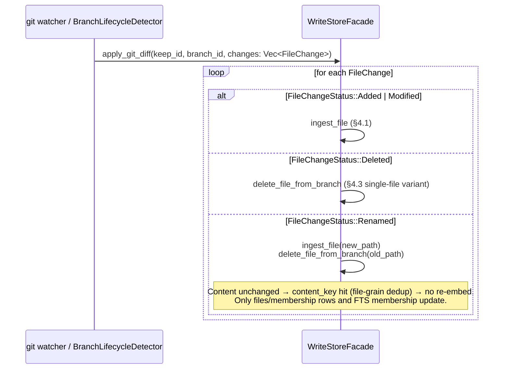

<!--
  File: docs/architecture/branch-storage-model.md
  Location: docs/architecture/ (subsystem architecture document)
  Context: workspace-qdrant-mcp (memexd daemon + mcp-server + wqm CLI). Defines
  the keep-model branch-storage model — stable keep_id identity, single storedb,
  file-grain dedup, minted branch_id — the replacement for the virtual-shadow-point
  + lineage-chain model specified in
  branch-lineage-indexing.md (superseded by this document).

  Companion documents (planned):
    - docs/ARCHITECTURE.md                     — system-level picture; will
                                                 reference this document
    - docs/architecture/data-flow-and-isolation.md — component isolation, store ownership
    - docs/architecture/write-path-enforcement.md  — write-path gRPC invariants
    - FIRST-PRINCIPLES.md                      — FP-1 (order-by-recoverability),
                                                 FP-2 (unify to prevent drift)

  Replaces: docs/architecture/branch-lineage-indexing.md (locked round-6
  virtual-shadow + lineage-chain + tombstone model). Everything from that doc
  that this one does not address is explicitly superseded and no longer applies.

  Architecture: keep-model branch-storage architecture; 2026-06-27
  (single storedb, file-grain content_key, keep/instance/branch identity).
  Decisions encoded here are authoritative; any open item is explicitly
  flagged in §10.
-->

# Branch-Storage Model — Subsystem Architecture

## 1. Overview and Terminology

Every indexed item in workspace-qdrant-mcp has a git-branch dimension: the same
file's content may be identical across branches (embed once, search from any
branch) or may differ per branch (different content, same path). The previous
"virtual-shadow + lineage-chain" model solved this with virtual Qdrant points,
a persisted lineage table, and tombstones. It was structurally sound but
invented git-style mechanics that git already provides for free, at the cost of
significant complexity — chain CTEs, nearest-branch-wins resolution, virtual
points with no vector, tombstone lifecycle.

**The keep-model takes a different route.** Each project's data is anchored by a
stable opaque `keep_id` (minted once, survives folder moves and branch renames).
All keeps share a single `storedb` — one SQLite store for all project data,
eliminating per-project handle churn, scope-fan-out migrations, and cross-store
non-atomicity. Dedup is at file grain: two branches with the same file content
share one `blobs` row and the same set of `chunks`. Qdrant remains the rebuildable
vector index; SQLite is the durable truth.

The model is **git-faithful**: what git can represent, we can represent; what git
resolves by commit parentage, we leave to git and consume only the resulting diff.
Delete on a branch removes branch membership from the file's blob; when the SQLite
referrer count reaches zero, the blob and its chunks are garbage-collected.

### Key terms (one definition each, used consistently throughout)

- **keep** — the stable data-ownership unit for one project or library. A keep has
  a KIND in {project, library}. `keep_id` is minted once at first registration;
  it never changes under ordinary transitions (folder move, branch rename, clone
  into the same remote). Identity derives from the repo's OWN remote (origin), so
  a fork (own or others') is a DISTINCT keep with a fresh `keep_id`.
- **keep_id** — an opaque UUID, minted once per keep, the primary storage and
  isolation key. The first input to `content_key`; the security-critical `keep_id = ?`
  filter on all Qdrant and SQLite search calls. Empty string is BANNED as a
  `keep_id` value — it is never used as a sentinel or default.
- **GLOBAL_KEEP_ID** — a reserved well-known constant: `UUIDv5(KEEP_NS, "global")`,
  pinned once in `wqm-common`, identical across all installs. Owns global libraries,
  global rules, and global scratchpad. The bare word `"global"` in user-facing
  inputs resolves to this keep; composed names (`"global-notes"`) are ordinary user
  names that do not collide.
- **instance_id** — minted per REPOSITORY (per `.git`), survives folder moves.
  A clone (separate `.git`, same remote/root-commit) = same keep_id, new instance_id.
  A worktree (shared `.git`) = same instance.
- **branch_id** — MINTED per branch per instance; opaque UUID. `branch_name` is a
  mutable attribute on the `branches` row. A rename updates the attribute only —
  ZERO re-key, ZERO payload remap. Two checkouts of the same branch name at
  different paths produce different `branch_id` values (different instances).
- **internal_project_id** — a RESOLUTION attribute only (derived from
  `hash(remote_url)` or `hash(path)`). NOT a stored column — it is a derived value
  computed on demand during the mint-guard lookup; no dedicated column exists in
  `keeps` or `instances`. Keys NOTHING — it exists solely as an implementation-internal
  concept for describing how candidate resolution keys are computed. Do not confuse
  with `keep_id`.
- **statedb** — the CONTROL plane SQLite DB. Contains: watch register,
  `unified_queue`, `dead_letter_queue`, `operational_state`, `metrics`,
  `startup_migrations`. Does NOT contain the keep/instance/branch directory —
  that lives in `storedb`. (`statedb` = the previous `state.db`, leaned down.)
- **storedb** — the single DATA plane SQLite DB. Contains: keep/instance/branch
  directory, `resolution_keys`, `files`, `blobs`, `chunks` (+ cold sidecars
  `chunk_text`, `chunk_vector`), `xrefs`, `file_symbols`, `symbol_signatures`,
  `signature_params`, branch membership, `scratchpad`, `rules`, `libraries`, and
  both FTS5 indexes. The old separate `search.db` (standalone FTS) and the
  per-project `store.db` files are gone — everything that the read path touches
  lives here. The sole writer is `memexd`.
- **content_key** — `SHA256(lp(keep_id) || lp(file_hash))`, computed by the single
  canonical producer. File-grain dedup key: identical file bytes within the same
  keep produce the same `content_key` → share one `blobs` row and all its `chunks`.
  See §5.4 for the full formula.
- **file_hash** — `SHA256(whole_file_bytes)`. FILE-grain content digest; the second
  input to `content_key`. Also stored on the `files` row for change detection ("has
  this file changed since last ingest?"). NOT a chunk-level concept.
- **point_id** — `UUIDv5(POINT_NS, lp(content_key) || lp(u32_be(chunk_index)))`.
  One Qdrant point per CHUNK (not per file). Multiple chunks within the same file
  share the same `content_key` but have distinct `chunk_index` values → distinct
  `point_id` values → distinct Qdrant points. See §5.4.
- **blob** — one `blobs` row: the file-grain dedup unit. Keyed by `content_key`.
  Owns `file_hash`, `size_bytes`, `chunk_count`. Multiple `chunks` hang off it.
  SHARED across all `(branch_id, relative_path)` pairs with identical file content.
- **chunk** — one `chunks` row: one semantic unit within a blob (from tree-sitter
  SemanticChunk + optional LSP enrichment). Carries `point_id`, positional offsets,
  `chunk_type`, `symbol_name`, overlap geometry, and embedding flags
  (`has_dense`, `has_sparse`). Cold sidecars (`chunk_text`, `chunk_vector`) hold
  `raw_text` and the packed binary vectors.
- **membership** — a junction row linking `(branch_id, file_id)` → `content_key`
  (i.e., which blob the file resolves to on that branch). Also drives the Qdrant
  `branch_id[]` payload array on each point.
- **file_identifier** — the repo-relative path within a branch; NOT a minted ID.
  A file rename re-keys exactly one `files` row (cheap under file-grain dedup).
  `file_identity_id` from the lineage model is RETIRED and does not exist here.
- **resolution_key** — a `(keep_id, kind, value)` row in `resolution_keys`,
  `kind ∈ {remote_url, root_commit_sha, path}`. Multiple resolution keys per keep.
  Used by the mint-guard to resolve candidate keeps at registration time.
- **mint-guard** — registration logic: compute candidate resolution keys for an
  incoming project; look each up in `resolution_keys`. ANY match → reuse existing
  `keep_id` (new instance, or same instance if shared `.git`). Two keys resolving
  to DIFFERENT keeps → CONFLICT, surface to user. NONE resolve → mint fresh `keep_id`.
- **worktree (W1)** — a git linked worktree shares the common `.git` dir with
  the primary clone → SAME `instance_id`. Each worktree is a `branches` row with
  its own nullable `checkout_path`. Detected via `git rev-parse --git-common-dir`:
  a linked worktree's `.git` is a FILE pointing to the common dir.
- **FTS5** — SQLite Full-Text Search version 5, embedded in `storedb`. All FTS
  operations are pure SQLite; Qdrant is not involved.
- **RRF** — Reciprocal Rank Fusion, the merge algorithm for hybrid dense+sparse
  search results.
- **HNSW** — Hierarchical Navigable Small World, the approximate nearest-neighbor
  graph Qdrant uses for vector search (~log N hops per query).
- **WAL** — SQLite Write-Ahead Logging mode: writers and readers operate on
  separate WAL pages; readers get a consistent snapshot without blocking writers.
- **CTE** — Common Table Expression: a named subquery (SQL `WITH` clause).

Architectural payoffs over the prior model:

| Concern | Prior (lineage+tombstone) | Round-7 (blob+concrete, per-project) | This model (keep-model, single storedb) |
|---------|--------------------------|--------------------------------------|------------------------------------------|
| Qdrant HNSW point count | O(branches × unique chunks), virtual points included | O(unique chunk contents) | O(unique chunk contents per keep) |
| Pre-filter | Chain CTE + nearest-wins → approximate | `branch_id ANY [B]` → exact | `branch_id ANY [B]` → exact (unchanged) |
| Delete lifecycle | Tombstone state machine | Remove membership + GC at refcount=0 | Remove membership + GC at refcount=0 |
| FTS5 store | Separate search.db | Per-project store.db | Single storedb (no per-project DBs) |
| Recovery | Re-embed on Qdrant loss | Durable vectors in per-project SQLite | Durable vectors in storedb chunks |
| Branch rename cost | O(points) Qdrant round-trips | O(points) re-key (derived branch_id) | Zero re-key (minted branch_id, rename = attr update) |
| scope=group fan-out | N/A | N per-project DB opens | 1 storedb open, filtered by keep_id |
| Migration surface | Branch-lineage schema | Per-project DB x N | One storedb migration |

---

## 2. Guiding Principles (Arch GP)

These principles resolve questions this document does not spell out literally.
Each refines the upstream chain (global FPs → coding-domain FPs → project FPs)
without contradicting it. Where a future implementation question is not
explicitly answered here, the implementor traces upward through this chain.
Each GP was validated upward for zero-contradiction before adoption.

**GP-1 — Git-faithful materialization.** We index the materialized result of
what git has computed, not how git computed it. Branch topology, merge ancestry,
rebase re-writes — these are git's business. Our business is: "given the current
file content on branch B at keep K, ensure the blob is indexed and the files
row for (K, B, relative_path) is current." We never replicate git's internal
mechanics; we consume its output.

**GP-2 — Blob = content identity; files + membership = branch identity.**
A `blobs` row is owned by its content (content-addressed, keyed by `content_key`).
A `files` row and its membership entry are owned by a `(keep_id, branch_id,
relative_path)` triple. These ownership domains must never be confused: writing a
files row or membership entry must not mutate a blob; GC-ing a blob must not leave
dangling files rows. The facade enforces this split.

**GP-3 — Qdrant is an index, storedb is the truth.** Qdrant carries pre-filter
metadata and vectors for approximate NN search. The storedb `chunks` rows (cold
sidecars `chunk_text`, `chunk_vector`) hold the durable text and packed binary
vectors. If Qdrant is lost or corrupted it is rebuilt from storedb without
re-embedding. No decision that makes Qdrant irreplaceable is acceptable.

**GP-4 — Transient failure means keep, not delete.** Any error in the delete or
GC path — network blip, timeout, git-read error — defers the operation; it never
triggers partial deletion. A still-referenced blob must never be GC'd. Data loss
from overly aggressive deletion is worse than temporary storage growth.
(Refines FP-1 "order by recoverability / delete last".)

**GP-5 — Single canonical producer for every derived value.** `content_key`,
`point_id`, `file_hash`, `keep_id`, `branch_id` are computed or minted by one
function each, used everywhere. No parallel formulas. (Refines FP-2 "unify to
prevent drift". `file_identity_id` is retired in this model — see §5.4 and §9.
The derived `branch_id = SHA256(lp(keep_id)||lp(location)||lp(branch_name))`
formula from round-7 is retired — branch_id is now minted.)

**GP-6 — Batch at ≥1000 points for all Qdrant bulk ops (upsert and membership-update
paths).** Performance evidence (SEED-prior-hazards §B): 100-point batches yield ~16s
for 50k-file×8-chunk corpus on remote Qdrant, failing a 30s acceptance ceiling;
1000-point batches yield ~1.6s. All upsert and membership-update paths batch at ≥1000
points unless the total count is smaller. **EXCEPTION — synchronous delete-path
REMOVE PUT (§4.3 Step 6):** the still-referenced REMOVE membership PUT executes
synchronously under the per-content_key ContentKeyLock, one content_key at a time, NOT
batched. Under flush-time recompute the enqueued REMOVE would be equally correct (the
qdrant_pending set drains idempotently, order-independent); synchronous execution is an
immediacy choice — the delete path already holds the lock and batching yields no material
throughput gain at typical delete cardinality. This is a deliberate carve-out from GP-6;
it is not an oversight.

**GP-7 — Least-privilege by process boundary, structurally enforced.** The MCP
server process may read and search; it may not write to the store. Write logic
lives in a SEPARATE crate `wqm-storage-write` that `mcp-server` and `wqm-cli`
never name in their dependency trees. `memexd` depends on both `wqm-storage`
(read + search) and `wqm-storage-write` (write). Because `mcp-server` and
`wqm-cli` have no path to `wqm-storage-write` in their dependency graphs, there
is no write code in those binaries — this is a STRUCTURAL guarantee (absence of
code), not a disabled feature.

**Why a crate split and not a cargo feature:** under `resolver = "2"` (verified:
`src/rust/Cargo.toml:9`), features are still unified across normal workspace
members that share the same dependency. If a single crate `wqm-storage` exposed
a `write` cargo feature and `memexd` enabled it, any workspace `cargo build` would
compile `wqm-storage` with `write` enabled for all dependents — including
`mcp-server` — because they share the same crate instance. The write code would be
present in the read-only binary regardless of the flag on the dependent. A separate
crate that `mcp-server` and `wqm-cli` never depend on cannot be unified away; the
guarantee becomes structurally unconditional. The `write` cargo feature approach is
explicitly retired as the primary boundary.

As defense-in-depth, a CI `cargo tree -e features -p mcp-server` assertion verifies
that `wqm-storage-write` does not appear in the `mcp-server` dependency closure.
This catches any future dependency edge that would restore the path. A `trybuild`
compile-fail test asserting that a write call fails to compile from the read-only
crate is a non-negotiable PRD deliverable alongside R8's `InMemoryStoreFacade`.
Aligns with the existing `wqm-client::write_service_guard` pattern.

**GP-8 — Named logical operations, no arbitrary SQL.** The storage facade grows
by adding named operations (`ingest_file`, `branch_onboard`, `branch_delete`,
`search`, `fts_search`, `rebuild_qdrant`, `register_keep`, `guard`, `unguard`).
Consumers never receive a raw connection or execute ad-hoc SQL. This is the hard
line between the application and the storage engine.

**GP-9 — Single-writer daemon invariant (named).** `memexd` is the SOLE writer
to storedb and statedb and to the Qdrant `projects` collection. MCP server and
wqm-cli are read-only by process boundary (GP-7) AND by design. This invariant
structurally excludes cross-process write races — no external process holds a
write client. Within `memexd`, concurrent writes targeting the same content_key
are serialized by `ContentKeyLockManager` (one async `Mutex<()>` per `content_key`
in a bounded `DashMap`); `branch_id[]` membership mutations are also serialized
through the same lock. The DashMap is eviction-bounded (see §6.3) to prevent
monotonic daemon heap growth.

**GP-9 enforcement mechanism (single-writer is load-bearing for F04 race
freedom AND cross-keep isolation):**

(a) **Daemon singleton advisory lock.** On startup, `memexd` acquires an OS-level
    advisory file lock on `<data_dir>/daemon.lock` — one lock per HOST/data-dir.
    A collection-global operation (like `rebuild_qdrant` or payload-index creation)
    races if two daemon processes run; the singleton lock prevents this. If the
    lock is held, startup refuses with a clear error — one writer per store,
    enforced at the process boundary. Stale-lock handling is a PRD detail.

(b) **Non-daemon connections are structurally read-only.** Every non-daemon SQLite
    connection (MCP server, CLI) is opened with `SQLITE_OPEN_READONLY` flag AND
    `PRAGMA query_only = ON` set immediately after open. A write attempt returns an
    error regardless of the schema. WAL readers proceed without blocking the writer.

(c) **Any future write-capable path acquires the same singleton lock.** Any
    future operation that must write (e.g. `wqm rebuild`, `wqm migrate`) MUST
    either run inside the daemon process OR acquire the same singleton advisory
    lock before touching storedb, statedb, or the Qdrant collection. No third path.

The `wal_autocheckpoint` PRAGMA is set only on the daemon write connection;
it is meaningless (and silently ignored) on read-only connections.

**GP-10 — Single storedb, sole-writer daemon.** All project, library, scratchpad,
and rules data share one storedb. No per-keep or per-project database files exist.
This is the decided topology (see §7.8). Consequences: scope=group and scope=all
search need no multi-DB fan-out (filter by keep_id instead); migrations run once
against a single file; there is no per-keep file handle to open or close. The
sole-writer daemon (GP-9) holds storedb open across the process lifetime.

---

## 3. Component Map

```mermaid
graph TB
    subgraph "Consumer processes"
        MCP["MCP server<br/>workspace-qdrant-mcp<br/>(read + search only)"]
        CLI["wqm CLI/TUI<br/>(read + search)"]
        Daemon["memexd daemon<br/>(write + read + search)"]
    end

    subgraph "Read crate — wqm-storage (MCP+CLI+daemon)"
        RFacade["ReadStoreFacade trait<br/>search, fts_search, list_branch,<br/>get_file, resolve_keep"]
        KeepReg["KeepRegistry<br/>(reads storedb keeps/instances/branches)"]
    end

    subgraph "Write crate — wqm-storage-write (daemon ONLY)"
        WFacade["WriteStoreFacade trait<br/>ingest_file, branch_onboard,<br/>branch_delete, rebuild_qdrant,<br/>register_keep, guard, unguard,<br/>delete_keep, delete_project"]
        LockMgr["ContentKeyLockManager<br/>per-content_key async Mutex"]
        ExtractEdges["extract_edges producer<br/>(unified: SemanticChunk[] →<br/>xrefs + file_symbols + symbol_signatures + signature_params + KG)"]
    end

    subgraph "Single storedb (one SQLite DB — all keeps)"
        Keeps["keeps table<br/>keep_id PK, kind (project|library)"]
        Instances["instances table<br/>instance_id PK, keep_id FK,<br/>checkout_path (nullable, worktree W1)"]
        Branches["branches table<br/>branch_id PK (minted UUID),<br/>branch_name (mutable attr), instance_id FK,<br/>active, sync_state"]
        ResKeys["resolution_keys table<br/>(keep_id, kind, value)<br/>kind: remote_url|root_commit_sha|path"]
        Files["files table<br/>1 row/(keep_id, branch_id, relative_path)<br/>content_key FK → blobs"]
        Blobs["blobs table<br/>content_key PK = SHA256(lp(keep_id)||lp(file_hash))<br/>file_hash, size_bytes, chunk_count"]
        Chunks["chunks table<br/>point_id PK = UUIDv5(content_key, chunk_index)<br/>chunk_type, symbol_name, overlap geometry,<br/>has_dense, has_sparse"]
        ChunkText["chunk_text (cold)<br/>point_id → raw_text"]
        ChunkVec["chunk_vector (cold)<br/>point_id → dense BLOB + sparse BLOB"]
        XRefs["xrefs table<br/>chunk-level relation edges:<br/>(point_id, xref_type, target_symbol, ...)"]
        FileSymbols["file_symbols table<br/>file-level rollup junction:<br/>(file_id, symbol_fqn, relation)"]
        FTS_Code["fts_code FTS5 table<br/>external-content on chunk_text;<br/>branch-scoped via membership join"]
        FTS_Grep["fts_grep FTS5 table<br/>line-level grep index;<br/>canonical line → (point_id, offset)"]
        Membership["membership table<br/>(branch_id, file_id) → content_key<br/>GC refcount = COUNT(*) WHERE content_key=?"]
        Scratchpad["scratchpad table<br/>virtual-path hierarchy, LLM-organized"]
        Rules["rules table<br/>virtual-path hierarchy, human-requested/LLM-written"]
        Libraries["libraries table<br/>virtual-path hierarchy, user-organized"]
    end

    subgraph "statedb (control plane only)"
        WatchReg["watch register<br/>unified_queue, dead_letter_queue,<br/>operational_state, metrics, startup_migrations"]
    end

    subgraph "Qdrant — projects collection"
        QChunk["chunk points (1 per chunk per keep)<br/>payload: keep_id (keyword, indexed),<br/>branch_id[] (keyword array, indexed)<br/>vectors: named dense (Cosine, 768-dim),<br/>named sparse (dot-product)"]
    end

    subgraph "Git object reader"
        GitReader["git module<br/>git2 (tree_ops.rs, worktree.rs)<br/>reflog reader (reflog.rs)<br/>diff_tree (diff_tree.rs)"]
    end

    Daemon -->|WriteStoreFacade| WFacade
    Daemon -->|ReadStoreFacade| RFacade
    MCP    -->|ReadStoreFacade| RFacade
    CLI    -->|ReadStoreFacade| RFacade
    WFacade -->|composes| RFacade

    WFacade --> LockMgr
    WFacade --> ExtractEdges
    ExtractEdges --> XRefs
    ExtractEdges --> FileSymbols
    WFacade --> Keeps
    WFacade --> Instances
    WFacade --> Branches
    WFacade --> ResKeys
    WFacade --> Files
    WFacade --> Blobs
    WFacade --> Chunks
    WFacade --> ChunkText
    WFacade --> ChunkVec
    WFacade --> Membership
    WFacade --> FTS_Code
    WFacade --> FTS_Grep
    WFacade --> Scratchpad
    WFacade --> Rules
    WFacade --> Libraries
    WFacade --> QChunk
    WFacade --> WatchReg

    RFacade --> Keeps
    RFacade --> Instances
    RFacade --> Branches
    RFacade --> Files
    RFacade --> Blobs
    RFacade --> Chunks
    RFacade --> ChunkText
    RFacade --> Membership
    RFacade --> FTS_Code
    RFacade --> FTS_Grep
    RFacade --> QChunk
    KeepReg --> Keeps
    KeepReg --> Instances
    KeepReg --> Branches

    Daemon -->|git topology| GitReader

    style WFacade fill:#ffe1e1
    style RFacade fill:#e1f5ff
    style QChunk fill:#e8f5e9
    style WatchReg fill:#fff9e1
    style ExtractEdges fill:#ffe8c8
```



### Component responsibilities and hard boundaries

**WriteStoreFacade** — The full storage interface, available to `memexd` only. Owns
all mutation: file-grain blob dedup, chunk writes, branch lifecycle
(onboard/delete/GC), Qdrant membership updates, FTS5 inserts, keep/instance
registration, worktree checkout_path management, guard/unguard. Must NOT expose raw
connections or raw SQL. Must NOT be linked into the MCP server binary.

**ReadStoreFacade** — The subset of `WriteStoreFacade` that performs no writes:
`search`, `fts_search`, `get_file`, `list_branch`, `resolve_keep`. Linked into
`mcp-server` and `wqm-cli`. Must NOT accept any write method. Locking: uses
SQLite WAL — readers get a consistent snapshot without blocking the daemon writer.

**ContentKeyLockManager** — Holds one async `Mutex<()>` per active `content_key`
in a `DashMap`. Serializes concurrent daemon writes targeting the same blob (file
dedup unit). The lock covers the storedb write cycle: acquire → SQLite INSERT
(`blobs`, chunks, membership, FTS rows) → `INSERT INTO qdrant_pending(content_key,
op_type) VALUES(?, ?)` in the same transaction (op_type='upsert' for a new-blob miss
path; op_type='overwrite' for all other enqueues) → release. The batched Qdrant FLUSH
(≥1000 ops, GP-6) executes OUTSIDE any single lock: the flusher acquires
ContentKeyLock(content_key), reads `op_type` from the `qdrant_pending` row, runs
`compute_membership(content_key)`, and calls the matching Qdrant operation: `upsert_points`
(vectors + payload) when `op_type='upsert'`; `overwrite_payload` (payload-only PUT)
when `op_type='overwrite'`. This is safe because the storedb-derived membership set
is idempotent — any retry with the same storedb state produces the same result.
The live-flush and recovery-drain are ONE code path (both read the durable `op_type`).

**Ingest path vs delete path (same producer, different sequencing and operation):**
all paths use `compute_membership(content_key)` to derive `branch_id[]` from storedb,
but differ in WHEN the membership mutation fires, WHICH Qdrant operation executes,
and whether the write is enqueued or synchronous:
- **Ingest ADD new blob:** storedb INSERT fires inside ContentKeyLock;
  `INSERT INTO qdrant_pending(content_key, op_type) VALUES(new_ck, 'upsert')` committed
  in the same transaction; lock released. At batch flush: flusher acquires
  ContentKeyLock(content_key), reads op_type='upsert', runs `compute_membership`, fetches
  vectors from `chunk_vector`, calls `upsert_points`; deletes all pending rows for
  this content_key on success.
- **Ingest ADD existing blob (or re-point):** storedb UPSERT fires inside ContentKeyLock;
  `INSERT INTO qdrant_pending(content_key, op_type) VALUES(new_ck, 'overwrite')` in the
  same transaction; if this is a re-point (this branch previously pointed to `old_ck`),
  `INSERT INTO qdrant_pending(content_key, op_type) VALUES(old_ck, 'overwrite')` ALSO in
  the same transaction (durable OLD_CK recovery on BOTH miss and hit paths;
  old_ck is always an existing blob, so op_type='overwrite' is correct). Lock released.
  At batch flush: flusher acquires ContentKeyLock(content_key) for each pending entry ONE
  AT A TIME (never two locks simultaneously), reads op_type='overwrite', runs
  `compute_membership`, calls `overwrite_payload` (payload-only); deletes all pending
  rows for this content_key on success.
- **Delete REMOVE (still-referenced):** `compute_membership` runs AFTER the membership
  DELETE (Step 4, §4.3) so the SELECT excludes the departed branch. Executes
  `overwrite_payload` SYNCHRONOUSLY inside the ContentKeyLock (Step 6) as an immediacy
  choice — under flush-time recompute this path could be enqueued via `qdrant_pending`
  equivalently; synchronous avoids an extra pending-set cycle at no correctness cost.
- **Delete REMOVE (orphaned):** chunk point DELETE (no empty-array PUT).

**extract_edges (unified producer)** — A single `extract_edges(SemanticChunk[])` function
produces relationship data for FOUR storedb sinks: (1) `xrefs` (chunk-precise relational
mirror), (2) `file_symbols` (coarse file-level rollup), (3) `symbol_signatures` (per
overload variant), (4) `signature_params` (per parameter); and optionally the LadybugDB
KG (traversal edges) when configured. `signature_params.type` and the `xrefs uses_type`
edge derive from the same extraction pass. No component may compute relationship data by
a parallel formula (FP-2, GP-5). See §8 for the canonical EdgeSet definition.

**KeepRegistry** — Reads storedb `keeps`, `instances`, `branches`, `resolution_keys`
tables to map `(CWD → keep_id → branch_id)`. Implements the resolution rule (§4
"Search"). Also implements the FP-3 fuzzy handle→key resolver: address-by-name on
human inputs (Jaro-Winkler ≥ 0.92, exact-match-wins short-circuit, action-tiered
strictness for READ / WRITE / DESTRUCTIVE), identify-by-key internally. The resolved
exact `keep_id` — never the typed name — feeds the `keep_id = ?` filter on every
storedb and Qdrant query. Must NOT write to storedb from the MCP or CLI; all
writes route through daemon gRPC. Minted by F10, extended by F16 (FP-2: one nexus,
two phases).

**storedb** — The single SQLite data-plane DB, opened by `memexd` at startup and
held open for the process lifetime. Contains all keep/instance/branch/resolution
metadata, all file-grain blobs and their chunk rows, cross-references, symbols,
scratchpad, rules, libraries, and both FTS5 indexes. `busy_timeout`,
`wal_autocheckpoint`, and WAL mode are set on the daemon write connection at open
time; read-only connections (MCP server, CLI) open with `SQLITE_OPEN_READONLY` and
`PRAGMA query_only = ON`.

**statedb** — The control-plane SQLite DB (the slimmed-down former `state.db`).
Contains: watch register, `unified_queue`, `dead_letter_queue`, `operational_state`,
`metrics`, `startup_migrations`. Does NOT contain the keep/instance/branch
directory; that moved to storedb in this model. statedb is still the crash-recovery
anchor for the work queue and watch registration; if storedb is lost, statedb records
what projects were registered and the recovery path (`wqm restore --full` then
`wqm rebuild`) can reconstruct.

**Qdrant chunk point store** — One Qdrant collection (`projects`). Each Qdrant point
represents one CHUNK (one `chunks` row). Payload fields are pre-filter metadata ONLY:
`keep_id` (keyword, indexed), `branch_id[]` (keyword array, indexed). NO raw text, NO
paths. GC refcount is computed from `SELECT COUNT(*) FROM membership WHERE content_key = ?`
in storedb (GP-3 — storedb is the truth for GC decisions). Qdrant is rebuildable from
storedb cold sidecars (`chunk_vector`) without re-embedding. Collection creation must
specify: named dense vector (`"dense"`, Cosine distance, 768-dim), named sparse vector
(`"sparse"`, dot-product), and payload indexes on `keep_id` and `branch_id` before
first upsert (see §5.3).

**FTS5 (two tables in storedb)** — `fts_code`: full-text search over chunk raw_text,
external-content on `chunk_text` (content_rowid = ct_id — an INTEGER AUTOINCREMENT
surrogate on `chunk_text`; FTS5 content_rowid MUST be INTEGER, so the TEXT `point_id`
UUID cannot serve directly). Zero text duplication: raw_text lives once in `chunk_text`.
`fts_grep`: line-level grep index, self-storing FTS5 (line_content is stored in the
FTS5 shadow tables — NOT external-content), mapping each canonical line to exactly one
`(point_id, offset)` via `fts_grep_map`. Because fts_grep is self-storing, line text
IS duplicated inside storedb — an accepted cost for efficient line-level grep. Never
double-returns the same source line. Both live in storedb: `fts_code`
(external-content) MUST share a DB with its content table `chunk_text` — that
external-content constraint is why the old standalone `search.db` is gone; `fts_grep`
(self-storing, no content table dependency) co-locates there for the same single-DB
operational simplicity. Branch-scoped queries JOIN the membership
table for an indexed scalar branch filter, avoiding json_each (SEED F01: 8-35x
slowdown). Full-text search never touches Qdrant.

**Git object reader** (`src/rust/daemon/core/src/git/`) — The existing module
(`tree_ops.rs:get_blob_hash`, `reflog.rs`, `diff_tree.rs`, `worktree.rs`) already
wraps `git2` for blob hash lookup, reflog reading, diff tree parsing, and worktree
detection. The new model promotes this from a supporting role to the **branch
topology source of truth**: diff apply for macro git ops, reflog scanning for
missed-event recovery. Must NOT be called from `mcp-server` or `wqm-cli`; it
runs inside `memexd` only.

---

## 4. Data Flows

### 4.1 Ingest — file → file_hash → content_key → blob dedup → chunks → Qdrant

Lock granularity: ONE `content_key` lock per FILE (not per chunk). The lock covers
the full write cycle for all chunks of a file. A file with N chunks acquires one
lock, writes N chunk rows, and releases.

```mermaid
sequenceDiagram
    participant FS as FS watcher / git event
    participant Ingest as ingest_file<br/>(strategies/processing/file/ingest.rs)
    participant LockMgr as ContentKeyLockManager
    participant SQLite as storedb (single)
    participant Qdrant as Qdrant

    FS->>Ingest: file event (path, branch_id, keep_id)
    Ingest->>Ingest: read file bytes; compute file_hash = SHA256(whole_file_bytes)<br/>compute content_key = SHA256(lp(keep_id)||lp(file_hash)) — §5.4 canonical producer

    Ingest->>LockMgr: acquire lock(content_key)
    LockMgr-->>Ingest: lock held

    alt blob already exists (content_key hit in blobs)
        Note over Ingest: Hit path: blobs row already exists for this content_key.<br/>Pre-read old_ck: SELECT content_key AS old_ck FROM membership WHERE branch_id=? AND file_id=?.<br/>UPSERT files row (keep_id, branch_id, relative_path, content_key, language...).<br/>UPSERT membership: INSERT INTO membership(branch_id, file_id, content_key)<br/>  VALUES(?,?,?) ON CONFLICT(branch_id, file_id) DO UPDATE SET content_key = excluded.content_key;<br/>For an unchanged file the UPDATE is a no-op (same content_key already stored).<br/>If old_ck IS NOT NULL AND old_ck != new_ck (file modified to content that is an existing blob<br/>  — re-point on the hit path): this branch previously referenced old_ck, now references new_ck.<br/>  INSERT INTO qdrant_pending(content_key, op_type) VALUES(new_ck, 'overwrite') — same transaction.<br/>  INSERT INTO qdrant_pending(content_key, op_type) VALUES(old_ck, 'overwrite') — same transaction.<br/>  (old_ck is always an existing blob: its points exist in Qdrant; op_type='overwrite' is correct.)<br/>  old_ck's lock is acquired at FLUSH TIME only (never held simultaneously with new_ck's lock).<br/>Otherwise (first-time ADD): INSERT INTO qdrant_pending(content_key, op_type) VALUES(new_ck, 'overwrite') only.<br/>Lock released BEFORE batch flush.<br/>AT FLUSH TIME: flusher acquires ContentKeyLock(content_key) for each pending entry,<br/>  reads op_type ('overwrite'), runs compute_membership(content_key) = SELECT DISTINCT branch_id<br/>  FROM membership WHERE content_key = ?,<br/>  calls overwrite_payload (PUT, payload-only: {keep_id, branch_id: full_set[]})<br/>  for ALL point_ids of this content_key (from chunks table).<br/>Idempotent: same storedb state → same result on any retry (GP-6).
        Ingest->>SQLite: UPSERT files; UPSERT membership (ON CONFLICT DO UPDATE SET content_key)
        Ingest->>LockMgr: release lock(content_key)
    else genuinely new blob (content_key miss — new file or changed file)
        Note over Ingest: A file modification produces a new file_hash → new content_key → miss path.<br/>PRE-UPSERT STEP (modification guard):<br/>  SELECT content_key AS old_ck FROM membership WHERE branch_id=? AND file_id=?.<br/>  If old_ck IS NOT NULL AND old_ck != new_ck (file was MODIFIED, not just newly seen):<br/>    INSERT INTO qdrant_pending(content_key, op_type) VALUES(old_ck, 'overwrite') — durable,<br/>    in the SAME transaction as the membership UPSERT below. old_ck is always an existing blob<br/>    (it was already in Qdrant), so op_type='overwrite' is correct. old_ck's ContentKeyLock<br/>    is acquired at FLUSH TIME ONLY (never held simultaneously with new_ck's lock).<br/>    At flush time, flusher acquires ContentKeyLock(old_ck), reads op_type='overwrite',<br/>    compute_membership(old_ck) returns the reduced set → overwrite_payload (PUT)<br/>    if old_ck still has other referrers; or old_ck's chunk points are GC'd if now orphaned.<br/>The membership UPSERT re-points (branch_id, file_id) → new_content_key atomically:<br/>  INSERT INTO membership(branch_id, file_id, content_key) VALUES(?,?,?)<br/>  ON CONFLICT(branch_id, file_id) DO UPDATE SET content_key = excluded.content_key;<br/>  INSERT INTO qdrant_pending(content_key, op_type) VALUES(new_ck, 'upsert') — same txn<br/>  (new blob: points do not yet exist in Qdrant; op_type='upsert' required).
        Ingest->>Ingest: parse + chunk (tree-sitter SemanticChunk + LSP enrichment)<br/>embed ALL chunks (dense + sparse vectors) — batch embedding call
        Note over Ingest: INSERT blobs(content_key, keep_id, file_hash, size_bytes, chunk_count)<br/>For each chunk: INSERT chunks(point_id, content_key, keep_id, chunk_index, start_line,<br/>  end_line, owned_start_line, owned_end_line, trim_offset, chunk_type, symbol_name,<br/>  lsp_symbol_kind, references_count, token_count, has_dense, has_sparse, ...)<br/>INSERT chunk_text(point_id, raw_text) — cold sidecar<br/>INSERT chunk_vector(point_id, dense BLOB, sparse BLOB) — cold sidecar, packed f32 LE<br/>FTS5 external-content trigger fires on chunk_text INSERT → fts_code updated.<br/>fts_grep is self-storing: after each chunk_text INSERT the write path iterates<br/>  owned lines (owned_start_line..owned_end_line, offset by trim_offset) and<br/>  for each line: INSERT INTO fts_grep(line_content) → capture last_insert_rowid;<br/>  INSERT INTO fts_grep_map(rowid, point_id, line_offset).<br/>extract_edges(chunks) → EdgeSet { xrefs, file_symbols, symbol_signatures,<br/>  signature_params }; INSERT all four sinks (§8 unified producer).<br/>UPSERT files row; UPSERT membership (INSERT ... ON CONFLICT DO UPDATE SET content_key).
        Ingest->>SQLite: INSERT blobs + chunks + chunk_text + chunk_vector +<br/>  xrefs + file_symbols + symbol_signatures + signature_params;<br/>  fts_grep + fts_grep_map rows (per owned line); UPSERT files; UPSERT membership<br/>  (ON CONFLICT DO UPDATE SET content_key); INSERT qdrant_pending(content_key, op_type)
        Note over Ingest,LockMgr: qdrant_pending INSERT(s) committed in the same transaction<br/>as the membership rows — durable pending entries survive a crash. op_type='upsert' for<br/>this new-blob miss path; op_type='overwrite' for any old_ck re-point row.<br/>Lock released BEFORE flush.<br/>AT FLUSH TIME: flusher acquires ContentKeyLock(content_key) for each pending entry,<br/>  reads op_type='upsert', runs compute_membership(content_key) = SELECT DISTINCT<br/>  branch_id FROM membership WHERE content_key = ?,<br/>  fetches dense+sparse vectors from chunk_vector for each point_id,<br/>  calls upsert_points({point_id, dense_vec, sparse_vec, payload: {keep_id, branch_id: full_set[]}})<br/>  for EACH new chunk point; DELETEs all qdrant_pending rows for this content_key on success.<br/>overwrite_payload MUST NOT be used for a new-blob —<br/>  it is payload-only and silently no-ops if the point does not yet exist.<br/>Payload carries the full recomputed set — NOT only current_branch_id (F04 safety).<br/>After any crash, §4.8 reconcile case 1 drains surviving qdrant_pending entries<br/>using the same code path (op_type is durable in the row).
        Ingest->>LockMgr: release lock(content_key)
    end

    Note over Ingest,Qdrant: Qdrant batch flush fires OUTSIDE the content_key lock<br/>when ≥1000 ops accumulated (GP-6). storedb writes complete BEFORE any flush.
    Note over SQLite,Qdrant: Write order (FP-1): storedb first → Qdrant second.<br/>Crash after storedb = Qdrant missing entries → §4.8 reconcile case 1 drains qdrant_pending.<br/>Crash after Qdrant flush = idempotent retry (same point_id, same content).<br/>WARNING: every Qdrant PUT (upsert_points OR overwrite_payload) MUST supply BOTH<br/>payload fields (keep_id, branch_id: full_set[]) — omitting either silently deletes it.
```

### 4.2 Branch onboard

When a previously unknown branch is first seen (new branch created, worktree
added, git checkout detected):

**Membership write path — ONE path only:** `branch_id[]` for each chunk point is
ALWAYS the full set derived from storedb (`SELECT DISTINCT branch_id FROM membership
WHERE content_key = ?`), written via `overwrite_payload` (PUT — full payload
replacement) under the per-content_key ContentKeyLock. This single pattern applies
to BOTH the ADD path (existing blob gains a new branch) and the REMOVE path (branch
delete). No `set_payload` array-append. Both the new-blob path (upsert with
`branch_id:[current_branch]` initial membership) and the existing-blob path
(recompute from storedb + PUT) are handled in §4.1 inside the per-file lock.

```mermaid
sequenceDiagram
    participant Git as git event / BranchLifecycleDetector
    participant Facade as WriteStoreFacade
    participant SQLite as storedb (single)
    participant Qdrant as Qdrant

    Git->>Facade: branch_onboard(keep_id, instance_id, branch_name, checkout_path, diff)
    Facade->>SQLite: mint branch_id = UUIDv4; INSERT branches(branch_id, keep_id, instance_id,<br/>branch_name, checkout_path, active=true, sync_state=pending)
    Note over Facade: sync_state=indexing emitted to telemetry so callers<br/>know search results may be incomplete until indexing completes.<br/>Worktree (W1): checkout_path is non-NULL; same instance_id as the primary clone.
    Facade->>Git: git diff HEAD..branch_name (diff_tree.rs) — git rev-parse/<br/>git-object reads cached per checkout_path (prior hazard B ~150s)
    loop for each changed file (bounded concurrency: ≤N_CPU tasks)
        Facade->>Facade: ingest_file (§4.1 flow)<br/>— membership written INSIDE §4.1 per-file lock
    end
    Note over Facade,SQLite: Unchanged files reuse existing blobs (content_key hit).<br/>Both §4.1 paths write membership rows and INSERT INTO qdrant_pending(content_key, op_type)<br/>in the same transaction. Miss path (new blob): op_type='upsert' → flush calls upsert_points<br/>(vectors+payload). Hit path (existing blob): op_type='overwrite' → flush calls overwrite_payload<br/>(payload-only PUT). op_type is durable in the row; live-flush and recovery-drain are one code path.
    Facade->>SQLite: UPDATE branches SET sync_state=current
    Note over Qdrant: branch_id[] membership complete for all chunk points.<br/>Crash before sync_state=current → §4.8 reconcile re-runs missing files.<br/>SLA: Qdrant pre-filter correct when sync_state=current; FTS5 available immediately.
```

**Partial-recall window:** between `sync_state=pending` and `sync_state=current`,
Qdrant search returns incomplete results (chunk points not yet carrying this
`branch_id` are missed). FTS5 is correct as soon as each file's ingest completes.
The facade MUST expose `sync_state` to callers via `list_branch` / status ops.

**Retry and crash-resume:** if the daemon crashes mid-onboard, on restart it reads
`sync_state=pending` branches and re-drives §4.1 for all their files. The
membership UPSERT (ON CONFLICT DO UPDATE SET content_key) and FTS trigger are idempotent. The Qdrant
`overwrite_payload` (PUT) recompute-from-storedb pattern is also idempotent:
re-running with the same storedb state produces the same full `branch_id[]` set.

**Worktree onboard (W1):** detected by `git rev-parse --git-common-dir` returning a
FILE path (not a directory) — the worktree's `.git` file points to the common dir.
`instance_id` = the instance of the primary clone sharing that common dir.
`checkout_path` = the worktree's root path (non-NULL, distinct from the primary's
path). The watch register tracks the UNION of an instance's non-NULL `checkout_path`
values. `cwd → branch_id` resolution matches the cwd against `checkout_path` values.

### 4.3 Branch delete + blob GC

**Deletion truth table (GP-4):** authorization to delete is driven by a POSITIVE
absence signal, not the absence of a positive presence signal.

| Git query result | Action |
|---|---|
| Branch HEAD positively confirmed deleted (`git for-each-ref` returns nothing; reflog shows a delete event) | Proceed with delete |
| Branch present in topology | Keep — do NOT delete |
| Read error (`git2` returns Auth, I/O, NotFound-ambiguous, locked-repo) | DEFER — do NOT proceed |
| Reflog unavailable / git dir unreachable | DEFER — do NOT proceed |

A transient `git2::Error::NotFound` (which can arise from a network error on a
remote-tracking ref, not only genuine absence) MUST map to DEFER, not delete.
Only a confirmed delete event (positively recorded in reflog or for-each-ref)
authorizes proceeding.

```mermaid
sequenceDiagram
    participant Git as git event (branch deleted)
    participant Facade as WriteStoreFacade
    participant SQLite as storedb (single)
    participant Qdrant as Qdrant

    Git->>Facade: branch_delete(keep_id, branch_id)

    Note over Facade: GP-4 — Deletion truth table check (above).<br/>Any ambiguity or error → DEFER, do NOT proceed.

    Note over Facade: FP-1 physical-delete ordering (data products first, truth last):<br/>Step 1: pre-select all content_keys for this branch from membership (read-only).<br/>Step 2: compute orphan candidates (content_keys with NO other branch in membership).<br/>Step 3: delete orphaned Qdrant points for all chunks of orphan content_keys.<br/>Step 4: DELETE membership + files rows for this branch (truth rows).<br/>Step 5: re-verify orphan set AFTER membership deletion; delete confirmed orphaned<br/>         blobs + their chunks + chunk_text + chunk_vector + xrefs + file_symbols +<br/>         symbol_signatures + signature_params (see §8 for all four extract_edges sinks).<br/>Step 6: for each still-referenced content_key, recompute branch_id[] from storedb<br/>         → overwrite_payload (PUT) per chunk point under ContentKeyLock.<br/>Step 7: delete branches row (crash-recovery anchor, last).<br/>NOTE: membership PUT (Step 6) fires AFTER membership DELETE (Step 4) so the storedb<br/>recompute correctly excludes the deleted branch. Orphaned blobs get chunk point DELETEs.

    Facade->>SQLite: SELECT DISTINCT content_key FROM membership WHERE branch_id=?
    Note over Facade: Step 1: hold all content_key candidates in memory.

    Note over Facade: Step 2: batched GROUP BY orphan scan (≤1000 content_keys per call):<br/>  SELECT content_key FROM membership WHERE content_key IN (candidate_window)<br/>  GROUP BY content_key<br/>  HAVING SUM(CASE WHEN branch_id != :deleted_branch_id THEN 1 ELSE 0 END) = 0<br/>Result: content_keys whose ONLY referrer is the deleted branch = orphan candidates.<br/>NOTE: do NOT add WHERE branch_id != :deleted before the GROUP BY — that eliminates<br/>the rows that define an orphan.
    Facade->>SQLite: batched GROUP BY orphan scan (≤1000 candidates per call)

    loop orphaned content_keys (batched ≥1000)
        Note over Facade: Collect all point_ids for orphan content_keys:<br/>  SELECT point_id FROM chunks WHERE content_key IN (orphan_batch)
        Facade->>Qdrant: delete chunk points (batched ≥1000) — Step 3
    end

    Note over Facade: CANONICAL CHUNKED-DELETE IDIOM (steps 4 and 5):<br/>  DELETE ... LIMIT is INVALID in the bundled SQLite (libsqlite3-sys 0.30.1 does<br/>  not enable SQLITE_ENABLE_UPDATE_DELETE_LIMIT). Every bounded bulk delete MUST<br/>  use the subselect pattern:<br/>    DELETE FROM &lt;t&gt; WHERE rowid IN<br/>      (SELECT rowid FROM &lt;t&gt; WHERE &lt;pred&gt; LIMIT N)<br/>  looped until 0 rows affected, committing (releasing the RESERVED lock) per<br/>  batch. This is the ONE valid idiom — used for ALL delete steps.

    loop step 4 — chunked deletes until 0 rows (≤10,000 rows per batch)
        Facade->>SQLite: BEGIN IMMEDIATE
        Facade->>SQLite: DELETE FROM membership WHERE rowid IN<br/>  (SELECT rowid FROM membership WHERE branch_id=? LIMIT 10000) — Step 4a
        Facade->>SQLite: DELETE FROM files WHERE rowid IN<br/>  (SELECT rowid FROM files WHERE branch_id=? LIMIT 10000) — Step 4b
        Facade->>SQLite: COMMIT — releases RESERVED lock; ingest may interleave
    end

    Note over Facade: Step 5: re-verify orphan set NOW (after membership rows deleted).<br/>BEGIN IMMEDIATE: re-verify SELECT and blob/chunk DELETE must be atomic (ABA guard).<br/>Per batch: confirm orphan content_keys (no remaining membership rows), then delete:<br/>  blobs row, chunks rows (cascade-deletes chunk_text + chunk_vector),<br/>  xrefs rows, file_symbols rows, symbol_signatures rows, signature_params rows.<br/>  FTS5 external-content trigger fires on chunk_text DELETE.

    loop step 5 — per batch of ≤1000 orphan candidates
        Facade->>SQLite: BEGIN IMMEDIATE
        Facade->>SQLite: SELECT content_key FROM membership<br/>WHERE content_key IN (candidate_window_1000) — ABA survivors (still referenced)
        Note over Facade: confirmed_orphan_batch = candidate_window MINUS survivors.<br/>DELETE chunks (cascade → chunk_text, chunk_vector), blobs, xrefs, file_symbols,<br/>symbol_signatures, signature_params.
        Facade->>SQLite: DELETE chunks/blobs/xrefs/file_symbols/symbol_signatures/signature_params for confirmed_orphan_batch<br/>  (subselect idiom; ≤1000 content_keys per batch; FTS5 trigger fires per chunk_text row)
        Facade->>SQLite: COMMIT
    end

    Note over Facade: Step 6: for each still-referenced content_key (Step 1 set MINUS confirmed orphans),<br/>collect point_ids from chunks, recompute branch_id[] via:<br/>  compute_membership(content_key) = SELECT DISTINCT branch_id FROM membership WHERE content_key = ?<br/>(deleted branch absent from membership after Step 4; returns correct reduced set).<br/>For each point_id: overwrite_payload (PUT, {keep_id, branch_id: recomputed_set[]})<br/>SYNCHRONOUSLY under per-content_key ContentKeyLock (immediacy choice — equally correct<br/>if enqueued via qdrant_pending; synchronous avoids an extra pending-set cycle here).

    loop step 6 — still-referenced content_keys (batched ≥1000 chunk points)
        Note over Facade,Qdrant: acquire ContentKeyLock → compute_membership(content_key) →<br/>overwrite_payload (PUT per chunk point_id) → release. Synchronous.
        Facade->>Qdrant: overwrite_payload (PUT) {keep_id, branch_id: recomputed_set[]}<br/>(Step 6 — per chunk point, after membership truth delete)
    end

    Facade->>SQLite: DELETE branches WHERE branch_id=?
    Note over Facade: branches row deleted LAST — crash recovery reads sync_state<br/>to resume. FTS5 triggers fire on chunk_text DELETE (Step 5), keeping FTS in sync.
```

**Crash safety:** a crash after Step 3 (orphan Qdrant points deleted) but before
Step 4 (membership deleted) means storedb still references the branch; §4.8
reconcile re-adds Qdrant membership for still-referenced chunk points (additive
recovery, GP-3). A crash after Step 4 (membership deleted) but before Step 6
(membership PUT) leaves Qdrant stale with the deleted branch still present; §4.8
detects the storedb/Qdrant mismatch and removes it. A crash after Step 3 but
before Step 5 (blobs/chunks deleted) leaves orphan `blobs` rows; §4.8 prunes them.
At no point is a storedb-truth-referenced blob GC'd.

**Single-file delete variant (`delete_file_from_branch(branch_id, file_id)`):**
Retracts ONE file from ONE branch without tearing down the whole branch. Same
FP-1 physical-delete order, scoped to `(branch_id, file_id)`:

1. Pre-select `content_key` for this `(branch_id, file_id)` from `files` and
   `membership` (read-only).
2. `BEGIN IMMEDIATE`; delete this file's `membership` and `files` rows for this
   branch; `COMMIT`.
3. For the `content_key`, re-test remaining referrer count in `membership`: count 0
   → orphan (delete Qdrant chunk points, then delete blobs/chunks/xrefs rows under
   `BEGIN IMMEDIATE` with ABA re-verify); count > 0 → recompute `branch_id[]` and
   `overwrite_payload` (PUT per chunk point) under ContentKeyLock.

A rename (§4.6) is `ingest_file(new_path)` FIRST, then `delete_file_from_branch(old_path)`
— ingest-before-delete so a blob shared between the old and new path never transiently
drops to refcount 0 and gets GC'd between the two steps.

### 4.4 Search — root resolution → pre-filter → storedb enrich

```mermaid
sequenceDiagram
    participant Claude as Claude / MCP client
    participant MCP as mcp-server ReadStoreFacade
    participant Reg as KeepRegistry (storedb)
    participant Qdrant as Qdrant
    participant SQLite as storedb (single)

    Claude->>MCP: search(cwd, query, k)
    MCP->>Reg: resolve_keep(cwd)
    Note over Reg: Walk CWD up to nearest registered checkout_path in branches.<br/>Most-specific path wins (submodule beats container).<br/>Match against keeps.keep_id, branches.branch_id — all in storedb.<br/>Return (keep_id, branch_id).
    Reg-->>MCP: (keep_id, branch_id)

    MCP->>Qdrant: TWO parallel ANN queries: dense named vector query + sparse named vector query.<br/>Both carry filter: branch_id ANY [branch_id] AND keep_id = ?<br/>(pre-filter — payload index on both fields required, see §5.3)<br/>Both fetch limit: k candidates. Client-side RRF: wqm_common::search::rrf::rrf_merge<br/>fuses the two ranked lists into one merged ranking (no Qdrant-server RRF needed).
    Note over MCP: Latency budget (scope=project): resolve_keep ≤5ms; per-Qdrant-query ≤80ms;<br/>storedb enrich ≤20ms; total p95 target ≤200ms. FTS5 path: storedb only, ≤50ms.
    Qdrant-->>MCP: chunk point_ids + scores (dense and sparse, two result sets)

    MCP->>SQLite: SELECT enrichment for point_ids via storedb:<br/>chunks.symbol_name, chunks.start_line, chunks.end_line,<br/>chunk_text.raw_text (snippet), files.relative_path<br/>JOIN blobs ON blobs.content_key = chunks.content_key<br/>JOIN membership ON membership.content_key = blobs.content_key<br/>JOIN files ON files.file_id = membership.file_id<br/>WHERE membership.branch_id = ? AND chunks.point_id IN (...)
    SQLite-->>MCP: enriched results (xrefs fetched separately if needed)

    MCP-->>Claude: ranked results with full metadata
```

**scope=group and scope=all:** with a single storedb, multi-keep fan-out requires
no per-keep DB opens. Both scopes issue: (1) one storedb enrich query with
`keep_id IN (keep_ids_for_scope)`, and (2) N Qdrant query pairs (one dense + one
sparse per keep) under bounded concurrency (semaphore = min(N_CPU, 8)). Each
per-keep pair is fused via client-side RRF; results across keeps are then merged
via a second cross-keep RRF pass (`rrf_merge`, §8 F17). See §10 R5 for the cliff
check. `project_groups` table (in storedb, keyed by keep_id) provides group
membership for scope=group.

### 4.5 Recovery — rebuild Qdrant from storedb

This path fires when Qdrant is empty or when the operator runs `wqm rebuild`.
It never re-embeds because dense + sparse vectors are durable in the `chunk_vector`
cold sidecar inside storedb.

```mermaid
sequenceDiagram
    participant Op as operator / daemon startup
    participant Facade as WriteStoreFacade
    participant SQLite as storedb (single)
    participant Qdrant as Qdrant

    Op->>Facade: rebuild_qdrant(keep_id)
    Note over Facade: Collection creation (idempotent): create_collection if not exists;<br/>create_payload_index(branch_id, keyword);<br/>create_payload_index(keep_id, keyword).<br/>Named vectors: dense (Cosine, 768-dim) + sparse (dot-product).
    Facade->>SQLite: streaming cursor (keyset pagination, batch size ≥1000):<br/>SELECT c.point_id, cv.dense, cv.sparse,<br/>json_group_array(DISTINCT m.branch_id) AS branch_ids_json,<br/>c.keep_id<br/>FROM chunks c<br/>JOIN chunk_vector cv ON cv.point_id = c.point_id<br/>JOIN membership m ON m.content_key = c.content_key<br/>WHERE c.keep_id = ? AND c.point_id > ? -- keyset cursor on denormalized keep_id<br/>GROUP BY c.point_id ORDER BY c.point_id LIMIT 1000
    Note over Facade: branch_ids_json is a JSON string (e.g. '["uuid1","uuid2"]');<br/>deserialize via serde_json::from_str before sending to Qdrant.<br/>Cursor advances c.point_id per batch; avoids O(total_chunks) scan.
    loop batches of ≥1000 (streaming, not all-at-once)
        Facade->>Qdrant: upsert chunk points (vectors + payload={keep_id, branch_id[]})
    end
    Note over Qdrant: Payload indexes re-created (Qdrant does not persist index defs<br/>across collection recreation). Recovery SLA = I/O bound, not model bound.
```

**Memory bound:** results are fetched in paginated batches (cursor by `point_id`),
not in a single `SELECT *` query. A single-query load of a 400k-chunk project
would spike the daemon heap by ~1.9 GB (400k x ~3 KB vectors + metadata).

**Recovery directions (`recover_state` retired).** In the keep-model, storedb is
the TRUTH and Qdrant is the rebuildable index, so the legacy `recover_state` command
— which reconstructed `state.db` FROM Qdrant (the OLD inverted direction) — is
retired (F12). There are exactly two correct recovery directions:
(1) **index recovery** = `wqm rebuild` / `rebuild_qdrant` (storedb → Qdrant, this
§4.5 path), used when Qdrant is lost or stale but storedb survives; and
(2) **disaster recovery** = `wqm restore --full` (F20), used when storedb itself is
lost — it restores the full truth-inclusive backup bundle, after which index recovery
(1) can re-derive Qdrant. Neither direction reconstructs truth from the rebuildable
index.

### 4.6 Macro git op diff apply (merge, rebase, checkout)

We do not model HOW git performed the operation. We consume the delta:



### 4.7 Registration — resolution/mint-guard flow

When a project or library is first registered (or re-registered after a folder move
or remote change), the mint-guard decides whether to reuse an existing `keep_id` or
mint a new one.

```mermaid
sequenceDiagram
    participant CLI as wqm project register / auto-detect
    participant Facade as WriteStoreFacade
    participant SQLite as storedb (single)

    CLI->>Facade: register_keep(path, git_remote_url, root_commit_sha, kind)
    Note over Facade: Compute candidate resolution keys:<br/>  remote_url (if present — PRIMARY precedence)<br/>  root_commit_sha (ONLY if remote_url is absent — remote-less repos; forks share root_commit_sha so it must never be used when a remote_url uniquely identifies the keep)<br/>  path (last resort — non-git or when neither remote_url nor root_commit_sha available)
    Note over Facade: Precedence-tiered lookup (highest precedence first):<br/>1. If remote_url present: SELECT DISTINCT keep_id FROM resolution_keys<br/>     WHERE kind='remote_url' AND value=? → if found, done.<br/>2. Else if root_commit_sha present: SELECT DISTINCT keep_id FROM resolution_keys<br/>     WHERE kind='root_commit_sha' AND value=? → if found, done.<br/>   (root_commit_sha only queried when no remote_url is present — remote-less repos.)<br/>3. Else: SELECT DISTINCT keep_id FROM resolution_keys WHERE kind='path' AND value=?<br/>STICKY RETENTION: a keep is reused while ANY resolution key resolves to it. A<br/>fresh keep_id is minted ONLY when ALL candidate keys return no match.
    Facade->>SQLite: tiered SELECT per precedence above (1 → 2 → 3, stop at first match)

    alt ONE keep_id resolved (any tier)
        Note over Facade: REUSE existing keep_id.<br/>Mint new instance_id (separate .git = new clone).<br/>OR: same instance_id if git-common-dir matches existing instance (worktree W1).<br/>INSERT/UPDATE resolution_keys for any new keys found in this registration<br/>(e.g. remote_url now known for a repo registered path-only earlier).<br/>root_commit_sha INSERT is gated: only if remote_url absent from resolution_keys<br/>for this keep (avoid redundant key storage when remote_url already uniquely identifies).<br/>INSERT branches row if new branch detected.
        Facade->>SQLite: UPSERT instances; UPSERT resolution_keys; INSERT branches if new
    else keys resolve to TWO DIFFERENT keep_ids
        Note over Facade: CONFLICT — surface to caller, never guess.<br/>Caller must explicitly merge or keep separate.
        Facade-->>CLI: RegistrationConflict { keep_id_a, keep_id_b, conflicting_key }
    else NO key resolves
        Note over Facade: MINT fresh keep_id = UUIDv4.<br/>INSERT keeps row (keep_id, display_name, kind).<br/>INSERT instance row (instance_id, keep_id, checkout_path).<br/>INSERT resolution_keys for: remote_url (if present); root_commit_sha ONLY if<br/>  remote_url is absent (gate: skip root_commit_sha when remote_url is present<br/>  to prevent UNIQUE collision with forks sharing the same root commit); path.<br/>INSERT branches row for current branch.
        Facade->>SQLite: INSERT keeps; INSERT instances; INSERT resolution_keys; INSERT branches
    end
```

### 4.8 Reconcile pass (periodic background)

The reconcile pass runs periodically (cadence must beat `gc.reflogExpire` — default
90 days for reachable refs, 30 days for unreachable) and on daemon startup. It
corrects state drift from crashes or missed events.

**Five cases reconcile handles:**

1. **Missing Qdrant membership (storedb says branch B owns chunk point X; Qdrant's
   `branch_id[]` lacks B):** crash after the storedb transaction committed (membership
   row + `qdrant_pending` entry both written atomically), before the flusher drained
   the pending entry and completed the Qdrant write. Covers ALL mutation classes: initial
   INSERT, re-point of an existing file on the miss path (both `new_ck` and `old_ck`
   recorded in `qdrant_pending`), and re-point on the hit path (same — see §4.1).
   No per-row watermark required; any surviving row in `qdrant_pending` represents
   unfinished Qdrant work.
   **Detection and fix — drain the pending set:** this is the SAME drain code path
   used by the live batch flusher; on daemon startup (and on the ~30s idle-drain
   timer — see §6.3), the drain loop runs over all surviving `qdrant_pending` rows.
   Dedup SQL: `SELECT content_key, MAX(op_type) AS op_type FROM qdrant_pending
   GROUP BY content_key ORDER BY MIN(pending_id)`. (When a content_key has multiple
   rows with mixed op_types — possible if a miss-path 'upsert' is followed by a
   hit-path 'overwrite' before the drain runs — `MAX(op_type)` resolves to 'upsert'
   (since 'upsert' > 'overwrite' in lexical order). 'upsert' MUST dominate: it calls
   `upsert_points`, which writes the chunk vectors AND the payload and is idempotent on
   points that already exist; the inverse would call `overwrite_payload`, which
   silently no-ops on not-yet-created points and would lose the new blob's vectors
   permanently. A content_key with only 'overwrite' rows correctly
   collapses to 'overwrite' — an existing blob whose membership changed, for which a
   payload-only update is correct and cheaper.) For each deduplicated row:
   a. Acquire `ContentKeyLock(content_key)`.
   b. Run `compute_membership(content_key)` = `SELECT DISTINCT branch_id FROM membership
      WHERE content_key = ?`.
   c. If the result set is non-empty: read `op_type` from the deduped row.
      If `op_type = 'upsert'`: fetch dense+sparse vectors from `chunk_vector` for each
      `point_id` of this `content_key`; call `upsert_points({point_id, dense_vec,
      sparse_vec, payload: {keep_id, branch_id: full_set[]}})` for each chunk point.
      If `op_type = 'overwrite'`: call `overwrite_payload` (payload-only PUT,
      `{keep_id, branch_id: full_set[]}`) for ALL N chunk points. In either case,
      supply BOTH payload fields (`keep_id` and `branch_id: full_set[]`) on every call.
   d. If the result set is empty (`content_key` became fully orphaned): §4.8 case 2
      prunes the stale chunk points.
   e. On success: `DELETE FROM qdrant_pending WHERE content_key = ?` (clears ALL rows
      for this content_key, including duplicates committed before the drain ran);
      release the lock.
   f. On transient failure (Qdrant unavailable): do NOT delete the row; apply
      exponential backoff (1s/2s/4s); skip to the next content_key (per-entry
      isolation — one poison entry does not block others). After N=3 consecutive
      failures for the same content_key: move the row to `dead_letter_queue` (statedb)
      with the error text; DELETE from `qdrant_pending`. The §4.8 periodic reconcile
      re-derives from storedb truth and re-enqueues any DLQ entries that remain
      unresolved.
   Idempotent: a crashed drain restarts from surviving rows; `op_type` is durable in
   the row, so the correct Qdrant operation is always recoverable without any
   in-memory state or Qdrant probe.
2. **Stale Qdrant point (Qdrant has chunk point X; storedb `membership` shows zero
   referrers):** crash after §4.3 Step 3 (Qdrant delete failed) but the chunks row
   survived. Fix: delete orphan Qdrant chunk point (verify `membership COUNT = 0`
   inside a transaction before deleting, ABA guard). Similarly prune orphan `blobs`
   and `chunks` rows where `membership COUNT = 0`. Conversely, if an ABA-survivor
   concurrent ingest hits the same orphan-candidate between orphan scan (Step 2) and
   point-delete (Step 5), chunks rows may exist with a valid storedb referrer but a
   missing Qdrant point; reconcile detects this and re-upserts from `chunk_vector`
   (no re-embedding required).
3. **Missed branch topology event** (branch deleted while daemon was down): read
   `git for-each-ref` + reflog to find branches whose heads are no longer present,
   then run §4.3 delete for each confirmed-deleted branch.
4. **FTS drift** — two sub-cases:
   a. **fts_code drift** (`membership` has a `(branch_id, content_key)` row but
      `fts_code` lacks the corresponding chunk_text rows): crash after `membership`
      write but before the `chunk_text_ai` trigger fired. Fix: for every
      `content_key` in `membership`, verify that `chunk_text` rows exist and
      re-insert missing `fts_code` entries via the `chunk_text_ai` trigger. Incremental
      scan scoped to rows newer than the last reconcile timestamp.
   b. **fts_grep drift** (a chunk point exists in `chunks` and `chunk_text` but
      the corresponding `fts_grep_map` rows are absent): crash after chunk_text INSERT
      before fts_grep write path completed. Fix: for each `point_id` in `chunks` whose
      `fts_grep_map` row count = 0, re-run the owned-line iteration (owned_start_line..
      owned_end_line) from `chunk_text.raw_text` and populate `fts_grep` + `fts_grep_map`
      rows (same write path as §4.1 miss path, idempotent on retry).
5. **keep_id mismatch** (a Qdrant point whose payload `keep_id` disagrees with its
   owning storedb `blobs.keep_id`): crash mid-keep-migration (copy-then-delete pattern
   — write destination row → Qdrant payload PUT → delete source row LAST).
   Heal: if storedb `membership` holds the canonical owner, re-PUT `{keep_id: correct}`
   under ContentKeyLock. Detection is bounded to the migration journal (not an
   O(N_points) full scan on every pass). MUST be evaluated before case 2 to avoid
   silent data loss: a point whose payload keep_id finds zero membership rows in
   storedb would be wrongly culled as orphan if case 5 is skipped.

The reconcile pass is additive-first (adds missing memberships and FTS rows before
pruning stale ones), honoring FP-1's bias toward false-positives over false-negatives.

### 4.9 Keep identity lifecycle

Three operations that alter a keep's identity state beyond branch-level changes:

**Dormancy (last instance removed):** When the last `instances` row for a `keep_id`
is removed (all clones/worktrees of that project unregistered), the keep transitions
to DORMANT. Data is RETAINED — all `blobs`, `chunks`, `membership`, Qdrant points, and
`resolution_keys` rows persist unchanged. The keep is invisible to the active-keep
search scope but is not deleted. Rationale: the user may re-clone the same project;
the keep's data provides instant re-activation without re-embedding. Deletion of a
dormant keep requires the explicit `wqm project delete` command.

**`wqm project delete` (deliberate deletion):** Permanently removes all storedb and
Qdrant data for a keep_id. Execution sequence (FP-1: data products before truth):
1. DELETE all Qdrant chunk points for all content_keys owned by this keep.
2. DELETE `membership` rows WHERE `file_id IN (SELECT file_id FROM files WHERE keep_id=?)`;
   then DELETE `files` rows WHERE `keep_id=?` (cascades `file_symbols` via `file_id`
   ON DELETE CASCADE); then DELETE `blobs` rows WHERE `keep_id=?` (cascades `chunks`,
   which cascades `chunk_text`, `chunk_vector`, `xrefs`, `symbol_signatures`,
   `signature_params` via `point_id` ON DELETE CASCADE).
2a. DELETE FROM `qdrant_pending` WHERE `content_key IN (SELECT content_key FROM blobs
    WHERE keep_id=?)` (must run BEFORE the blobs DELETE in step 2 — collect the
    content_key set first; after blobs DELETE the set is gone). Prevents the drain
    from processing stale pending entries for deleted content_keys after the delete.
3. DELETE `branches` rows for this keep, then DELETE `instances` rows for this keep.
4. DELETE `resolution_keys` rows for this keep.
5. DELETE `keeps` row (last, crash-resume anchor).
Requires an explicit confirmed user action (destructive, irreversible). The `guard_keep`
MANUAL tier does not block `wqm project delete` — the guard is for re-indexing only.

**`git remote set-url` handler (remote URL change):** When the daemon detects that a
repo's remote URL has changed (e.g. repo renamed on GitHub, migrated to another host),
the KeepRegistry must replace the stale `remote_url` resolution key:
1. Compute the new remote URL (from `git remote get-url origin`).
2. INSERT new `(keep_id, 'remote_url', new_url)` resolution key row.
3. DELETE old `(keep_id, 'remote_url', old_url)` resolution key row.
The keep_id is unchanged — this is a key update, not a new keep mint. The `root_commit_sha`
and `path` resolution keys are unaffected. A future re-registration of the old URL will
not find this keep (correct: if the old URL now belongs to a different repo, it must
mint a new keep).

**Debounce tiers (cross-reference for guard_keep):** Three tiers prevent spurious
re-indexing during transient git states:
- **SHORT** (Tier 1): git-marker detection — suppressed when `.git/MERGE_HEAD`,
  `.git/rebase-merge/`, `.git/rebase-apply/`, or `.git/CHERRY_PICK_HEAD` exists;
  auto-lifted on event-driven marker-clear (inotify/kqueue watch on `.git/`).
- **LONG** (Tier 2): identity-stability guard (~1h); auto-lifted after the stabilization
  window expires with no identity changes.
- **MANUAL** (Tier 3): `guard_keep`/`unguard_keep` explicit operator control (§6.1).

---

## 5. Data Model and Storage

### 5.1 statedb — control plane tables

`statedb` is the CONTROL plane DB (the slimmed-down former `state.db`). It retains
all daemon-bookkeeping tables unchanged (`watch_folders`, `unified_queue`,
`dead_letter_queue`, `operational_state`, `metrics`, `startup_migrations`,
`db_maintenance`). The `projects` and `project_locations` tables and the per-project
DB path reference are GONE — the keep/instance/branch directory moved to storedb.

statedb's role in the FP-1 recovery anchor is narrower than before: it is the
anchor for the WORK QUEUE and WATCH REGISTER. If storedb is lost, statedb records
which paths were being watched; `wqm restore --full` then rebuilds storedb from the
backup bundle (§4.5, §7.7).

The control-plane tables are not redefined here; they are unchanged from the
current schema. What IS new: `startup_migrations` records which storedb migrations
have run, so the daemon knows whether storedb needs a schema upgrade at startup.

### 5.2 storedb — single data-plane DB schema

`storedb` is the SINGLE DATA plane SQLite DB. The old per-project `store.db` files,
the global bucket `store.db`, and the standalone `search.db` are all gone. One file
contains everything the read path touches.

**Keep/instance/branch directory tables:**

```sql
-- One row per keep (one data-ownership unit = one project or library).
-- keep_id is minted once at first registration; never changes under ordinary
-- transitions (folder move, branch rename, clone).
-- GLOBAL_KEEP_ID = UUIDv5(KEEP_NS, "global") is a reserved constant; the "global"
-- display_name is enforced by the mint path (register_keep refuses any keep whose
-- display_name = 'global' unless the keep_id matches GLOBAL_KEEP_ID exactly).
CREATE TABLE keeps (
    keep_id        TEXT NOT NULL PRIMARY KEY,  -- UUID (v4 minted; GLOBAL_KEEP_ID is UUIDv5)
    kind           TEXT NOT NULL CHECK (kind IN ('project', 'library')),
    display_name   TEXT NOT NULL UNIQUE,       -- human-readable; mutable; 'global' reserved
    created_at     TEXT NOT NULL
);

-- One row per repository (.git dir). Survives folder moves (minted, not path-derived).
-- A clone (separate .git, same remote/root-commit) = same keep_id, new instance_id.
-- A worktree (shared .git) = same instance_id, different branches row with checkout_path.
CREATE TABLE instances (
    instance_id    TEXT NOT NULL PRIMARY KEY,   -- UUID (v4 minted)
    keep_id        TEXT NOT NULL REFERENCES keeps(keep_id),
    created_at     TEXT NOT NULL
);
CREATE INDEX idx_instances_keep ON instances(keep_id);

-- One row per branch per instance.
-- branch_id is MINTED (UUID v4), NOT derived. branch_name is a mutable attribute.
-- A rename updates branch_name ONLY — zero re-key, zero payload remap.
-- checkout_path: NULL for branches not currently checked out; non-NULL for worktrees (W1).
-- Two worktrees checking out different branches of the same repo = two rows on the
-- same instance_id with distinct checkout_path values.
CREATE TABLE branches (
    branch_id      TEXT NOT NULL PRIMARY KEY,   -- UUID (v4 minted)
    instance_id    TEXT NOT NULL REFERENCES instances(instance_id),
    keep_id        TEXT NOT NULL REFERENCES keeps(keep_id),  -- denormalized for fast keep-filter
    branch_name    TEXT NOT NULL,               -- git ref name, mutable (rename = attr update)
    checkout_path  TEXT,                        -- absolute checkout root; NULL if not checked out
    active         INTEGER NOT NULL DEFAULT 1,
    sync_state     TEXT NOT NULL DEFAULT 'pending'
                       CHECK (sync_state IN ('pending','indexing','current','error')),
    sync_metadata  TEXT,  -- JSON crash-resume cursor: {"last_processed_chunk_index": N, ...}
    created_at     TEXT NOT NULL,
    updated_at     TEXT NOT NULL,
    UNIQUE (instance_id, branch_name)  -- one active branch name per repository clone
);
CREATE INDEX idx_branches_keep      ON branches(keep_id);
CREATE INDEX idx_branches_instance  ON branches(instance_id);
CREATE INDEX idx_branches_path      ON branches(checkout_path) WHERE checkout_path IS NOT NULL;

-- Resolution attributes for the mint-guard.
-- kind IN {remote_url, root_commit_sha, path} — many per keep.
-- Precedence: remote_url PRIMARY; root_commit_sha = fallback for remote-less repos;
-- path = last resort (non-git).
CREATE TABLE resolution_keys (
    key_id         INTEGER PRIMARY KEY AUTOINCREMENT,
    keep_id        TEXT NOT NULL REFERENCES keeps(keep_id),
    kind           TEXT NOT NULL CHECK (kind IN ('remote_url', 'root_commit_sha', 'path')),
    value          TEXT NOT NULL,
    created_at     TEXT NOT NULL,
    UNIQUE (kind, value)  -- one canonical keep per (kind, value) pair
);
CREATE INDEX idx_resolution_keys_keep ON resolution_keys(keep_id);
```

**File and content tables:**

```sql
-- One row per (keep_id, branch_id, relative_path): a file as seen on a specific branch
-- of a specific keep. content_key links to the blobs row (file-grain dedup unit).
-- UNIQUE(branch_id, relative_path) — a file appears at most once per branch.
-- No file_identity_id: cross-branch file identity is not tracked; a rename re-keys
-- exactly one files row (cheap under file-grain dedup).
CREATE TABLE files (
    file_id          INTEGER PRIMARY KEY AUTOINCREMENT,
    keep_id          TEXT NOT NULL REFERENCES keeps(keep_id),
    branch_id        TEXT NOT NULL REFERENCES branches(branch_id),
    relative_path    TEXT NOT NULL,   -- project-relative, normalized (forward slashes)
    content_key      TEXT NOT NULL REFERENCES blobs(content_key),
    language         TEXT,
    extension        TEXT,
    file_type        TEXT,
    is_test          INTEGER NOT NULL DEFAULT 0,
    size_bytes       INTEGER,
    mtime            TEXT,
    meta             TEXT,            -- JSON: internal bookkeeping only, nothing a query touches
    created_at       TEXT NOT NULL,
    updated_at       TEXT NOT NULL,
    UNIQUE (branch_id, relative_path)
);
CREATE INDEX idx_files_keep       ON files(keep_id);
CREATE INDEX idx_files_branch     ON files(branch_id);
CREATE INDEX idx_files_path       ON files(branch_id, relative_path);
CREATE INDEX idx_files_content    ON files(content_key);
CREATE INDEX idx_files_language   ON files(language);
CREATE INDEX idx_files_is_test    ON files(is_test);

-- File-grain dedup unit. One row per unique file content within a keep.
-- content_key = SHA256(lp(keep_id) || lp(file_hash)) — §5.4 canonical formula.
-- Dedup is WITHIN a single keep: two keeps with the same bytes produce different
-- content_key values (keep_id is the first input), preserving deletion isolation.
CREATE TABLE blobs (
    content_key    TEXT NOT NULL PRIMARY KEY,  -- SHA256(lp(keep_id)||lp(file_hash))
    keep_id        TEXT NOT NULL REFERENCES keeps(keep_id),
    file_hash      TEXT NOT NULL,              -- hex(SHA256(whole_file_bytes)) — dedup input
    size_bytes     INTEGER NOT NULL,
    chunk_count    INTEGER NOT NULL,
    meta           TEXT,                       -- JSON internal bookkeeping
    created_at     TEXT NOT NULL
);
CREATE INDEX idx_blobs_keep        ON blobs(keep_id);
CREATE INDEX idx_blobs_file_hash   ON blobs(file_hash);

-- One row per chunk (semantic unit from tree-sitter SemanticChunk + LSP enrichment).
-- point_id = UUIDv5(content_key, chunk_index) — one Qdrant point per chunk.
-- Overlap geometry: owned_start_line/owned_end_line/trim_offset track de-overlap
-- for the grep line index (first-occurrence-wins, §5.3 FTS note). Each file has at
-- most 2 overlapping chunks at each boundary (leading shared with prev, trailing
-- shared with next).
-- Selective vectors: has_dense/has_sparse flags indicate whether dense/sparse vectors
-- are populated in chunk_vector. A chunk may have text but no embedding (small chunks,
-- boilerplate, etc.).
CREATE TABLE chunks (
    point_id           TEXT NOT NULL PRIMARY KEY,  -- UUIDv5(content_key, chunk_index)
    content_key        TEXT NOT NULL REFERENCES blobs(content_key) ON DELETE CASCADE,
    keep_id            TEXT NOT NULL REFERENCES keeps(keep_id),  -- denormalized for rebuild_qdrant keyset scan
    chunk_index        INTEGER NOT NULL,
    start_line         INTEGER NOT NULL,
    end_line           INTEGER NOT NULL,
    owned_start_line   INTEGER NOT NULL,   -- canonical line ownership (de-overlap)
    owned_end_line     INTEGER NOT NULL,
    trim_offset        INTEGER NOT NULL DEFAULT 0,
    chunk_type         TEXT CHECK (chunk_type IN (
                           'function','class','method','module','import','comment','doc',
                           'struct','enum','trait','impl','interface','type_alias',
                           'constant','variable','text','fragment'
                       )),
    symbol_name        TEXT,               -- canonical symbol definition if applicable
    parent_symbol      TEXT,
    lsp_symbol_kind    INTEGER,            -- LSP 26-enum (nullable)
    lsp_container      TEXT,
    is_fragment        INTEGER NOT NULL DEFAULT 0,
    fragment_index     INTEGER,
    total_fragments    INTEGER,
    references_count   INTEGER NOT NULL DEFAULT 0,
    token_count        INTEGER NOT NULL DEFAULT 0,
    has_dense          INTEGER NOT NULL DEFAULT 0,
    has_sparse         INTEGER NOT NULL DEFAULT 0,
    meta               TEXT,
    UNIQUE (content_key, chunk_index)
);
CREATE INDEX idx_chunks_content_key ON chunks(content_key);
CREATE INDEX idx_chunks_keep_point  ON chunks(keep_id, point_id);  -- rebuild_qdrant keyset cursor
CREATE INDEX idx_chunks_chunk_type  ON chunks(chunk_type);
CREATE INDEX idx_chunks_symbol      ON chunks(symbol_name);

-- Cold sidecar: chunk raw text. Separated from chunks for cache locality
-- (hot queries read chunk metadata; raw text is fetched only for retrieval/FTS).
-- ct_id is a stable INTEGER rowid required by FTS5 external-content (content_rowid
-- must be INTEGER; point_id is a TEXT UUID and cannot serve as FTS5 rowid directly).
CREATE TABLE chunk_text (
    ct_id       INTEGER PRIMARY KEY AUTOINCREMENT,  -- FTS5 external-content rowid
    point_id    TEXT NOT NULL UNIQUE REFERENCES chunks(point_id) ON DELETE CASCADE,
    raw_text    TEXT NOT NULL
);
CREATE INDEX idx_chunk_text_point ON chunk_text(point_id);

-- Cold sidecar: chunk vectors. Packed binary f32 little-endian.
-- NOT one-float-per-row, NOT base64. Packed for minimal storage + fast BLOB read.
-- Populated only when has_dense=1 / has_sparse=1 on the chunks row.
-- Durable store for Qdrant rebuild (§4.5) — no re-embedding needed.
CREATE TABLE chunk_vector (
    point_id    TEXT NOT NULL PRIMARY KEY REFERENCES chunks(point_id) ON DELETE CASCADE,
    dense       BLOB,   -- f32[] LE, 768 floats = 3072 bytes per vector (nullable)
    sparse      BLOB    -- (u32 index, f32 value)[] pairs, packed LE (nullable)
);

-- Branch membership: which file (files.file_id, via content_key) is present on
-- which branch. This is the referrer ledger: GC refcount = COUNT(*) WHERE content_key = ?.
-- Multiple branches sharing the same file content → multiple membership rows
-- pointing at the same content_key (the file-grain dedup model).
-- Also drives the Qdrant branch_id[] payload on chunk points.
-- Crash recovery uses the qdrant_pending table (§5.2 below) — no per-row write_seq
-- watermark is needed. Every membership mutation atomically INSERTs the affected
-- content_key(s) into qdrant_pending(content_key, op_type) in the same transaction;
-- the flusher drains qdrant_pending idempotently at flush time and on startup
-- (§4.8 case 1). op_type='upsert' for new-blob miss paths; 'overwrite' for all others.
CREATE TABLE membership (
    membership_id  INTEGER PRIMARY KEY AUTOINCREMENT,
    branch_id      TEXT NOT NULL REFERENCES branches(branch_id) ON DELETE CASCADE,
    file_id        INTEGER NOT NULL REFERENCES files(file_id) ON DELETE CASCADE,
    content_key    TEXT NOT NULL REFERENCES blobs(content_key),
    UNIQUE (branch_id, file_id)
);
CREATE INDEX idx_membership_branch      ON membership(branch_id);
CREATE INDEX idx_membership_content_key ON membership(content_key, branch_id);
```

**Cross-reference and symbol tables (populated by the unified extract_edges producer):**

```sql
-- Chunk-level relation edges; relational mirror of code-graph KG edges.
-- Source: extract_edges(SemanticChunk[]) — the unified producer (§8).
-- xref_type covers the full relation vocabulary.
CREATE TABLE xrefs (
    xref_id         INTEGER PRIMARY KEY AUTOINCREMENT,
    point_id        TEXT NOT NULL REFERENCES chunks(point_id) ON DELETE CASCADE,
    content_key     TEXT NOT NULL,     -- denormalized for fast keep-scoped queries
    symbol_name     TEXT NOT NULL,
    xref_type       TEXT NOT NULL CHECK (xref_type IN (
                        'call','define','import','uses_type','contains',
                        'extends','implements','reference','definition'
                    )),
    target_symbol   TEXT,
    target_file     TEXT,
    target_line     INTEGER,
    target_col      INTEGER,
    target_branch_id TEXT REFERENCES branches(branch_id),
    target_point_id TEXT REFERENCES chunks(point_id) ON DELETE SET NULL,
    is_stdlib       INTEGER,
    resolved        INTEGER,
    created_at      TEXT NOT NULL
);
CREATE INDEX idx_xrefs_point          ON xrefs(point_id);
CREATE INDEX idx_xrefs_symbol_type    ON xrefs(symbol_name, xref_type);
CREATE INDEX idx_xrefs_target_branch  ON xrefs(target_branch_id, target_symbol);

-- File-level rollup PROJECTION (junction, JOIN-always; never a delimited list column).
-- Source: extract_edges — same unified producer as xrefs.
CREATE TABLE file_symbols (
    file_id      INTEGER NOT NULL REFERENCES files(file_id) ON DELETE CASCADE,
    symbol_fqn   TEXT NOT NULL,
    relation     TEXT NOT NULL CHECK (relation IN ('defines','depends_on','called_by','calls')),
    UNIQUE (file_id, symbol_fqn, relation)  -- idempotent on re-ingest
);
CREATE INDEX idx_file_symbols_fqn      ON file_symbols(symbol_fqn, relation);
CREATE INDEX idx_file_symbols_file     ON file_symbols(file_id, relation);

-- Per overload variant of a function/method signature (junction under chunks).
-- Tiered population: raw + return_type always filled when a signature exists;
-- signature_params decomposed when LSP SignatureHelp.parameters[] available.
CREATE TABLE symbol_signatures (
    signature_id   INTEGER PRIMARY KEY AUTOINCREMENT,
    point_id       TEXT NOT NULL REFERENCES chunks(point_id) ON DELETE CASCADE,
    return_type    TEXT,
    raw            TEXT NOT NULL,
    variant_index  INTEGER NOT NULL DEFAULT 0
);
CREATE INDEX idx_signatures_point ON symbol_signatures(point_id);
CREATE INDEX idx_signatures_return ON symbol_signatures(return_type);

-- Per-parameter row (junction under symbol_signatures).
CREATE TABLE signature_params (
    signature_id   INTEGER NOT NULL REFERENCES symbol_signatures(signature_id) ON DELETE CASCADE,
    position       INTEGER NOT NULL,
    name           TEXT NOT NULL,
    type           TEXT,
    default_value  TEXT,
    is_variadic    INTEGER NOT NULL DEFAULT 0,
    PRIMARY KEY (signature_id, position)
);
CREATE INDEX idx_sig_params_type ON signature_params(type);
```

**Pseudo-filesystem tables (scratchpad, rules, libraries):**

All three collections use virtual paths. The physical document lives anywhere on
disk; the handle is the virtual path. `mkdir -p` semantics: path nodes auto-vivify,
never error on missing intermediates. Storage is ONE FLAT table per collection; the
tree is virtual. The keep_id column links each item to its owning keep (GLOBAL_KEEP_ID
for global-scope items).

```sql
-- LLM-organized collection. NOT user-accessible for org operations.
-- Owner class: LLM (write autonomously); humans read via MCP tools.
CREATE TABLE scratchpad (
    item_id        INTEGER PRIMARY KEY AUTOINCREMENT,
    keep_id        TEXT NOT NULL REFERENCES keeps(keep_id),
    virtual_path   TEXT NOT NULL,   -- e.g. "research/embedding-models/notes.md"
    title          TEXT,
    content        TEXT NOT NULL,
    created_at     TEXT NOT NULL,
    updated_at     TEXT NOT NULL,
    UNIQUE (keep_id, virtual_path)
);
CREATE INDEX idx_scratchpad_keep ON scratchpad(keep_id);

-- Human-requested / LLM-written behavioral invariants.
CREATE TABLE rules (
    rule_id        INTEGER PRIMARY KEY AUTOINCREMENT,
    keep_id        TEXT NOT NULL REFERENCES keeps(keep_id),
    virtual_path   TEXT NOT NULL,
    label          TEXT NOT NULL,
    content        TEXT NOT NULL,
    priority       INTEGER NOT NULL DEFAULT 0,
    created_at     TEXT NOT NULL,
    updated_at     TEXT NOT NULL,
    UNIQUE (keep_id, virtual_path)
);
CREATE INDEX idx_rules_keep ON rules(keep_id);

-- User-organized reference library documents.
-- Owner class: USER (mv/mkdir/rename on virtual folders via CLI, later yazi TUI).
-- A standalone named library = a keep of kind='library'. The GLOBAL library = GLOBAL_KEEP_ID.
-- Project-attached library docs have the PROJECT keep_id and are branch-discriminated.
-- All share this one table, discriminated by keep_id.
CREATE TABLE libraries (
    lib_id         INTEGER PRIMARY KEY AUTOINCREMENT,
    keep_id        TEXT NOT NULL REFERENCES keeps(keep_id),
    branch_id      TEXT REFERENCES branches(branch_id),  -- branch-discriminated for
                                   -- project-attached docs; NULL for a standalone/GLOBAL
                                   -- library keep (kind='library', not branch-scoped)
    virtual_path   TEXT NOT NULL,
    title          TEXT,
    source_path    TEXT,            -- physical path at ingestion time (for re-ingestion)
    content        TEXT NOT NULL,
    created_at     TEXT NOT NULL,
    updated_at     TEXT NOT NULL,
    UNIQUE (keep_id, branch_id, virtual_path)
);
CREATE INDEX idx_libraries_keep ON libraries(keep_id, branch_id);
```

**FTS5 tables (both in storedb — external-content MUST share DB with content table):**

```sql
-- Full-text search over chunk raw_text. External-content on chunk_text table.
-- content_rowid maps to chunk_text.ct_id (INTEGER PRIMARY KEY AUTOINCREMENT —
-- the stable surrogate rowid on chunk_text; see chunk_text DDL above).
-- Branch-scoped queries: JOIN membership on content_key, filter on branch_id.
CREATE VIRTUAL TABLE fts_code USING fts5 (
    raw_text,
    content="chunk_text",
    content_rowid="ct_id"   -- maps to chunk_text.ct_id (stable INTEGER PK)
);

-- Line-level grep index. Each canonical line (owned by exactly one chunk per
-- de-overlap geometry) maps to (point_id, line_offset). Never double-returns.
-- Self-storing FTS5 (no content= clause): line_content is stored inside the FTS5
-- shadow tables. Population is explicit at ingest time (not via trigger — line
-- iteration requires application code). Deletion via fts_grep_map BEFORE DELETE
-- trigger (fires before the cascade from chunks.point_id deletes the map row).
-- Query pattern: fts_grep MATCH ? → rowids → fts_grep_map → (point_id, offset) →
-- render source location, scoped to keep_id + branch_id.
CREATE VIRTUAL TABLE fts_grep USING fts5 (
    line_content          -- self-storing: content stored in FTS5 shadow tables
);
-- Mapping table: fts_grep.rowid → (point_id, line_offset within chunk's owned span).
-- Cascades on chunks.point_id deletion; BEFORE DELETE trigger removes fts_grep row first.
CREATE TABLE fts_grep_map (
    rowid       INTEGER PRIMARY KEY,  -- matches fts_grep internal rowid
    point_id    TEXT NOT NULL REFERENCES chunks(point_id) ON DELETE CASCADE,
    line_offset INTEGER NOT NULL      -- 0-based line offset within the chunk's owned span
);
CREATE INDEX idx_fts_grep_map_point ON fts_grep_map(point_id);

-- Branch-scoped grep query pattern (storedb — fts_grep is self-storing, not external-content):
-- SELECT fg.line_content, gm.point_id, gm.line_offset, c.owned_start_line,
--        f.relative_path
-- FROM fts_grep fg
-- JOIN fts_grep_map gm ON gm.rowid = fg.rowid
-- JOIN chunks c ON c.point_id = gm.point_id AND c.keep_id = ?
-- JOIN membership m ON m.content_key = c.content_key AND m.branch_id = ?
-- JOIN files f ON f.file_id = m.file_id
-- WHERE fg MATCH ? LIMIT ?;
```

**Triggers to keep FTS5 in sync (external-content + self-storing requirements):**

```sql
-- After inserting a chunk_text row, insert the raw_text into fts_code.
-- CRITICAL: rowid must match chunk_text.ct_id for the external-content JOIN.
CREATE TRIGGER chunk_text_ai AFTER INSERT ON chunk_text BEGIN
    INSERT INTO fts_code(rowid, raw_text) VALUES (new.ct_id, new.raw_text);
END;
CREATE TRIGGER chunk_text_ad AFTER DELETE ON chunk_text BEGIN
    INSERT INTO fts_code(fts_code, rowid, raw_text) VALUES ('delete', old.ct_id, old.raw_text);
END;

-- fts_grep deletion: fires BEFORE fts_grep_map row is cascade-deleted (from
-- chunks.point_id ON DELETE CASCADE). Captures old.rowid while the map row still
-- exists; deletes the corresponding fts_grep row from the self-storing shadow tables.
CREATE TRIGGER fts_grep_map_bd BEFORE DELETE ON fts_grep_map BEGIN
    DELETE FROM fts_grep WHERE rowid = old.rowid;
END;
```

**project_groups table (storedb — not statedb; keyed by keep_id for scope=group fan-out):**

```sql
-- Group membership for scope=group fan-out (F17). Lives in storedb (not statedb)
-- so a single JOIN against keeps resolves group membership without a cross-DB query.
CREATE TABLE project_groups (
    group_id    INTEGER PRIMARY KEY AUTOINCREMENT,
    group_name  TEXT NOT NULL,
    keep_id     TEXT NOT NULL REFERENCES keeps(keep_id) ON DELETE CASCADE,
    created_at  TEXT NOT NULL,
    UNIQUE (group_name, keep_id)
);
CREATE INDEX idx_project_groups_keep ON project_groups(keep_id);
CREATE INDEX idx_project_groups_name ON project_groups(group_name);
```

**qdrant_pending table (storedb — durable Qdrant work set):**

(See §4.1 for the enqueue sites; §4.8 case 1 for the drain algorithm; §6.3 for the
drain timer and failure contract.)

```sql
-- Durable pending-Qdrant work set. Every membership mutation (ADD / REMOVE /
-- re-point) INSERTs the affected content_key(s) here IN THE SAME TRANSACTION as the
-- membership write. The flusher pops entries, acquires ContentKeyLock(content_key) at
-- flush time only (never at ingest), reads op_type, calls the matching Qdrant
-- operation (upsert_points for 'upsert', overwrite_payload for 'overwrite'), then
-- DELETEs all rows for this content_key on success.
-- Crash recovery = re-drain surviving rows on daemon restart (§4.8 case 1).
-- Replaces the write_seq per-row watermark; no separate sequence table required.
-- A re-point commits TWO rows atomically with the membership UPSERT: one for
-- new_ck (op_type='overwrite') and one for old_ck (op_type='overwrite') on the hit
-- path; new_ck gets op_type='upsert' on the miss path (op_type discriminant).
-- pending_id AUTOINCREMENT: global monotonic ordering for FIFO drain.
-- No FOREIGN KEY to blobs(content_key): the drain races a GC that may delete the
-- content_key between enqueue and flush. The drain MUST tolerate a missing blob row
-- (empty compute_membership result → case 2 in §4.8 handles the orphan).
CREATE TABLE qdrant_pending (
    pending_id   INTEGER PRIMARY KEY AUTOINCREMENT,
    content_key  TEXT NOT NULL,
    op_type      TEXT NOT NULL CHECK(op_type IN ('upsert','overwrite'))
);
-- Covering index: supports dedup-scan (GROUP BY content_key ORDER BY MIN(pending_id))
-- and drain-by-key (WHERE content_key = ?) without a table fetch.
-- Include op_type so the drain reads op from the index entry directly.
CREATE INDEX idx_qdrant_pending_ck ON qdrant_pending(content_key, pending_id, op_type);
```

**op_type rationale:** the simpler "always `upsert_points`" alternative would
re-upload dense+sparse vectors on every membership change — a branch onboard sharing
content with an existing branch would re-upload all its vectors (~150 MB+ for a
50k-file repo) instead of a payload-only PUT, defeating the durable-vector +
slim-payload + cheap-branch-onboard intent (GP-3, §7.2/§7.3). The one-column
discriminant preserves payload-only membership updates while making live-flush and
recovery-drain one code path (both read the durable `op_type` row).

**Connection-open protocol (mandatory for every connection to storedb):**

```sql
PRAGMA foreign_keys = ON;  -- SQLite default is OFF; CASCADE/RESTRICT guards are
                            -- silently inactive without this. Set per-connection.
PRAGMA journal_mode = WAL; -- already set at DB creation; idempotent to re-assert.
```

Daemon write connections additionally set:
```sql
PRAGMA wal_autocheckpoint = 1000;  -- PASSIVE checkpoint after 1000 WAL pages.
                                   -- PASSIVE cannot advance past reader snapshots;
                                   -- use explicit PRAGMA wal_checkpoint(RESTART)
                                   -- in the scheduled checkpoint task (§9 Guard-4)
                                   -- to force WAL truncation when no readers hold
                                   -- long transactions.
PRAGMA busy_timeout = 5000;        -- 5s retry window for WAL lock contention.
-- NOTE: user_version is READ here at open (not written) to gate the migration runner
-- in schema/migrations.rs. It is WRITTEN only by the migration runner, AFTER it has
-- applied the migrations for that epoch -- never unconditionally at connection-open,
-- or a v1 (round-7 chunk-grain) DB would be stamped v2 and silently skip migration.
-- Epochs: Version 1 = round-7 chunk-grain per-project; Version 2 = keep-model
-- file-grain single storedb.
```

Read-only connections (MCP server, CLI) open with `SQLITE_OPEN_READONLY` flag and
`PRAGMA query_only = ON`. They do NOT set `wal_autocheckpoint`.

**DROPPED from round-7 model:**
- `blob_refs` junction table (replaced by `membership` + file-grain `blobs`)
- `concrete` table (per-branch enrichment; replaced by `files` + `membership`)
- `fts_branch_membership` (replaced by `membership` JOIN on `content_key`)
- `store_meta` per-project tenant stamp (storedb is single; keep_id in `blobs`)
- Four-slot `content_key(tenant_id, "code", chunk_content_hash, "")` formula
- `chunk_content_hash` as dedup input (replaced by `file_hash`)
- Derived `branch_id = SHA256(lp(tenant_id)||lp(location)||lp(branch_name))`
- `tenant_id` (renamed to `keep_id` throughout)
- Per-project `store.db` files and the global/libraries bucket DB files
- Standalone `search.db` (FTS now lives in storedb)

### 5.3 Qdrant collection spec and chunk point payload

**Collection creation (idempotent — run before first upsert and after any rebuild):**

One Qdrant collection for all keeps. Scope filters use the `keep_id` payload index,
not separate per-keep collections. This matches the single-storedb model: one DB,
one collection, keep isolation via filter.

```json
POST /collections/projects
{
  "vectors": {
    "dense": { "size": 768, "distance": "Cosine" }
  },
  "sparse_vectors": {
    "sparse": {}
  },
  "hnsw_config": { "m": 16, "ef_construct": 100 }
}
```

`m=16` and `ef_construct=100` are Qdrant defaults, adequate for 768-dim Cosine at
typical corpus sizes. Higher `m` (e.g. 32) raises recall at ~2x graph memory cost.
`ef_construct` affects only build quality, not search latency. Search-time
recall/latency lever is `hnsw_ef` per-query or via `optimizer_config`. Values
deferred to PRD performance tuning.

Sparse vectors go under `"sparse_vectors"` key with `SparseVectorParams` (`{}` — no
`distance` field). Must NOT be inside `"vectors"` map (which requires `VectorParams`
with a `distance` field — invalid shape for sparse).

```json
PUT /collections/projects/index — mandatory payload indexes:
  field: "branch_id",  schema: { "type": "keyword" }
  field: "keep_id",    schema: { "type": "keyword" }
```

Both indexes MUST exist before any search with a branch/keep filter. Without them,
Qdrant performs a full payload scan (O(N) post-filter disguised as pre-filter),
negating exact top-K. `rebuild_qdrant` (§4.5) recreates them after collection
creation.

**Chunk point payload (pre-filter metadata only — one point per CHUNK):**

```json
{
  "keep_id":   "uuid-string",
  "branch_id": ["uuid1", "uuid2"]
}
```

The payload is slim: exactly TWO fields, both indexed. No `chunk_type`, no
`collection_id`, no `referrer_list`. `chunk_type` is stored in `chunks.chunk_type`
(storedb, §5.2) and retrieved via the enrichment JOIN — it does not belong in the
Qdrant payload because it is a stable file-grain attribute (not a pre-filter key).

- `keep_id`: the owning keep's UUID. Replaces `tenant_id` from round-7. Every chunk
  point carries exactly one `keep_id` (dedup is within-keep; a chunk belongs to
  exactly one keep).
- `branch_id[]`: keyword array indexed in Qdrant (`MatchAny` condition:
  `branch_id ANY [target_branch_id]`). Maintained by the daemon (GP-9, single-writer
  invariant). ADD and REMOVE both use ONE unified producer:
  `compute_membership(content_key) = SELECT DISTINCT branch_id FROM membership
  WHERE content_key = ?` → `upsert_points` (new blob: vectors + full payload) or
  `overwrite_payload` (existing blob: PUT — full payload replacement) under the
  per-`content_key` ContentKeyLockManager lock, acquired at FLUSH TIME ONLY via the
  `qdrant_pending` drain (§4.8 case 1, §5.2). The two cases differ in WHEN they run
  relative to the membership mutation and which Qdrant operation executes:
    - **ADD (new blob):** `membership` INSERT fires first inside ContentKeyLock.
      `INSERT INTO qdrant_pending(content_key, op_type) VALUES(?, 'upsert')` in the same
      transaction — no payload snapshot. AT FLUSH TIME: flusher acquires
      ContentKeyLock(content_key), reads op_type='upsert', runs
      `compute_membership(content_key)`, fetches vectors from `chunk_vector`, and
      calls `upsert_points({point_id, dense_vec, sparse_vec, payload: {keep_id,
      branch_id: full_set[]}})` for each chunk point. The `upsert_points` operation
      creates the point if absent; `overwrite_payload` cannot be used here (it is
      payload-only and silently no-ops on a non-existent point).
    - **ADD (existing blob):** same flush-time model. `membership` INSERT fires first
      inside ContentKeyLock; `INSERT INTO qdrant_pending(content_key, op_type)
      VALUES(?, 'overwrite')` in the same transaction; lock released.
      AT FLUSH TIME: flusher acquires lock, reads op_type='overwrite', runs
      `compute_membership`, and calls `overwrite_payload` (payload-only PUT,
      `{keep_id, branch_id: full_set[]}`) — vectors already exist in Qdrant from the
      original new-blob `upsert_points`.
    - **REMOVE:** `membership` DELETE (step 4, §4.3) fires first; THEN
      `compute_membership` runs inside the per-content_key lock for each
      still-referenced content_key (deleted branch is now absent from `membership`,
      so the query excludes it naturally); the `overwrite_payload` PUT executes
      SYNCHRONOUSLY inside the lock (step 6, §4.3, §6.3) as an immediacy choice —
      enqueuing via `qdrant_pending` would be equally correct under flush-time
      recompute; synchronous avoids an extra pending-set cycle at no correctness cost.
      Orphaned content_keys (no remaining membership rows after step 4) get a Qdrant
      chunk point DELETE — no empty-array PUT.

No `collection_id` field. The single `projects` collection covers all keeps. No
`referrer_list` in payload. GC refcount is `SELECT COUNT(*) FROM membership WHERE
content_key = ?` in storedb (SQLite is truth, per FP-1). Storing a mutable referrer
array in Qdrant would create a dual source of truth, diverge after any crash, and
grow unbounded on hot content_keys.

`set_payload` (POST) is NEVER used for `branch_id[]` — it appends or merges
depending on Qdrant version, not idempotently replaces. Always use the full-payload
PUT (`overwrite_payload`).

**No `Qdrant.get_points` call anywhere.** Qdrant is never a source of membership
truth. chunk point counts in Qdrant MUST NOT be used as a GC signal.

**Pre-filter recall:** `branch_id ANY [B]` is exact above a minimum matching-set
size (Qdrant HNSW pre-filter graph resolves at ~O(log N)). At extreme low
selectivity (very few matching points), Qdrant may fall back to brute-force exact
search — still yields exact top-K; latency increases proportionally.

**Point count:** one Qdrant point per CHUNK (not per file, not per blob in the
round-7 sense). A file with N chunks produces N Qdrant points with N distinct
`point_id` values. This differs from round-7's one-point-per-blob model because
round-8's `blobs` table is file-grain (one row per unique file content), while the
embedding unit remains a chunk. Each chunk's `point_id = UUIDv5(POINT_NS,
lp(content_key) || lp(u32_be(chunk_index)))` from the `chunks` table (§5.4).

**DROPPED from round-7 §5.3:**
- `tenant_id` payload field (replaced by `keep_id`)
- `collection_id` field (single collection, no multi-collection fan-out)
- `set_payload` append pattern for `branch_id[]`
- One-point-per-blob assumption (now one-point-per-chunk)

### 5.4 Dedup scope and content-key formula

Content dedup is bounded **within a single keep** by construction. Two different keeps
(different projects or libraries) with the same file bytes produce different
`content_key` values — `keep_id` is the first input to the hash. This preserves
deletion isolation: removing a file from keep A never orphans a chunk point that keep B
still references, because keep A's chunks carry a different `content_key` from keep B's.

Dedup crosses BRANCHES within a keep (a file on `main` and on `feat/x` that has the
same bytes → one `blobs` row, two `membership` rows, one Qdrant chunk point set).
Dedup crosses CLONES within a keep (same remote, same file on different machines →
same keep_id → same `content_key` → same blobs).

**Blob grain is FILE, not chunk.** One `blobs` row = one unique file content within
a keep. The dedup input is the whole-file hash (`file_hash = SHA256(whole_file_bytes)`).
This is the fundamental change from round-7 (where blob grain was chunk). Files with
N chunks produce ONE `blobs` row and N `chunks` rows. Each chunk still gets its own
Qdrant point (one-point-per-chunk), but dedup happens at file grain.

**FP-2 / GP-5 — one canonical producer, one formula everywhere:**

```
file_hash   = hex(SHA256(whole_file_bytes))               -- file grain
content_key = hex(SHA256(lp(keep_id) || lp(file_hash)))  -- keep-scoped dedup key
```

Where `lp(s)` = length-prefixed encoding: `u32_be(len(s)) || bytes(s)` (same convention
as the prior four-slot formula). Two inputs: `keep_id` and `file_hash`. The canonical
producer is `wqm_common::hashing::content_key(keep_id, file_hash)` — a NEW function
replacing the old four-slot `content_key(tenant_id, collection, identity, content_hash)`.

The old four-slot formula is retired. No call site should pass four arguments to the
content_key producer after migration.

**`point_id` derivation (one per CHUNK):**

```
chunk_index = 0, 1, 2, ...  (chunk ordering within the file, assigned at parse time)
point_id    = UUIDv5(POINT_NS, lp(content_key) || lp(u32_be(chunk_index)))
```

`POINT_NS` = a fixed namespace UUID (same constant as the prior formula).
`chunk_index` is now part of the `point_id` key (not always 0 as in round-7 where
one blob = one point). Each chunk's `point_id` is deterministic: re-embedding the
same file produces the same `point_id` for each chunk at the same index.

**Why file-grain dedup with chunk-grain points:**

- File-grain `blobs` row: covers the WHOLE file with one content_key. If a file
  appears on two branches, ONE `blobs` row holds the chunk payload (text, vectors,
  xrefs). The `membership` table records which (content_key, branch_id) pairs exist.
- Chunk-grain Qdrant points: the embedding unit remains a chunk (semantic unit from
  tree-sitter parse). One file → N chunk points.
- Result: dedup savings happen at ingest time (if `blobs` row already exists, skip
  parse+embed for the whole file), while retrieval accuracy is preserved at chunk grain.

**`chunk_index` belongs in `chunks`, not in the dedup key.** Two identical files on
two different branches → same `content_key` → same `blobs` row → same `chunks` rows
→ same `point_id` values. The `membership` table records the (content_key, branch_id)
association. Qdrant chunk points carry `branch_id[]` for pre-filter.

**Security property:** SHA-256 collision-resistance is the load-bearing property
for `content_key` (birthday bound ~2^64). A `point_id` collision would silently
overwrite a Qdrant chunk point on upsert; the birthday bound for UUIDv5/SHA-1 is
~2^61. The `keep_id` prefix in `content_key` partitions the hash space by keep,
eliminating cross-keep collision paths (a file in keep A cannot collide with keep B
even at the raw-bytes level, because `keep_id` differs).

Residual guard (same as prior architecture): on upsert, verify `blobs.content_key`
matches expected derivation. On a detected chunk `point_id` collision (two distinct
content_key+chunk_index pairs → same UUID — astronomically unlikely), mint a salted
`point_id` (random nonce appended to hash input), store in `chunks.point_id`. Log
alert. GC uses `membership` COUNT, verify-before-delete, inside a transaction.

**File-level change detection:** `blobs.file_hash = hex(SHA256(whole_file_bytes))`.
This is ALSO the dedup input. When a file changes: new `file_hash` → new
`content_key` → new `blobs` row (miss path). The old `blobs` row's refcount drops
via `membership` deletion once the old file entry on that branch is evicted. There is
no separate `concrete.file_hash` change-detection field; `blobs.file_hash` serves both
roles (change detection + dedup key input). This is the key simplification over
round-7 (where `concrete.file_hash` was a per-branch per-file change-detection field
distinct from the chunk-grain `chunk_content_hash` in the content_key).

**`content_key_version`:** the active dedup formula version is recorded in storedb's
`PRAGMA user_version` (set to 2 for keep-model file-grain, 1 for prior four-slot
chunk-grain). This is the canonical home — one read, one write, no separate table
needed. The migration runner reads it at startup and bumps it after re-keying all
rows (§5.6). The function name is `wqm_common::hashing::content_key` (the old
four-slot `content_key(tenant_id, collection, identity, content_hash)` is retired;
the new two-input form is the sole implementation).

### 5.5 Consistency model

The two-store contract (storedb truth + Qdrant index) uses a strict ordering
derived from FP-1: data products (Qdrant chunk points, FTS5 indexes) are written
AFTER their storedb truth rows, and deleted BEFORE their storedb truth rows.

The consistency invariant: `storedb` is the AUTHORITY. Qdrant is ALWAYS
reconstructable from storedb (§4.5 rebuild). A state where storedb is complete and
Qdrant is behind is a recoverable interim; a state where Qdrant is ahead of storedb
is the failure mode (§4.8 reconcile cases 1-2 detect and correct both).

**Additive (ingest new file — cache miss path):**

Per §4.1, the file-level lock covers ALL chunks atomically (one ContentKeyLock per
file, not per chunk):

1. Acquire `ContentKeyLock(content_key)` for this file.
2. storedb: INSERT `blobs` row + all N `chunks` rows in one transaction.
   - FTS5 `chunk_text_ai` trigger fires automatically for each chunk_text INSERT
     (inserts into `fts_code`). INSERT `membership` row. INSERT `files` row.
3. Call `extract_edges(SemanticChunk[])` → INSERT all four storedb sinks: `xrefs`,
   `file_symbols`, `symbol_signatures`, `signature_params` (§8 unified producer),
   all in the same transaction (one transaction for all of steps 2-3).
   Also in the same transaction: `INSERT INTO qdrant_pending(content_key, op_type)
   VALUES(?, 'upsert')` — this new blob's chunk points do not yet exist in Qdrant;
   op_type='upsert' ensures the drain calls `upsert_points` (not `overwrite_payload`,
   which silently no-ops on absent points). If a modification guard
   old_ck was detected in the pre-UPSERT read (see modification-guard note below), also commit
   `INSERT INTO qdrant_pending(content_key, op_type) VALUES(old_ck, 'overwrite')`
   in this same transaction (old_ck is an existing blob; its points exist in Qdrant).
4. Release ContentKeyLock. Qdrant batch flush executes outside the lock when >=1000
   ops accumulated (GP-6, flush threshold = 1000 ops) OR the ~30s idle-drain timer
   fires (see §6.3 drain timer).
5. (After batch flush) Qdrant: upsert N chunk points (batched >= 1000).

A crash after step 3 leaves storedb consistent and Qdrant missing N chunk points.
§4.8 reconcile case 1 re-adds them. A crash after step 5 is a completed write.

NOTE (file modification): this miss path also fires when a branch EDITS an
existing file (new file_hash → new content_key). In that case `(branch_id, file_id)`
already has a membership row pointing to `old_ck`. The full modification guard —
pre-UPSERT read of `old_ck`, then `INSERT INTO qdrant_pending(content_key, op_type)
VALUES(new_ck, 'upsert')` AND `VALUES(old_ck, 'overwrite')` in the same transaction
as the membership UPSERT — is stated in §4.1 miss path and is canonical. The SAME
OLD_CK guard applies on the HIT path: if a file is modified to content that is already
a known blob (new_ck hits blobs), the re-point takes the hit path; `old_ck` MUST still
be recorded with op_type='overwrite' in `qdrant_pending` (§4.1 hit-path diagram).
§5.5 step 2 membership INSERT must be an UPSERT (`ON CONFLICT DO UPDATE SET
content_key = excluded.content_key`) to handle the modification case; the first-time
INSERT simply has no conflict to resolve.

NOTE (modification-guard performance): the modification guard adds one `qdrant_pending` INSERT per
re-point (`old_ck`). This roughly doubles the effective flush-op count on the edit
path relative to a first-time ingest. At typical edit rates this remains well below
the GP-6 ≥1000-op batch threshold and has no material throughput impact.

**Additive membership update (file already ingested on another branch):**

Cache HIT path — `blobs` row already exists, file content identical:

1. Acquire `ContentKeyLock(content_key)` for this file.
   Pre-read `old_ck`: `SELECT content_key AS old_ck FROM membership WHERE branch_id=?
   AND file_id=?` before the UPSERT (detects a re-point on the hit path).
2. storedb (one transaction): UPSERT `membership`: `INSERT INTO membership(branch_id,
   file_id, content_key) VALUES(?,?,?) ON CONFLICT(branch_id, file_id) DO UPDATE SET
   content_key = excluded.content_key`; UPSERT `files(keep_id, branch_id,
   relative_path, content_key, ...)` ON CONFLICT DO UPDATE;
   `INSERT INTO qdrant_pending(content_key, op_type) VALUES(content_key, 'overwrite')`;
   if `old_ck IS NOT NULL AND old_ck != content_key` (re-point on hit path), also
   `INSERT INTO qdrant_pending(content_key, op_type) VALUES(old_ck, 'overwrite')`
   (OLD_CK recovery — old_ck is always an existing blob; op_type='overwrite').
3. Release ContentKeyLock. AT FLUSH TIME: flusher acquires ContentKeyLock(content_key),
   reads op_type='overwrite', runs `compute_membership(content_key)` = `SELECT DISTINCT
   branch_id FROM membership WHERE content_key = ?`, calls `overwrite_payload`
   (PUT — full payload replacement, `{keep_id, branch_id: full_set[]}`) for ALL N chunk
   points. Batch flush fires when >=1000 ops accumulated (GP-6), or on the ~30s
   idle-drain timer (§6.3). (See §5.3 for the canonical flush-time rule.)

NOTE: Qdrant `set_payload` (POST) is NEVER used for `branch_id[]` — behavior varies
by Qdrant version (merge vs replace). Always use `overwrite_payload` (PUT, full
replacement). BOTH payload fields — `keep_id` and `branch_id: full_set[]` — MUST be
supplied on every PUT; omitting either silently drops it from the point.

A crash after step 2 leaves the membership visible in storedb but invisible to Qdrant
pre-filter. §4.8 reconcile case 1 re-adds missing memberships via recompute-and-PUT.

**Physical delete (branch deleted — content_keys become unreferenced):**

Per FP-1 "delete data products first, truth rows last" with membership update
sequenced AFTER the `membership` DELETE so storedb truth is correct at recompute time:

1. Pre-select candidate content_keys: `SELECT DISTINCT content_key FROM membership
   WHERE branch_id = ?` — hold in memory before any delete.
2. Pre-select orphan content_keys: content_keys whose ONLY referrer is the deleted
   branch. Correct query shape (batched GROUP BY, <= 1000 per batch, OUTSIDE the
   transaction): `GROUP BY content_key HAVING SUM(CASE WHEN branch_id != :deleted
   THEN 1 ELSE 0 END) = 0`. A `WHERE branch_id != :deleted` predicate before the
   GROUP BY eliminates the rows that DEFINE an orphan and MUST NOT be used.
3. For each orphan content_key: collect `point_id` values from `chunks` table.
   Qdrant: DELETE all orphan chunk points (data product before truth row).
   Batch at >= 1000 point_ids per delete call.
4. storedb: DELETE `membership` rows WHERE `branch_id = ?` using chunked-delete
   idiom: `WHERE rowid IN (SELECT rowid FROM membership WHERE branch_id=? LIMIT 10000)`
   looped until 0 rows, committing per batch (releases RESERVED lock so ingest can
   interleave). `files` rows WHERE `branch_id = ?` deleted in the same loop.
   `file_symbols` cascade-deletes automatically from `files.file_id ON DELETE CASCADE`
   (DDL §5.2) — no explicit delete of `file_symbols` needed in step 5.
5. storedb: Re-verify orphan set in batches of <= 1000 candidates inside individual
   `BEGIN IMMEDIATE ... COMMIT` cycles (ABA guard — see §4.3): per batch, select
   still-referenced content_keys from the candidate window (COUNT from `membership`),
   then DELETE confirmed-orphan `blobs` rows. The `ON DELETE CASCADE` on
   `chunks.content_key → blobs.content_key` (§5.2 DDL) propagates: `blobs` DELETE
   cascades to `chunks`, which cascades via `chunk_text.point_id → chunks.point_id`
   to `chunk_text` (the `chunk_text_ad` trigger fires per row, removing from
   `fts_code`), and to `chunk_vector`. The `fts_grep_map_bd` trigger fires BEFORE
   each `fts_grep_map` cascade-delete, removing the corresponding `fts_grep` row.
   `xrefs`, `symbol_signatures`, and `signature_params` cascade via their
   `point_id REFERENCES chunks(point_id) ON DELETE CASCADE` foreign keys — fired
   automatically by the `chunks` cascade-delete. (`file_symbols` already cascaded
   from `files.file_id` in step 4 — it does NOT cascade from chunks.) All cascades
   fire automatically; no explicit deletes of child tables needed. Chunked to avoid
   `SQLITE_MAX_VARIABLE_NUMBER` and unbounded write-stall.
6. Qdrant: for each still-referenced content_key (step 1 set MINUS confirmed orphans),
   recompute `branch_id[]` via `compute_membership(content_key) = SELECT DISTINCT
   branch_id FROM membership WHERE content_key = ?` (now excludes deleted branch —
   `membership` rows deleted in step 4) → `overwrite_payload` (PUT, full payload
   replacement, `{keep_id, branch_id: recomputed_set[]}`) for EACH of the N chunk
   points of this content_key, SYNCHRONOUSLY under per-content_key ContentKeyLock
   (immediacy choice — under flush-time recompute, enqueuing via `qdrant_pending`
   would be equally correct; see §6.3). Orphaned content_keys already had their
   chunk points deleted in step 3; do NOT PUT empty arrays.
7. storedb: DELETE `branches` row (crash-resume anchor, deleted last).

A crash after step 3 (orphan chunk points deleted) but before step 4 (storedb
membership deleted) leaves storedb intact → §4.8 reconcile re-adds Qdrant
membership (additive recovery). A crash after step 3 but before step 5 (blobs rows
deleted) leaves orphan `blobs` rows → §4.8 reconcile case 2 prunes them. A crash
mid-chunk (step 4) is idempotent (chunked DELETE returns 0 remaining rows on retry).
At no point is a storedb-referenced blob GC'd.

### 5.6 Migration approach

This is a D1-scale reset. The migration from the round-7 model (per-project
`store.db` files, global `bucket` DB, standalone `search.db`, chunk-grain
`content_key`, derived `branch_id`, `tenant_id` everywhere) to the keep-model
(single `storedb`, file-grain `content_key`, minted `branch_id`, `keep_id`) requires
a FULL re-ingest of all data with Qdrant collection drop-and-rebuild. There is no
in-place path: the content_key formula changes (4-slot chunk-grain → 2-input
file-grain) and branch_ids change from derived-SHA256 to minted-UUID.

**SQLite table rebuild pattern (authoritative, unchanged from prior migrations):**
SQLite does not support `ALTER TABLE ... DROP COLUMN` (before 3.35) or
`ALTER TABLE ... DROP CONSTRAINT` (any version). Schema changes that remove columns
or constraints MUST use the CREATE+INSERT SELECT+DROP+RENAME pattern:

```sql
PRAGMA foreign_keys = OFF;
BEGIN IMMEDIATE;
CREATE TABLE t_new ( ... new schema ... );
INSERT INTO t_new SELECT ... FROM t;
DROP TABLE t;
ALTER TABLE t_new RENAME TO t;
COMMIT;
PRAGMA foreign_keys = ON;
```

The FK-off window is a data-integrity risk; keep it as narrow as possible (one
transaction, confirmed commit before re-enabling).

**Pre-flight gates (ALL must pass before any schema change; ordered):**

P1. **Drain the dead-letter queue.** Reprocess `dead_letter_queue` entries so
    permanently-failed items are resolved before the corpus is frozen. The migration
    refuses to proceed while unresolved DLQ rows remain, unless `--accept-dlq` is
    passed (which records the residual permanent-failure set to `maintenance_meta`
    so the post-migration verify classifies them as pre-existing-not-indexed, not
    migration loss).
P2. **Quiesce the work queue.** Assert `unified_queue` has zero pending and zero
    in-flight items. The migration MUST NOT start while the daemon still has work
    in progress — a busy daemon writes the old schema during the migration read.
P3. **Stop the daemon (graceful).** Request `memexd` shutdown; daemon finishes its
    current item, drains, and releases `daemon.lock`. The flock probe confirms daemon
    is down.
P4. **Full backup (F20).** Run `wqm backup --full` AFTER the daemon is down. Record
    the archive path in `maintenance_meta`. Rollback restores via `wqm restore --full`.
    Refuse to proceed without a recorded archive unless `--skip-backup` is passed.

**Migration steps (daemon down, post-backup):**

1. **Mint identity records.** For each existing project (from old `statedb.projects`):
   - Mint one `keep_id` (UUIDv4). Insert row into new `storedb.keeps`.
   - Record old `tenant_id` → `keep_id` mapping in a migration journal (transient,
     used only during migration; not kept afterwards).
   - Mint one `instance_id` per clone (one per unique `project_locations.location`
     root-dir `.git`). Insert row into `storedb.instances`.
   - Mint one `branch_id` (UUIDv4) per `project_locations` row (was derived
     SHA256). Insert row into `storedb.branches` with `checkout_path` and
     `branch_name` from the old `project_locations` row.
   - Insert `storedb.resolution_keys` rows for each project: `remote_url` if
     `git remote get-url origin` succeeds; `root_commit_sha` (from `git rev-list
     --max-parents=0 HEAD`) ONLY if no `remote_url` is available (forks share a
     root commit and must be distinct keeps — root_commit_sha is a fallback for
     remote-less repos only); `path` as last resort.
   - Record old `branch_id`(SHA256) → new `branch_id`(UUID) mapping in the journal.

2. **Re-ingest all files (full corpus rebuild).** For each branch (using new
   minted `branch_id`), walk the filesystem and ingest each file using the new
   file-grain ingest path (§4.1): compute `file_hash = SHA256(bytes)`, compute
   `content_key = SHA256(lp(keep_id)||lp(file_hash))`, parse+chunk+embed if cache
   miss, INSERT all storedb tables. FTS5 triggers fire automatically. `extract_edges`
   runs for each new file.

   **Vector reuse (no re-embed) — priority path:** For each file, check whether the
   old per-project store.db has chunk vectors for this file's chunks. In the pre-keep-
   model schema (round-7), vectors live on the `blobs` table as two BLOB columns:
   `blobs.dense_vec` (f32[] LE) and `blobs.sparse_vec` ((u32,f32)[] pairs LE) — confirmed
   at `src/rust/storage-write/src/schema/blobs.rs:36-37`. Read the old blob row by
   matching on raw_text fingerprint; translate to the new `chunk_vector(point_id, dense,
   sparse)` sidecar row. Re-embedding is a FALLBACK only for chunks whose old vector is
   absent (e.g. pre-F2 store.db files that never populated blobs.dense_vec).

3. **Qdrant collection rebuild.** After storedb is fully populated:
   - DELETE old Qdrant `projects` collection (old chunk points carried `tenant_id`,
     `collection_id`, derived `branch_id` UUIDs — incompatible with keep-model).
   - CREATE new `projects` collection per §5.3.
   - Upsert all chunk points from storedb `chunks JOIN chunk_vector JOIN membership`
     streaming cursor. Batch at >= 1000 per call. Payload: `{keep_id, branch_id[]}`.
   - Create payload indexes (`branch_id`, `keep_id`).

4. **statedb cleanup.** DROP old `projects` + `project_locations` tables from
   statedb. These are no longer needed — the keep/instance/branch directory lives
   in storedb. Update `startup_migrations` to record the keep-model epoch.

5. **Post-migration verification.** Restart daemon; run §4.8 reconcile in FULL/
   systematic mode (not watermark-bounded). Verify: (a) every file on every branch
   has a `membership` row + at least one `chunks` row + at least one Qdrant chunk
   point; (b) every `keep_id` has at least one `resolution_keys` row; (c) zero
   unexplained Qdrant points without a storedb `chunks` row.

**Migration journal** (dedicated `migration_journal` table in storedb, created at
migration start): records per-keep migration phase (`pending|in_progress|complete|error`)
and the old-project_id → new-keep_id mapping for crash-resume. The journal is
cleared after step 5 completes and verified.

**Rollback:** `wqm restore --full` from the step P4 backup restores all old per-project
store.db files + statedb. The old Qdrant collection is NOT backed up (Qdrant is
rebuildable from store.db — this was true pre-migration too). On rollback, the old
Qdrant collection must be rebuilt from old store.db. This is acceptable because the
pre-migration schema also supports `rebuild_qdrant` (§4.5).

Detailed runbook (exact file paths, backup naming, partial-resume logic, rollback
procedure) belongs in the PRD. This section establishes the approach and the
identity-minting / vector-reuse pattern.

---

## 6. Interfaces and Contracts

### 6.1 WriteStoreFacade trait

Available only inside `memexd`. Trait DEFINED in `wqm-storage-write` (daemon only);
`wqm-storage` defines ONLY `ReadStoreFacade`. `mcp-server` and `wqm-cli` depend on
`wqm-storage` only — they have no dependency edge to `wqm-storage-write` and therefore
cannot link or name the write trait (GP-7, §9). This is a structural guarantee: the
write trait definition is absent from every binary that must not write.

```rust
/// Full write+read+search interface available to the daemon.
/// All methods are async; errors are StorageError.
/// No method accepts a raw SQL string or a database connection.
/// `#[async_trait]` is required: async fn in traits produces opaque `impl Future`
/// which is not object-safe; the macro erases it so `Arc<dyn WriteStoreFacade>`
/// compiles (see §6.4 for the Arc<dyn ...> usage pattern).
#[async_trait::async_trait]
pub trait WriteStoreFacade: ReadStoreFacade {
    /// Ingest one file into storedb for a given (keep_id, branch_id).
    /// Implements the file-grain dedup ladder (§4.1) — two cases:
    ///   content_key hit → add membership only (blob exists; no re-embed needed)
    ///   content_key miss → parse+chunk+embed, store blobs+chunks, add membership
    /// ("byte-identical" content always produces the same file_hash and therefore
    /// the same content_key — it is a content_key HIT, not a third case.)
    async fn ingest_file(
        &self,
        keep_id: &str,
        branch_id: &str,
        file: &IngestFileRequest,
    ) -> Result<IngestOutcome, StorageError>;

    /// Onboard a previously unknown branch: register it (mint branch_id) and ingest
    /// the files that differ from the prior state (§4.2).
    async fn branch_onboard(
        &self,
        keep_id: &str,
        instance_id: &str,
        branch_name: &str,
        checkout_path: Option<&Path>,
        diff: &[FileChange],
    ) -> Result<BranchOnboardStats, StorageError>;

    /// Delete a branch: remove membership rows, GC orphaned content_keys+chunks.
    /// Deferred on any transient error (GP-4). Returns the number of GC'd content_keys.
    async fn branch_delete(
        &self,
        keep_id: &str,
        branch_id: &str,
    ) -> Result<BranchDeleteStats, StorageError>;

    /// Rebuild the Qdrant index for a keep from storedb durable vectors.
    /// No embedding API calls. Used for recovery and operator-driven rebuild.
    async fn rebuild_qdrant(
        &self,
        keep_id: &str,
    ) -> Result<RebuildStats, StorageError>;

    /// Register a new project root: run the mint-guard (§4.7), mint keep_id if
    /// no matching resolution_key found, mint instance_id + branch_id, store
    /// resolution_keys. Returns the (keep_id, instance_id, branch_id) triple.
    async fn register_keep(
        &self,
        registration: &KeepRegistrationRequest,
    ) -> Result<KeepRegistration, StorageError>;

    /// Apply a git diff to a branch (macro git op: merge/rebase/checkout result).
    async fn apply_git_diff(
        &self,
        keep_id: &str,
        branch_id: &str,
        changes: &[FileChange],
    ) -> Result<DiffApplyStats, StorageError>;

    /// Suppress re-indexing for a keep (three-tier debounce system: two automatic
    /// tiers + this manual override). Tier 1 (SHORT) = git-marker detection
    /// (.git/MERGE_HEAD, rebase-merge/, rebase-apply/, CHERRY_PICK_HEAD — auto-lifted
    /// on marker clear). Tier 2 (LONG) = identity-stability guard (~1h re-eval,
    /// auto-lifted). Tier 3 (MANUAL) = guard_keep/unguard_keep explicit operator
    /// control. Does not stop the daemon — only defers queue dispatch for this keep.
    async fn guard_keep(
        &self,
        keep_id: &str,
    ) -> Result<(), StorageError>;

    /// Lift the manual guard for a keep; resumes queue dispatch.
    async fn unguard_keep(
        &self,
        keep_id: &str,
    ) -> Result<(), StorageError>;

    /// Permanently delete ALL data for a keep: Qdrant chunk points, storedb
    /// blobs/chunks/files/membership/branches/instances/resolution_keys/keeps rows.
    /// FK sub-order enforced with `foreign_keys=ON` (§5.2 connection protocol):
    ///   Step 1: DELETE all Qdrant chunk points for every content_key of this keep.
    ///   Step 2: DELETE membership WHERE file_id IN (SELECT file_id FROM files WHERE
    ///           keep_id=?) — membership has no keep_id column; scope via files.
    ///           Cascades file_symbols (file_id ON DELETE CASCADE).
    ///           Then DELETE files WHERE keep_id=?.
    ///           Then DELETE blobs WHERE keep_id=? — cascades chunks → chunk_text
    ///           (FTS5 trigger fires per row) + chunk_vector + xrefs +
    ///           symbol_signatures + signature_params.
    ///   Step 3: DELETE branches WHERE keep_id=? BEFORE instances WHERE keep_id=?
    ///           (branches.instance_id FK; instances row must outlive its branches).
    ///   Step 4: DELETE resolution_keys WHERE keep_id=?.
    ///   Step 5: DELETE keeps WHERE keep_id=? (last — crash-resume anchor).
    /// Requires explicit confirmed user action (destructive, irreversible).
    /// guard_keep MANUAL tier does NOT block this call (guard is for re-indexing).
    async fn delete_keep(
        &self,
        keep_id: &str,
    ) -> Result<DeleteKeepStats, StorageError>;

    /// Alias for `delete_keep`; accepts the keep's `display_name` (resolved via
    /// KeepRegistry fuzzy resolver at DESTRUCTIVE tier — unique-ID confirmation
    /// required). Implemented as `resolve_name_to_keep_id` then `delete_keep`.
    async fn delete_project(
        &self,
        name_or_keep_id: &str,
    ) -> Result<DeleteKeepStats, StorageError>;
}
```

### 6.2 ReadStoreFacade trait

Implemented by the same struct as `WriteStoreFacade`; exposed as a trait object
to `mcp-server` and `wqm-cli`, which depend on the `wqm-storage` read crate and
have no dependency edge to `wqm-storage-write`. There is no "read-only build" of a
single crate — the boundary is a crate edge, not a feature flag (GP-7, §2).

```rust
/// Read-only interface available to the MCP server and CLI.
/// A future result-manager (triage) consumes this same trait.
/// `#[async_trait]` required for object-safety (used as Arc<dyn ReadStoreFacade>).
#[async_trait::async_trait]
pub trait ReadStoreFacade: Send + Sync {
    /// Hybrid search (dense + sparse + RRF) scoped to one branch.
    /// Pre-filters on keep_id + branch_id[] membership in Qdrant; enriches from storedb.
    async fn search(
        &self,
        keep_id: &str,
        branch_id: &str,
        query: &SearchQuery,
        k: usize,
    ) -> Result<Vec<SearchResult>, StorageError>;

    /// Full-text (FTS5) search scoped to one branch.
    /// Pure storedb query (fts_code JOIN membership) — does not touch Qdrant.
    async fn fts_search(
        &self,
        keep_id: &str,
        branch_id: &str,
        query: &str,
        k: usize,
    ) -> Result<Vec<FtsResult>, StorageError>;

    /// Line-level grep search scoped to one branch.
    /// Uses fts_grep (self-storing FTS5) + fts_grep_map JOIN chunks JOIN membership.
    /// keep_id + branch_id filters applied inside the JOIN; never crosses keep boundaries.
    /// query string is sanitized to SAFE mode (phrase-wrap) before binding (§6.5).
    async fn grep_search(
        &self,
        keep_id: &str,
        branch_id: &str,
        query: &str,
        k: usize,
    ) -> Result<Vec<GrepResult>, StorageError>;

    /// List all files known to a branch.
    async fn list_branch(
        &self,
        keep_id: &str,
        branch_id: &str,
    ) -> Result<Vec<FileEntry>, StorageError>;

    /// Retrieve a specific file entry by path.
    async fn get_file(
        &self,
        keep_id: &str,
        branch_id: &str,
        relative_path: &str,
    ) -> Result<Option<FileEntry>, StorageError>;

    /// Resolve the caller's CWD/git context to (keep_id, instance_id, branch_id).
    /// Walks up the directory tree to the nearest registered project root;
    /// checks git remote URL and root-commit SHA against storedb.resolution_keys.
    /// Most-specific root wins (submodule beats container).
    /// Returns None when no registered keep matches the git context.
    async fn resolve_keep(
        &self,
        cwd: &Path,
    ) -> Result<Option<KeepBinding>, StorageError>;

    /// Hybrid search across multiple keeps (scope=group or scope=all).
    /// Issues one dense+sparse Qdrant query pair PER keep (N total), bounded by
    /// FanoutConfig::max_concurrent semaphore. Branch selection policy for each keep:
    /// the `branches` row with `sync_state='current'`; if multiple `current` rows
    /// exist for a keep, select by `updated_at DESC LIMIT 1` (matches §10 R5 policy).
    /// Results merged via client-side RRF; enriched with a single storedb JOIN.
    /// Falls back to scope=keep if keep count exceeds the cliff threshold (§8, F17).
    async fn search_scoped(
        &self,
        keep_ids: &[&str],
        query: &SearchQuery,
        k: usize,
        config: &FanoutConfig,
    ) -> Result<Vec<SearchResult>, StorageError>;
}
```

### 6.3 Cross-process locking protocol

**Single-writer daemon invariant (GP-9):** `memexd` is the SOLE writer to storedb
and to the Qdrant `projects` collection. This is a hard architectural invariant, not
a convention. Three-layer enforcement:

1. `mcp-server` and `wqm-cli` depend on `wqm-storage` (read + search) but NOT on
   `wqm-storage-write`. The write crate is absent from their dependency graph (GP-7,
   §2). Structural guarantee — write code does not exist in those binaries.
2. storedb is opened with `SQLITE_OPEN_READONLY` + `PRAGMA query_only=ON` by all
   non-daemon connections — a write attempt returns an error, not a race.
3. `memexd` acquires a singleton advisory lock on `<data_dir>/daemon.lock` at startup
   (one lock per HOST/data-dir); a second daemon instance is refused. Any future
   write-capable path (rebuild CLI, migrate) must acquire the same lock first.

**ContentKeyLockManager** — an in-process async `Mutex<()>` per `content_key`
stored in a `DashMap`. Serializes concurrent daemon writes targeting the same file.
Lock granularity is FILE (one lock covers ALL N chunks of a file), not chunk. The
lock is used at TWO points in the write cycle (flush-time model, §5.3).
NO-NESTED-LOCK INVARIANT: only ONE `ContentKeyLock` is ever held at a time.
The lock for `old_ck` (modification guard) is acquired at FLUSH TIME — never at
ingest while `new_ck`'s lock is held. This eliminates AB-BA deadlock risk.

INGEST: acquire lock(content_key) → storedb writes (INSERT blobs + N chunks +
N chunk_text + N chunk_vector + xrefs/file_symbols/symbol_signatures/signature_params
+ membership + files + INSERT INTO qdrant_pending(content_key, op_type), one
transaction) → release. (The qdrant_pending INSERT is in the same transaction as
membership — durable, no payload snapshot carried in memory. op_type='upsert' for
a new-blob miss path; op_type='overwrite' for all other enqueues including old_ck
re-point rows and hit-path adds.)

FLUSH (qdrant_pending drain — one code path used by both live batch-flush and
recovery-drain):

  Trigger 1 — batch threshold: fires when >=1000 pending entries accumulated (GP-6).
  Trigger 2 — idle-drain timer: fires ~30 seconds after the last ingest burst, even
    if the batch threshold has not been reached. This ensures Qdrant stays in sync
    under normal dev usage (fewer than 1000 edits per session). The timer resets on
    each new qdrant_pending INSERT; it fires only when the table is non-empty and
    no INSERT has arrived for ~30 seconds. Independent of the 30-day reconcile cadence.
  Trigger 3 — daemon startup: drain all surviving rows (crash recovery, §4.8 case 1).

  Drain loop (same code for all three triggers):
  Dedup SQL: SELECT content_key, MAX(op_type) AS op_type FROM qdrant_pending
    GROUP BY content_key ORDER BY MIN(pending_id).
  ('upsert' dominates a mixed set — MAX('overwrite','upsert')='upsert' — so a new
   blob's vectors are never lost to a coalesced payload-only PUT; see §4.8 case 1.)
  Per deduplicated content_key:
    acquire lock(content_key) →
    compute_membership(content_key) = SELECT DISTINCT branch_id FROM membership
      WHERE content_key = ? →
    read op_type from the deduped row:
      'upsert': fetch vectors from chunk_vector; call upsert_points (vectors+payload).
      'overwrite': call overwrite_payload (payload-only PUT {keep_id, branch_id: full_set[]}).
    On success: DELETE FROM qdrant_pending WHERE content_key = ? (clears all rows
      for this key, including duplicates) → release.
    On transient failure: release lock; skip to next content_key (per-entry isolation).
      Apply exponential backoff (1s/2s/4s) before retry. After N=3 consecutive
      failures for the same content_key: move to dead_letter_queue (statedb) with
      the error; DELETE FROM qdrant_pending WHERE content_key = ?. The §4.8
      periodic reconcile re-derives from storedb truth and re-enqueues unresolved
      DLQ entries.

This is safe because the storedb-derived membership set is idempotent — any
retry with the same storedb state produces the same PUT payload — and `point_id` is
content-addressed; a concurrent flush of the same point produces the same result.
Two concurrent ingests of the same `content_key` queue at the lock; the second finds
the blobs+chunks present and takes the membership-update path.

**Qdrant membership updates — ONE unified producer (compute_membership → upsert_points or overwrite_payload):**

All paths (ADD new-blob, ADD existing-blob, REMOVE) derive `branch_id[]` from storedb
truth via `compute_membership(content_key) = SELECT DISTINCT branch_id FROM membership
WHERE content_key = ?` and write to Qdrant with `ALL payload fields supplied`
(`keep_id`, `branch_id: full_set[]`) — omitting either silently drops it from the
point. `get_points` is NEVER called; Qdrant is never a source of membership truth.
The Qdrant operation differs by path:

- **ADD new blob (miss path):** `upsert_points` at flush time — creates the point with
  vectors + payload. `overwrite_payload` MUST NOT be used; it cannot create a new point.
- **ADD existing blob (hit path):** `overwrite_payload` at flush time — payload-only
  update; vectors already exist from the original new-blob `upsert_points`.
- **REMOVE still-referenced:** `overwrite_payload` SYNCHRONOUSLY inside ContentKeyLock
  (step 6, §4.3) as an immediacy choice — enqueuing via `qdrant_pending` would be
  equally correct under flush-time recompute; synchronous avoids an extra pending-set cycle.
- **REMOVE orphaned:** chunk point DELETE (step 3, §4.3) — no empty-array PUT.

No `get_points` call is made at any site; Qdrant is never a source of membership truth.

The producer runs AFTER the site's `membership` mutation, so the query reflects the
authoritative post-mutation state:
- **Ingest-path ADD (existing blob):** `membership` INSERT fires first inside the
  ContentKeyLock; `content_key` (and `old_ck` if re-point) inserted into
  `qdrant_pending` in the same transaction; lock released. AT FLUSH TIME the flusher
  acquires ContentKeyLock(content_key), runs `compute_membership(content_key)`, and
  calls `overwrite_payload` (PUT, payload-only `{keep_id, branch_id: full_set[]}`) for
  each of the N chunk points — the points already exist in Qdrant with their vectors
  from the original new-blob `upsert_points` call, so no vector fetch is needed.
  Same storedb state on retry → same result (idempotent, GP-6).
- **Ingest-path ADD (new blob):** storedb INSERT fires first (blobs+chunks+membership
  + qdrant_pending in one transaction — durable pending entry). AT FLUSH TIME the
  flusher acquires ContentKeyLock(content_key), runs
  `compute_membership(content_key)` = `SELECT DISTINCT branch_id FROM membership WHERE
  content_key = ?`, fetches dense+sparse vectors from `chunk_vector` for each
  `point_id` of this content_key, and calls `upsert_points` with
  `{point_id, dense_vec, sparse_vec, payload: {keep_id, branch_id: full_set[]}}` for
  each chunk point. `overwrite_payload` MUST NOT be used here — it is payload-only and
  cannot create a Qdrant point that does not yet exist. Flush order is irrelevant;
  every `upsert_points` call writes vectors + current storedb truth (idempotent, GP-6).
  A concurrent ingest of the same content_key from another branch writes its
  membership row before flush; compute_membership captures both atomically.
- **Delete-path REMOVE (still-referenced content_keys):** `membership` DELETE (step
  4, §5.5) fires first; THEN `compute_membership` runs inside the ContentKeyLock for
  each still-referenced content_key. Deleted branch is now absent from `membership`,
  so the SELECT excludes it automatically. The `overwrite_payload` (PUT) executes
  SYNCHRONOUSLY inside the lock (step 6, §4.3) as an immediacy choice — under
  flush-time recompute, enqueuing via `qdrant_pending` would be equally correct; the
  synchronous path avoids an extra pending-set cycle at no correctness cost.
- **Delete-path REMOVE (orphaned content_keys):** content_keys with zero remaining
  `membership` rows after step 4 had their chunk points DELETE'd in step 3
  (data product before truth row, FP-1) — no empty-array PUT issued.

`set_payload` (POST) is NEVER used for `branch_id[]`. Always use `overwrite_payload`
(PUT, full payload replacement).

**Lock eviction (heap bound):** DashMap grows one entry per unique `content_key`
encountered since daemon start. To prevent monotonic heap growth:
- Locks evicted when zero waiters AND idle for >60 seconds (cleanup task every 30s).
- Maximum DashMap size: 100,000 entries (configurable). If reached, ingest for new
  blobs serializes on a global fallback lock until eviction catches up — flow control,
  not a correctness boundary.

**WAL readers:** `mcp-server` and `wqm-cli` open storedb with:
- `SQLITE_OPEN_READONLY` flag + `PRAGMA query_only = ON` (GP-9 enforcement).
- `PRAGMA journal_mode = WAL` (already set by daemon at creation; idempotent).
- `PRAGMA busy_timeout = 5000` (ms; retry window for WAL lock contention).
- `PRAGMA foreign_keys = ON` (see §5.2 connection-open protocol).
- `PRAGMA wal_autocheckpoint` is NOT set on read-only connections.

### 6.4 Versioning stance

The facade trait is versioned by Rust's type system: adding a new method to
`WriteStoreFacade` is a breaking change for implementors. New logical operations
are added as new named methods. The trait is `#[async_trait]` with explicit
`Send + Sync` bounds so it can be used as `Arc<dyn WriteStoreFacade>` in the
daemon and `Arc<dyn ReadStoreFacade>` in the MCP server.

storedb schema versioning uses TWO complementary homes — both intentional:
`PRAGMA user_version` in storedb is an at-open sanity check (read at
daemon startup to validate the connected DB matches the expected epoch before any
query runs); `statedb.startup_migrations` is the migration journal (records which
migration modules have run, enabling idempotent replay). They serve different
purposes and are not redundant: `user_version` cannot record per-step completion;
`startup_migrations` cannot gate a connection that opened the wrong DB file.

Migration modules (`schema_version/vNN.rs`) follow the established pattern. `statedb`
schema changes use the same `startup_migrations` journal; they are independent epochs
from storedb schema changes.

### 6.5 SQL parameter binding and FTS5 sanitization contract

**GP-8 mandates named operations, no arbitrary SQL.** All SQL executed by
`wqm-storage` MUST use bound parameters for every value that originates from
external input (file paths, query strings, symbol names, branch names, FTS5 MATCH
strings). String interpolation into SQL is forbidden at every altitude.

**FTS5 MATCH string sanitization (MUST-FIX A5):** FTS5 MATCH strings accept a
mini-query language; a malformed MATCH string (unmatched quotes, illegal operators)
DoS's the SQLite FTS5 module with a parse error that can stall the query or raise
an uncaught exception in the daemon. Even under Q3=(b) local-trust, the raw text
content indexed from a file is an untrusted input (a malicious file in an indexed
repo controls `raw_text`). The contract:

1. All FTS5 MATCH values are passed as bound parameters (never string-interpolated
   into `MATCH '...'`).
2. Two sanitization modes — mutually exclusive, never mixed:
   - **SAFE mode** (default for all external-input paths): wrap the entire query in
     double quotes with internal `"` escaped as `""`. This produces a phrase search
     and eliminates all FTS5 operator/colon ambiguity with a single rule:
     `format!("\"{}\"", query.replace('"', "\"\""))`.
   - **RAW mode** (internal use ONLY — must be documented at each call site with a
     comment naming the invariant that guarantees the string is already valid FTS5):
     pass the string as-is. Never use RAW mode for any path that accepts user input
     or file content.
   There is NO bypass for "queries that already look like FTS5 syntax" — that
   determination requires parsing FTS5 grammar, which is the attack surface being
   avoided. SAFE mode is the sole default.
3. The facade methods `fts_search` and `grep_search` (§6.2) are the ONLY entry
   points for FTS5 queries from external callers; they apply SAFE mode before binding.

**Path parameters:** `resolve_keep(cwd: &Path)` canonicalizes the path (resolving
symlinks and `..` components) before any storedb query to prevent path-traversal
in the walk-up logic.

**`resolve_keep` returns `None` semantics:** when `resolve_keep` returns `None`
(no registered keep matches the git context from the caller's CWD), the facade
MUST return an error or an empty result — never fall through to a cross-keep or
default-scope search. The SEC-3 `keep_id = ?` filter can only be satisfied with a
known `keep_id`; using a wrong value is a data-exposure defect, not a degraded mode.

---

## 7. Technology Decisions

### 7.1 Blob dedup vs copy-at-create

**Decision: blob dedup.**

**Alternatives considered:**
- Copy-at-create: each (branch_id, file) pair gets its own Qdrant point with the
  full vector copied at branch creation. Simpler membership management (no
  `branch_id[]` array); write amplification on branch lifecycle eliminated.
- Blob dedup: one Qdrant point per unique content; `branch_id[]` membership
  maintained on the shared point.

**Evidence:** HNSW scales with point count N (~log(N) hops). A typical project
with 50k files x 8 chunks = 400k points. With 10 active branches, copy-at-create
= 4M points. Qdrant's HNSW with 4M points at ef=128 requires ~3–4 GB RAM for the
graph alone at 768-dim float32 vectors (~2.3 GB vectors + ~1.2 GB HNSW graph);
400k blobs require ~230 MB vectors + ~120 MB graph. **Note:** sparse vector index
RAM is not included above; Qdrant's sparse IVF index adds roughly 40–60% of the
dense graph size for a typical vocabulary (~40k distinct token indices), so the
400k-blob estimate rises to ~170 MB graph total. Search latency also scales
(fewer points = fewer hops = faster). For remote Qdrant, bandwidth for 4M point
upserts is ~12 GB vs ~1.2 GB for 400k. The HNSW argument (not disk) is the
deciding factor, per brief §3.

**Dedup-rate assumption (explicit floor — T6):** the 400k-chunk point count above
assumes a meaningful cross-branch file-dedup rate. Specifically, the file-dedup
model is preferable to copy-at-create when the cross-branch file-dedup rate exceeds
~30% (i.e. at least 30% of files on a new branch are identical to files already
in `blobs` from another branch — same `file_hash`, same `content_key`). Below ~30%,
the blob + chunk count approaches the copy-at-create level and the HNSW advantage
narrows. This floor is an architectural assumption, not an observed measurement.

**Observability (does not reopen A4):** the daemon MUST emit a telemetry metric
`file_dedup_rate{keep_id}` = `(files_deduped / files_attempted)` computed per
branch-onboard operation. If this metric falls sustainably below the ~30% floor for
a keep, the operator is advised to evaluate whether copy-at-create is a better fit.
The A4 decision is not reopened — it remains the default; the metric makes the
premise observable.

**Reversal cost:** high. Re-keying all points and removing `branch_id[]` payload
is a full Qdrant re-index. Mitigated by GP-3 (Qdrant is rebuildable from SQLite).

### 7.2 Durable vectors in storedb

**Decision: dense + sparse vectors stored in the `chunk_vector` cold sidecar
table (BLOB columns, packed little-endian f32 serialization).**

The `chunk_vector` table is a cold sidecar to `chunks`: most queries read chunk
metadata (point_id, chunk_type, symbol_name) without touching the vector bytes.
Separating vectors into a sidecar preserves SQLite page cache locality on hot
queries while keeping vectors co-located in the same DB for transactional consistency.

**Evidence:** Embedding is the single most expensive operation in the ingest
pipeline (model inference: ~50–200ms per file at 8 chunks, totaling 50k files =
~2.8 wall-clock hours at 200ms/file on a single GPU, or ~0.28h at 20ms/file on
fast hardware — the point is elimination of re-embedding, not the absolute figure). Storing vectors in storedb costs disk space
(768-dim f32 = 3 KB per chunk; 400k chunks = ~1.2 GB) but eliminates the
re-embedding requirement on any future Qdrant loss. GP-3 makes Qdrant fully
rebuildable from storedb without any external service call. This is the
highest-value recoverability lever in the design.

**Granularity change from round-7:** round-7 stored vectors on the `blobs` table
(one row per CHUNK, blob = chunk). Round-8 stores vectors on `chunk_vector` (one
row per CHUNK), with `blobs` now at file grain (one row per unique file content).
The storage cost per chunk is unchanged; the schema boundary moves.

**Reversal cost:** low. The `chunk_vector` table can add or remove the vector
columns without changing any other contract. If embedding costs fall to zero
(future model running on-device at <1ms), the columns can be dropped.

### 7.3 branch_id[] on chunk point membership (vs. SQLite id-set at query time)

**Decision: `branch_id[]` array on the Qdrant chunk point payload, indexed as keyword.**

**Alternatives considered:**
- Query-time id-set: before querying Qdrant, fetch all blob point_ids for
  `branch_id` from SQLite, then use a `point_id IN [...]` Qdrant filter.
  Eliminates write-amplification on membership updates; adds a SQLite round-trip
  and a potentially large filter set on every search.
- Hybrid: maintain `branch_id[]` on Qdrant but derive it from the storedb
  `membership` table on reconcile rather than incrementally.

**Evidence:** The id-set alternative requires a SQLite query returning potentially
hundreds of thousands of point IDs and sending them as a Qdrant filter. Qdrant's
`HasId` filter is not designed for sets of this scale (each id is 16 bytes; 400k
points = 6.4 MB filter payload per search call). The `branch_id ANY [B]` keyword
pre-filter is a single-value index lookup in Qdrant's HNSW pre-filter graph,
resolving at O(log N) with no transfer overhead.

**Write-amplification bound:** branch lifecycle (onboard/delete) touches every
chunk point that the branch sees. For a 50k-file branch with 8 chunks = 400k chunk
point updates. At 1000-point Qdrant batches (GP-6), this is 400 batch calls.
Additionally, `fts_grep` is self-storing: ingest writes one row per owned source line.
At ~20 owned lines per chunk (conservative for code), 400k chunks = ~8M fts_grep
INSERT calls. Unlike the Qdrant batches, these fire inside the per-file storedb
transaction (one INSERT per line; no Qdrant RPC). The net storage cost: ~8M fts_grep
rows at ~100 bytes/row = ~800 MB for the reference corpus — accepted design cost for
O(1) line-grep without a full table scan (§7.4 rationale).

**Performance note:** The ~640s estimate in SEED §B is based on UPSERT timing
(vector upsert), not `overwrite_payload` (PUT) timing. An `overwrite_payload`-only
call (membership update for existing blobs — the M3 unified pattern) may be 2–5x
faster or slower depending on payload size and Qdrant version. The PRD must benchmark
`overwrite_payload` (PUT) specifically before committing to the 640s SLA.

**SLA stance:** "Qdrant pre-filter search available" SLA for a newly onboarded
branch = when `sync_state=current` (§5.2 `branches` table). FTS5 is available
immediately after per-file ingest, even during the membership batch. The daemon
emits a progress metric (`branch_onboard_progress{branch_id, files_done, total}`)
at 10-second intervals during the membership batch, routed through the existing
telemetry nexus.

**Retry and crash-resume:** each 1000-point batch is retried up to 3 times on
transient Qdrant error (exponential backoff, 1s/2s/4s). After 3 failures, the
batch is logged at ERROR, `sync_state` is set to `error`, and an alert is emitted.
A cursor (`last_processed_chunk_index` stored in `branches.sync_metadata` JSON
column — see §5.2 DDL) enables resumption after a daemon crash without
reprocessing from zero. The cursor is written after each successful batch flush
and read at startup when `sync_state='indexing'` is found.

**Reversal cost:** medium. Removing `branch_id[]` from Qdrant payload requires a
full point re-key or payload wipe; both are one-time O(N) operations.

### 7.4 FTS5 in storedb (vs. separate search.db or per-project DB)

**Decision: fold FTS5 into storedb as external-content virtual tables alongside
the relational tables.**

**Evidence:** The current `search.db` is a separate SQLite file because FTS5
batch writes "can take 2+ seconds" and were causing lock contention with
`state.db` (see `search_db/mod.rs:7–9`). The keep-model eliminates the contention
by moving both FTS5 and the relational tables into a single `storedb` — a different
file from `statedb`, hence no cross-schema lock contention. The FTS5 virtual tables
(`fts_code` external-content on `chunk_text`, `fts_grep` with `fts_grep_map`
junction) share the same connection pool as the relational tables, enabling
branch-scoped FTS5 queries in a single SQL query:

```sql
-- Branch-scoped FTS5 query pattern
SELECT c.point_id, ct.raw_text, f.relative_path, c.chunk_type
FROM fts_code
JOIN chunk_text ct ON ct.rowid = fts_code.rowid
JOIN chunks c ON c.point_id = ct.point_id
JOIN membership m ON m.content_key = c.content_key AND m.branch_id = ?
JOIN files f ON f.file_id = m.file_id AND f.branch_id = ?
WHERE fts_code MATCH ?
LIMIT ?;
```

External-content tables REQUIRE co-location with the content table (`chunk_text`)
in the same DB. This is why the standalone `search.db` is gone: an external-content
FTS5 table CANNOT reference a content table in a separate database file. The
`chunk_text_ai`/`chunk_text_ad` triggers maintain the `fts_code` index automatically.

Eliminates two stores (old `search.db` + `fts_branch_membership`), one migration
surface, one sync contract, one data inconsistency class (FTS out of sync with
relational after crash).

**Reversal cost:** low. The FTS5 virtual tables can be detached into a separate
attached DB without changing the facade API, if WAL contention becomes an issue
(measurement required before splitting).

### 7.5 Facade split (WriteStoreFacade / ReadStoreFacade)

**Decision: two trait objects, one implementation, split by capability, enforced
by process boundary via a SEPARATE WRITE CRATE (C1 / GP-7).**

**Evidence:** The current architecture has an invariant that Qdrant writes are
daemon-only (ARCHITECTURE.md: "Daemon owns all persistent state"). The brief §10b
extends this to the storage layer: MCP server and CLI must never be able to corrupt
the store. The enforcement is a crate split: `WriteStoreFacade` and all write logic
live in `wqm-storage-write`; `mcp-server` and `wqm-cli` depend only on `wqm-storage`
(read + search). Because those binaries have no edge to `wqm-storage-write` in their
dependency graphs, write code is structurally absent — not disabled by a feature flag
that could be silently unified. A cargo-feature approach would be defeated by
`resolver = "2"` workspace feature unification (verified: `src/rust/Cargo.toml:9`).
A CI `cargo tree -e features -p mcp-server` assertion verifies the write-crate path
is absent. A `trybuild` compile-fail test (§R8) asserts at CI time that a write call
fails to compile from the `wqm-storage` read crate (no write surface exists there).

**Live-tree re-grounding (FP-2, MF-4):** the actual crate layout at
`src/rust/client/` contains: `qdrant/` (Qdrant read client), `search/` (search
pipeline including `flow.rs`, `flow_collect.rs`, `graph_fusion.rs` — the shared
search pipeline), `project.rs` (project resolution), `write_service_guard.rs`
(gRPC write-service guard). There is NO "config crate" — configuration lives in
a MODULE (`src/rust/common/src/config/`) inside `wqm-common`. The doc's prior
§7.5 reference to "config crate" was incorrect.

`wqm-storage` MUST NOT fork the Qdrant read client or the search pipeline from
`wqm-client::search`. The `ReadStoreFacade` reads from SQLite via its own
connection and calls `wqm-client::search` (or its `QdrantReadClient`) for the
Qdrant vector query leg — it COMPOSES, it does not duplicate. `wqm-storage-write`
owns the write Qdrant path (upsert, membership, collection init, rebuild) and the
write SQLite path (blob dedup ladder, branch lifecycle); it composes `wqm-storage`
for the read leg. `mcp-server` depends on `wqm-storage` only — it never depends on
`wqm-storage-write`, which is the structural guarantee (absence of code).

`wqm-storage` composes only `client::{qdrant, search}`; it never calls
`client::project`, whose remaining callers are pre-migration daemon code until they
migrate to the new facade.

**Disposition of existing `wqm-client` modules (§9 MUST address):**
- `client/search/` — retained, used by `ReadStoreFacade` for the Qdrant query leg
- `client/project.rs` — superseded by `wqm-storage/keep/resolver.rs`; retire
  after migration and route callers to the new facade
- `client/qdrant/` — retained as the Qdrant read client; `wqm-storage/qdrant/read.rs`
  wraps it for read-only operations (no write path); write methods live in
  `wqm-storage-write/qdrant/` (daemon only — no `write` feature; separate crate)

**Disposition of `daemon/core/src/storage/client.rs` (B3 — FP-2 write-leg fork
closure):** `daemon/core/src/storage/client.rs` and the `strategies/processing/*`
call-sites that invoke it are the CURRENT write path for Qdrant. They are the
authoritative live writer. When `wqm-storage-write` is implemented, its
`WriteStoreFacade` becomes the SOLE write path; the existing `storage/client.rs`
write logic MIGRATES INTO `wqm-storage-write`'s write leg and is then DELETED
from `daemon/core`. After migration:
- `wqm-storage-write/qdrant/{upsert,membership,collection}.rs` own ALL Qdrant writes.
- `daemon/core/src/storage/client.rs` either becomes a thin delegation wrapper or
  is removed entirely.
- No two write paths to Qdrant or storedb exist simultaneously.
This migration is a PRD deliverable; until it is complete, the parallel write
surface exists and must be flagged in the implementation plan.

**Reversal cost:** low. The trait boundary is internal; consumers see the same
method names regardless of which trait they have.

### 7.6 Remote-only branch ingestion (phased decision)

**Decision: Phase 1 = filesystem-watcher-only (no git-object reader for
remote-only branches). Phase 2 = git-object reader (`git ls-tree`, `git
cat-file` via `get_blob_hash` in `tree_ops.rs:1`).**

**Phase 1 rationale:** The FS watcher already detects checked-out branches
(worktrees included). Remote-only branches (never checked out) are invisible to
the watcher. For typical developer workflows (one or two active branches checked
out) this covers the primary use case without the complexity of a second ingestion
path.

**Phase 2 path:** `tree_ops.rs` already wraps `git2::Repository` and implements
`get_blob_hash` (line 8). Extending it to walk an entire tree
(`repo.find_commit(rev).tree()`) and stream content to the ingest pipeline is the
planned Phase 2. The facade API already accepts `diff: &[FileChange]` from any
source (filesystem or git object), so adding a git-object source requires no API
change.

**Git read caching:** `git rev-parse` and `git cat-file` / `get_blob_hash` calls
per-location are cached in memory for the duration of a single branch onboard
operation (keyed by `(location, rev)`) to avoid redundant subprocess or libgit2
calls. Without caching, a 50k-file branch onboard triggers ~50k `get_blob_hash`
calls; with caching per-batch, this reduces to O(unique revs seen in the batch).
This addresses prior hazard B (~150s on uncached git-read paths).

**Missed-topology recovery:** `reflog.rs` already exposes `parse_reflog_last_entry`
and `parse_reflog_line` (`git/reflog.rs`). The reconcile path (§4.8) periodically
reads `git for-each-ref` and `git reflog` to detect topology events the watcher
may have missed (branch delete, forced push, rebase). Cadence must beat
`gc.reflogExpire` (default 90 days for reachable refs, 30 days for unreachable).

### 7.7 Truth-inclusive full backup / restore (F20, Decision 3)

**Decision: `wqm backup --full <dest>` / `wqm restore --full <file>` produce and
restore a single compressed archive that bundles the TRUTH (all SQLite stores) plus a
Qdrant snapshot, replacing the truth-reconstructing `recover_state`.**

**Rationale.** Today `wqm backup` snapshots Qdrant only (`cli/src/commands/backup/`).
In the keep-model the SQLite stores are the durable truth (vectors live in the
`chunk_vector` cold sidecar inside storedb) and Qdrant is the rebuildable index,
so a Qdrant-only backup protects the *discardable* layer and leaves the truth unprotected. The full backup bundles: the TRUTH (`statedb` + `storedb` — the two SQLite files)
AND a Qdrant snapshot (reusing the existing snapshot helpers and
`restore/from_backup.rs`) AND a manifest enumerating the members. In the keep-model,
all content (project files, libraries, scratchpad, rules) lives in a single `storedb`,
so one backup file covers everything. This is the migration backup gate (§5.6 P4)
and it guards subsequent destructive migrations.

**Compression — shell out, do not roll our own.** We invoke the best external compressor
present rather than compressing in-process; detection order `zstd → xz → gzip` (first
present wins, §14-Q10, Chris-overridable). The shell-out uses a **fixed argv** (no shell
template), Guard-4 / CWE-78 safe, consistent with the no-shell-git contract (AC-F12.6).
Configurable archive format is deferred (§15).

**`restore --full`** refuses to run while the daemon is live and restores the SQLite
stores + Qdrant snapshot from the bundle. It is the *disaster-recovery* direction;
*index recovery* remains `wqm rebuild` (§4.5). `recover_state` (the OLD Qdrant→SQLite
inverted direction) is retired/redirected under F12 — its two correct replacements are
rebuild (index) and full restore (disaster).

**Daemon-running guard — transition path (FP-2).** The refuse-if-daemon-live check is
the same invariant `recover_state` enforces today, but F12 DELETES `recover_state`, so
that check's only current home disappears in the same phase F20 ships. To avoid both a
compile break (F20 sharing the check by reference into a soon-deleted file) and an FP-2
duplicate-divergence (two identical daemon-running checks maintained separately), the
guard is **EXTRACTED to a single shared location** (a named `wqm-common` guard, e.g.
`assert_daemon_stopped()`) BEFORE F12 removes `recover_state`; F20's `restore --full` and
any future destructive command call the one shared guard. (Build order: the extraction
lands with F20, the deletion with F12; in the feature dependency order F20 precedes F12,
so the shared home exists before the old one is removed.)

**Security note:** all git interaction uses `git2` (libgit2 Rust bindings), NOT
shell-spawned `git` commands. Any `git ...` command syntax shown in this document
is ILLUSTRATIVE of what the git topology check computes; the implementation MUST
call `git2::Repository` methods (e.g. `repo.reflog()`, `repo.references()`) to
avoid shell-injection through branch names or paths.

### 7.8 Single storedb vs per-keep stores

**Decision: one storedb for all keeps (projects + libraries + scratchpad + rules).**

**Alternatives considered:**
- Per-keep store: each keep (project or library) gets its own SQLite file. Strict
  isolation by filesystem; GC is file deletion.
- Shared storedb with keep_id filter: one SQLite file; `keep_id = ?` on every
  query provides cross-keep isolation at query level.

**Evidence for shared storedb:**
1. FTS5 external-content tables REQUIRE co-location with the content table. Per-keep
   stores would require N FTS5 databases, N connections, and N external-content sync
   contracts — one per project. With 50 projects, that is 50 open FTS5 DB handles.
2. Cross-keep symbol resolution (xrefs that span library → project boundary) requires
   a JOIN. Per-keep stores would need SQLite `ATTACH DATABASE` for each pair — not
   practical at scale and not WAL-compatible (ATTACH + WAL has known locking issues).
3. Daemon resource cost: one WAL writer, one busy_timeout cycle, one checkpoint task.
   Per-keep: N WAL writers, N checkpoint cycles. N = number of registered keeps, which
   grows without bound.
4. Backup simplicity: one storedb file in the bundle vs N files (per-keep).
5. keep_id isolation at query level is strictly equivalent to filesystem isolation for
   all correctness properties: the `content_key` formula already encodes `keep_id` as
   the first hash input, so a cross-keep collision is impossible at hash level, and
   every query is bounded by `keep_id = ?` or `keep_id IN (...)`.

**Write-amplification is not worse:** per-keep stores require N independent WAL
checkpoints; a single storedb requires one checkpoint of a larger WAL. At 50k files per
project x 50 projects = 2.5M files, the single storedb WAL checkpoint time is
dominated by the write volume, not the number of DB files.

**Reversal cost:** high. Moving to per-keep stores requires splitting the storedb,
re-keying all content_keys, and rebuilding FTS5 indexes. Mitigated by GP-3 (storedb
is rebuildable from a full re-ingest, although that is slow).

### 7.9 Minted vs derived branch_id

**Decision: branch_id is MINTED (UUIDv4) at registration time, not DERIVED from
(keep_id, checkout_path, branch_name).**

**Alternatives considered:**
- Derived: `branch_id = SHA256(lp(keep_id) || lp(location) || lp(branch_name))`.
  Deterministic; can be recomputed from public fields. Branch rename = new branch_id =
  O(N) re-key of every chunk point in Qdrant (F10 hazard from prior art).
- Minted: UUIDv4 generated once at registration. Rename = UPDATE `branches.branch_name`
  = zero re-key. All chunk point Qdrant payloads continue to carry the same UUID.

**Evidence:** A branch rename is a low-cost developer action (done many times per week
in typical feature-branch workflows). Under the derived formula, a rename triggers an
O(N) Qdrant `overwrite_payload` loop over all N chunks on the renamed branch. At
400k chunks, that is 400 batch calls at 1000-point batches and a non-atomic window
during which the old branch_id is invalid but the new one is not yet written. Under
the minted model, rename is ONE row UPDATE in storedb. No Qdrant write whatsoever.

A worktree (shared `.git`, multiple checkout paths) is modeled as multiple `branches`
rows on the same `instance_id` with distinct `checkout_path` values. The minted
branch_id captures the branch-checkout, not a derived combination.

**Reversal cost:** medium. Reverting to derived branch_id requires minting a formula,
re-keying all `branches` rows, and rebuilding Qdrant chunk point payloads. The
migration would be equivalent to §5.6 in reverse.

### 7.10 Instance identity: per-repo vs per-folder

**Decision: instance_id tracks the `.git` directory (repository), not the checkout
root folder.**

A repository and all its worktrees share a single `.git` (or a common-dir per
`git rev-parse --git-common-dir`). Branches on the same repository share an
`instance_id`. Two different clones (separate `.git` directories) of the same remote
produce two `instance_id` values under the same `keep_id`.

**Why not per-folder:** a folder move (rename checkout path) would produce a new
`instance_id`, orphaning all `branches` rows. Tracking the `.git` directory as the
identity anchor means a folder move triggers a `checkout_path` UPDATE on the
`branches` row, not an identity change.

**Detection:** `git rev-parse --git-common-dir` returns the common git dir for both
normal repos and worktrees. The daemon hashes the canonical path of this common-dir
to detect whether a given checkout shares a `.git` with a known `instance_id`
(resolution_key lookup). On first encounter (no match), mint a new `instance_id`.

**Reversal cost:** low. The `instances` table is small; re-keying it on a changed
detection strategy requires one migration step.

### 7.11 Reserved GLOBAL keep_id vs empty-string sentinel

**Decision: GLOBAL keep_id = `UUIDv5(KEEP_NS, "global")` — a well-known constant.
Empty string as keep_id is BANNED.**

**Alternatives considered:**
- Empty-string sentinel: global-scope items use `keep_id = ""`. Simple to type.
  But: empty-string as a primary key violates the convention that all keys are
  non-empty UUIDs; SQL `WHERE keep_id = ?` with an empty string is indistinguishable
  from a missing parameter; and `FOREIGN KEY` enforcement rejects empty-string where
  the referenced `keeps` table has no such row.
- `"global"` bare string: readable but not a UUID; breaks UUID format validation;
  collides with any keep whose display_name is "global".

**Evidence:** UUIDv5 is deterministic from the namespace + name — every daemon
instance computes the same `GLOBAL_KEEP_ID` from `UUIDv5(KEEP_NS, "global")` without
coordination. The `KEEP_NS` constant is a fixed UUID minted once and embedded in the
codebase. The GLOBAL keep is pre-inserted into `storedb.keeps` at schema creation
time (migration vNN+1). The "global" bare word in CLI/MCP calls resolves to
`GLOBAL_KEEP_ID` through the same `resolve_keep` fuzzy resolver that handles project
names — no special-casing at call sites.

Composed keep names (e.g. "project/global") are ordinary project names, not aliases
for GLOBAL. The bare word "global" and only "global" resolves to GLOBAL_KEEP_ID.

**Reversal cost:** very low. The `KEEP_NS` and `GLOBAL_KEEP_ID` constants are
centralized in `wqm_common::keep`. Changing the sentinel requires one constant change
and a migration that re-inserts the `keeps` row.

---

## 8. Cross-Cutting Concerns and Nexuses

Nexuses are non-optional internal anchors every component uses and must not
re-implement (coding.md §XI). The storage subsystem adds three new nexuses and
inherits the rest from the existing system.

### New nexuses introduced by this subsystem

**File dedup ladder (wqm-storage-write crate)** — The two-case dedup ladder
(content_key hit → add membership only; content_key miss → parse+chunk+embed+store+add
membership) is the single path through which all file content enters storedb.
"Byte-identical" content always produces the same `file_hash` → same `content_key`
and is therefore a hit — there is no third case (§6.1). The existing `BranchTagger`
in `branch_index/tagger.rs` implements this for the lineage model; the new model's
dedup ladder replaces it and lives inside `WriteStoreFacade::ingest_file`
(`wqm-storage-write/ingest/dedup.rs`). No component may open a direct connection to
storedb and bypass the ladder.

**extract_edges unified producer (wqm-storage-write crate)** — The single function:
```rust
pub fn extract_edges(chunks: &[SemanticChunk]) -> EdgeSet
```
where `EdgeSet { xrefs: Vec<XRef>, file_symbols: Vec<FileSymbol>,
signatures: Vec<SymbolSignature>, signature_params: Vec<SignatureParam> }`.
Consumes the parsed chunk set once and produces ALL FOUR sinks. Feeds four storedb
tables (`xrefs`, `file_symbols`, `symbol_signatures`, `signature_params`) and
optionally the KG (LadybugDB) via the graph nexus. The ONE call site is inside
`WriteStoreFacade::ingest_file` in the content_key MISS path (§4.1) — called once
per new file, results inserted in the same transaction as blobs/chunks/chunk_text.
No component may run a second extraction pass over the same SemanticChunk[] to
produce any of these four sinks (FP-2 / §2 GP-5). Lives in
`wqm-storage-write/ingest/extract_edges.rs`.
**Retirement:** the existing `daemon/core/src/graph/extractor/mod.rs` `extract_edges`
and `extract_edges_batch` functions (line 109) are REDIRECTED to call this unified
producer (not deleted in place — they become thin delegation wrappers until all
call sites migrate, then deleted). "RETIRED" in an earlier round meant the old
logic is replaced; the MECHANISM for existing callers is redirection until cutover,
then deletion.
No call site may retain a direct dependency on the old extractor functions after the
keep-model migration.
The KG sink is optional (LadybugDB may not be configured); the storedb sinks are
always written.

**ContentKeyLockManager** — The single in-process serialization point for concurrent
file writes. Lock granularity is ONE lock per `content_key` (file-grain), not per
chunk. Every write touching a `blobs` row (or its N chunks, chunk_text, chunk_vector,
xrefs, file_symbols, symbol_signatures, signature_params, membership) holds this lock
for the duration of the SQLite transaction. No component may write to these tables or
to Qdrant chunk points outside this lock.

**KeepRegistry** — The single resolver mapping a CWD (and git context: remote URL,
root-commit SHA) to a `KeepBinding` (keep_id, instance_id, branch_id). All search
and list calls route through it. No component resolves CWD→keep_id by its own
path-walking or git-querying logic. **Replaces ProjectRegistry (F10 / F16).**
Extended with the mint-guard registration flow (§4.7), the FP-3 fuzzy handle→key
resolver for human inputs, and pseudo-fs addressing for scratchpad, rules, AND
libraries (FP-3 corollary extended to libraries in this round-8 amendment). Address-
by-name on human inputs (Jaro-Winkler >= 0.92, exact-match-wins short-circuit,
action-tiered: READ resolves-or-disambiguates / WRITE exact-or-confirm-or-exit /
DESTRUCTIVE unique-ID confirm), identify-by-key internally — the resolved exact
`keep_id`, never the typed name, feeds the `keep_id = ?` filter (§6.5 binding).
No component implements its own name→key matching.

### Inherited nexuses (unchanged)

**Canonical home — F0 relocation into `wqm-common` (D-PRD-1 / DR GP-9):** four
shared nexuses that physically lived in the daemon-WRITE crate are MOVED DOWN into
the leaf crate `wqm-common` so the new read crate can reuse them without depending
on daemon-core. Each is defined ONCE in `wqm-common`; the prior daemon-core
definition becomes a `pub use` re-export. The four: `StorageError`
(`wqm-common/src/error.rs`), `SearchResult` (`wqm-common/src/search/types.rs`),
`FileChange`/`FileChangeStatus` (`wqm-common/src/git/file_change.rs`), and the
shared **`rrf_merge` ONLY** (`wqm-common/src/search/rrf.rs`, a pure function with no
daemon deps). **`cross_collection_search` does NOT relocate** — it is a 915-line
`async fn` over a live `Qdrant` handle (fans over Qdrant collections); moving it
would pull qdrant-client's async stack into the leaf crate (MF-4). It stays in
daemon-core. F17 fans over keeps (not Qdrant collections per-keep; storedb is single) and
reuses only `rrf_merge`.

**Error handling** — `StorageError` is DEFINED in `wqm-common/src/error.rs` (F0
canonical home); re-exported from `wqm-storage/src/error.rs` for crate-local
convenience. The §9 Crate 1 `error.rs` entry is a re-export wrapper, not a second
definition — no two-home ambiguity. The facade's `Result<_, StorageError>` is the
outward-facing error type; internals use `?` propagation.

**Configuration** — `wqm_common` config types. The storage crate reads the Qdrant
endpoint, data directory, and WAL settings from the existing config nexus; it
never reads environment variables directly.

**Logging/observability** — `tracing` crate, existing `tracing_otel` and
`metrics_history_schema` nexuses. The storage crate emits spans and metrics
through these; it does not open a new metrics or tracing connection.

**content_key / point_id derivation** — `wqm_common::hashing` (canonical path:
`src/rust/common/src/hashing.rs`). The two derivation formulas:
```
file_hash   = hex(SHA256(whole_file_bytes))
content_key = hex(SHA256(lp(keep_id) || lp(file_hash)))
point_id    = UUIDv5(POINT_NS, lp(content_key) || lp(u32_be(chunk_index)))
```
are implemented ONCE in this module. No component reimplements or inlines either
formula. `lp(s) = u32_be(len(s)) || bytes(s)`. POINT_NS is a fixed namespace UUID
constant exported from `wqm_common::hashing::POINT_NS`. UUID serialization: hyphenated
lowercase, 36 bytes (e.g. `"a1b2c3d4-e5f6-..."`), UTF-8 encoded.

**Domain type model** — The types `KeepId`, `InstanceId`, `BranchId`,
`ContentKey`, `PointId` are defined once in `wqm_common` (or in `wqm-storage` if
subsystem-specific) and used everywhere. No component defines its own string alias
for these types. `TenantId` is RETIRED — replaced by `KeepId` throughout.
`FileIdentityId` is RETIRED — the new model mints `file_id` per `(branch_id, path)`
with no cross-branch identity (§5.2, §9).

**Exclusion patterns** — `common/src/exclusion.rs` (canonical path:
`src/rust/common/src/exclusion.rs`). The git topology reader and the discovery walk
both route through this nexus to avoid enumerating `target/`, `node_modules/`,
`.git/`. Secret-file patterns are also excluded by default (never indexed, never
embedded, never stored in storedb): `.env`, `.env.*`, `*.pem`, `*.key`, `*.p12`,
`*.pfx`, `*_rsa`, `*_dsa`, `*_ecdsa`, `*_ed25519`, `id_rsa`, `id_dsa`,
`*.secret`, `credentials`, `secrets.yaml`, `secrets.yml`. The exclusion list is
configurable but the default set is non-empty. (Carries forward SEED F16.)

**Security boundary — within-keep dedup, cross-keep isolation:**

- Dedup scope is bounded to within one keep by the `content_key` formula:
  `SHA256(lp(keep_id) || lp(file_hash))`. Two keeps with identical file bytes
  produce different `content_key` values — dedup cannot cross the keep boundary
  even within the single storedb. Deletion isolation is preserved: removing a file
  from keep A never orphans a chunk that keep B still references.
- Within a keep, file dedup is transparent to the caller: the correct chunk vectors
  are returned regardless of whether the file was already ingested on another branch.
- MCP server — least-privilege (`ReadStoreFacade`) — cannot write, delete, or
  modify any row in storedb or any Qdrant chunk point. Structural guarantee (GP-7):
  `mcp-server` depends on `wqm-storage` only; write code is absent from the binary.
  A CI `cargo tree` assertion and a `trybuild` compile-fail test are defense-in-depth
  (§9).
- `keep_id = ?` is a **MANDATORY present-day** filter on ALL Qdrant searches
  (§4.4, §6.2). The shared HNSW graph is not keep-isolated by construction —
  a vector search ranks all points and filters. Omitting `keep_id = ?` from the
  filter exposes every registered keep's content to any search, regardless of the
  Q3=(b) local-trust stance. A resolver bug or unregistered-CWD default must not
  be able to surface another keep's content. This is not a future feature; it is a
  required clause in every search call today.

### F17 -- scope=group|all multi-keep fan-out (AC-F17.4 doc requirement)

`ReadStoreFacade::search_scoped` implements bounded fan-out for `scope=group`
and `scope=all` within the SINGLE storedb (no per-keep DB opens). Supporting types:

- `storage/src/facade/read/mod.rs` -- `search_scoped`, `assemble_merged_hits`
- `storage/src/facade/read/fanout.rs` -- `FanoutConfig`, `run_bounded`,
  `apply_per_keep_top_k`, `build_keep_collection`, `merge_keep_results`,
  `compute_cliff`
- `storage/src/keep/resolver.rs` -- `SearchScope`, `enumerate_by_scope`
- `wqm-common/src/error.rs` -- `ScopeTooBroadPayload`, `StorageError::ScopeTooBroad`

**Scope semantics:**

| scope   | Keeps queried                                                          |
|---------|------------------------------------------------------------------------|
| project | Current keep only (existing F10 single-keep path, unchanged).          |
| group   | All keeps sharing a `project_groups` row (storedb) with the current    |
|         | keep. Falls back to `project` when no group membership.                |
| all     | Every keep with at least one active `branches` row in storedb.         |
|         | Blocked by cliff check (see below).                                    |

**Cost model and derived cliff (AC-F17.2, PERF-04):**

Fan-out latency estimate:

    total_fan_out_p95 ~= ceil(P / concurrency) * per_keep_p95

where `P` = number of projects, `concurrency` = min(N_CPU, 8),
`per_keep_p95` = per-keep Qdrant query time at the 95th percentile.

The `scope=all` cliff is derived from a stated ceiling, not a magic number:

    cliff = ceil(ceiling_ms / per_keep_p95_ms) * concurrency

Default values (PRD §14-Q3):
- `ceiling_ms` = 1000 ms (1 s fan-out p95 budget)
- `per_keep_p95_ms` = 200 ms
- `concurrency` = 8 (default = `min(N_CPU, 8)`; example assumes >= 8 cores)
- => `cliff = ceil(1000/200) * 8 = 5 * 8 = 40 projects`

Both `cliff` and `ceiling` are configurable via `FanoutConfig`. `compute_cliff`
in `fanout.rs` implements the formula so callers can derive a new cliff for
their hardware. The default `FanoutConfig` uses `cliff = 40`.

**ScopeTooBroad error (AC-F17.2, AC-F17.5):**

When `scope=all` and the project count exceeds `cliff`, `check_cliff` returns
`StorageError::ScopeTooBroad(count, cliff, Box<ScopeTooBroadPayload>)`.

The payload carries machine-actionable discrete fields (not only prose):

    ScopeTooBroadPayload {
        requested_scope: "all",
        project_count: N,      // projects found
        cliff: 40,             // configured ceiling
        suggested_scope: "group",  // always "group" -- concrete, not generic
        hint: "...",           // prose for human readers
    }

Per-surface rendering (AC-F17.5):
- **MCP/JSON**: serialize `ScopeTooBroadPayload` directly -- all fields appear
  as discrete JSON keys. Clients read `suggested_scope` and `cliff` without
  parsing prose.
- **CLI**: `payload.cli_banner()` produces a one-line stderr message:
  `"Scope too broad: N projects > cliff K -- retry with --scope group"`.
  Exit code is non-zero.
- **Prose/agent**: state count, cliff, and suggested scope in a sentence.

**Bounded concurrency (AC-F17.2):**

Fan-out tasks run under a `tokio::sync::Semaphore` with capacity equal to
`FanoutConfig::concurrency` (default: `min(N_CPU, 8)`). Extras queue.

**Per-keep top-K cap (AC-F17.3):**

Each keep's result list is truncated to `top_k` BEFORE the cross-keep
RRF merge. The merge candidate set is therefore bounded at `P * K`.

**RRF normalization per keep (AC-F17.1, DR GP-9):**

The cross-project merge uses `wqm_common::search::rrf::rrf_merge` (the F0-
relocated pure RRF function -- no fork, DR GP-9). The collection key is the
`keep_id`, so each keep contributes one ranked list. RRF rank-1 in a
2-result project and rank-1 in a 50-result project yield the same per-collection
contribution (1/(k+1)), preventing large projects from drowning small ones.

**Live wiring deferral (Path note):**

`ReadStoreFacade` has no live consumers in mcp-server or the CLI yet -- the
live search path still routes through the daemon gRPC `run_search_pipeline`.
`search_scoped` is complete and fully unit-tested. Wire-up rides the read-
facade cutover (same posture as F8/F20 write features pending #175). Until
that cutover, this feature is unreachable from production surfaces.

---

## 9. Module and Codesize Plan

Rust file size limit: 500 lines (coding.md §VIII). The storage subsystem is split
into TWO crates (C1 / GP-7) to enforce the write boundary structurally.

**Crate layout context (live-tree verification):** `src/rust/` contains:
`cli/`, `client/`, `common/`, `daemon/`, `proto/`, `tools/`. The new crates sit
at `src/rust/storage/` (read crate, `wqm-storage`) and
`src/rust/storage-write/` (write crate, `wqm-storage-write`), both parallel to
`client/`. Config lives in `src/rust/common/src/config/` (a MODULE in `wqm-common`,
not a separate crate — no "config crate" exists). External line-count anchors
(verified against live tree): `tracked_files_schema/schema.rs` = 202 lines /
2 tables (multi-file model required for 9 tables); `storage/search.rs` = 609 lines
(already over limit; split pattern precedent).

**Implementation prerequisite — workspace members:** `src/rust/Cargo.toml`'s
`[workspace] members` array must include `"storage"` and `"storage-write"` before
any `cargo build`, `cargo test`, or `cargo tree` invocation. Crates absent from
`members` are invisible to all workspace-root cargo commands; the Guard 1 CI assertion
depends on the workspace resolving both crates correctly. This is the FIRST step of
implementation, before any source files are created.

**CI dependency-closure assertions (two, both required):**
```
# Guard 1: wqm-storage-write must not appear in mcp-server's dependency tree
# grep exits 0 on match (CI PASS) and 1 on no-match (CI FAIL) — invert with !
! cargo tree -e features -p mcp-server | grep -q wqm-storage-write
# Exits 0 (CI PASS) when the dep is absent; exits 1 (CI FAIL) when it is present.

# Guard 2: no reachable DDL/migration execution in mcp-server's symbol closure
# Verify that no CREATE TABLE, DROP TABLE, ALTER TABLE, or migration-runner symbol
# is reachable from the mcp-server binary. Implementation: a trybuild compile-fail
# test asserting that any call to a schema::* or migrations::* function from the
# wqm-storage crate fails to compile (schema DDL and migrations.rs live in
# wqm-storage-write, not wqm-storage — see Crate 1 / Crate 2 layout below).

# Guard 3: set_payload prohibition for branch_id[] — compile-fail test
# Any call to qdrant_client's set_payload in wqm-storage-write/qdrant/membership.rs
# for the branch_id field MUST fail (set_payload is never correct for branch_id[]).
# Implementation: trybuild compile-fail test with a small harness that imports
# membership.rs types and calls the forbidden path. This enforces the invariant
# that ALL branch_id[] writes use overwrite_payload (PUT), not set_payload (POST).
# Note: set_payload is legitimately used for other payload fields if needed;
# this guard is scoped to branch_id[] write paths only.

# Guard 4: daemon-running check for all destructive commands (restore --full, migrate)
# The assert_daemon_stopped() guard in wqm-common (§7.7) must be present in every
# CLI command that modifies storedb outside the daemon. CI: a unit test verifies
# that restore_cmd and migrate_cmd call assert_daemon_stopped() before any IO.
# The guard acquires the daemon.lock advisory flock; if a daemon holds it, the
# command refuses with a clear error (exit code non-zero). Also runs a scheduled
# PRAGMA wal_checkpoint(RESTART) task on the daemon write path (every N=500
# write batches or 10-minute timer, whichever fires first) to keep WAL bounded
# under sustained ingest without requiring a full PASSIVE cycle to quiesce.
```
Guard 1 is a grep-based defense-in-depth. Guard 2 closes the residual gap where
write-capable code (DDL, migration runner) placed in the read crate would pass
Guard 1 while still shipping executable write logic in the MCP binary.
Guards 3 and 4 are behavioral invariants with compile-fail or unit-test coverage.

### Crate 1: wqm-storage (read + search — linked into mcp-server, wqm-cli, memexd)

Located at `src/rust/storage/`. Never depends on `wqm-storage-write`.

**Cargo.toml dependencies (minimum):**
```toml
[dependencies]
wqm-common    = { path = "../common" }
wqm-client    = { path = "../client" }        # reused for QdrantReadClient + search pipeline
tokio         = { workspace = true }          # in [workspace.dependencies]
tracing       = { workspace = true }          # in [workspace.dependencies]
uuid          = { workspace = true }          # in [workspace.dependencies]
# The following 3 deps are NOT in [workspace.dependencies] (verified against
# src/rust/Cargo.toml) — use explicit version strings, not workspace inheritance:
sqlx          = { version = "0.8", features = ["sqlite", "runtime-tokio-rustls", "chrono", "uuid"] }
async-trait   = { version = "0.1" }          # required: traits used as Arc<dyn ...>
qdrant-client = { version = "1" }            # read client only (search + query)
```

```
src/rust/storage/
├── Cargo.toml
└── src/
    ├── lib.rs              (~80 lines)   — crate root; re-exports read facades + types.
    │                                       MUST include: pub use facade::read::fanout::FanoutConfig;
    │                                       (required so search_scoped callers can import FanoutConfig
    │                                       from the crate root without naming the internal module path).
    ├── error.rs            (~80 lines)   — StorageError enum
    ├── types.rs            (~350 lines)  — KeepId(String); InstanceId(String); BranchId(String);
    │                                       ContentKey(String); PointId(String);
    │                                       KeepBinding { keep_id, instance_id, branch_id };
    │                                       SearchResult; FtsResult; GrepResult; FileEntry;
    │                                       SearchQuery { text, dense_weight, sparse_weight, filters };
    │                                       IngestOutcome; BranchOnboardStats; BranchDeleteStats;
    │                                       DeleteKeepStats { qdrant_points_deleted, blobs_deleted,
    │                                         chunks_deleted, branches_deleted };
    │                                       KeepRegistration; DiffApplyStats; RebuildStats.
    │                                       (TenantId RETIRED; ProjectBinding RETIRED.)
    ├── facade/
    │   ├── mod.rs          (~60 lines)   — ReadStoreFacade trait definition + type aliases ONLY.
    │   │                                   WriteStoreFacade is DEFINED in wqm-storage-write.
    │   │                                   No DDL, no migration execution, no write SQL.
    │   └── read/
    │       ├── mod.rs      (~80 lines)   — ReadStoreFacade impl dispatch; search_scoped +
    │       │                               assemble_merged_hits (multi-keep RRF aggregation).
    │       ├── search.rs   (~320 lines)  — hybrid search: Qdrant query (keep_id+branch_id filter)
    │       │                               + storedb enrich (chunks JOIN chunk_text JOIN files) + RRF
    │       ├── fanout.rs   (~280 lines)  — FanoutConfig (max_concurrent, cliff_keeps);
    │       │                               run_bounded (semaphore-bounded N-query fan-out, one
    │       │                               dense+sparse pair per keep); compute_cliff (selectivity
    │       │                               estimate). Non-current keeps filtered to default/active
    │       │                               branch_id. Called by search_scoped in mod.rs.
    │       ├── list.rs     (~150 lines)  — list_branch, get_file (files JOIN membership)
    │       └── resolve.rs  (~220 lines)  — resolve_keep: CWD walk-up + git-context lookup
    │                                       (remote URL, root-commit SHA) against storedb.resolution_keys;
    │                                       delegates to keep/resolver.rs
    ├── fts/
    │   ├── mod.rs          (~50 lines)
    │   └── search.rs       (~320 lines)  — SOLE FTS5 module: fts_code MATCH + membership JOIN +
    │                                       keep_id filter + sanitize; called by fts_search.
    │                                       (FP-2: one FTS5 module; no duplicate path.)
    ├── keep/
    │   ├── mod.rs          (~50 lines)
    │   └── resolver.rs     (~240 lines)  — CWD→KeepBinding walk-up: git context extraction
    │                                       (remote URL via git2, root-commit SHA), resolution_keys
    │                                       lookup, most-specific root wins; fuzzy handle→key resolver
    │                                       (Jaro-Winkler >= 0.92) for human-typed names.
    ├── schema/
    │   └── columns.rs      (~80 lines)   — EXECUTION-FREE table/column name constants only.
    │                                       NO DDL. Shared by read queries.
    └── qdrant/
        └── read.rs         (~150 lines)  — thin wrapper around wqm-client::qdrant::QdrantReadClient
                                            for search (keep_id + branch_id pre-filter); no write path
```

### Crate 2: wqm-storage-write (write + all read — linked ONLY into memexd)

Located at `src/rust/storage-write/`. `mcp-server` and `wqm-cli` NEVER depend on
this crate — its absence from their dependency graph is the structural least-privilege
guarantee (GP-7). Depends on `wqm-storage` for shared types and read logic.

**Cargo.toml dependencies (minimum):**
```toml
[dependencies]
wqm-storage   = { path = "../storage" }       # composes the read crate
wqm-common    = { path = "../common" }
wqm-client    = { path = "../client" }
tokio         = { workspace = true }
tracing       = { workspace = true }
uuid          = { workspace = true }
sqlx          = { version = "0.8", features = ["sqlite", "runtime-tokio-rustls", "chrono", "uuid"] }
qdrant-client = { version = "1" }             # full client (upsert + delete + overwrite_payload)
                                              # NOTE: set_payload available in client but MUST NOT
                                              # be used for branch_id[] — see qdrant/membership.rs
async-trait   = { version = "0.1" }
dashmap       = { version = "6" }            # ContentKeyLockManager backing store
# Note: dashmap and qdrant-client write path are only in the write crate — mcp-server
# has no path to either via its dependency graph.
```

```
src/rust/storage-write/
├── Cargo.toml
└── src/
    ├── lib.rs              (~80 lines)   — crate root; re-exports WriteStoreFacade impl + schema
    ├── facade/
    │   ├── mod.rs          (~80 lines)   — WriteStoreFacade TRAIT DEFINITION. Supertrait is
    │   │                                   ReadStoreFacade (from wqm-storage) — write-crate→read-crate,
    │   │                                   cycle-free. mcp-server and wqm-cli cannot name this
    │   │                                   trait (not in their dep graph).
    │   └── write.rs        (~220 lines)  — WriteStoreFacade impl: delegates to ingest/branch/
    │                                       keep/qdrant/schema. guard_keep/unguard_keep included.
    ├── ingest/
    │   ├── mod.rs          (~60 lines)   — file dedup ladder entry point
    │   ├── dedup.rs        (~480 lines)  — two-case file-grain dedup ladder: content_key HIT
    │   │                                   (file_hash match → add membership + files row only;
    │   │                                   blobs+chunks already present, no re-embed) /
    │   │                                   content_key MISS (parse+chunk+embed → INSERT blobs,
    │   │                                   N chunks, N chunk_text, N chunk_vector, membership,
    │   │                                   files; all in one transaction under ContentKeyLock).
    │   │                                   "Byte-identical" content is always a HIT — no third
    │   │                                   case. Budget: ~480 lines; overflow splits to
    │   │                                   ingest/ladder.rs (coordination) + ingest/embed.rs
    │   │                                   (embedding call + retry).
    │   ├── extract_edges.rs (~240 lines) — unified extract_edges(SemanticChunk[]) -> EdgeSet.
    │   │                                   EdgeSet = { xrefs: Vec<XRef>, file_symbols: Vec<FileSymbol>,
    │   │                                     signatures: Vec<SymbolSignature>, signature_params: Vec<SignatureParam> }.
    │   │                                   Called ONCE per file miss path in ingest_file.
    │   │                                   Feeds all four storedb sinks + optional LadybugDB KG.
    │   │                                   NO second extraction pass (FP-2). Retires
    │   │                                   daemon/core/src/graph/extractor/mod.rs extract_edges*.
    │   └── gc.rs           (~320 lines)  — GC sweep: chunked membership DELETE + orphan
    │                                       re-verify (ABA guard) + cascade DELETE blobs →
    │                                       chunks (CASCADE) + Qdrant chunk point DELETE.
    ├── membership/
    │   └── compute.rs      (~240 lines)  — CANONICAL SQL producer: compute_membership(content_key)
    │                                       = SELECT DISTINCT branch_id FROM membership WHERE
    │                                       content_key = ? (ONE producer for ADD and REMOVE).
    │                                       CALLED BY qdrant/membership.rs for both paths;
    │                                       no other module may run this SQL directly (FP-2).
    │                                       ADD: called after membership INSERT, result enqueued
    │                                       for batch flush. REMOVE: called after membership DELETE
    │                                       (step 4, §5.5), synchronous inside ContentKeyLock (step 6).
    │                                       Orphaned content_keys → chunk point DELETE; no
    │                                       empty-array PUT; no get_points.
    ├── branch/
    │   ├── mod.rs          (~50 lines)
    │   ├── onboard.rs      (~300 lines)  — branch_onboard: mint branch_id, register branches
    │   │                                   row (checkout_path, branch_name), ingest diff loop
    │   ├── probe.rs        (~180 lines)  — GP-4 truth-table types (DeleteAction, GitBranchProbe)
    │   │                                   + git2-backed probe_branch + pure delete_decision fn.
    │   │                                   Separated so decision is unit-testable without git.
    │   ├── steps.rs        (~360 lines)  — SQL step helpers step1–step7 + ContentKeyCandidate.
    │   │                                   Preselect, orphan GROUP BY (HAVING SUM...=0 pattern),
    │   │                                   chunked membership DELETE, ABA-guarded orphan blob
    │                                       cascade DELETE, survivor membership PUT enqueue,
    │   │                                   files cleanup, branch row delete last.
    │   ├── delete.rs       (~140 lines)  — Thin orchestrator: branch_delete public async fn.
    │   └── registry.rs     (~160 lines)  — branches table CRUD (write path: mint, update, delete)
    ├── keep/
    │   ├── mod.rs          (~50 lines)
    │   └── registry.rs     (~300 lines)  — storedb keeps/instances/branches directory CRUD
    │                                       (write path). Mint-guard: look up resolution_keys →
    │                                       reuse/CONFLICT/mint. INSERT keeps, instances,
    │                                       resolution_keys rows. guard_keep/unguard_keep state
    │                                       management. KeepRegistry nexus (§8).
    ├── schema/
    │   ├── mod.rs          (~50 lines)
    │   ├── directory.rs    (~180 lines)  — keeps + instances + branches + resolution_keys DDL
    │   ├── files.rs        (~150 lines)  — files table DDL + indexes
    │   ├── blobs.rs        (~120 lines)  — blobs table DDL + indexes (file-grain)
    │   ├── chunks.rs       (~180 lines)  — chunks + chunk_text + chunk_vector DDL +
    │   │                                   chunk_text_ai/chunk_text_ad triggers for fts_code
    │   ├── membership.rs   (~100 lines)  — membership table DDL + indexes
    │   ├── xrefs.rs        (~150 lines)  — xrefs + file_symbols + symbol_signatures +
    │   │                                   signature_params DDL
    │   ├── fts.rs          (~120 lines)  — fts_code + fts_grep + fts_grep_map DDL
    │   ├── pseudo_fs.rs    (~120 lines)  — scratchpad + rules + libraries DDL + indexes
    │   └── migrations.rs   (~220 lines)  — migration runner (vNN → keep-model epoch);
    │                                       executes DDL; daemon-only. GP-7: all executable
    │                                       DDL lives here, never in wqm-storage.
    ├── qdrant/
    │   ├── mod.rs          (~80 lines)   — coordinates QdrantReadClient + write client
    │   ├── upsert.rs       (~260 lines)  — batch upsert N chunk points per file, >= 1000 batch
    │   ├── membership.rs   (~300-320 lines) — Qdrant membership coordinator + drain loop.
    │   │                                   Two responsibilities in one module:
    │   │                                   (1) DRAIN LOOP: drains qdrant_pending on startup,
    │   │                                   on the ~30s idle-drain timer, and when the >=1000
    │   │                                   batch threshold fires. Dedup SQL (GROUP BY content_key
    │   │                                   ORDER BY MIN(pending_id)), per-entry ContentKeyLock
    │   │                                   acquisition, op_type dispatch (upsert_points /
    │   │                                   overwrite_payload), DELETE FROM qdrant_pending on
    │   │                                   success, DLQ escalation on N=3 consecutive failures.
    │   │                                   (2) PUT COORDINATOR: CALLS membership/compute.rs to
    │   │                                   obtain branch_id[] (canonical SQL producer; no SQL
    │   │                                   here), then issues overwrite_payload (PUT, full payload:
    │   │                                   {keep_id, branch_id[]}). ADD: enqueued after INSERT;
    │   │                                   REMOVE: synchronous inside ContentKeyLock after DELETE
    │   │                                   (step 6, §5.5). Orphaned → chunk point DELETE.
    │   │                                   Delegation: compute_membership SQL → membership/compute.rs;
    │   │                                   Qdrant PUT/upsert → this file. FP-2: ONE SQL producer.
    │   │                                   Budget: ~300-320 lines; within 500-line ceiling.
    │   ├── collection.rs   (~150 lines)  — CREATE collection + payload indexes (keep_id, branch_id);
    │   │                                   idempotent; called at daemon startup + after rebuild.
    │   └── recover.rs      (~260 lines)  — rebuild_qdrant: streaming cursor
    │                                       (chunks JOIN chunk_vector JOIN membership) → batch upsert.
    ├── lock.rs             (~200 lines)  — ContentKeyLockManager (DashMap-backed, FILE-grain,
    │                                       eviction-bounded, §6.3); write-crate only.
    └── testing/
        └── mock.rs         (~320 lines)  — InMemoryStoreFacade: full WriteStoreFacade impl for
                                            unit tests; no live SQLite or Qdrant needed.
                                            Gated: #[cfg(feature = "testing")] in Cargo.toml.
```

**Codesize compliance:** every file is budgeted under 500 lines. `ingest/dedup.rs` at
~480 lines absorbs the BranchTagger (989 lines) by refactoring to the simpler
chunk-grain model (no lineage walks, no file_identity_id allocation) and splitting
out embedding calls to `ingest/embed.rs` if the budget is exceeded. The ~350-line
budget previously listed was insufficient; the correct budget is the 500-line ceiling
with an explicit overflow split plan. The schema split (6 DDL files + `migrations.rs`
in `wqm-storage-write/schema/`) mirrors the existing precedent:
`tracked_files_schema/schema.rs` = 202 lines for 2 tables; 8-table split requires
multiple files. The read crate (`wqm-storage/schema/columns.rs`) carries ONLY
execution-free `&str` constants — it has no DDL and no `sqlx::query!` calls.

**FTS5 single implementation (FP-2 / C3):** there is ONE FTS5 query module:
`wqm-storage/fts/search.rs`. The `facade/read/` directory in `wqm-storage` does NOT
contain a `fts.rs` file — that entry was an R2 residue that was never collapsed.
`ReadStoreFacade::fts_search` calls `fts::search::fts_branch_query` directly. No
second FTS5 implementation exists anywhere in the crate tree.

### Files to split or retire from the current codebase

| Current file | Lines (verified) | Disposition |
|---|---|---|
| `daemon/core/src/branch_index/tagger.rs` | 989 | Absorbed into `wqm-storage-write/ingest/dedup.rs` (≤500 lines, overflow → ingest/embed.rs); `BranchTagger` struct retired |
| `daemon/core/src/storage/cross_collection_search.rs` | 915 | Retained in daemon-core (cross-collection search not branch-specific; stays per MF-4 — pulls qdrant-client async stack, must not move to leaf crate); `rrf_merge` ONLY relocates to `wqm-common/src/search/rrf.rs` (F0), this file calls the relocated function |
| `daemon/core/src/tracked_files_schema/operations.rs` | 938 | Replaced by `wqm-storage-write/schema/` (DDL + migrations) + `wqm-storage-write/ingest/dedup.rs` (write logic) |
| `daemon/core/src/tracked_files_schema/identity.rs` | 422 | **RETIRED** — `allocate_file_identity` walks `branch_lineage` (confirmed in live tree). No reuse possible. New model mints `file_id` per `(branch_id, path)` in `wqm-storage-write/keep/registry.rs`; no identity allocator needed. |
| `daemon/core/src/strategies/processing/file/ingest.rs` | 1149 | Retained but trimmed: branch-tagging call becomes `WriteStoreFacade::ingest_file` |
| `daemon/core/src/graph/sqlite_store.rs` | 1293 | Not in this subsystem's scope; flagged for separate split |
| `daemon/core/src/graph/ladybug_store/store.rs` | 1869 | Not in scope; flagged |
| `client/project.rs` | ~417 | Superseded by `wqm-storage/keep/resolver.rs`; retire after callers migrated |
| `search_db/` module | n/a | Retired; replaced by `wqm-storage/fts/`. `search.db` removed; FTS5 lives in `store.db` |
| `branch_cleanup/` module | n/a | Replacement (`wqm-storage-write/branch/delete.rs` + `probe.rs` + `steps.rs` + `ingest/gc.rs`) implemented and tested. Daemon cutover (wiring `memexd` to call `branch_delete` instead of `branch_cleanup/`) is DEFERRED to task #175; until then `branch_cleanup/` continues serving the daemon unchanged. |

### Existing modules that are unchanged or extended

- `git/` — promoted to topology source of truth (additive consumers: `branch/onboard.rs`,
  `branch/probe.rs` + `branch/delete.rs`, §4.8 reconcile). API unchanged (no new public
  types needed). The doc's prior "unchanged API" understated this: these are additive
  consumers, not new API surface.
- `common/src/exclusion.rs` (canonical path: `src/rust/common/src/exclusion.rs`) —
  unchanged; used by git topology reader and discovery walk.
- `common/src/hashing.rs` — unchanged as a file; generalized call-site in
  `wqm-storage-write` (§5.4).
- `client/qdrant/` — retained as `QdrantReadClient`; composed into `wqm-storage/qdrant/read.rs`
  (read path) and `wqm-storage-write/qdrant/mod.rs` (full write+read coordination)
- `client/search/` — retained as the shared search pipeline; composed into
  `wqm-storage/facade/read/search.rs` for the Qdrant vector query leg

---

## 10. Risks and Open Questions

### R1 — FP-1 re-anchoring amendment (RESOLVED)

**Resolution (round-8):** FP-1 is amended in `FIRST-PRINCIPLES.DRAFT.md` in this
same change-set. The concrete anchors updated:
- Old: `state.db registry (projects, project_locations)` + `per-project store.db` as
  second tier.
- New: `statedb` (control-plane, watch register) as the work-queue anchor;
  `storedb` as the single data-plane truth for all keeps; `branches` table in storedb
  is a PART of storedb (not a cache of statedb); Qdrant chunk points and FTS5 indexes
  are the data products.
- Tombstones remain eliminated.

The keep-model amendment also re-anchors the consistency model to storedb (§5.5).
No pending action on this risk.

### R2 — Branch rename semantics (DISSOLVED)

**Resolution (round-8):** minted `branch_id` (UUIDv4, §7.9) means a rename is ONE
storedb UPDATE of `branches.branch_name` — zero Qdrant write, zero re-key, zero
membership update. The O(N) delete+onboard cost described in round-7 is eliminated.
This risk is dissolved; no residual action.

### R3 — Write-amplification on large-branch lifecycle

Onboarding or deleting a branch with 50k files x 8 chunks = 400k chunk points requires
400 batched Qdrant `overwrite_payload` (PUT) calls. At ~1.6s per 1000-point batch
(SEED §B estimate — `overwrite_payload` timing may differ from upsert timing; see
§7.3 performance note), total ≈ 640s for the full membership update. Background
daemon operation; does not block search.

**Keep-model change:** write-amplification is now file-grain at the compute level
(`compute_membership` runs once per content_key, not per chunk). But the Qdrant PUT
still issues one call per chunk point in that file's chunks set (N PUTs per
content_key, batched at 1000). Total PUT count is unchanged from round-7.

**Mitigation:** FTS5 search available immediately after per-file ingest. Qdrant
pre-filter search available only after `sync_state=current`. Progress metric
`branch_onboard_progress{branch_id, files_done, total}` emitted at 10-second
intervals. Per-batch retry policy and crash-resume cursor in §7.3.

### R4 — Migration vector reuse (amended 2026-06-24)

The keep-model migration (§5.6) changes the `content_key` formula (4-slot chunk-grain
→ 2-input file-grain), the `point_id` formula (chunk_index now in key), and the
`branch_id` representation (derived SHA256 → minted UUID). Qdrant MUST be dropped
and rebuilt — the old points carry incompatible `tenant_id`/`collection_id` payloads
and derived `branch_id` values (see §5.6 step 3).

**Vector reuse path:** the pre-migration per-project `store.db` files contain
durable vectors on the `blobs` table as BLOB columns `blobs.dense_vec` and
`blobs.sparse_vec` (confirmed at `src/rust/storage-write/src/schema/blobs.rs:36-37`).
Pull these BLOBs by matching on raw_text fingerprint; translate to the new
`storedb.chunk_vector(point_id, dense, sparse)` sidecar rows. There is NO
`chunk_vector` sidecar table in the pre-keep-model schema — the vectors are on `blobs`.
If `blobs.dense_vec` is NULL for a given chunk (pre-F2 store.db), fall back to
batched Qdrant `scroll` (`with_vectors`) to retrieve from Qdrant's live collection.
Re-embedding is a last-resort FALLBACK only for chunks absent from both.

**Precondition:** vector reuse is valid ONLY while the embedding model and chunker
are unchanged. If either changes before the migration runs, re-embedding is required.

### R5 — scope=group|all searches: N-query fan-out model

**Keep-model change (positive):** the round-7 R5 required N SQLite opens (one per
keep). Single storedb eliminates the per-keep DB open. The Qdrant leg, however, still
fans out: `scope=group` and `scope=all` use `ReadStoreFacade::search_scoped` (§6.2),
which issues ONE Qdrant dense+sparse query pair PER keep, bounded by
`FanoutConfig::max_concurrent` (semaphore). This is the correct model:

1. **Qdrant:** N query pairs (one dense+sparse per keep). Each query filters on
   `keep_id == k_i` AND `branch_id == b_i`, where `b_i` is the keep's active
   branch_id (policy: the `branches` row with `sync_state='current'`; if multiple
   `current` branches exist for that keep, select by `updated_at DESC LIMIT 1`).
   A single `keep_id ANY [k1, k2, ...]` filter is NOT used — it cannot enforce the
   per-keep branch_id constraint and may return results from non-indexed branches.
2. **storedb:** ONE enrich query across all N result sets (chunks JOIN chunk_text JOIN
   files WHERE point_id IN (...merged candidates...)); single connection, no per-keep
   opens.
3. **Merge:** client-side RRF across all N Qdrant result sets; top-k returned.

The cliff check applies to the Qdrant fan-out breadth. `compute_cliff` (§8, F17,
`fanout.rs`) estimates the selectivity crossover; above the cliff, scope degrades to
`scope=keep` on the caller's current keep. Default cliff = 40 keeps; configurable
in `FanoutConfig`. The `project_groups` table (§5.2 DDL) provides group membership
resolution via a single storedb query — no cross-DB work needed to enumerate the
target keep_ids.

### R6 — Remote-only branch ingestion (open axis, Phase 2)

See §7.6. Phase 1 indexes only checked-out branches. Remote-only branches are
invisible. This is a known scope boundary, not a defect.

### R7 — Migration rollback runbook (PRD scope)

The migration in §5.6 is a D1-scale reset. Rollback requires restoring the backup
archive and re-applying the old migrations. The detailed runbook — archive path
naming, migration journal state in storedb, daemon-safe partial re-index,
rollback test procedure — belongs in the PRD, not here. The risk is flagged:
a failed partial migration without a rollback path leaves the system in an
inconsistent state. Primary rollback mechanism is `wqm restore --full` as
documented in §5.6 (Rollback subsection).

### R8 — Testability: MockQdrantClient gap

SEED §C notes there was no `MockQdrantClient` in the prior PRD. The `wqm-storage-write`
crate provides an in-memory `WriteStoreFacade` implementation for unit tests
(`InMemoryStoreFacade` in `testing/mock.rs`, gated under `#[cfg(feature = "testing")]`).
Placing it in the write crate (not the read crate) satisfies the Rust orphan rule:
the `InMemoryStoreFacade` type and its `WriteStoreFacade` impl co-reside in
`wqm-storage-write`, which is also where `WriteStoreFacade` is DEFINED (§6.1, §9
Crate 2 `facade/mod.rs`). A trait's impl must live in the crate that defines the
trait OR the impl type; both conditions are satisfied here.
Qdrant-touching integration tests are gated on a Docker fixture (existing pattern).
This is a non-negotiable deliverable for any PRD derived from this architecture.

### R9 — Membership table write-amplification on multi-branch keeps

storedb `membership` table grows O(B * F) where B = number of live branches in a
keep and F = files per branch. At 50 branches x 50k files = 2.5M membership rows
per keep. Reads remain fast (indexed on `branch_id` + `content_key`). The GC
refcount query (`COUNT(*) WHERE content_key = ?`) executes on an indexed column.

**Risk level:** medium. Large monorepos with many long-lived branches will see
storedb size grow proportionally. WAL + FTS5 already account for majority of DB
size; membership rows are small (3 int/text columns).

**Mitigation:** periodic reconcile pass (§4.8) prunes membership rows for deleted
branches. Configurable keep max-branch-count (soft limit; emits metric alert, not
hard error). Explicit branch delete via `wqm branch prune` remains the primary
control.

### R10 — Worktree checkout_path resolution races

Two worktrees may share an `instance_id` (same `.git`) but have different
`checkout_path` values. When resolving CWD → `branch_id` (§4.4, `resolve_keep`),
the daemon walks CWD against registered `checkout_path` values. A race condition
exists if:
1. A worktree is added between the CWD resolve and the membership query.
2. A `checkout_path` UPDATE fires concurrently with a search (transient stale bind).

**Stance:** storedb WAL single-writer serializes writes; readers see a consistent
snapshot per BEGIN DEFERRED. The resolve-then-search sequence runs in a single
read transaction. Concurrent worktree add is a write; it queues behind any
in-progress read. No torn-read class exists under WAL semantics. Documented
constraint: `checkout_path` MUST be unique within a keep at any point in time.

### R11 — Migration identity cutover: tenant → keep re-keying

The migration produces NEW `keep_id` values (minted UUIDs). Any external store
referencing old `tenant_id` values (e.g. cached MCP search payloads, stored
agent memory referencing `tenant_id=<uuid>`) will fail to match post-migration.

**Mitigation:** migration journal records old `project_id` → new `keep_id` mapping
in storedb for the migration run window. CLI emits a post-migration summary listing
each mapping. External consumers (MCP server) re-read `resolve_keep` on first
request after migration; there is no persistent client-side `keep_id` cache.

### R12 — Data-protection mechanism: backup scheduling deferred (FUTURE)

Snapshot rotation scheduling (auto-backup on cron / daemon lifecycle hook, backup
retention count, cloud upload) is FUTURE as noted in PART A.8 of the converged
spec. Current backup surface: `wqm backup --full` (CLI, manual). Restore surface:
`wqm restore --full`.

**D1 — Encryption requirement (MANDATORY before any off-machine upload path ships):**
The deferred data-protection mechanism — when implemented — MUST provide:
1. At-rest encryption of the backup archive before writing to any non-local destination
   (AES-256-GCM or ChaCha20-Poly1305; algorithm pluggable, not hard-coded).
2. In-transit encryption for any upload channel (TLS 1.2+ minimum; mTLS preferred
   for operator-managed destinations).
3. Key management: encryption keys must never reside in the backup archive itself;
   key material must be stored separately (e.g. OS keychain, operator-managed KMS).
This requirement is recorded here as a pre-condition for any PRD that adds cloud
upload or remote backup capabilities. No off-machine upload path may ship without
satisfying all three points.

**Risk:** an operator who does not run `wqm backup` before migration has no rollback
path. The migration must gate on either a verified backup or explicit
`--no-backup-required` opt-in. This gate belongs in the PRD migration runbook (R7
scope), not here.

---

*Architecture document — workspace-qdrant-mcp branch-storage subsystem.*

This document defines the keep-model branch-storage architecture: stable `keep_id`
identity, a single `storedb`, file-grain `content_key` deduplication, and minted
`branch_id`. It supersedes `docs/architecture/branch-lineage-indexing.md` — the
virtual-shadow-point + lineage-chain + tombstone model — which no longer applies.
Anything in that document not addressed here is explicitly superseded.
