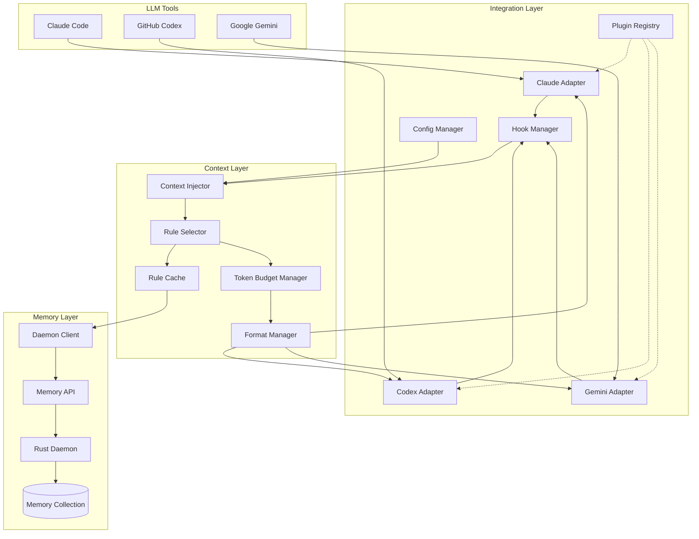
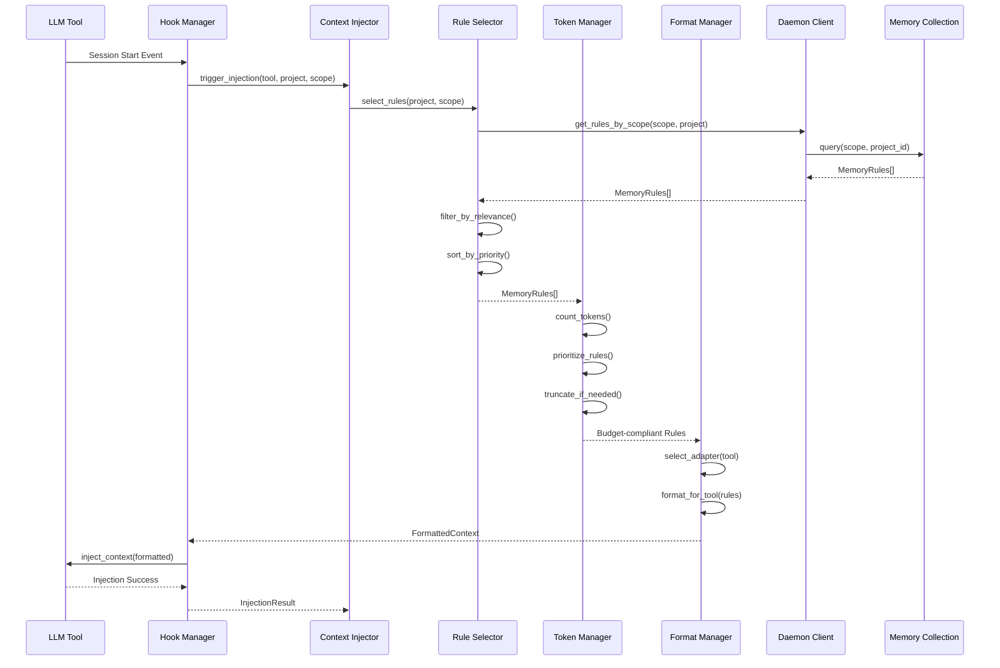
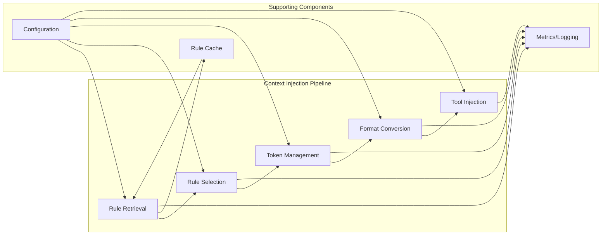
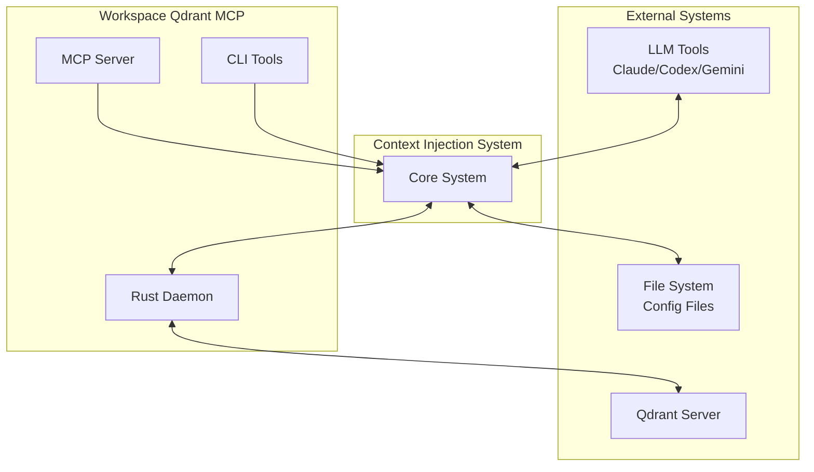
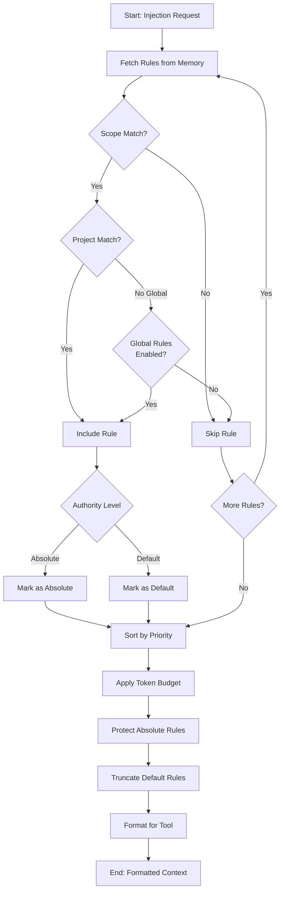
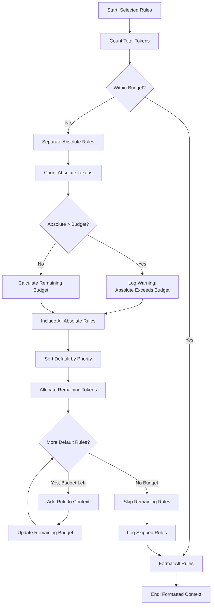
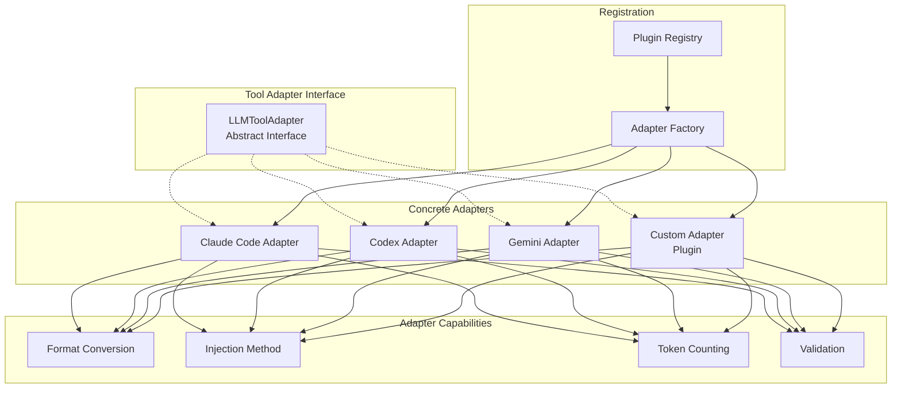
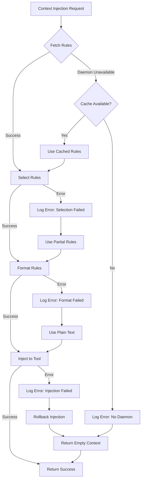
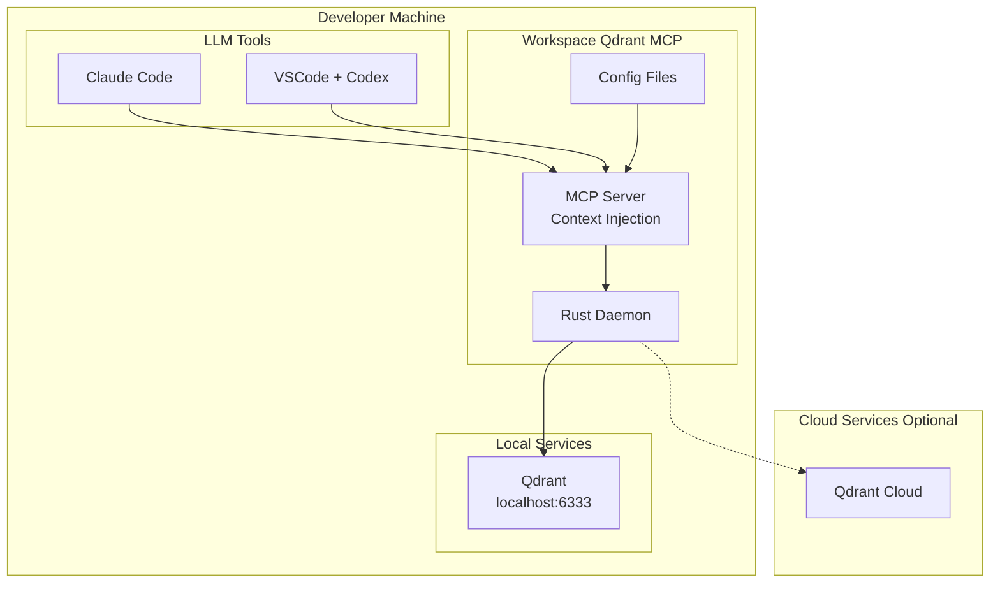
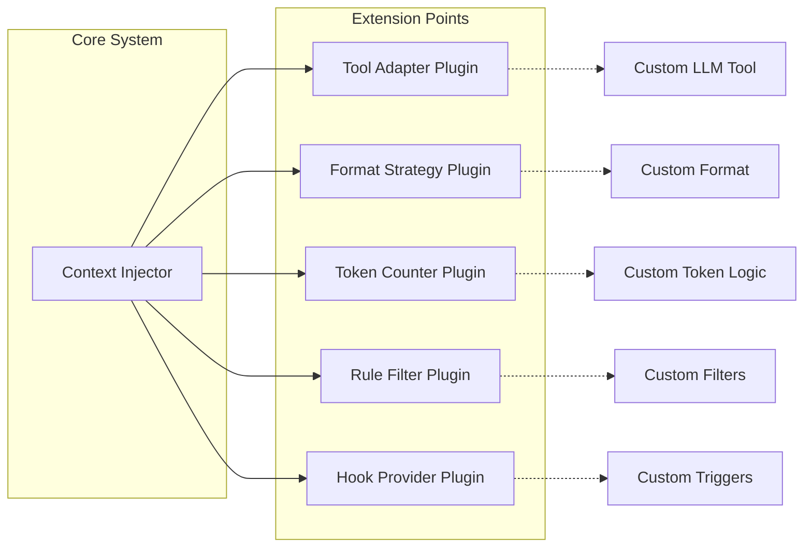

# LLM Context Injection System - Architecture Diagrams

**Version:** 0.2.1dev1
**Date:** 2025-10-04

## Component Diagram



## Data Flow Diagram - Rule Injection



## Component Interaction Diagram



## System Context Diagram



## Rule Selection Flow



## Token Budget Management Flow



## Multi-Tool Support Architecture



## Configuration Flow

```mermaid
flowchart LR
    subgraph "Configuration Sources"
        Default[Default Config<br/>assets/default_config.yaml]
        User[User Config<br/>config/context_injection.yaml]
        Env[Environment Variables]
    end

    subgraph "Configuration Manager"
        Loader[Config Loader]
        Validator[Schema Validator]
        Merger[Config Merger]
    end

    subgraph "Runtime"
        Cache[Config Cache]
        Runtime[Runtime Config]
    end

    Default --> Loader
    User --> Loader
    Env --> Loader
    Loader --> Validator
    Validator --> Merger
    Merger --> Cache
    Cache --> Runtime
```

## Error Handling Flow



## Deployment Architecture



## Extension Points



## References

- **llm-context-injection.md**: Detailed architecture documentation
- **FIRST-PRINCIPLES.md**: Core architectural principles
- **PRDv3.txt**: System specification
