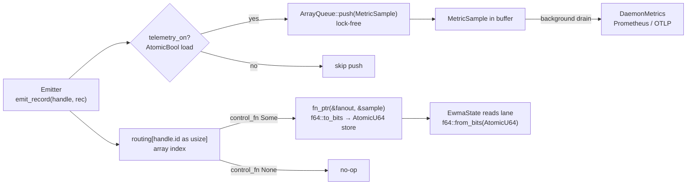

# Metrics Switchboard — Subsystem Architecture

<!--
  File: docs/architecture/metrics-switchboard.md
  Location: docs/architecture/ (subsystem doc — not the root ARCHITECTURE.md)
  Context: memexd daemon (workspace-qdrant-mcp). Defines the routing layer that
  sits between metric emitters and their two sink classes (telemetry export vs.
  in-process control logic). Companion to:
    - src/rust/daemon/core/src/monitoring/metrics_core.rs (METRICS global)
    - src/rust/daemon/core/src/idle/ (MaintenanceScheduler — flush hook)
    - #133 queue-health EWMA work (branch feat/queue-health-133, absent here)
  See ARCHITECTURE.md §Monitoring for the system-level picture.
  Architecture round: 3 (converged). Date: 2026-06-14.
  All cited file:line references verified against branch feat/metrics-switchboard.
-->

## Post-Merge Reconciliation (2026-06-14)

This document was authored when #133 queue-health lived on a separate branch
(`feat/queue-health-133`). That branch is now **merged into this branch**, so:

- **`EwmaState`, `DualEwma`, `EwmaLane`, `queue_health/`, and `config/queue_health.rs`
  are present in-tree** — no longer "absent by design." References below to those
  types being on a separate branch are historical; they are now local.
- **`control_baseline` is schema v46, not v45.** #133 already consumed **v45** for
  the `unified_queue.size_bytes` column. The current max is v45; the switchboard's
  table is the next additive migration, **v46**. (§4a reflects this; some prose
  still narrates the original v45 intent — the binding number is v46.)
- **Scope is full re-route (no carve-outs)** per the locked §1.1: the switchboard
  re-routes #133's existing direct-feed lanes (ms/KB, throughput, DLQ) in addition
  to the embedder lane, and its generic `control_baseline` (v46) **supersedes #133
  task 17's bespoke `queue_health_baseline`** and tasks 18–20.
- The §10/§11 "`feat/queue-health-133` can rebase on top" framing is obsolete — the
  code is merged; the switchboard is built directly on it.

### Embedder telemetry already existed — dual-id reconciliation (2026-06-15)

The §1 premise that `embed_ms` "is routed to no consumer … no Prometheus histogram
for it" was **inaccurate**. `EmbeddingGenerator::generate_embeddings_batch`
(`generator.rs`) already called `DaemonMetrics::record_embedding(model, batch_size,
elapsed)`, exporting `wqm_memexd_embedding_duration_seconds{model}` +
`wqm_memexd_embedding_batch_size{model}` for **every** embedding batch (ingestion,
keyword-extraction, tagging). The switchboard's genuinely-new value is the
**control feed** (the EWMA lane), not telemetry. Per Chris's ruling the hub still
**owns all telemetry** — but it must **route** that existing series, not duplicate
it. Two facts force a two-id split (the original single `EmbedderLatency` design
conflated them):

| | `EmbedderLatency` (existing) | `EmbedderBatch` (new, id=4) |
|---|---|---|
| Purpose | **Control** feed (EWMA fast lane) | **Telemetry** only (no control fn) |
| Site | ingestion stage-3 (`chunk_embed`) | `generator.rs` (every batch call) |
| Scope | ingestion only | all callers |
| Measure | whole-stage `embed_ms` + `source_bytes` | batch `elapsed` + `batch_size` |
| Drain → | no Prometheus series (no-op; control only) | `record_embedding(model, batch_size, elapsed)` — byte-identical to the prior direct call |

The direct `record_embedding` call at `generator.rs` is **removed**; the drain
re-emits the identical observation, so the Prometheus series are unchanged — only
the path (emitter → switchboard ring → drain → `DaemonMetrics`) changed. The model
label is interned to `&'static` (`switchboard/intern.rs`) so the `Copy` sample
carries it losslessly. Draining `EmbedderLatency` to `record_embedding` would
**double-count** (every ingestion batch also flows through `EmbedderBatch`), so its
drain arm is a deliberate no-op.

> **Why metrics_label() is NOT used as the telemetry label.** `record_embedding`
> labels by the caller's requested `model_name` arg ("default", "all-MiniLM-L6-v2",
> provider label). Preserving that exactly (FP2 — no regression of verified
> behaviour) is why the label is interned rather than replaced with the provider's
> bounded `metrics_label()`.

---

## 0. Stale-Reference Notice (Brief §4)

The brief's §4 cites `config/queue_health.rs` as a config anchor. **No file exists
at that config path** (confirmed: no match for
`src/rust/daemon/core/src/config/queue_health*`). A separate `queue_health.rs`
*does* exist at the crate root (`src/rust/daemon/core/src/queue_health.rs`,
exported `pub mod queue_health` at `lib.rs:51`, holding `QueueProcessorHealth`) —
but it is not the config anchor the brief intended, and the #133 `queue_health/`
EWMA module (`state.rs`, `EwmaState`) is absent on this branch by design. The
config module here exposes `config/observability/` with submodules `telemetry.rs`,
`logging.rs`, `monitoring.rs`. The switchboard off-switch config therefore lives in
`config/observability/telemetry.rs` alongside the existing `MetricsConfig`
(`telemetry.rs:64`). See §7c for the exact additive patch.

---

## 1. Overview

The metrics switchboard is a single global routing hub between every metric
emitter in the daemon and two distinct sink classes: **telemetry** (the existing
Prometheus/OTLP export path) and **control** (in-process consumers that react to
values — the EWMA health-verdict lanes from #133).

**Why this exists.** EWMA lanes are a *control* signal, not telemetry. Before the
switchboard the only path for a measured value was `METRICS.<field>`, which feeds
only Prometheus. The queue-health design (#133) needs a live feed of `embed_ms`
values from deep inside `EmbeddingGenerator`. That value is measured today and
written to the structured log, but is **routed to no consumer** — there is no
EWMA feed and no Prometheus histogram for it:

- `embedding/generator.rs:117` — `embed_ms` in `generate_embedding()` (single)
- `embedding/generator.rs:210` — `embed_ms` in `generate_embeddings_batch()`
- `embedding/provider/fastembed.rs:173` — per-chunk `embed_ms` inside `embed()`
- `ingestion.rs:218` — stage-3 batch `embed_ms` computed, logged at
  `ingestion.rs:226` and again at the caller (`ingestion.rs:106`), then returned
  as the second tuple element at `ingestion.rs:230` and **consumed only by that
  log statement** — never fed to EWMA or telemetry.

> **Accuracy note:** an earlier draft called `embed_ms`
> "unused by the caller." It is in fact destructured at `ingestion.rs:87` and
> logged at `ingestion.rs:106`. The motivating gap is precise: the value reaches
> a `tracing` log line but **no programmatic consumer** (no EWMA lane, no
> Prometheus series). The switchboard closes that gap.

Adding a side-channel from each measurement site to the EWMA lanes would scatter
routing decisions across the codebase and create a second hidden global. The
switchboard solves this by making **one unified routing decision at daemon init**
and requiring emitters to be routing-blind.

**Two sink classes (locked, brief §1.2):**

| Class | Behavior | Off-switch scope |
|---|---|---|
| Telemetry | Emit-only → Prometheus/OTLP downstream | `telemetry_enabled` flag suppresses **export only**: no buffer fill, no series advance |
| Control | Always-on, in-process reaction (EWMA lanes today) | NEVER suppressed by any global flag; blindness here = health verdict goes dark |

**Scope on this branch.** The queue-health EWMA types (`EwmaState`, `EwmaLane`,
`DualEwma`, `config/queue_health.rs`) live on `feat/queue-health-133` and are
absent here. This document designs the **interface** the switchboard exposes to
those types when the branches merge — it does not redesign EWMA math or the
health verdict.

---

## 2. Component Map

```mermaid
graph TD
    subgraph Emitters
        GEN["EmbeddingGenerator\ngenerator.rs"]
        ING["IngestionEngine\ningestion.rs"]
        QP["UnifiedQueueProcessor\n(queue timing)"]
    end

    subgraph Switchboard["MetricsSwitchboard (global OnceCell SWITCHBOARD)"]
        direction TB
        REG["Id Registry\nMetricId enum"]
        ROUTE["Routing Table\nBox<[RoutingEntry]>"]
        FLAG["telemetry_on\nAtomicBool"]
        TBUF["Telemetry Buffer\nArrayQueue<MetricSample>"]
        FAN["ControlFanout\nArc<AtomicU64> per lane"]
    end

    subgraph Sinks
        DRAIN["Telemetry Drainer\nbackground task"]
        PROM["Prometheus / OTLP\nexisting DaemonMetrics"]
        EWMA["EwmaState\nfeat/queue-health-133"]
        PERSIST["ControlBaselinePersistTask\nMaintenanceTask"]
        DB["state.db\ncontrol_baseline (v46)"]
    end

    GEN -->|register at init| REG
    ING -->|emit_record handle, rec| Switchboard
    QP  -->|emit handle, v| Switchboard

    REG --> ROUTE
    FLAG --> TBUF
    ROUTE --> TBUF
    ROUTE --> FAN

    TBUF -->|drain| DRAIN
    DRAIN --> PROM

    FAN -->|Arc<AtomicU64> read| EWMA
    FAN -->|slow-lane values| PERSIST
    PERSIST --> DB
```



### Component responsibilities and hard boundaries

**Id Registry (`MetricId` enum, `switchboard/registry.rs`).**
Single source of truth for every metric kind: zone path, base name, unit, record
shape. Each variant is a compile-time constant with `#[repr(usize)]`; its
discriminant (`id as usize`) is the array index into the routing table — no hash,
no map. Adding a metric = adding an enum variant (and the matching `MetricSample`
variant + `RoutingEntry`). Must NOT: contain routing logic, carry runtime state,
or be mutated after init.

**`MetricSample` (single event enum, `switchboard/sample.rs`).**
The **one** event type that flows through the switchboard — both into the
telemetry buffer and into the control fn-pointer. One variant per `MetricId`,
each carrying that id's typed record (raw values, no pre-normalization, brief
§1.5). There is deliberately **no separate `ControlEvent`/`TelemetryEvent`
split** — a two-enum design is a needless confusion source. Both sinks consume the
same `MetricSample`. Must NOT: heap-allocate (it is `Copy`), or carry routing
decisions.

**Handle (`MetricHandle`, `switchboard/handle.rs`).**
A `Copy` struct `{ id: MetricId, model: &'static str }` returned by
`MetricsSwitchboard::handle(id, model)` at emitter init (§5e — handle creation is a
pure operation, no switchboard mutation). `id` is the routing key; `model` is the
stable label baked in at construction (brief §1.6 — stable labels live in the
handle, never re-resolved per emit). The emitter stores the handle as an
**instance field** and passes it to every `emit*` call. One emitter instance → one
`handle()` call → one handle, stored per-instance (not a global const). Must NOT:
hold a reference to the switchboard, carry per-call mutable state, or be created on
the hot path.

**Routing Table (`Box<[RoutingEntry]>`, built once at init, `switchboard/routing.rs`).**
One `RoutingEntry` per `MetricId`, indexed by discriminant. Each entry holds an
optional control function pointer (`Option<fn(&ControlFanout, &MetricSample)>`).
Telemetry is the automatic default for every id and needs no entry — the hot path
always attempts the buffer push when `telemetry_on` is set. Read-only after init.
Must NOT: be modified after init, hold locks, or contain `dyn` trait objects.

**Telemetry Buffer (`ArrayQueue<MetricSample>`, `switchboard/telemetry_buf.rs`).**
A fixed-capacity, lock-free **MPMC** ring (it is
multi-producer/multi-consumer, not SPMC). Emitters push without blocking; a single
background drain task pops and converts to Prometheus observations. On full (drain
slow or telemetry off and the consumer idle): `push` returns `Err`, the sample is
dropped, and a drop counter increments (§7d). Telemetry can shed; the control path
is independent. Must NOT: be read on the hot path (drain is background), block
emitters, or carry control state.

**Control Fanout (`ControlFanout`, `switchboard/control_fanout.rs`).**
Concrete struct holding one `Arc<AtomicU64>` per control metric per lane
(fast/slow for dual-EWMA). The `Arc` is cloned at init and shared with the
`EwmaState` that owns the read side on `feat/queue-health-133`. Emit stores an
`f64` via `f64::to_bits()` (§9). The read side (`read_fast`/`read_slow`) returns
`Option<f64>` — explicit arms for control ids, `None` for non-control ids (round-2
fix read-F4: no silent `0.0` fallthrough). Must NOT: hold locks, block, allocate
per-call, or contain EWMA math.

**Control-Persistence Component (`ControlBaselinePersistTask`, `switchboard/persist_task.rs`).**
A `MaintenanceTask` registered with the existing `MaintenanceScheduler` in
`unified_queue_processor/processing_loop/loop_state.rs` (the real registration
site, lines 63–75; `queue_init.rs` has no scheduler). On each qualifying idle tick
it reads slow-lane values from
`ControlFanout`, upserts rows into `control_baseline` (v46) with bound parameters,
and prunes dead rows. Must NOT: run on the hot path, write fast-lane atomics, or
contain EWMA math. The daemon (scheduler) drives it; it owns the SQL; control
sinks never see a pool.

---

## 3. Data Flows

### 3a. Emit → Route → Sinks



### 3b. Embed-event end-to-end sequence

> **Superseded — see "Embedder telemetry already existed" above (2026-06-15).**
> Two corrections to the sequence below: (1) `IngestionEngine::stage3_embed_chunks`
> is dead code (never constructed); the **control** emit lives at the live
> ingestion path `strategies/processing/file/chunk_embed/mod.rs`. (2) The drain
> does **not** call `record_embedding` for `EmbedderLatency` (that would
> double-count). The `record_embedding` series is routed via the separate
> **`EmbedderBatch`** id emitted at `generator.rs` (all callers, real `batch_size`,
> full `Duration`), `record_embedding(model, batch_size, elapsed)`.

The control measurement that reaches the switchboard is the **stage-3 batch
`embed_ms`** at the live `chunk_embed` path. `source_bytes` is derived in the same
function from the chunk texts in scope.

```mermaid
sequenceDiagram
    participant ING as IngestionEngine (ingestion.rs)
    participant GEN as EmbeddingGenerator (generator.rs)
    participant SW as MetricsSwitchboard
    participant BUF as ArrayQueue (telemetry)
    participant EWMA as embedder_latency fast lane (AtomicU64)
    participant DRAIN as TelemetryDrainer
    participant PROM as DaemonMetrics / Prometheus

    ING->>ING: embed_start = Instant::now()
    ING->>GEN: generate_embeddings_batch(chunk_texts) [ingestion.rs:188]
    GEN-->>ING: Vec<EmbeddingResult>
    ING->>ING: embed_ms = embed_start.elapsed().as_millis() [ingestion.rs:218]
    ING->>ING: source_bytes = chunk_texts.iter().map(|s| s.len()).sum() [from :184]
    ING->>SW: emit_record(self.embed_latency_handle,\n EmbedLatencyRec { embed_ms, source_bytes })

    SW->>SW: telemetry_on.load(Relaxed) → true
    SW->>BUF: ArrayQueue::push(MetricSample::EmbedderLatency{rec, model})
    Note over SW,BUF: lock-free MPMC; drop+count on full

    SW->>SW: routing[EmbedderLatency as usize].control_fn → Some(fn)
    SW->>EWMA: fn_ptr(&fanout, &sample)\n→ fast.store((embed_ms as f64).to_bits(), Release)
    Note over SW,EWMA: 1 atomic store, no lock, no alloc

    Note over ING,SW: Hot path complete (~10–20 ns, §9).

    DRAIN->>BUF: ArrayQueue::pop() [background task, off hot path]
    DRAIN->>PROM: METRICS.record_embedding(model, 1, Duration::from_millis(embed_ms))
    Note over DRAIN,PROM: existing DaemonMetrics path unchanged

    Note over EWMA: EwmaState (feat/queue-health-133) reads the\nfast-lane Arc<AtomicU64>, runs EWMA math → verdict
```

### 3c. Off-switch path

When `telemetry_on` is `false` (from `observability.switchboard.telemetry_enabled
= false`):

- `ArrayQueue::push` is NOT called — skipped after the atomic load.
- The control fn-pointer path is UNCHANGED — always executes.
- The drain loop finds an empty queue — no work, no observations.
- Prometheus/OTLP receive no new observations; existing series do not advance.

No reset/zero is emitted — Prometheus staleness semantics apply, matching the
existing `DaemonMetrics::set_enabled(false)` behavior (`metrics_helpers.rs:266`).

### 3d. Persistence flush path

On each `MaintenanceScheduler` tick during a qualifying idle state
(`FullIdle` / `QdrantDownIdle` — SQLite-only operation), the scheduler calls the
task's `run_batch(ctx, cancel)` (`MaintenanceContext` carries `pool` at
`idle/task.rs:28` — the same state.db pool as `DatabaseHandles::queue_pool` used
for reload below):

1. For each registered slow-lane metric: load the `AtomicU64`, `f64::from_bits`.
2. Upsert into `control_baseline` via a parameter-bound query (§5g, §7a).
3. Prune rows whose `metric_id` has no registered handle (bound-parameter
   `NOT IN`, §4c).
4. Return `MaintenanceResult::Done` (few rows; one batch per cycle).

On daemon restart:

1. `MetricsSwitchboard::reload_baselines(queue_pool)` reads all rows and stores
   values back into the slow-lane `AtomicU64` cells.
2. Called from `memexd/src/main.rs` after the schema migration completes
   (`database.rs` `SchemaManager`) **and after the switchboard is sealed**
   (§5e, §7c), **before** the processing loop starts. The pool is the
   `DatabaseHandles::queue_pool` (`database.rs:37`). It must be driven from
   `main.rs`, not from inside `database::initialize_all()`, where neither the pool
   handle nor the sealed switchboard is available at the right moment.

---

## 4. Data Model and Storage

### 4a. `control_baseline` table (schema version v46)

Current max schema version is **v45** (`schema_version/mod.rs:179` —
`pub const CURRENT_SCHEMA_VERSION: i32 = 45`; latest migration file `v45.rs`, the
#133 `size_bytes` column). `control_baseline` is the next additive migration: **v46**.

```sql
-- Migration v46: control_baseline — switchboard slow-lane persistence.
-- Additive CREATE TABLE IF NOT EXISTS — idempotent, no ALTER, no FK changes.
-- Replaces the bespoke queue_health_baseline planned in #133 task 17, which is
-- now never created.

CREATE TABLE IF NOT EXISTS control_baseline (
    metric_id    TEXT    NOT NULL,  -- MetricId variant name, e.g. "embedder_latency"
    field        TEXT    NOT NULL,  -- field within the record, e.g. "embed_ms"
    labels       TEXT    NOT NULL,  -- canonical JSON (BTreeMap, keys sorted), e.g. '{"model":"fastembed"}'; empty: '{}'
    lane         TEXT    NOT NULL,  -- 'slow' only (fast lane is transient, never persisted)
    value        REAL    NOT NULL,  -- f64 EWMA accumulator or last scalar
    sample_count INTEGER NOT NULL DEFAULT 0,
    updated_at   TEXT    NOT NULL DEFAULT (strftime('%Y-%m-%dT%H:%M:%fZ', 'now')),
    PRIMARY KEY (metric_id, field, labels, lane)
);

CREATE INDEX IF NOT EXISTS idx_control_baseline_updated
    ON control_baseline (updated_at);
```

**Migration registration (the prior draft omitted these).**
Adding v46 requires, in the same change-set:
- `schema_version/v46.rs` — `V46Migration` implementing the migration trait.
- `schema_version/mod.rs:179` — `CURRENT_SCHEMA_VERSION = 46`.
- `schema_version/mod.rs` `build_registry()` — add `registry.register(Box::new(v46::V46Migration))`.
- Update the hard sentinel `assert_eq!(CURRENT_SCHEMA_VERSION, 45)` to `46` at
  `tests/migration_crash_recovery_tests.rs:291` (line 291 hard-pins the literal —
  now `45` post-#133-merge — so the bump to `46` is a required manual edit).
- `schema_version/tests/constants.rs::test_build_registry_has_all_migrations`
  passes once v46 is in the registry (it iterates `1..=CURRENT_SCHEMA_VERSION`).

**Invariants:**
- `labels` is a canonicalized JSON object produced from a **`BTreeMap<&str,&str>`**
  (`serde_json` `Map` preserves insertion order, so
  `BTreeMap` is required for stable alphabetical key order across daemon
  versions; otherwise PK lookups orphan after a code change reorders labels).
- Only `lane = 'slow'` rows are persisted; the fast lane is rebuilt live.
- **Telemetry is never written here** — this table is control-lane only.
- **The daemon owns all SQL.** `ControlBaselinePersistTask` is the only writer;
  `EwmaState` holds only `Arc<AtomicU64>`, never a pool.

### 4b. Labels cardinality

| Metric | Labels | Max distinct rows |
|---|---|---|
| `embedder_latency` | `{"model":"<metrics_label>"}` | one per provider `metrics_label()` value (bounded `&'static str`: `"fastembed"`, `"openai-…"`, …) |

Total rows: O(10). No separate labels table needed.

### 4c. Prune lifecycle

After upserting live values, the task removes rows for metrics no longer
registered, using **bound parameters** — never `format!()` interpolation of label
text. The registered-id set is the fixed, compile-time list of `MetricId` variant
names (today 4), so the placeholder string is static and only the values are
bound. This uses the crate's existing `sqlx::query(...).bind(...)` precedent (no
`QueryBuilder` API, which has no call site in `daemon-core`):

```rust
// registered_ids: &[&'static str] — MetricId variant names, compile-time set.
let placeholders = vec!["?"; registered_ids.len()].join(", ");
let sql = format!("DELETE FROM control_baseline WHERE metric_id NOT IN ({placeholders})");
// NOTE: only the count of `?` placeholders is interpolated (from a fixed-size
// enum), never any value. Each id is bound, keeping the statement injection-safe.
let mut q = sqlx::query(&sql);
for id in registered_ids { q = q.bind(*id); }
q.execute(ctx.pool).await?;
```

Bound parameters are used even though the ids are trusted, so the persist layer
stays injection-proof if a future label-derived value ever enters the set.

---

## 5. Interfaces and Contracts

### 5a. Id Registry — `MetricId` enum

**Decision: enum, discriminant as array index.** A `const` table is equivalent but
needs a lookup function; an enum whose `as usize` IS the index gives the zero-hash
key natively. Adding a metric is a compile-everywhere change (exhaustive `match`
on `MetricSample`). No codegen.

```rust
// switchboard/registry.rs
#[repr(usize)]
#[derive(Debug, Clone, Copy, PartialEq, Eq)]
pub enum MetricId {
    EmbedderLatency = 0,  // EmbedLatencyRec { embed_ms, source_bytes } — control feed (#133 task 11)
    QueueItemMs     = 1,  // scalar u64  — tasks 8–10, migrated later
    QueueKb         = 2,  // scalar u64  — tasks 8–10, migrated later
    QueueThroughput = 3,  // scalar f64  — tasks 8–10, migrated later
    EmbedderBatch   = 4,  // EmbedderBatchRec { batch_size, elapsed } — telemetry-only (2026-06-15 reconciliation)
}
pub const METRIC_COUNT: usize = 5;

pub struct MetricDescriptor { pub zone: &'static str, pub name: &'static str, pub unit: &'static str }
pub const DESCRIPTORS: [MetricDescriptor; METRIC_COUNT] = [
    MetricDescriptor { zone: "embedding", name: "latency",    unit: "ms"      },
    MetricDescriptor { zone: "queue",     name: "item_ms",    unit: "ms"      },
    MetricDescriptor { zone: "queue",     name: "memory_kb",  unit: "kb"      },
    MetricDescriptor { zone: "queue",     name: "throughput", unit: "items_s" },
    MetricDescriptor { zone: "embedding", name: "batch",      unit: "ms"      },
];
```

### 5b. Record types + the single `MetricSample` enum

```rust
// switchboard/sample.rs

/// Co-measured fields for one embedding call. Raw values (brief §1.5).
/// embed_ms is u128 (Instant::elapsed().as_millis()); converted to f64 at the
/// control store (§9). source_bytes from chunk text lengths.
#[derive(Debug, Clone, Copy)]
pub struct EmbedLatencyRec { pub embed_ms: u128, pub source_bytes: usize }

/// THE event type through the switchboard — telemetry buffer AND control fn.
/// One variant per MetricId. `model` is the stable label carried for telemetry
/// dimensionality (never affects routing, brief §1.6). Copy — no per-emit alloc.
#[derive(Debug, Clone, Copy)]
pub enum MetricSample {
    EmbedderLatency { rec: EmbedLatencyRec, model: &'static str },
    QueueItemMs(u64),
    QueueKb(u64),
    QueueThroughput(f64),
}

impl MetricSample {
    /// The routing key. Matches the handle's id (debug-asserted at emit).
    #[inline]
    pub fn id(&self) -> MetricId {
        match self {
            MetricSample::EmbedderLatency { .. } => MetricId::EmbedderLatency,
            MetricSample::QueueItemMs(_)         => MetricId::QueueItemMs,
            MetricSample::QueueKb(_)             => MetricId::QueueKb,
            MetricSample::QueueThroughput(_)     => MetricId::QueueThroughput,
        }
    }
}
```

### 5c. Handle

```rust
// switchboard/handle.rs
/// Resolved once at emitter init via handle(). Stored as an instance field.
/// Never created on the hot path. `id` is the routing key; `model` is the
/// stable label baked in at registration.
#[derive(Debug, Clone, Copy)]
pub struct MetricHandle { pub(crate) id: MetricId, pub(crate) model: &'static str }
```

> **Note:** this is the **single** handle definition. All call sites
> and the §9 proof use `handle.id`; the earlier struct-vs-tuple inconsistency is
> removed.

### 5d. Emit methods (three shapes, brief §1.7)

```rust
// switchboard/mod.rs — impl MetricsSwitchboard
/// Scalar — hottest path. Builds the scalar MetricSample variant for handle.id.
#[inline] pub fn emit(&self, h: MetricHandle, value: f64) { … }

/// N samples of one field. Resolve once, fold in one pass; one buffer push
/// (a summary sample) + one control store (the folded value). See Q2 (§13).
#[inline] pub fn emit_batch(&self, h: MetricHandle, values: &[f64]) { … }

/// Co-measured multi-field record. Builds MetricSample::EmbedderLatency.
#[inline] pub fn emit_record(&self, h: MetricHandle, rec: EmbedLatencyRec) { … }
```

**Extensibility seam.** A second record-bearing metric adds:
(1) a `MetricId` variant, (2) a `MetricSample` variant carrying its record, (3) a
matching `emit_record_<x>` method (Rust has no overloading; each record shape gets
its own method, brief §1.7). The exhaustive `match` in `MetricSample::id()` and in
each control fn forces every site to be updated — divergence is a compile error.

### 5e. Initialization: wire + seal; handle creation is pure

Two operations with different mutation profiles, deliberately separated:

- **`wire_control`** mutates the routing table → **builder-only**, before `seal()`.
- **Handle creation** mutates nothing — a `MetricHandle` is just `{ id, model }`
  computed from its arguments. So `handle(id, model)` is a **pure method on the
  sealed switchboard**, callable any time an emitter is constructed (before or
  after `seal()`). This resolves the prior draft's contradiction (it claimed
  handles were produced by the consumed builder yet emitters were built after
  `seal()` — there was no API to get a handle post-seal).

```rust
// switchboard/mod.rs
pub static SWITCHBOARD: OnceCell<MetricsSwitchboard> = OnceCell::new();

/// Built once at daemon init. Owns routing-table mutation; consumed by seal().
pub struct SwitchboardBuilder { /* routing entries, fanout, telemetry flag */ }
impl SwitchboardBuilder {
    pub fn wire_control(&mut self, id: MetricId, f: fn(&ControlFanout, &MetricSample)) { … }
    pub fn seal(self) -> MetricsSwitchboard { … }   // freezes the routing table
}

impl MetricsSwitchboard {
    /// Pure — no mutation. Emitters call this at construction to obtain a handle.
    #[inline]
    pub fn handle(&self, id: MetricId, model: &'static str) -> MetricHandle {
        MetricHandle { id, model }
    }
}

#[inline]
fn switchboard() -> Option<&'static MetricsSwitchboard> { SWITCHBOARD.get() }
```

**Why `OnceCell`, not `Lazy`.** `Lazy` would let the routing table be
constructed lazily on first access with no enforced "fully wired before first
emit" point — reintroducing exactly the silent-init failure this pattern removes.
The global MUST be `OnceCell` set explicitly once at init. Do not "simplify" it to
`Lazy<MetricsSwitchboard>`.

**Ordering guarantee (not a runtime race).** `SWITCHBOARD.set(builder.seal())`
runs during daemon init in `main.rs`, **before any emitter thread, ingestion
worker, or queue processor starts**. Therefore no real measurement emit precedes
`set()`. The `SWITCHBOARD.get()` → `None` branch is a defensive guard for code
that might run during very early init, where it is a logged no-op — **not** a
data-loss window during steady-state operation. After `set()`, the routing table
is an immutable `Box<[_]>` for the daemon's lifetime; emitters constructed
afterward obtain their handle via `SWITCHBOARD.get().expect(..).handle(id, model)`
and store it as an instance field.

### 5f. Control read-side hook

```rust
// switchboard/control_fanout.rs
pub struct ControlFanout {
    pub embedder_latency_fast: Arc<AtomicU64>,  // live signal (transient)
    pub embedder_latency_slow: Arc<AtomicU64>,  // EWMA accumulator (persisted)
    // one pair per control metric
}
impl ControlFanout {
    /// Live fast-lane value, or None for a non-control id (no silent 0.0).
    pub fn read_fast(&self, id: MetricId) -> Option<f64> {
        match id {
            MetricId::EmbedderLatency => Some(f64::from_bits(self.embedder_latency_fast.load(Acquire))),
            _ => None,
        }
    }
    pub fn read_slow(&self, id: MetricId) -> Option<f64> { … }   // same shape
}
```

`EwmaState` (on `feat/queue-health-133`) holds an `Arc<AtomicU64>` cloned from the
fanout at init and calls `load(Acquire)` directly each verdict cycle — no call
through the switchboard, no lock, no map lookup.

> **Honest limitation:** adding a control metric requires
> manually adding a fanout field **and** a `read_*` arm. This is NOT
> compile-enforced (a missing field just yields `None`). It is a deliberate,
> documented init-time checklist item, not a claimed compile guarantee. The
> cardinality is tiny (one field pair per control metric), so the manual step is
> acceptable per the simplicity guardrail.

### 5g. Persistence task — real trait shape

```rust
// switchboard/persist_task.rs
#[async_trait]
impl MaintenanceTask for ControlBaselinePersistTask {
    fn name(&self) -> &str { "control_baseline_persist" }
    fn required_idle_states(&self) -> &[IdleState] { &[IdleState::FullIdle, IdleState::QdrantDownIdle] }
    fn idle_delay_secs(&self) -> u64 { 60 }
    fn cooldown_secs(&self) -> u64 { 300 }
    async fn run_batch(&mut self, ctx: &MaintenanceContext<'_>, cancel: &CancellationToken)
        -> MaintenanceResult { /* upsert via ctx.pool, prune, Done */ }
}
```

> **Note:** matches the real trait at `idle/task.rs:48` exactly —
> `#[async_trait]`, `run_batch(&mut self, ctx: &MaintenanceContext<'_>, cancel:
> &CancellationToken) -> MaintenanceResult`, plus `name` /
> `required_idle_states` / `idle_delay_secs` / `cooldown_secs`. Registered at
> `loop_state.rs:65` style:
> `maintenance_scheduler.register(Box::new(ControlBaselinePersistTask::new()));`

### 5h. Labels — stable vs. per-emit

- **Stable labels** (in `MetricHandle`): do not vary per call on a given emitter
  (e.g. `model = "fastembed"` for a `FastEmbedProvider`-backed generator). Captured
  at `handle()` and copied into each `MetricSample` without per-call alloc.
- **Per-emit labels**: would ride in the record fields if a future emitter varied
  them per call. Today none do.
- **Routing** uses `MetricId` only; neither label type affects routing (brief
  §1.6). Labels are telemetry dimensions attached in the drain step.

---

## 6. Technology Decisions

### 6a. Telemetry buffer: `crossbeam_queue::ArrayQueue`

**Choice:** `crossbeam_queue::ArrayQueue<MetricSample>` — a fixed-capacity,
lock-free **MPMC** ring.

**Alternatives:** `std::sync::mpsc::SyncSender` (needs producer-side `Mutex` in MP
context — violates §1.8); `tokio::sync::mpsc` (async, but emit is sync — risks a
`block_on`); hand-rolled `UnsafeCell` ring (reimplements `ArrayQueue`, no gain).

**Dependency status (corrected from a false claim).**
`crossbeam-queue` is **not** currently a dependency of `daemon/core`
(`daemon/core/Cargo.toml` has zero crossbeam references). It IS already present in
the workspace lockfile (`src/rust/Cargo.lock:1237`), pulled transitively by
`sqlx`. Therefore adding `crossbeam-queue = "0.3"` to `daemon/core/Cargo.toml`:
- adds **no new third-party code** to the build and **no new `Cargo.lock` entry**
  (same crate+version already compiled for the workspace), but
- **is a new direct dependency edge** for the `daemon/core` crate — stated
  honestly, not as "zero-cost."

Justified against the §1.8 gap: a lock-free bounded MPMC ring with non-blocking
`push`/`pop`; std offers no equivalent.

**Backpressure:** on full, `push` returns `Err`; the sample is dropped and
`switchboard_buffer_full_total` increments (§7d). Telemetry sheds; control is
independent.

**Capacity:** 4096 samples (fixed, compile-time, no heap growth). At ~1 kHz emit
this absorbs ~4 s of burst.

**Reversal cost:** Low — implementation is local to `telemetry_buf.rs`.

### 6b. Handle: small `Copy` struct

`MetricHandle { id: MetricId, model: &'static str }`, resolved once at
registration. Rejected: `Arc<Sink>` per handle (heap alloc + `Arc::deref` per
emit, violates §1.8). Reversal cost trivial.

### 6c. Routing: fn-pointer array, not `dyn ControlSink`

`Box<[RoutingEntry]>` with `Option<fn(&ControlFanout, &MetricSample)>`, indexed by
discriminant. A bare `fn` pointer is a single indirect call — no vtable, no fat
pointer — distinct from `dyn Trait` dispatch (see §9 for why this satisfies §1.8).
Brief §3 prohibits "per-metric trait objects on the hot path"; this honors it.
Reversal cost low.

### 6d. Off-switch: single `AtomicBool`

One `telemetry_on: AtomicBool`, loaded `Relaxed` before each buffer push (mirrors
`DaemonMetrics::is_enabled()` at `metrics_helpers.rs:271`). Control dispatch is
never gated by it. Per-id granularity is unneeded today; if required later, a
`u64` bitmask + bit test is backward-compatible. Reversal cost low.

### 6e. New direct dependency: `crossbeam-queue`

The only new direct dep added to `daemon/core/Cargo.toml`. Already in the
workspace lock via `sqlx` (§6a). No other new deps: `serde_json` is already a
direct dep of `workspace-qdrant-core` (used for label canonicalization, off the
hot path). `once_cell` (for `OnceCell`) is already a direct dep
(`metrics_core.rs:8`).

---

## 7. Cross-Cutting Concerns

### 7a. Error handling

- **Emit**: never returns `Result`. Atomic store + buffer push have no meaningful
  error path; buffer-full is a counted drop (§6a).
- **Init**: `register`/`wire_control` run on the builder before `seal()`; there is
  no after-emit mutation path, so no runtime panic. Emit
  before `SWITCHBOARD.set()` is a logged no-op.
- **Flush task**: follows the `QueueCleanupTask` pattern — `warn!` on SQL error,
  return `Done` so the scheduler continues. In-memory lane values survive; the
  next cycle retries.
- **Reload**: `reload_baselines` failure is logged and treated as "no prior
  baseline" — cold start, same as pre-switchboard behavior.

### 7b. Daemon-owns-state boundary

`ControlBaselinePersistTask` is the ONLY writer to `control_baseline`. `EwmaState`
holds only `Arc<AtomicU64>` — it has no `SqlitePool` and the `MaintenanceContext`
is never handed to a control sink. This extends the existing daemon-owns-state
invariant. The type design closes the boundary: a sink literally cannot reach a
pool.

### 7c. Config placement: off-switch (concrete additive patch)

`config/observability/telemetry.rs` already defines `ObservabilityConfig` with
three fields — `collection_interval`, `metrics`, `telemetry` — plus its `Default`
and `validate()` (verified `telemetry.rs:19–63`). The patch is **additive**
(the prior `// ... existing fields ...` elision risked
clobbering them):

```rust
// add near the other defaults in telemetry.rs:
fn default_switchboard_telemetry_enabled() -> bool { true }

/// Metrics switchboard config. Controls only the telemetry sink; control sinks
/// (EWMA lanes, health verdict) are NEVER affected by this flag.
#[derive(Debug, Clone, Serialize, Deserialize)]
pub struct SwitchboardConfig {
    #[serde(default = "default_switchboard_telemetry_enabled")]
    pub telemetry_enabled: bool,
}
impl Default for SwitchboardConfig {
    fn default() -> Self { Self { telemetry_enabled: default_switchboard_telemetry_enabled() } }
}

// in the EXISTING ObservabilityConfig struct, add one field (keep the other three):
//     #[serde(default)]
//     pub switchboard: SwitchboardConfig,
// and in its EXISTING Default impl add:  switchboard: SwitchboardConfig::default(),
```

TOML key: `[observability.switchboard] telemetry_enabled = false`. Re-export
`SwitchboardConfig` from `config/observability/mod.rs` (round-2 NIT). At daemon
init, `main.rs` calls `MetricsSwitchboard::set_telemetry_enabled(cfg…)` right after
the existing `METRICS.set_enabled(...)` call. This flag is independent of
`observability.metrics.enabled`, which gates the legacy `DaemonMetrics` A2 path.

### 7d. Observability of the switchboard itself

The switchboard reports its own health through the existing `METRICS` global (not
through itself — avoids recursion / circular init):

- `wqm_memexd_switchboard_buffer_full_total` (IntCounter) — incremented on a
  dropped push.
- `wqm_memexd_switchboard_emit_total{metric_id}` (IntCounter, optional) — useful
  for regression tests; minimal overhead.

These are added to `DaemonMetrics` (`metrics_core.rs`) and registered like the
existing counters; they are TELEMETRY about the switchboard, not control.

---

## 8. Module and Codesize Plan

New module `src/rust/daemon/core/src/switchboard/`:

```
switchboard/
  mod.rs            — MetricsSwitchboard, SwitchboardBuilder, SWITCHBOARD OnceCell,
                      emit*(), set_telemetry_enabled(), reload_baselines()   (~220 ln)
  registry.rs       — MetricId, METRIC_COUNT, DESCRIPTORS                     (~60 ln)
  sample.rs         — EmbedLatencyRec, MetricSample, id()                     (~70 ln)
  handle.rs         — MetricHandle                                            (~25 ln)
  routing.rs        — RoutingEntry, fn-ptr type alias, table builder          (~80 ln)
  control_fanout.rs — ControlFanout, read_fast/read_slow                      (~90 ln)
  telemetry_buf.rs  — ArrayQueue wrapper, drain helpers                       (~110 ln)
  persist_task.rs   — ControlBaselinePersistTask (MaintenanceTask impl)       (~150 ln)
  labels.rs         — BTreeMap canonical-JSON label encoding                  (~55 ln)
```

All within the Rust 500-line file / 80-line function limits (coding.md §VIII).

**Existing files modified (same change-set):**
- `config/observability/telemetry.rs` — `SwitchboardConfig` + one field (§7c).
- `config/observability/mod.rs` — re-export `SwitchboardConfig`.
- `monitoring/metrics_core.rs` — two switchboard health counters; `metrics_helpers.rs` — their setters; `monitoring/mod.rs` — `switchboard` re-export.
- `schema_version/v46.rs` (new), `schema_version/mod.rs` (`CURRENT_SCHEMA_VERSION = 46`, add `V46Migration` to `build_registry()`), and the test-sentinel bump (§4a).
- `unified_queue_processor/processing_loop/loop_state.rs:63–75` — register `ControlBaselinePersistTask`.
- `memexd/src/main.rs` — build+seal `SWITCHBOARD` at init; `set_telemetry_enabled`; `reload_baselines(&db_handles.queue_pool)` after migration, before processing loop.
- `embedding/generator.rs` / `ingestion.rs` — register the embedder-latency handle; `emit_record` in `stage3_embed_chunks` (§11 Phase 1).
- `lib.rs` — `pub mod switchboard`.
- `daemon/core/Cargo.toml` — `crossbeam-queue = "0.3"`.

---

## 9. Hot-Path Proof

**Claim (brief §1.8):** per emit ≤ 1 atomic update (control) + 1 lock-free buffer
push (telemetry-if-on). No per-call string hash, map lookup, lock, heap alloc, or
dynamic dispatch.

**Walkthrough for `emit_record(handle, EmbedLatencyRec { embed_ms, source_bytes })`:**

```
0. SWITCHBOARD.get()                              [1 OnceCell load → &'static, ~1 ns]
   One relaxed atomic-pointer load; the emitter may cache the &'static after
   first resolve. Returns Some in steady state (sealed at init, §5e).

1. handle.id, handle.model                       [Copy fields, already in hand]
   Zero cost — resolved at handle() time, stored on the emitter.

2. self.telemetry_on.load(Relaxed)               [1 atomic load, ~1 ns]
   No lock, no alloc.

3. if telemetry_on:
     let s = MetricSample::EmbedderLatency {      [stack value, Copy, no heap]
         rec, model: handle.model };              [≈48 B: u128 + usize + fat &str + tag]
     self.telemetry_buf.push(s)                   [ArrayQueue::push — one ~48 B slot write]
   Uncontended: 1 CAS on the tail index, no lock, no heap alloc.
   Contended (N producer threads): ArrayQueue is MPMC; push retries the CAS on
   collision — bounded by the number of concurrent producers (embedder threads),
   not unbounded spinning. On full: returns Err, dropped + counted. (See note.)

4. self.routing[handle.id as usize]              [array index = base + offset]
   One pointer offset. No hash, no map. O(1) by construction.

5. if let Some(f) = entry.control_fn:
     f(&self.fanout, &s)                          [1 fn-pointer indirect call]
   A bare fn pointer — single indirection, NO vtable, NO fat pointer. Inside:
     let bits = (rec.embed_ms as f64).to_bits();  [u128→f64 cast, then to_bits]
     self.fanout.embedder_latency_fast            [1 AtomicU64 store, Release]
         .store(bits, Release);

TOTAL: 1 OnceCell load + 1 atomic load + 1 ArrayQueue CAS (~48 B slot)
       + 1 array index + 1 fn-ptr call + 1 AtomicU64 store  ≈ 12–22 ns uncontended.
```

**Note.** The store is
`(rec.embed_ms as f64).to_bits()`, NOT `rec.embed_ms as u64`. The read side
(`f64::from_bits`, §5f) must see IEEE-754 bits. Storing a raw integer and reading
it as float bits yields garbage (`50u64` → `f64::from_bits(50)` ≈ `2.47e-322`).
§2, §3b, and this proof now all use `(embed_ms as f64).to_bits()`.

**Cast note (impl-NIT).** `embed_ms` is `u128` (`Instant::elapsed().as_millis()`).
`embed_ms as f64` is lossless for any value below 2^53 ms (≈ 285 000 years), so
the cast is safe for all real latencies; it is now explicit, not silent.

**MPMC contention note (perf-F1).** The "1 CAS" cost is the uncontended fast path.
Under concurrent embedder threads the producer CAS may retry; the cost is bounded
by concurrency, remains lock-free and alloc-free, and stays far below any metrics
budget. The design does not claim a hard cycle bound under contention — it claims
lock-free, alloc-free, hash-free, vtable-free, which holds in all cases.

**Off the hot path (correct per §1.8):** EWMA math (EwmaState's own loop, reading
the fast-lane atomic), SQLite persistence (idle task), Prometheus observation
(drain task), label canonicalization (persist time only, never on the hot path).

**Why fn-pointer ≠ dynamic dispatch.** §1.8 prohibits `dyn Trait`/vtable dispatch
(two dereferences through a vtable, blocks inlining). A bare `fn(&ControlFanout,
&MetricSample)` is one function pointer — a single indirect call the optimizer can
even devirtualize when one fn dominates. This is the standard zero-overhead
callback pattern, not trait-object dispatch.

---

## 10. #133 Re-Scope Table

The **State** column distinguishes work already shipped, work in scope for this
switchboard branch, follow-up cleanup, and deferred items.

| Task | Description | State | Before | After (switchboard) |
|---|---|---|---|---|
| 8–10 | ms/KB/throughput EWMA lanes | SHIPPED (feat/queue-health-133) | Direct feed into `EwmaState`, no switchboard | Migrate onto switchboard later (§11 Phase 3) — emit values + wire control fn to the same `Arc<AtomicU64>` `EwmaState` reads; EWMA wiring unchanged |
| 11 | Embedder lane — `embed_ms` → EWMA | THIS BRANCH | Measured, logged, routed nowhere | `ingestion.rs` `stage3_embed_chunks` emits `emit_record(EmbedLatencyRec{embed_ms, source_bytes})`; `EwmaState` reads `fanout.embedder_latency_fast` |
| 13 | Probes read lane values | THIS BRANCH (read API) | Plan TBD | Consumers call `SWITCHBOARD.get()?.fanout().read_fast(MetricId::EmbedderLatency)`; verdict logic unchanged |
| 17 | `queue_health_baseline` table | THIS BRANCH (replaced) | Bespoke table planned | REPLACED by generic `control_baseline` (v46); #133 task 17's queue_health_baseline never created |
| 18–20 | Baseline flush/reload/prune | THIS BRANCH | Bespoke queue-health logic | Generic `ControlBaselinePersistTask` for ALL control metrics |
| 26 | Telemetry emit for health metrics | LATER CLEANUP | Ad-hoc `METRICS` calls | Route through switchboard telemetry sink; drain maps to existing `DaemonMetrics` |

**Tasks 8–10 migration (Phase 3).** The shipped lanes feed `EwmaState` directly.
Migration: (a) emit the same values via `SWITCHBOARD.emit(handle, v)`; (b) wire a
control fn that stores into the same `Arc<AtomicU64>` `EwmaState` already reads.
The `EwmaState` side does not change — only the *source* of the atomic write moves
from inline code to switchboard dispatch. Mechanical, green at each step.

---

## 11. METRICS → Switchboard Migration Plan

Incremental, green at every step.

**Phase 0 — Scaffolding (no behavior change).**
1. Add the `switchboard/` module (all types; builder/seal; `SWITCHBOARD` OnceCell).
2. Add `SwitchboardConfig` (§7c); wire `set_telemetry_enabled` from config in `main.rs`.
3. Add `crossbeam-queue` to `daemon/core/Cargo.toml`.
4. Add `schema_version/v46.rs`; bump `CURRENT_SCHEMA_VERSION` to 46; add
   `V46Migration` to `build_registry()`; update the `assert_eq!(…, 45)→46` sentinel
   (`migration_crash_recovery_tests.rs:291`). Verify
   `test_build_registry_has_all_migrations` passes.
5. Register `ControlBaselinePersistTask` in `loop_state.rs:63–75`.
6. Build+seal `SWITCHBOARD` at init; call `reload_baselines(&db_handles.queue_pool)`
   from `main.rs` after migration, before the processing loop.
7. Tests: emit*; `ControlFanout::read_*`; BTreeMap canonicalization; v46 idempotency.
8. Full suite green. Ship.

**Phase 1 — Embedder lane (task 11).**

> **Emit-site correction (impl finding, 2026-06-14).** §3b and the steps below
> originally named `IngestionEngine::stage3_embed_chunks` (`ingestion.rs:218`) as
> the authoritative emit site. Implementation verified that **`IngestionEngine`
> is never constructed in the daemon** — `IngestionEngine::new` has zero call
> sites (tests included) and `Pipeline::set_ingestion_engine` is never invoked, so
> that path is dead in production. The LIVE document-embedding path is the
> unified-queue strategy `embed_chunks`
> (`strategies/processing/file/chunk_embed/mod.rs`), which already times the batch
> (`embedding_start` at `:83` → `.elapsed().as_millis()` at `:205`). Emitting in
> dead code would produce no real data and defeat §1's purpose, so Phase 1 emits
> at the live site per First Principle 2 (Evidence). The measurement semantics are
> identical (stage-3 batch `embed_ms` + summed chunk byte length).

1. `MetricId::EmbedderLatency` + `EmbedLatencyRec` already in the module.
2. The live emitter (`embed_chunks`) is a free strategy fn with no per-instance
   init struct, so the handle is resolved inline per batch from
   `ctx.embedding_generator.metrics_label()` (a `&'static str` — no alloc; one
   `OnceCell` load + a two-field struct, off the per-chunk loop). This is a
   deliberate, documented deviation from "store the handle on the emitter": there
   is no live emitter struct to store it on.
3. In `embed_chunks`, capture `let embed_ms = embedding_start.elapsed().as_millis();`
   then, when `switchboard()` is `Some`:
   `let source_bytes = chunk_texts.iter().map(|s| s.len()).sum::<usize>();`
   `sw.emit_record(handle, EmbedLatencyRec { embed_ms, source_bytes });`
   (`chunk_texts` is in scope from `:106`; `source_bytes` is derived here.)
4. Wire the control fn for `EmbedderLatency` at init → the `Arc<AtomicU64>` pair
   (done in Phase 0, `memexd/src/main.rs`).
5. Tests: fn fires; `read_fast()` reflects the emitted value.
6. Ship. `feat/queue-health-133`'s `EwmaState` adopts the fanout `Arc` to run EWMA
   on real data.

**Phase 2 — Telemetry drain.**
1. Background drain task in `monitoring/background.rs` (alongside `start_uptime_tracker`).
2. `loop { match sw.drain_one() { Some(s) => apply(s, &METRICS), None => sleep(…) } }`
   (see R1 on cadence).
3. `apply()` maps `MetricSample::EmbedderLatency{rec,model}` →
   `METRICS.record_embedding(model, 1, Duration::from_millis(rec.embed_ms as u64))`.
4. Tests: emit 100, drain, assert histogram count advanced.
5. Ship.

**Phase 3 — Queue lanes (tasks 8–10 migration).**
1. Add `QueueItemMs`/`QueueKb`/`QueueThroughput` emit sites.
2. Wire control fns to the same `Arc<AtomicU64>` cells the shipped EWMA lanes read.
3. Replace inline lane updates with switchboard dispatch.
4. Tests: emit → EWMA fast lane updated → drain updates METRICS.
5. Ship.

**Phase 4 — Remaining hot-path METRICS calls (task 26).**
For high-frequency `METRICS` families that benefit from the off-switch: add
`MetricId` variants (telemetry-only, no control fn), replace the calls, map them in
the drain. Low-frequency calls (uptime, memory, disk) stay direct `METRICS`. The
two-globals period is an explicit, bounded transition (Q1).

---

## 12. Showstopper Section

**Verdict: none found.** No finding in either audit round challenged the locked
§1 shape; all were mechanics-level and are addressed above.

Concerns investigated and resolved:

- **Hot-path budget (§1.8).** Verified §9: lock-free, alloc-free, hash-free,
  vtable-free in all cases; ~10–20 ns uncontended. The MPMC CAS may retry under
  contention but stays lock-free (perf-F1).
- **f64 bit-store correctness.** Fixed to `(embed_ms as f64).to_bits()` end-to-end
  (perf-F2/F3) — the one finding that would have shipped a runtime bug.
- **wire_control silent panic.** Eliminated by the builder/seal + OnceCell pattern
  (sec-F2): there is no after-emit mutation path, so no unwinding tokio panic.
- **SQL injection / prune.** Bound parameters via `sqlx::query(...).bind(...)`
  over a fixed compile-time id set (§4c; sec-F1).
- **Rust ownership / async.** `MetricsSwitchboard` is `Send + Sync` (atomics +
  `ArrayQueue` + `Box<[_]>`). `OnceCell` global follows the `once_cell` pattern
  already used at `metrics_core.rs:8`. Drain is a standalone tokio task.
- **Daemon-owns-state.** Closed by type design (§7b): a control sink has no pool.
- **Label cardinality.** O(10) rows; no labels table (data §4b).
- **crossbeam-queue dependency.** Honest framing (§6a): new direct edge for
  `daemon/core`, but already in the workspace lock via `sqlx` — no new
  third-party code, no new lock entry (arch-F1).
- **Migration framework.** v46 additive `CREATE TABLE IF NOT EXISTS` + registry +
  test-sentinel fixups all enumerated (§4a, data-F2).
- **#133 branch absent.** Interface-only design; `EwmaState` adopts the
  `Arc<AtomicU64>` read pattern at merge — a one-time init wiring, no EWMA-math
  change.
- **Stale config reference (brief §4).** `config/queue_health.rs` absent;
  resolved to `config/observability/telemetry.rs` (§0, §7c).

---

## 13. Risks and Open Questions

**R1 — Drain cadence.** The telemetry drain is a new background task. Its
frequency vs. Prometheus scrape intervals needs testing so observations are not
chronically stale. Mitigation: drain in a tight loop while the queue is non-empty,
short sleep when empty; negligible CPU. Tunable.

**R2 — Phase 3 coordination with `feat/queue-health-133`.** Migrating tasks 8–10
lanes replaces inline `EwmaState::update()` calls. If that branch has not landed,
the switchboard ships first with control fns pre-wired (a no-op until `EwmaState`
arrives). Additive, low risk.

**R3 — A future probe-latency control metric (task 13).** A probe latency signal
would be a new `MetricId::EmbedderProbeLatency` fed by a **new** measurement at the
probe site (note: `EmbeddingGenerator::probe_provider` does not measure latency
today, so the measurement must be added). The switchboard accommodates it without
redesign: one variant + one control fn + one fanout pair.

**R4 — Multi-instance label collision.** If the daemon ever runs multiple dense
providers at once, distinct handles register with distinct `model` labels
(`{"model":"openai"}` vs `{"model":"fastembed"}`); the `labels` JSON in
`control_baseline` keeps them separate. No code change needed.

**Q1 — Is `SWITCHBOARD` the long-term replacement for `METRICS`?** Out of scope
here. The migration treats `METRICS` as the telemetry downstream (drain maps to
`METRICS` helpers). Full replacement (~50 metric families) is Phase 4+ and an
explicit, bounded transition.

**Q2 — `emit_batch`: per-sample telemetry events or one aggregate?** Decision: one
summary `MetricSample` per `emit_batch` call (e.g. a batched variant carrying
`{min,max,sum,count}` for the field), drained to N observations or one summary.
The exact summary shape is an open implementation detail, flagged for the
implementer; it does not affect the hot-path proof (still one push + one control
store per call).

---

<!-- ===================== ROUND-2 RESPONSE / DISPOSITION ===================== -->
## Appendix A. Round-2 Audit Disposition

Every round-1 MUST-FIX, tagged ADDRESSED / DISPUTED / DEFERRED. Full finding text:
`tmp/arch-workspace/round1-*.md`. (NITs folded into the body inline; not all
re-listed here.)

| # | Auditor | Finding | Disposition |
|---|---|---|---|
| arch-F1 | architecture | crossbeam-queue not a daemon/core dep; "zero-cost" false | ADDRESSED §6a/§6e/§12 — honest reframe: new direct edge, already in workspace lock |
| arch-F2 | architecture | `source_bytes` absent at emit site | ADDRESSED §3b/§11 P1 — derived from `chunk_texts` (`:184`) |
| arch-F3 | architecture | `ObservabilityConfig` redefined not patched | ADDRESSED §7c — additive patch, 3 existing fields preserved |
| arch-F4 | architecture | two-enum `ControlEvent`/`TelemetryEvent` underdocumented | ADDRESSED §2/§5b — unified to single `MetricSample` |
| arch-F5 | architecture | registration site wrong (`queue_init.rs`) | ADDRESSED §2/§5g/§8/§11 — `loop_state.rs:63–75` |
| impl-01 | implementability | false "embed_ms unused by caller" | ADDRESSED §1 — corrected: logged (`:106`), routed nowhere |
| impl-02 | implementability | `MetricHandle` two definitions | ADDRESSED §5c — single `{ id, model }`, `handle.id` everywhere |
| impl-03 | implementability | `TelemetryEvent` never defined | ADDRESSED §5b — single `MetricSample` defined |
| impl-04 | implementability | `MaintenanceTask` signature mismatch | ADDRESSED §5g — exact trait from `idle/task.rs:48` |
| sec-F1 | security | SQL injection in prune query | ADDRESSED §4c/§7a — `QueryBuilder` bound params |
| sec-F2 | security | `wire_control` silent panic kills verdict | ADDRESSED §5e/§7a/§12 — builder/seal + OnceCell, no after-emit mutation |
| read-F1 | readability | buffer element-type ambiguous | ADDRESSED §2/§5b — single `MetricSample` |
| read-F2 | readability | which `embed_ms` measurement reaches emit | ADDRESSED §3b — stage-3 `ingestion.rs:218` |
| read-F3 | readability | handle global-const vs instance-field | ADDRESSED §2/§5c — per-instance field |
| read-F4 | readability | `ControlFanout` silent `0.0` vs compile-error claim | ADDRESSED §5f — `Option<f64>`, honest manual-checklist note |
| read-F5 | readability | re-scope table conflates states | ADDRESSED §10 — added State column |
| read-F6 | readability | `emit_record` extensibility seam unshown | ADDRESSED §5d — documented variant+method seam |
| perf-F1 | performance | ArrayQueue MPMC, CAS contention unbounded claim | ADDRESSED §6a/§9 — MPMC stated, contention caveated |
| perf-F2 | performance | `as u64` store read as `from_bits` → garbage | ADDRESSED §9 — `(embed_ms as f64).to_bits()` |
| perf-F3 | performance | §2/§9 store contradiction | ADDRESSED §2/§3b/§9 — consistent `to_bits` |
| data-F1 | data | `serde_json` map not alphabetical | ADDRESSED §4a/§8 — `BTreeMap` canonicalization |
| data-F2 | data | migration test sentinels omitted | ADDRESSED §4a/§11 P0 — registry + sentinel fixups enumerated |
| data-F3 | data | registration site wrong | ADDRESSED (dup arch-F5) §5g/§11 |
| data-F4 | data | `reload_baselines` ordering/scope | ADDRESSED §3d/§8/§11 — `main.rs` with `queue_pool`, post-seal |

No findings DISPUTED or DEFERRED at round 2; Q2 (`emit_batch` summary shape) is an
acknowledged open implementation detail (§13), not a blocker.

### Round-3 disposition (re-audit verification + new findings)

The round-2 re-audit verified **all 24 round-1 MUST-FIX as FIXED** across all six
disciplines. It raised 5 new MUST-FIX, all addressed in round 3:

| # | Auditor | Finding | Disposition |
|---|---|---|---|
| arch-NF2 | architecture | §0 over-claimed "queue_health.rs does not exist" | ADDRESSED §0 — `config/queue_health.rs` absent, but a crate-root `queue_health.rs` (lib.rs:51, `QueueProcessorHealth`) exists; wording corrected |
| impl-05 / data-NF1 | implementability / data | migration-test sentinel citation | ADDRESSED §4a — corrected path `tests/migration_crash_recovery_tests.rs:291`; **verified** it IS a hard `assert_eq!(…,44)` needing a manual bump (impl-05's "self-updating" claim was wrong; only the path was) |
| read-NF1 | readability | §5e init/registration contradiction (handle from consumed builder) | ADDRESSED §5e — handle creation is a pure `handle(id,model)` method on the sealed switchboard; only `wire_control` is builder-only |
| read-NF2 | readability | "skip until init" implied transient self-heal | ADDRESSED §5e — explicit ordering guarantee (seal before any emitter thread); `None` branch is a defensive early-init guard, not a steady-state data-loss window |
| data-NF2 / sec-N1 | data / security | `QueryBuilder` prune snippet (no precedent, missing type param) | ADDRESSED §4c — idiomatic bound-param `sqlx::query` form (fixed compile-time id set; placeholders static, values bound) |

Round-2 NITs also folded: OnceCell-not-Lazy warning (§5e), `ctx.pool` = `queue_pool`
note (§3d), `SWITCHBOARD.get()` branch + `MetricSample` slot size in the hot-path
accounting (§9), and the inline round-fix annotations stripped from the prose body
(this appendix is the durable disposition record). No findings DISPUTED or DEFERRED.
