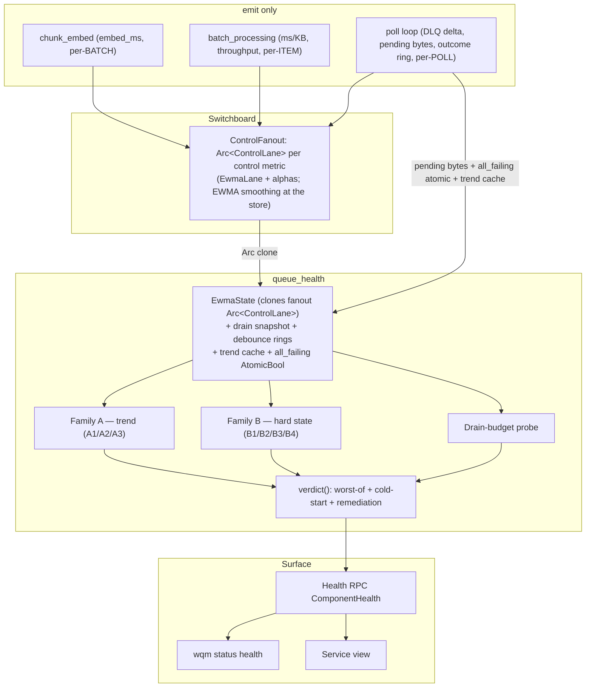

# Queue-Health Functional Verdict (#133)

The daemon reports a **functional** queue-health verdict driven by live
degradation signals — not a liveness flag. It replaces the removed
`error_count > 100` lifetime trigger and the interim `is_running`/`>60s` check
with a set of probes whose worst-of result, debounced against flapping, is
surfaced through gRPC, the `wqm status health` CLI, and the TUI Service view.

Cross-reference: the metrics plumbing (switchboard, `ControlFanout`,
`control_baseline` persistence) is documented in
[`metrics-switchboard.md`](./metrics-switchboard.md); this document covers the
consumer — probes, the verdict, and the surfaces.

## Component diagram

## Control-lane handshake

`ControlFanout` holds one `Arc<ControlLane>` per control metric (`embedder_latency`,
`ms_per_kb`, `throughput`, `dlq_depth`). A `ControlLane` wraps the shipped
atomics-backed `EwmaLane` plus its two immutable smoothing factors (`fast_alpha`,
`slow_alpha`). The control fn for each id calls `ControlLane::update(sample)`, so
EWMA smoothing happens **at the store**. `EwmaState` is constructed via
`from_fanout`, which **clones the same `Arc<ControlLane>`s** — so the lane an emit
advances is exactly the lane the verdict snapshots (a single source). `EwmaState::new`
exists only for unit tests that drive lanes directly.

### Control-lane feeds (emit sites and cadence)

| Signal | MetricId | Emit site | Cadence |
|---|---|---|---|
| Embedder latency (ms) | `EmbedderLatency` | `chunk_embed` (emit_record) | per batch |
| Per-byte cost (ms/KB) | `QueueMsPerKb` | `batch_processing::record_item_cost_ewma` | per item |
| Throughput (bytes/s) | `QueueThroughput` | `batch_processing` + idle-zero in the poll loop | per item / per idle poll |
| DLQ delta-rate (counts/poll) | `QueueDlqDepth` | poll loop `update_health_probes` | per poll |

The DLQ control sample is an `f64` **signed delta-rate**, not an absolute count:
the A3 probe needs the sign to distinguish a draining DLQ (negative) from a
growing one (positive). The lane is fed `count_now − prev_dlq` each poll, with
`prev_dlq` seeded from a live count on the first poll (never 0) so a restart with
a static backlog feeds ≈0, not the whole backlog.

## Trend probes (Family A, 3-state RAG)

Each reads one dual-EWMA lane snapshot and compares the responsive *fast* lane to
the *slow* baseline. The raw RAG is **debounced** by the poll loop before the
verdict reads it (see Debounce below).

- **A1 — ms/KB processing cost.** `fast/slow > regression_ratio` (default 2.0) ⇒
  Amber. Green while unseeded, or while the baseline is below `ms_per_kb_floor`
  (default 0.1 ms/KB — too fast to matter; never divides by a near-zero baseline).
  Culprit `processing`.
- **A2 — embedder latency.** Identical with `embedder_ratio` (2.0) and
  `embedder_latency_floor` (1.0 ms). Culprit `embedder`.
- **A3 — DLQ depth (delta-rate).** On the smoothed delta-rate `rate` and the live
  `count_now`:
  - `count_now < dlq_empty_eps` (1) ⇒ Green (empty), regardless of rate.
  - fewer than 2 delta samples ⇒ Green (one sample is not a trend).
  - `rate > dlq_rate_band` (1.0 count/poll) ⇒ **Red** (growing).
  - `rate < −dlq_rate_band` ⇒ Green (draining).
  - otherwise (flat, non-empty) ⇒ Amber (stuck). Culprit `dlq`.

A1/A2 do not reject the outlier *sample* — a spike still enters the fast lane;
the **debounce** suppresses the one-poll verdict flip while the fast lane decays.

## Hard-state probes (Family B, Green/Red only)

- **B1 — Qdrant reachable.** A live `StorageClient::test_connection()` issued by
  the gRPC handler when the verdict is computed (poll/RPC cadence, never per item),
  wrapped in `tokio::time::timeout(qdrant_probe_timeout_secs)` (default 2). Reachable
  within the bound ⇒ Green; any error or timeout ⇒ Red. Fed into `verdict()` as a
  `bool`. No cached flag, no cross-component state. Culprit `qdrant`.
- **B2 — disk space.** Free bytes on the state.db volume (path from
  `pragma_database_list`, read via the `read_disk_space` sysinfo seam). `free <
  disk_low_bytes` (1 GiB) OR free fraction `< disk_low_pct` (5%) ⇒ Red. An
  unreadable volume ⇒ Green (no false alarm). Culprit `disk`.
- **B3 — processing stall.** Pending work (`queue_depth > 0`) AND no poll or
  heartbeat within `stall_timeout_secs` (60) ⇒ Red. Culprit `stall`.
- **B4 — all items failing.** Over a rolling poll window (`all_failing_window`, 3
  cycles): `items_processed` did not advance AND the DLQ net-increased AND ≥1 item
  was attempted ⇒ Red. The poll loop keeps the outcome ring **locally** and stores
  the predicate in a lock-free `AtomicBool` the verdict reads — no shared mutex.
  Culprit `all_failing`.

## Drain budget (F5)

ETA-to-empty from the pending-bytes snapshot and the **slow** throughput lane
(the stable long-run rate; the fast lane would jitter the verdict). `eta =
pending_bytes / throughput_slow`. `eta > drain_budget_secs` (1 day) ⇒ Amber;
seeded-but-≈0 throughput with a backlog ⇒ Amber (cannot estimate). Green for the
cold-start, unseeded-throughput, and stale-snapshot (older than
`drain_snapshot_max_age_secs`, 15 s) cases — insufficient data never alarms.
Culprit `drain`.

## Debounce

The shipped `DebounceRings::observe` is a **plurality vote with a severity-biased
tie-break** over a window of `debounce_window` (default 5), not a majority vote —
so a verdict can flip on as few as 2 of 5 when a tie breaks toward the more severe
RAG. The system is deliberately asymmetric: it flips *toward* Red more easily than
away. The poll loop is the only `observe` writer; it caches the debounced trend
results so `verdict()` reads them without touching the debounce mutex.

## Overall verdict

`verdict()` aggregates every probe with **worst-of** (`Rag::severity`): the single
most-severe probe sets the overall color, no weighting; every non-green probe's
remediation is surfaced. When **no** lane is seeded (fresh daemon) `cold_start =
true`; with all probes Green the overall is Green but the surface renders
"unknown / learning baseline" rather than "healthy". A hard failure (e.g. Qdrant
down) still surfaces as Red even during cold start. Amber originates only from
Family A and the drain probe, never from Family B.

`verdict()` is computed on demand at poll / Health-RPC cadence — never on the
per-item hot path. It reads the cached debounced trend results, the lock-free
`all_failing` atomic, the drain snapshot, and the caller-supplied B1/B2 inputs.

## Surfaces

| Verdict / state | proto `ServiceStatus` | surface word | non-color channel |
|---|---|---|---|
| Green (seeded) | Healthy | `healthy` | gutter `✓` / glyph `●` |
| Amber | Degraded | `degraded` | gutter `!` / glyph `▲` |
| Red | Unhealthy | `unhealthy` | gutter `✗` / glyph `✗` |
| Cold-start / no data | Unspecified | `unknown` ("learning baseline") | CLI `Gutter::Probing` (`…`/`~`); TUI `…` |

- **gRPC.** `ComponentHealth{name:"queue_processor", status, message}`. `message`
  holds the bounded (2048 B / 10 lines), severity-ordered remediation lines,
  each `[<rag> <culprit>] <text>`, with a `…(N more)` marker when truncated.
- **CLI** (`wqm status health`). Human mode renders the status word + gutter
  symbol + one attributed remediation line per row. `status_gutter` maps
  `Unknown → Gutter::Probing` (`…`) — never a blank gutter. JSON mode adds an
  unbounded `remediation` array per component.
- **TUI** (Service view). The Queue panel shows a `Health:` row via a dedicated
  verdict renderer (not the probe-liveness `health_indicator`): verdict-`Unknown`
  reads `… learning baseline`, distinct from the daemon panel's probe-pending
  `… probing`. Each state has a glyph and a word so Amber/Red are distinguishable
  without color.

## Persistence

The `persist: bool` descriptor flag gates persistence: `true` for `EmbedderLatency`,
`QueueMsPerKb`, `QueueThroughput`; `false` for `QueueDlqDepth` (a per-poll
delta-rate, not a level baseline) and `EmbedderBatch` (telemetry-only). On idle,
`ControlBaselinePersistTask` flushes each **seeded** persist:true slow lane to
`control_baseline` (schema v46). The embedder row carries the **live provider
model label** (recorded on the lane by the labeled control fn), not a hardcoded
one; the queue-cost lanes use a fixed `queue` label. A TTL prune deletes rows
older than `baseline_ttl_secs` (30 days) **only** when their `(metric_id, model)`
is no longer a live seeded baseline, so an in-use baseline is never pruned. On
restart, `reload_baselines` seeds both lanes and sets `seeded = true` (via
`EwmaLane::store`) so the first live sample advances the restored baseline instead
of overwriting it; it filters to the known persist:true ids, ignoring any stray
non-persisted row.

The `seeded` flag is the publish/consume synchronization point: `Release` on
store, `Acquire`-read-first on snapshot, so a reader on a weakly-ordered target
(aarch64) never observes `seeded = true` with a stale `slow = 0` (proven by the
`wqm_loom` torn-read test).

## Configuration

All thresholds live in `[queue_health]` (`config/queue_health.rs`), each with a
`validate()` bound: `fast_alpha`/`slow_alpha` (0,1]; `regression_ratio`/
`embedder_ratio` > 1; `dlq_rate_band`/`ms_per_kb_floor`/`embedder_latency_floor` >
0; `dlq_empty_eps`/`stall_timeout_secs`/`all_failing_window`/
`qdrant_probe_timeout_secs`/`drain_snapshot_max_age_secs` ≥ 1; `baseline_ttl_secs`
≥ 1 day; `debounce_window` ≥ 1 (any size — the plurality vote is well-defined for
even windows); `disk_low_pct` in (0,1).

Remediation strings are fixed literals with at most a numeric ratio interpolated —
no absolute path, URL, secret, or `WQM_*` config-variable name (enforced by a
prefix-scan test).
