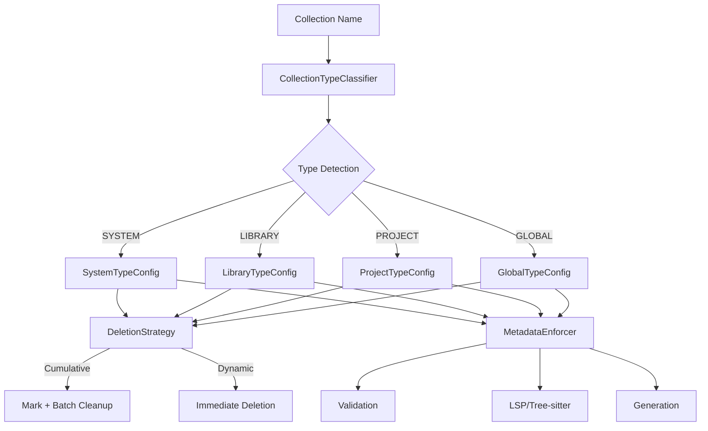
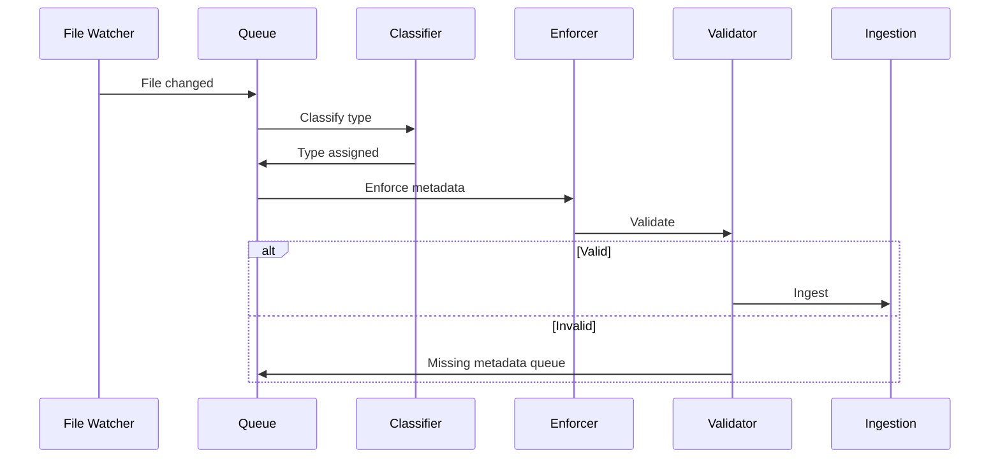

# Collection Types Documentation

> **DEPRECATED**: This documentation describes the legacy collection architecture which has been superseded by [ADR-001: Canonical Collection Architecture](../adr/ADR-001-canonical-collection-architecture.md).
>
> **Current Architecture (ADR-001):**
> - Exactly 3 collections: `projects`, `libraries`, `memory`
> - Multi-tenant isolation via `project_id` (projects) and `library_name` (libraries) payload fields
> - No underscore prefixes, no per-project collections, no SYSTEM/GLOBAL types
>
> **See:**
> - [WORKSPACE_QDRANT_MCP.md](../../WORKSPACE_QDRANT_MCP.md) - Authoritative specification
> - [ADR-001](../adr/ADR-001-canonical-collection-architecture.md) - Collection architecture decision
>
> This documentation is retained for reference during migration from legacy systems.

---

**[LEGACY]** Comprehensive guide to the collection type management system in workspace-qdrant-mcp.

## Overview

The collection type system provides structured management of Qdrant collections with type-specific behaviors, metadata requirements, deletion handling, and performance optimization.

## Quick Reference

| Type | Prefix/Pattern | Deletion Mode | Use Case | Access |
|------|----------------|---------------|----------|--------|
| **SYSTEM** | `__name` | Cumulative | CLI-managed system collections | CLI write, MCP read |
| **LIBRARY** | `_name` | Cumulative | Language libraries/SDKs | CLI write, MCP read |
| **PROJECT** | `{id}-{suffix}` | Dynamic | Project-scoped content | CLI & MCP write |
| **GLOBAL** | Fixed names | Dynamic | System-wide resources | CLI & MCP write |

### Collection Type Characteristics

#### SYSTEM Collections (`__prefix`)
- **Purpose**: CLI-managed system configuration and metadata
- **Deletion**: Cumulative (mark + batch cleanup every 24h)
- **Access**: CLI writable, MCP read-only
- **Searchable**: Not globally searchable
- **Examples**: `__system_docs`, `__cli_config`, `__admin_state`
- **Performance**: Batch size 50, priority 4/5

#### LIBRARY Collections (`_prefix`)
- **Purpose**: Programming language libraries and API documentation
- **Deletion**: Cumulative (mark + batch cleanup every 24h)
- **Access**: CLI writable, MCP read-only
- **Searchable**: Globally searchable
- **Integration**: LSP servers, Tree-sitter for metadata
- **Examples**: `_python_stdlib`, `_react_docs`, `_rust_std`
- **Performance**: Batch size 100, priority 3/5

#### PROJECT Collections (`{project_id}-{suffix}`)
- **Purpose**: Project-scoped documentation, notes, memory
- **Deletion**: Dynamic (immediate removal)
- **Access**: CLI & MCP writable
- **Searchable**: Project-scoped only
- **Integration**: Git branch detection, file watching
- **Examples**: `abc123def456-docs`, `abc123def456-memory`
- **Performance**: Batch size 150, priority 2/5

#### GLOBAL Collections (predefined names)
- **Purpose**: System-wide resources and cross-project knowledge
- **Deletion**: Dynamic (immediate removal)
- **Access**: CLI & MCP writable
- **Searchable**: Globally searchable
- **Names**: `algorithms`, `codebase`, `context`, `documents`, `knowledge`, `memory`, `projects`, `workspace`
- **Performance**: Batch size 200, priority 5/5

## Getting Started

### 1. View Collection Types

```bash
# List all collections grouped by type
wqm collections list-types

# View with details
wqm collections list-types --verbose

# JSON output
wqm collections list-types --format json
```

### 2. Validate Collections

```bash
# Validate all collections
wqm collections validate-types

# Filter by severity
wqm collections validate-types --severity error

# JSON output for automation
wqm collections validate-types --format json
```

### 3. Check Deletion Status

```bash
# View deletion queue status
wqm collections deletion-status

# Verbose output
wqm collections deletion-status --verbose
```

### 4. Migrate Collections

```bash
# Dry-run migration
wqm collections migrate-type old-collection PROJECT --dry-run

# Execute migration
wqm collections migrate-type old-collection PROJECT
```

### 5. Configure Type

```bash
# Set collection type
wqm collections configure-type my-collection SYSTEM
```

## Documentation Sections

### Detailed Guides

1. **[Collection Type Reference](collection-type-reference.md)**
   - Detailed behavior for each type
   - Metadata requirements
   - Deletion handling modes
   - Access control patterns

2. **[Migration Guide](migration-guide.md)**
   - Migrating legacy collections
   - Migration strategies
   - Rollback procedures
   - Common scenarios

3. **[Performance Tuning](performance-tuning.md)**
   - Type-specific optimization
   - Batch sizing guidelines
   - Concurrency limits
   - Monitoring performance

4. **[Troubleshooting](troubleshooting.md)**
   - Common issues by type
   - Error code reference
   - Diagnostic procedures
   - Recovery steps

5. **[API Reference](api-reference.md)**
   - Python API documentation
   - Code examples
   - Integration patterns

### Example Configurations

- [SYSTEM Collection Example](examples/system-collection-example.yaml)
- [LIBRARY Collection Example](examples/library-collection-example.yaml)
- [PROJECT Collection Example](examples/project-collection-example.yaml)
- [GLOBAL Collection Example](examples/global-collection-example.yaml)

## Key Concepts

### Deletion Modes

#### Dynamic Deletion (Immediate)
- Files deleted immediately from Qdrant
- Real-time synchronization with file system
- Used by: PROJECT, GLOBAL collections
- Best for: Frequently changing content

#### Cumulative Deletion (Batch)
- Files marked as deleted in queue
- Batch cleanup every 24h or 1000 items
- Used by: SYSTEM, LIBRARY collections
- Best for: Performance and consistency

### Metadata Enforcement

All collections must have type-specific metadata:

- **Required fields**: Validated on ingestion
- **Optional fields**: Validated if present
- **Generated fields**: Created automatically
- **LSP/Tree-sitter**: Language-specific extraction

### Performance Settings

Each type has optimized performance settings:

- **Batch size**: Number of documents per batch
- **Concurrency**: Max parallel operations
- **Priority**: Queue processing priority (1-5)
- **Cache TTL**: How long to cache results
- **Retry policy**: Failure handling

## Common Tasks

### Create a New Collection

```bash
# SYSTEM collection
wqm admin create-collection __my_system

# LIBRARY collection
wqm admin create-collection _my_library

# PROJECT collection (auto-created via file watcher)
# GLOBAL collection (predefined, may already exist)
```

### Search Collections by Type

```python
from common.core.collection_types import CollectionType, CollectionTypeClassifier

classifier = CollectionTypeClassifier()

# Get all SYSTEM collections
system_collections = [
    name for name in all_collections
    if classifier.classify_collection_type(name) == CollectionType.SYSTEM
]
```

### Validate Metadata

```python
from common.core.collection_type_config import get_type_config
from common.core.collection_types import CollectionType

# Get type configuration
config = get_type_config(CollectionType.LIBRARY)

# Validate metadata
is_valid, errors = config.validate_metadata({
    "collection_name": "_python",
    "language": "python",
    "created_at": "2025-01-03T10:00:00Z",
    "collection_category": "library"
})

if not is_valid:
    print(f"Validation errors: {errors}")
```

### Handle Type Errors

```python
from common.core.collection_type_errors import InvalidCollectionTypeError

try:
    # Some collection type operation
    pass
except InvalidCollectionTypeError as e:
    print(f"Error: {e.message}")
    print(f"Recovery: {e.recovery_suggestion}")
    print(f"Docs: {e.doc_link}")
```

## Architecture

### Component Diagram



### Data Flow



## Best Practices

1. **Choose the Right Type**
   - SYSTEM: CLI-only management, system configuration
   - LIBRARY: Language documentation, globally searchable
   - PROJECT: Per-project content, file-synced
   - GLOBAL: Cross-project knowledge, always available

2. **Follow Naming Conventions**
   - SYSTEM: Always use `__` prefix
   - LIBRARY: Always use `_` prefix
   - PROJECT: Use {project_id}-{meaningful_suffix}
   - GLOBAL: Use predefined names only

3. **Optimize Performance**
   - Use appropriate batch sizes for content volume
   - Monitor queue status regularly
   - Tune concurrency based on system resources
   - Enable caching for stable content

4. **Handle Errors Gracefully**
   - Catch type-specific exceptions
   - Log error codes for tracking
   - Follow recovery suggestions
   - Check documentation links

5. **Validate Before Migrating**
   - Always use `--dry-run` first
   - Fix validation errors before migration
   - Backup important data
   - Test with small collections first

## Next Steps

- **New Users**: Start with [Collection Type Reference](collection-type-reference.md)
- **Migrating**: See [Migration Guide](migration-guide.md)
- **Performance Issues**: Check [Performance Tuning](performance-tuning.md)
- **Errors**: Consult [Troubleshooting](troubleshooting.md)
- **Developers**: Review [API Reference](api-reference.md)

## Support

- **Documentation**: This docs directory
- **Examples**: `docs/collection_types/examples/`
- **CLI Help**: `wqm collections --help`
- **Error Codes**: See [Troubleshooting](troubleshooting.md#error-codes)

---

**Version**: 0.2.1dev1
**Last Updated**: 2025-01-03
**Status**: Stable
